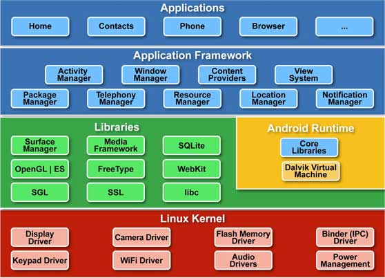
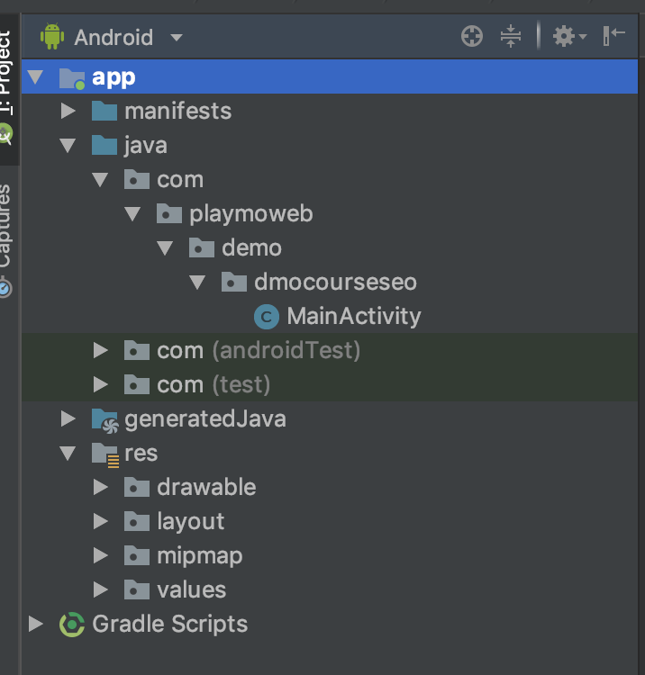
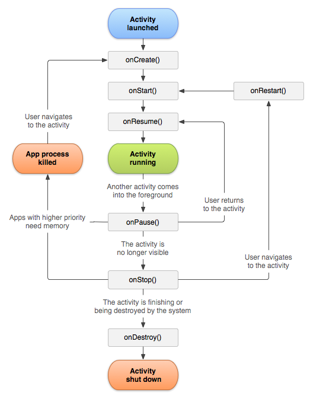
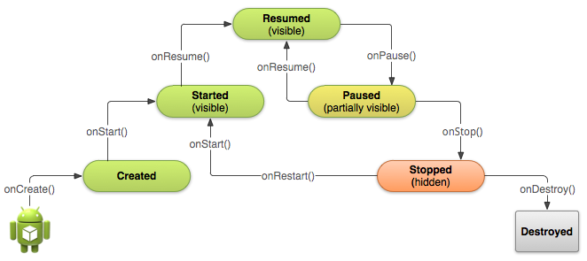
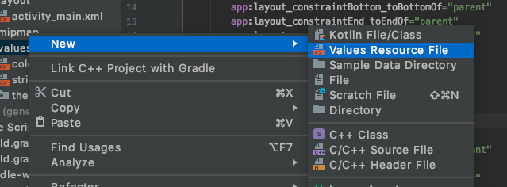
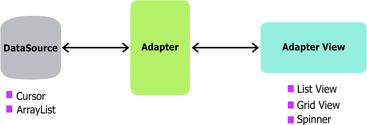
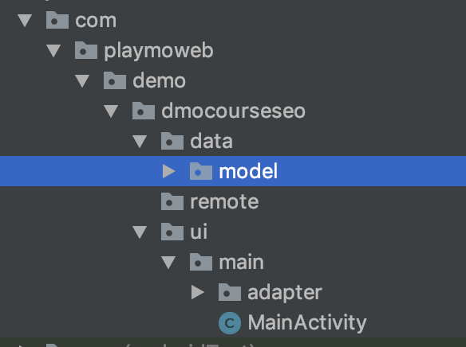

# Les bases d'Android

Par [Valentin Brosseau](https://github.com/c4software) / [Playmoweb](https://www.playmoweb.com)

---

## Introduction à Android

---

- Développé par Google
- Créé en 2008
- Actuellement en version 11 (Android R)
- Android 12 en beta (Android S)

---

## Pourquoi Android ?

- Multi marques (Google, Samsung, Xiaomi, Microsoft, …)
- Part de marché
- Ouvert
- Personnalisable
- Le prix

---

## Les défauts d'Android

- La fragmentation
- Un Android ? Non… des Android!

---

- [Répartition des versions](https://gs.statcounter.com/android-version-market-share/mobile-tablet/worldwide)
- [Répartition des caractéristiques](https://developer.android.com/about/dashboards)

---

## L'architecture



---


Linux ?

---

<iframe src="https://giphy.com/embed/wcW0qeayf7bfW" width="480" height="480" frameBorder="0" class="giphy-embed" allowFullScreen></iframe>

---

## Android is not Linux

Construis autour du noyau Linux mais … c'est tout

- Noyau Linux : Drivers, Batterie, Ram.
- Runtime Android : Fais tourner les applications Android.
- App Framework : Android Framework (Android API).

---

## La sécurité

- Chaque application a son propre utilisateur Linux.
- Les applications sont sandboxées.
- Chaque application tourne dans sa propre « VM ».
- Chaque application a son cycle de vie.

---

## Les API

Deux types :

- SDK Android : Évolue lors des mises à jour de système. (Intégré)
- Play Service : Évolue automatiquement indépendamment de la version de l'OS (En plus… Mais…)

---

## Les langages

---

### Le Code

- Java (Historique)
- Kotlin (_Nouveau_ à privilégier maintenant)

---

### Les Ressources

- XML (Drawables, Layout, Settings, Color, String)
- png / jpeg / 9.png (Images)

---

### Évolutions permanentes

- AndroidX
- Jetpack
- Compose

---

### Compose ?

- Passer d'une Interface déclarative (XML).
- À une Interface « Composable » écrite en code (Compose)

---

### Sans entrer dans le détail…

<video autoplay controls loop class="block">
    <source src="https://developer.android.com/jetpack/videos/jetpack-compose-preview.mp4" type="video/mp4">
</video>

---

## Android Studio

- l'IDE
- Java + Kotlin
- Version spéciale de Intellij

---


---

## Toolbar


---

## Créer un émulateur

- Intégré dans Android Studio.
- Performances suffisantes pour tester.
- BLE / Bluetooth non disponible.

---

## Première application

---

- File > New > New Project
- Configurer le projet
- Lancer l'application sans aucune modification (dans un émulateur)

---

## C'est à vous

---

## Structure du projet

---



---

- **src** : Vos sources Kotlin (ou Java).
- **res** : XML, fichiers de configurations, images
  - layout
  - strings
  - drawable…

---

### **R.java.class**

- Généré automatiquement.
- Contiens les références de tous les id.
- Permets l'accès aux ressources depuis votre code :
  - `getString(R.string.title)`
  - `setContentView(R.layout.activity_main)`
  - …

---

## Debugger

- Points d'arrêts.
  - Avec arrêt.
  - Sans arrêt.
  - Conditionnés
- Logs.
- Logs affichés dans le Logcat.

---

## Logcat


---

## Que se passe-t-il lors de la compilation ?

### Avez-vous regardé ?

---

## Un logiciel a été lancé « Gradle »

- Compilation
- Test
- Packaging
- Configurable via un fichier

---

## Gradle

- Open-source.
- Règles / scripts de compilation de votre projet.
- Complètement intégré dans Android Studio (complétion, etc.)

---

## Votre première application

- Activity
- Un Layout associé
- Déclaré dans le « Manifest »

---

## L'activity

- Représente un seul écran.
- Gère tout ce qu'il y a dans l'écran.
- Gère la logique des interactions utilisateurs.
- Possède son propre **cycle de vie**.

---



---



---

- L'ensemble de vos activity hérite d'une super **Activity**.
- « Override » surcharge des méthodes de base (au début uniquement onCreate).

---

## Un détail qui compte… les layout

- Constraint Layout
- Linear Layout
- Relative Layout
- Grid Layout

---

## Constraint Layout

- Contraint par rapport au « TOP, BOTTOM, START, END » des autres éléments.
- La nouvelle façon de faire.

---

## Les éléments du Layout

- TextView
- Button
- RecyclerView
- ImageView
- …

---

## Comment les découvrir ?

- Via l'interface graphique.
- Via l'autocomplétion dans le XML de layout (oui, oui, oui)

---

## Exemple de Layout

```xml
<?xml version="1.0" encoding="utf-8"?>
<androidx.constraintlayout.widget.ConstraintLayout
    xmlns:android="http://schemas.android.com/apk/res/android"
    xmlns:app="http://schemas.android.com/apk/res-auto"
    xmlns:tools="http://schemas.android.com/tools"
    android:layout_width="match_parent"
    android:layout_height="match_parent">

    <Button
        android:layout_width="wrap_content"
        android:layout_height="wrap_content"
        android:text="@string/btn"
        app:layout_constraintBottom_toBottomOf="parent"
        app:layout_constraintEnd_toEndOf="parent"
        app:layout_constraintStart_toStartOf="parent"
        app:layout_constraintTop_toBottomOf="parent" />

</androidx.constraintlayout.widget.ConstraintLayout>
```

---

✋ − Quelques points importants

- Les Namespaces (Tools, App, Android)
- L'internationalisation (i18n)
- Les contraints
- Les dimensions

---

## Comment procéder ?

Via Android Studio bien évidemment. Et de préférence via l'éditeur XML

---

## C'est à vous

Ajouter un bouton dans l'interface et une ImageView.

---

## Et maintenant ?

---

## Le fichier Manifest

- Déclare le nom de l'application.
- Déclare les activités.
- Déclare le thème de l'application.
- L'icône de l'application.
- Configuration de l'application (package…).
- Déclare les permissions.

---

## « Exemple » contenu d'un Manifest

```xml
<?xml version="1.0" encoding="utf-8"?>
<manifest xmlns:android="http://schemas.android.com/apk/res/android"
    package="com.playmoweb.demo.dmocourseseo">

    <uses-permission android:name="android.permission.ACCESS_COARSE_LOCATION" />
    <uses-permission android:name="android.permission.ACCESS_FINE_LOCATION" />

    <application
        android:allowBackup="true"
        android:icon="@mipmap/ic_launcher"
        android:label="@string/app_name"
        android:roundIcon="@mipmap/ic_launcher_round"
        android:supportsRtl="true"
        android:theme="@style/AppTheme">

        <activity android:name=".MainActivity">
            <intent-filter>
                <action android:name="android.intent.action.MAIN" />
                <category android:name="android.intent.category.LAUNCHER" />
            </intent-filter>
        </activity>

    </application>

</manifest>
```

---

## Le dossier `res` en détail

- **anim** : Définition des propriétés d'animation (`R.anim.…`)
- **drawable** : Vos images (png, xml, 9.png…) (`R.drawable.…`)
- **layout** : Vos interfaces un fichier par vue (`R.layout.…`)
- **menu** : Contenu de vos menus (Options Menu, Sub Menu…)
- **values** : « Constantes » de votre application (String, Int, Color, etc)
- **mipmap** : Icônes de votre application.

---

## Le dossier `res` en détail 2

### AKA les ressources alternative

Chaque dossier peut-être redéfini en fonction de la résolution. (`-hdpi`, `-mdpi`, `-xxhdpi`…)

---


---

## Mais ce n’est pas tout !

Chaque dossier peut-être redéfini en fonction… De la langue (`values-fr/strings.xml`), de la configuration du « mobile », du thème sombre…

---


---



---


---

[Pratiquons ensemble](/tp/android/android-base-tp.html#les-ressources-alternatives)

---

## Afficher un message à l'utilisateur

---

### Les toasts


---

## C'est à vous

Ajouter un Toast dans votre interface

```java
Toast.makeText(this, "Bonjour à tous", Toast.LENGTH_SHORT).show();
```

⚠️ Avec la complétion d'Android Studio

---

### Les Dialog

Interaction « complexe » avec l'utilisateur (Choix…)


---

## C'est à vous

Ajouter une Dialog dans votre interface. 

Nous allons utiliser la librarie [Material Dialog](https://github.com/afollestad/material-dialogs)

---

## Sans librairie

Grâce à [`Material.io`](https://material.io/develop/android/docs/getting-started)

---

## Material ?

Ensemble « de règles » / de bonne pratique pour avoir des interfaces de qualités _ou_ cohérentes.

---

## Ajouter la librairie.

### C'est à vous !

---

## Créer une Dialog avec la proposition de Google

[La documentation](https://material.io/develop/android/components/dialogs)

---

## Interagir avec l'utilisateur

### 3 étapes

- Le layout (ajouter un `id`)
- La méthode `findViewById` (dans le code)
- Le `setOnClickListener(…)`

---

## Version Java

---

## Le listener

```java
tvHello.setOnClickListener(new View.OnClickListener() {
    @Override
    public void onClick(View v) {
        Toast.makeText(MainActivity.this, "Bonus point", Toast.LENGTH_SHORT).show();
    }
});
```

---

## Le Listener en version « courte »

Android supporte Java 1.8 (dont les lambdas)

---

## Les lambda's

```java
tvHello.setOnClickListener(l -> {
    Toast.makeText(this, "Bonus Point", Toast.LENGTH_LONG).show();
});
```

---


---

## Version Kotlin

Beaucoup moins « verbeux ».

**Dommage pour nous cette version est maintenant dépréciée**

---

```kotlin
tvHello.setOnClickListener {
    Toast.makeText(this, "Bonus Point", Toast.LENGTH_LONG).show();
};
```
Pas de déclaration de `tvHello` ? Bien sur que si, mais ça sera automatique avec `kotlin-android-extension`

---

## ViewBinding

La nouvelle façon de faire :

- Gère le typage.
- NullSafety.
- Plus complexe que le `kotlin-android-extension`.

---

## Dans le Build.gradle

Activer le « ViewBinding », dans le block Android déjà présent ajouter :

```gladle
buildFeatures {
    viewBinding true
}
```

---


---

Dans vos class, modifier le code pour :

```kotlin
class MainActivity : AppCompatActivity() {

    private lateinit var binding: ActivityMainBinding // <-- Référence à notre ViewBinding

    override fun onCreate(savedInstanceState: Bundle?) {
        super.onCreate(savedInstanceState)

        // --> Indique que l'on utilise le ViewBinding
        binding = ActivityMainBinding.inflate(layoutInflater)
        setContentView(binding.root)

        // L'ensemble de nos références sont disponibles directement dans « binding.LE_NOM_DE_L_ELEMENT »
        binding.button.setOnClickListener {
            // Click sur le Button nommé « Button » dans notre Layout.
        }
    }
}
```

---

[Voir dans le support](/tp/android/android-base-tp.html#rendre-un-element-clickable-2)

---

## Paramètre et le Scope `{ … }`

Petite subtilité du Kotlin. Dans un Scope :

```kotlin
monBtn.setOnClickListener {
    // ICI une variable « it » est accessible. Elle contient la vue.
}
```

Où encore :

```kotlin
listOf<Device>().forEach {
    // « it » dans le cas présent est la valeur _courante_ de l'itération
 }
```

---

Dans votre `Build.gradle` ajouter

---

```gradle
plugins {
    id 'com.android.application' // Déjà présente.
    id 'kotlin-android' // Vous devez déjà l'avoir.
    id 'kotlin-android-extensions' // <- Cette ligne.
}
```

---

## Créer une activity

- Intégré dans Android Studio
- Une activity (Kotlin), Un Layout (XML), Une entrée dans le Manifest (XML)

---


## Démarrer une autre `activity`

Une astuce…

---

### Dans l'activity à démarrer ajouter

```kotlin
companion object {
    fun getStartIntent(context: Context): Intent {
        return Intent(context, MaClass::class.java)
    }
}
```

---

### Et quand on souhaite afficher la vue

```java
startActivity(MaClass.getStartIntent(this));
```

---


---


---

## Testons ensembles

- Création « d'un Splash ».
- Démarrage après un délai « simulant un petit chargement » la Home.

---


[Mettre en pratique avec la création d'un SplashScreen](/tp/android/android-base-tp.html#creer-une-autre-activity)

---

## Bon et les permissions ?


---


---

[La théorie c'est bien… La pratique c'est mieux](/tp/android/android-base-tp.html#les-permissions)

---

## Les RecyclerView (AdapterView)

---



---

- **adapter** : gère les données pour les afficher dans la vue.
- L'adapter est associé à la liste.
- Un Datasource est attaché à l'Adapter.
- Les données sont ajoutées dans la Datasource.

---

- [En 3 fichiers version Java](https://gist.github.com/c4software/6687dc4bb1d858bb81a79313f0e81fd9)
- [En 3 fichiers version Kotlin](https://gist.github.com/c4software/95e51417890c68078c14555b2f1d9a03)

---

- [Guide complet](https://guides.codepath.com/android/Using-an-ArrayAdapter-with-ListView)

---

## C'est à vous !

### Ajoutons une RecyclerView « Simple de type String »

---

## C'est complexe… mais des librairies existent

- [FlexibleAdapter](https://github.com/davideas/FlexibleAdapter)
- [Recyclical](https://github.com/afollestad/recyclical) (Kotlin)

---

## C'est à vous !

### Utilisons ensemble la librairie Recyclical

---

## Réorganisons notre code

---

## Organisation du code

- MVP
- ViewModel

---

## Plus simplement pour commencer…

### Au minimum quelques packages

---

Android c'est très ouvert… Il faut s'imposer une organisation

---

## Quelques packages

- `ui/` (pour l'interface)
- `data/` (pour les données)
- `remote/` (pour la partie accès au API http)

---

Bien évidemment c'est un exemple

(Vous pouvez faire autrement…)

---

### Zoom sur le package ui

- Organisation par « vue » / « activity ».
- On regroupe les fonctionnalités par « vue » (exemple les `Adapters`)

---

### C'est à vous

Réorganisation de votre projet initial.

---



---

## Pourquoi est-ce important

- Partage de code
- Reprise du code
- Maintenance
- …

---

## Sauvegarder des paramètres

- SharedPreferences
- SQLite (via `Room` par exemple)

---

## SharedPreferences

- Simple
- Type natif **exclusivement**(`int`, `string`, …)
- Persistant
- Supprimé à chaque réinstallation

---

[Voir dans le support un exemple](/tp/android/android-base-tp.html)