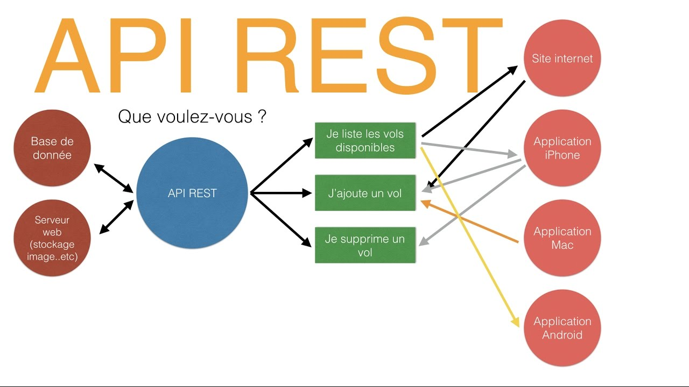

# Introduction API Rest

Par [Valentin Brosseau](https://github.com/c4software) / [@c4software](http://twitter.com/c4software)

---



---

## Coeur du web moderne

- Point central (TV, WebApp, IoT, …)
- Contiens la logique d'accès aux données.

---

Vous avez déjà entendu parler des API?

---

Regardons des exemples

---

### PWA

Progressive Web Apps

---

### Le monde de demain sera Web

#### Exemple de PWA

- <https://appsco.pe/> (Liste d'exemples)
- <https://pwa.rocks/> (Liste d’exemples)
- <https://mobile.twitter.com>
- <https://m.facebook.com> (volontairement bridé)

---


---

Bluffant n’est-ce pas ? (psst c’est du ReactJS)

---

### Concrètement une PWA c’est quoi


---

- Pour tous, quelques soit le navigateur
- Responsive
- Indépendant du réseau (via des services Workers, fonctionne hors-ligne ou en ligne)
- App-like
- Toujours à jour
- Sure (HTTPS)
- Découvrable et identifié comme application grâce au fichier manifeste
- Notifications, envoyer de l’information
- Installable
- Partageable (oui, c’est « juste » un lien)

---

### Une App Native

- Installable via le « store ».
- Consomme de la donnée via le réseau HTTP.

---

### IoT

- Objet connecté
- Communique via 3G / 4G

---

## Le point commun ?

- La communication via API

---

## Repose sur le client / Serveur

---


---

## Une API expose donc des

## services à d'autres logiciels

---

## L'API spécifie comment communiquer

- Lien
- Méthode HTTP
- Données en entrée
- Format de sortie

---

## Repose sur l'HTTP

---

## Comme pour le web

### Des liens des ressources

- `/users`
- `/user/42`
- …

---

## Utilisations des « Verbes HTTP »

---

Vous connaissez des méthodes « HTTP » ?

---

- GET
- PUT
- POST
- PATCH
- DELETE

---

## Mais également des ressources attendues

- `Accept`
- `Content-Type`
- `Authorization …`
- …

---

```
GET /hello.htm HTTP/1.1
User-Agent: Mozilla/4.0 (compatible; MSIE5.01; Windows NT)
Host: www.tutorialspoint.com
Accept-Language: en-us
Accept-Encoding: gzip, deflate
Connection: Keep-Alive
```

---

## La réponse du serveur

---

## HTTP Status Codes

### Un code une signification

---

- 200 – OK
- 201 Created
- 301 Moved Permanently
- 400 Bad Request
- 403 Forbidden
- 404 Not Found
- 500 Internal Server Error ● 503 Service Unavailable

http://www.restapitutorial.com/httpstatuscodes.html

---

## Et surtout

## Un format de données

---

## Le JSON

---

Format de communication universelle

---

Vous avez déjà entendu parler ?

---

- Décodable simplement.
- Léger.
- Lisible par un humain.
- Faiblement typé.

---

## Un tableau

```json
["a", "b"]
```

---

## Un Dictionnaire

```json
{
  "cle1": "valeur",
  "cle2": "valeur"
}
```

---

## Un Dictionnaire ?


---

## Le principe

- Structure similaire à un objet
- Structuré
- Valeur accessible par des clés.

---

https://json.org/example.html

---

## Les clients

- Web (Ajax)
- Mobile (Client HTTP)
- …

---

## Web

- L'Ajax est fourni de base.
  - Fetch
  - jQuery
  - …
