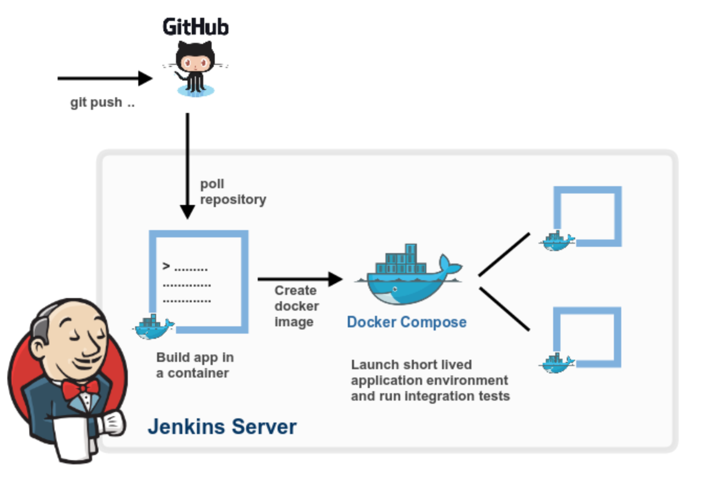

# CI/CD

## L'outillage du DevOps

Par [Valentin Brosseau](https://github.com/c4software) / [@c4software](http://twitter.com/c4software)

---


---

## CI ?

---

## Integration Continue

- Validation en continu
- Régulièrement
- Workflow GIT
- **Automatique**

---

## CD ?

### Deux aspects !

---

## Déploiement continu

- Si validation OK
- Prépare **le livrable** (Artifact)
- Automatisation des tâches

---

## Livraison continue

- Si validation OK
- Mise en ligne « régulière »
  - Prod
  - Staging

---

## Déploiement ou Livraison ?

### Objectifs identiques

Automatiser pour simplifier et améliorer la qualité.

---

## CI / CD même objectif

### L'automatisation des tâches

- Compilation.
- Tests unitaires et fonctionnels.
- Validation du produit.

---

## Les prérequis

- Versionning du code.
- Commits régulier.
- Application « testable ».

---

## Revenons au CI

---

- Tests réguliers
- Découpage des actions (Instal, Tests …).
- Répétable à l'infini (à chaque « Push » mais également localement).
- Être prévenu rapidement en cas de problème (en continu).
- L'échec est possible (pas d'erreur silencieuse).

---

## Tester ?

### Quoi à votre avis ?

---


---

## Et le CD ?

---

- Automatiser au maximum (Code, Configuration, Environement …)
  - Dev / Staging / Review
  - Prod
- S'assure de la qualité
- Versionne la livraison (suivi, archivage, rollback)

---


---

## CI / CD

### Complémentaires « s'enchaine »

---


---


---

## Rends le test « utile »

Ou plutôt visible et très intéressant

---

- Simplification de leurs exécutions
- Aussi simple qu'en « Local »
- Libère du temps

---

## Que le test ?

Non !

---

- Vérifie le Lint
- Analyse statique
- Couverture du code
- Qualité du code
- Sécurité du code

---

<center><iframe src="https://giphy.com/embed/chES7uKgwnloDZeS03" width="480" height="480" frameBorder="0" class="giphy-embed" allowFullScreen></iframe></center>

---


---

## Ah ouais…

### C'est moins fun…

---

## Si si c'est très intéressant !

### Parlons-en…

---


---

## Test & Build

- Docker
- Répétable
- Multi-developpeur

---



---

## Centralisation des Artifacts

---

- Toujours présent
- Centralisé
- Nommage cohérent

---

## Pourquoi est-ce intéressant ?

---

- Réduction du risque d'erreurs
- Automatisation (plus d'humain)
- La sécurité

---


<center>visuellement compréhensible</center>

---

- Intégré dans le développement
- Simplifie le test
- Amélioration continue

---

- Tester souvent, tester tout le temps.
- Simplification de la livraison
- Automatisation de la livraison
- Déploiement plus fréquent

---

- Réduis les erreurs (tests)
- Amélioration de la qualité
- Centrée client

---

## En résumé

- Pour vous ?
- Pour votre produit ?
- Pour votre client ?

---

## Quels outils ?

- Gratuit ?
- Payant ?
- Cloud / Interne

---

## Cloud : Gratuit / Payant

- Gitlab-CI
- CircleCI
- Bitrise
- Travis
- …

---

## Interne : Gratuit / Payant

- Gitlab-CI
- Jenkins
- …

---

[Une liste plus complète](https://github.com/ligurio/awesome-ci)

---

## Zoom sur Gitlab-CI

- Gratuit (\*)
- Intégré dans gitlab
- Simple à utiliser

---

## Un seul fichier le gitlab-ci.yml

---

### Gitlab-ci.yml

L'ensemble de la configuration de Gitlab-CI est dans un seul fichier, le `gitlab-ci.yml`, ce fichier va définir l'ensemble des règles qui serviront à valider le bon fonctionnement de votre application. Voilà un exemple :

```yml
image: node:4.2.2

before_script:
  - npm install

cache:
  paths:
    - node_modules/

stages:
  - test

test_async:
  stage: test
  script:
    - node ./specs/start.js ./specs/async.spec.js

test_db:
  stage: test
  services:
    - postgres:9.5.0
  script:
    - node ./specs/start.js ./specs/db-postgres.spec.js
```

---

## Des questions ?
