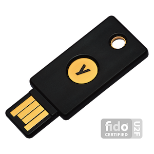

# Git en groupe
## Avec GitLab

Par [Valentin Brosseau](https://github.com/c4software) / [@c4software](http://twitter.com/c4software)

---

## Les commandes git de base

---

### Récupération d’un projet du dépot distant

```sh
$ git clone URL_DU_PROJET
```

- À votre avis ? Quel type de protocols sont possibles ? <!-- .element: class="fragment" -->

---

### Mise à jour

```sh
$ git pull
```

#### ou

```sh
$ git fetch
```

---

### Envoi des modifications sur le dépôt distant

```sh
$ git push
```

---

## Le « Workflow » Git


---

## Des outils / interfaces existent

## GitLab

- Interface Web pour Git
- Ruby On Rails (+VueJS)
- Gestion des dépots : Privé, Public, Interne
- Gestionnaire de dépots GIT
- « Équivalent open source de GitHub »
- Revue de Code
- Gestion des tâches (issues)
- Agile (Issue Board)

---

## Trois versions

- CE (Gratuite)
- EE (Payante)
- Cloud (Gratuite)
- Communautée, facilement contribuable

---

## Qui utilise GitLab

- Vous ?
- Moi, Playmoweb
- AT&T
- Bell
- CERN
- Nasa
- Interpol
- Red Hat
- …

---

## STOP

Mais !? Y'a t'il des équivalents ?

---

### GitLab est un choix parmis plusieurs outils

- Github
- GitLab
- Gogs
- Bitbucket
- Serveur SSH
- …

---

## GitHub

### Service dans le Cloud

- Avril 2008
- Dépot public gratuit, payant pour des privés
- Revue de code
- Wiki
- Issues
- Branches privées (Payant)
- Intégration continue (Service tiers)
- Hébergement interne (Payant)
- Microsoft (Rachat en 2017, 7,5 milliards de $)

---

## GOGS

### Service installable en privé

- Go
- Gestion de droits
- Wiki
- Issues
- Minimaliste
- Gratuit / Open Source

---

## GitLab

### Service dans le Cloud en Privé

- Septembre 2011
- Dépots publics et privés gratuits
- Revue de code
- Wiki
- Issues
- Branches privées
- Intégration continue (Integré : Gitlab-CI)
- Hébergement interne (Intégré, simple .rpm / .deb)

---

## Les risques dans le Cloud ?

- Indisponibilité <!-- .element: class="fragment" -->
- Lenteur <!-- .element: class="fragment" -->
- Dépend de VOTRE connexion Internet <!-- .element: class="fragment" -->
- Dépend de LEUR connexion Internet <!-- .element: class="fragment" -->
- Sécurité <!-- .element: class="fragment" -->
- Faille <!-- .element: class="fragment" -->

---

## Installation

- Via les sources
- Via Omnibus (paquets)
- Avec docker

---

## Dans le cloud

- Gratuit
- Dépots privés
- Équivalent version payante (mais gratuite)

---

## Les fonctionnalités

### Pour vous maintenant

### Mais aussi dans votre future vie…

---

### Dépots

### Privés / Publics

---

### Gestion des groupes

---

### Gestion fine des droits

---

### Gestion des tickets

### « Issues »

---

### Gestion de tableau de taches

### Un peu comme trello

Mais integré dans le développement (vous allez voir c’est genial)

---

### Branches

Intégration dans les issues, et dans le « workflow » de travail à plusieurs.

---

### Wiki


---

### API

Une API pour tout piloter ;)

---

### Des « snippets »

Des morceaux de code que l’on partage.

- Quelqu'un connait un équivalent ? <!-- .element: class="fragment" -->

---

### Des « Web hooks »

Des URL appelées lors d’action dans l’interface (Intégration slack par exemple)


---

### Intégration continue

On en reparlera…

---

### Authentification

- Via mot de passe (site)
- Via Clef SSH (client git)

---

### Démo

---

### Le workflow GitLab (début)

---

#### (Flux de travail)

- Création d’une issue
- Création d’une branche relative à l’issue
- Changement de branche
- Modification du code
- « Pusher » le code

---

### Le workflow Gitlab (Suite)

- Création de la « merge request »
- Assignation de la « merge request » à quelqu’un
- Discussion avec le « quelqu’un » (IMPORTANT)
- « merge du code » sur la branch Master

---


---

### L’intégration continue

- Valide le code en continue
- Analyser la qualité du code ([Sonar](https://www.sonarqube.org/))
- Effectuer les tests (à chaque commit)
- Réaliser les « livrables » en automatique

---

### GitLab-CI

- Isolation grâce à Docker
- Multi serveurs

---

### Qualité de code

- Important (pourquoi ?) <!-- .element: class="fragment" -->
- Pour le chef du projet / responsable de projet (pour qui) <!-- .element: class="fragment" -->
- Améliore la qualité (comment) <!-- .element: class="fragment" -->
- Commentaires automatique dans les issues <!-- .element: class="fragment" -->
- Recherche les vulnérabilités (le vrai pourquoi…) <!-- .element: class="fragment" -->

---

### Les tests unitaires

- Permet de valider le fonctionnement <!-- .element: class="fragment" -->
- Évite les régréssions <!-- .element: class="fragment" -->
- Façon de penser <!-- .element: class="fragment" -->

---

### L’identité sur Git

#### Encore plus important en groupe

  

- PGP Physique
- PGP Logiciel (OpenPGP)

---

## Rappel

### Les commandes Git

---

### Récupération d’un projet du dépot distant

```sh
$ git clone URL_DU_PROJET
```

---

### Mise à jour

```sh
$ git pull
```

#### ou

```sh
$ git fetch
```

---

### Envoi des modifications sur le dépôt distant

```sh
$ git push
```

---

## Le « Workflow » Git


---

# Des questions ?