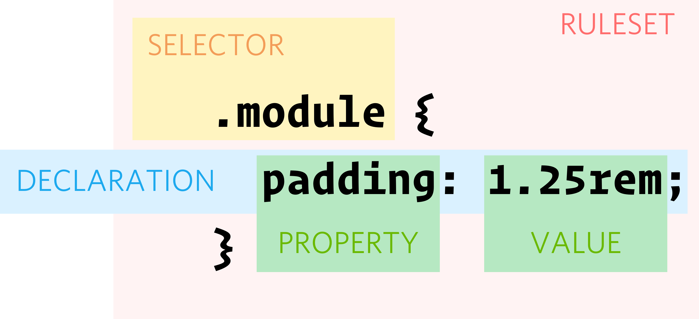

# Introduction CSS

Par [Valentin Brosseau](https://github.com/c4software) / [@c4software](http://twitter.com/c4software)

---

## La CSS

Décrit la présentation de vos pages Internet

---

## CSS signifie

- **`C`** => Cascading
- **`S`** => Style
- **`S`** => Sheet

_En français :_ Une feuille de style

---

- CSS1 1996
- CSS2 1998 (amélioration de CSS1)
- CSS3 la version courant (amélioration et fonction type bord arrondi, animation, etc)

---

CSS à donc été développé par « niveaux ».

---

## Sur un principe de version

CSS1 est développé pour être un sous-ensemble de CSS2, qui est lui-même développé pour être un sous-ensemble de CSS3.

---


---

## Oui… et Concrêtement ? 🤔

## Plus le navigateurs est ancien…

# moins ils ne connais de propriétés CSS

---

## ✋

Nous devons donc vérifier le support.

[Can I Use](https://www.caniuse.com/)


---

## Le fonctionnement des « Rules CSS »

### 2 parties

- Le selecteur : L'élément à viser « `table`, `div`, `#id`, `.class` ».
- La déclaration : Le style en lui même. Écrit sous la forme de `propriété: valeur`.

---



---

## Un exemple

Comment le lire ?

<div class="colContainer">
    <div class="col">
        <iframe src='/demo/css/index.html'></iframe>
    </div>
    <div class="col">
        
    </div>
</div>

---

## Les selecteurs


---

## Les selecteurs

```html
<p>Exemple <i>suite…</i> !</p>

<style>
  p {
    font-weight: bold;
  }

  p > i {
    color: red;
  }
</style>
```

---

## Les selecteurs

```html
<h1>Titre</h1>
<p>Exemple <i>suite…</i> !</p>

<style>
  p,
  h1 {
    color: red;
  }
</style>
```

---

## Ou déclarer la feuille de style ?

- Dans un fichier externe `monfichier.css`. (👍)
- Dans le document `<style>p {color.red}</style>`.
- Dans l'élément via l'attribut `style=''` `<p style='color: red'>Ceci est rouge</p>`. (🙅‍♂️)

---

## Pourquoi choisir la CSS Externe ?

### Permet de partager la CSS entre plusieurs pages.

---

## Cascading ? Vous vous souvener ?

Il y a donc un ordre d'application de la CSS

- Style du navigateur.
- CSS externe.
- Balises styles dans le document.
- Attribut style.

---

## Mais

Si il le faut…

```css
color: red !important;
```

---

## Mise en pratique

[Découverte de la CSS](/tp/html_css/tp2.html)

---

## Partie 2 - La CSS avancée

Flexbox, Grid …
