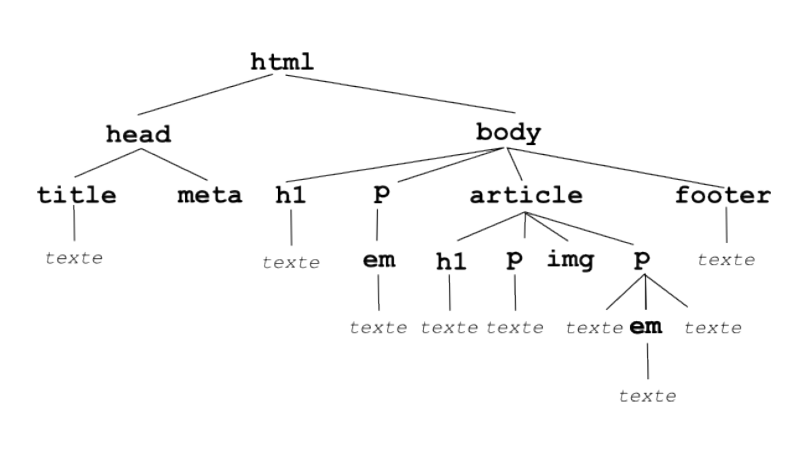

# Introduction HTML

Par [Valentin Brosseau](https://github.com/c4software) / [@c4software](http://twitter.com/c4software)

---

- Partie 0 - Un peu d'histoire
- Partie 1 - Le HTML
- Partie 2 - La sémantique
- Partie 3 - L'Hébergement

---

## HTML signifie

- **`H`** => Hyper
- **`T`** => Text
- **`M`** => Markup
- **`L`** => Language

---

- Décrit la structure d'une page Internet.
- Une série d'éléments
- Indique à votre navigateur comment afficher le contenu
- Structure chaque élément (Titre, paragraphe, …)

---

## Partie 0 - Un peu d'histoire

---

- 1989-1990 : Création du « concept »
- 1993: HTML 1.0
- 1995: HTML 2.0

---

- 1997: HTML 4.0 (Création de la W3C)
- 2000: XHTML

---

- 2007: Le renouveau

---

## HTML 5

Plus de nouvelles versions, mais une évolution continue.

(Proposal, Draft, …)

---

## L'état des lieux des navigateurs

WebKit, Firefox, Chrome…

Que se passe-t-il ? Ce qu'il faut savoir !

---

## Comment fonctionne votre navigateur ?

---

### 🤓

### Regardons ensemble

---

## Et les robots de Google ?

```sh
$ curl https://www.google.com
```

---

## Quel est l'objectif donc ?

Avoir un code « compréhensible » par une machine. Le plus simplement possible

### À votre avis pourquoi ?

---

## Petit aparté sur le référencement

(très rapide, ce n'est pas l'objectif)

---

- Mot clef.
- Structure du site.
- Liens.
- Vitesse et qualité du code.
- Rendre l'invisible visible / compréhensible

---

## Partie 1 - Le HTML

La structure

---

## Le HTML c'est du XML

### Avec au minimum 4 éléments

---

```html
<!DOCTYPE html>
<html>
  <head></head>
  <body></body>
</html>
```

---

- Le doctype
- <html> En tout début et en toute fin de document.
- <head> Informations servant au navigateur, mais non affichées (Méta, CSS, JS, etc.).
- <body> Corps de votre page (ce que vous allez afficher)

---

## Le principe

### Une balise « ouvrante » une balise « fermante »

```html
<html>
  …
</html>
```

---

## Le principe

### Ou… une balise auto-fermante

```html

```

---


---

## Toute balise ouverte

## <ins>_doit être fermée_</ins>

---

## Un exemple

```html
<p>Ceci est un exemple de texte</p>
```

Nous avons donc, un texte entouré d'une balise :
<br /><br />
**ouvrante `<p>`** et d'une balise **fermante `</p>`**

---


---

## Chaque élément peut avoir des « attributs »


---

## Chaque balise peut-être imbriquée

```html
<p>Le HTML c'est <strong>très</strong> simple !</p>
```

### Ce qui donnera :

<p>Le HTML c'est <strong>très</strong> simple !</p>

---

## Ça forme ce que nous appellerons « un arbre »

### Le DOM



---

## Les balises

### Il y en a beaucoup ? À votre avis ?

[Mémo HTML](/cheatsheets/html/)

---

## Les commentaires

En informatique _ils sont importants_, et peut prendre plusieurs formes.

### En HTML c'est :

```html
<!-- Mon commentaire -->
```

---

## Quelques exemples

---

### Une image

```html

```

- Combien j'ai d'attributs ?
- À votre avis à quoi sert le `alt` ?

---

### Un autre attribut très important

[Lazy Loading](https://web.dev/browser-level-image-lazy-loading/)

---

### Les titres

```html
<h1>Titre principal</h1>
<h2>Titre de section</h2>
<h3>Sous-titre</h3>
<h4>Sous-sous-titre</h4>
```

---

### Les listes

Le web est construit avec des données _structurées_ nous avons donc un ensemble d'éléments pour les afficher.

```html
<ul>
  <li>Élément 1</li>
  <li>Élément 2</li>
  <li>Élément 3</li>
</ul>
```

---

### Les liens

La toile, Le Web…

```html
<a href="https://cours.brosseau.ovh">Consulter le cours</a>
```

---

## Mise en pratique

### Mais avant …

---

## Comment / où « coder » en HTML ?

### À votre avis ?

---

- VScode
- WebStorm <!-- .element: class="fragment" -->
- … <!-- .element: class="fragment" -->

---

## C'est parti

### Je vous laisse tenter de réaliser la page suivante :

[Exemple](/demo/html/)

---

## Comment analyser le code source ?

### À votre avis ?

(Code source de la page, Inspecteur d'éléments) <!-- .element: class="fragment" -->

---

## Créer une seconde page:

- Ajouter un titre (`<h1>` + `<title>`)
- Ajouter une balise audio `<audio>`
- Ajouter une balise video `<video>`

---

## Comment allez-vous procéder

### Les ressources en ligne

- Google
- Stackoverflow
- [MDM](https://developer.mozilla.org/en-US/docs/Web/HTML/Element/video)

---

## Créer une troisième page

- Ajouter un titre (`<h1>` + `<title>`)
- Créer un tableau (`table`). Celui-ci doit contenir.
  - 3 colonnes
  - 20 lignes
  - Un entête et un pied de tableau

---

## Ajouter dans votre première page un « menu »

Comment faire ?

---

## Partie 2 - La sémantique

L'Organisation de la structure de mon HTML

---

## Nous avons vu la base

### Maintenant quelques détails

---

| Balise      | Utilité                            |
| ----------- | ---------------------------------- |
| `<header>`  | Entête d'un contenu                |
| `<nav>`     | Lien de navigation                 |
| `<section>` | Partie du contenu                  |
| `<footer>`  | Pied du contenu                    |
| `<article>` | Un article (comme dans un journal) |
| `<aside>`   | Contenu complémentaire             |

---

## Partie 3 - « L'Hébergement » en local

Tester mon site… Le faire tester « en local »

---

## Local ?

C'est à dire « sur votre ordinateur »

---

- Tester pendant le developpement
- Faire tester à vos proches

---

## Des outils

- Wamp (Windows)
- Xampp (Windows)
- Mamp (Mac OS)
- Lamp (Linux)

---

## Partie 3 - L'Hébergement

Rendre mon site visible au public

---

## Plusieurs options

- Un serveur dédié (💰)
- Chez vous (bonne idée à votre avis ?)
- Le cloud
  - Netlify (JamStack)
  - Firebase
  - OVH
  - …

---

## Comment choisir ?

### À votre avis ?

---

## Des questions ?

---

## Votre CV.

### C'est à vous.
