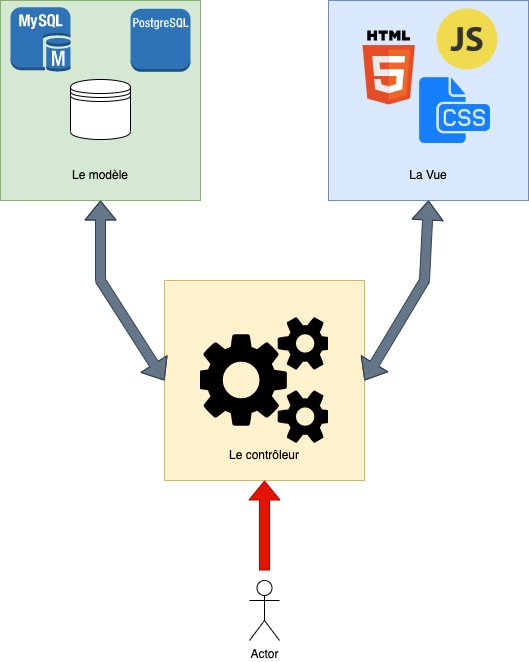

# MVC

## Le développement organisé

Par [Valentin Brosseau](https://github.com/c4software) / [@c4software](http://twitter.com/c4software)

---

## L'approche MVC

---

## Vous connaissez ?

### Pour vous c'est quoi ?

---

## L'objectif, réaliser un code « Professionnel »

### Mais qu'est-ce qu'un code professionnel ?

---

## Je vous laisse réfléchir à deux ou trois

---

## Quelques éléments de réponse

- Documentés
- **Modulaire**
- Clair et précis
- Utilise des termes « **anglais** » / « nommage principalement en Anglais »
- **Réutilisable**
- **Évolutif**
- Découpé pour pouvoir **travailler à plusieurs**

---

## Globalement

C'est un code qui permet à une équipe de travailler, et est compréhensible par tous en quelques **heures**.

---

## Objectif

**Gagner du temps** lors des ajouts et **également** en cas d'évolution.

---

## Apprendre à structurer

- Nous l'avons vu avec le TP sur les SESSION mais allons plus loin…
- Repose sur **l'entry-point unique**

---

## Pourquoi le point d'entrée unique _est important_ ?

---

## Pourquoi le point d'entrée unique _est primordiale_ ?

---

---

[Entrons dans le détail](https://cours.brosseau.ovh/tp/php/support.html#la-structure)

---

## La structure

## C'est aussi important que le code

---

## Parlons de votre code de première année

À votre avis était-il « maintenable » ?

---

Nous allons donc préférer un développement en couche

---

Dans un site classique, nous avons :

- La base de données
- Le HTML
- Les traitements PHP

---

---

Code avec du PHP mélangé avec du HTML et de la BDD

---

<iframe src="https://giphy.com/embed/jquDWJfPUMCiI" width="480" height="428" frameBorder="0" class="giphy-embed" allowFullScreen></iframe>

---

Isoler chaque partie pour simplifier la lecture du code

---

---

L'idée est de créer différentes couches à partir des éléments

- Le Modèle
- La Vue
- Le Controller

---

## Le Design Pattern « MVC »

---

## Le modèle

- Fichier PHP qui va contenir toute la logique de la récupération des données
- En POO, on essai de créer autant d'objets de que problématique, ici c'est pareil
  - Un Objet == une table

---

## La Vue

- C'est un Fichier **HTML** ou **PHP**.
- Qui ne contiendra **QUE** la vue de votre page (et uniquement de la page).

---

## Le Contrôleur

- **Il gère le lien entre « Le(s) Modèle(s) » et « la Vue »**
- Contiens la logique de votre page **ET NON LA RÉCUPÉRATION DES DONNÉES**
- Donc nous aurons ici seulement la logique (**les boucles, les conditions, etc**)

---

Ce découpage s'appelle un développement en couche.

« 3 - Tiers »

---

---

**Important** on oubli pas ce que vous avez appris

## On améliore

---

Concrètement à quoi ça ressemble ?

---

[Code Source MINI MVC](https://github.com/c4software/mini-mvc-sample)

**Attention**, c'est un projet « d'apprentissage », nous allons plus tard voir des Frameworks

Vous en connaissez ?

---

## Comment ça fonctionne ?

### C'est parti pour une démo

---

Organiser notre code « autour de ces 3 couches.

C'est là où la POO arrive.
