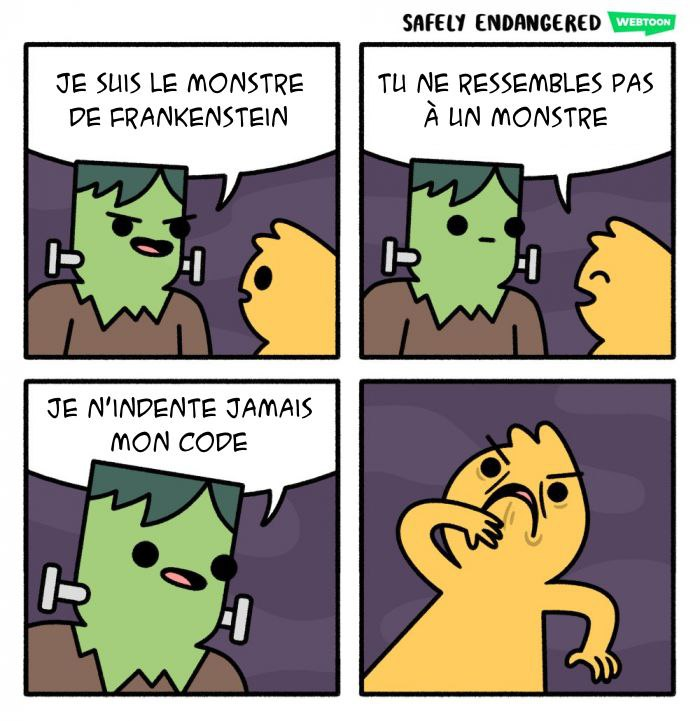

# Organiser mon code

## Pour qui ? Pourquoi ? Comment !

Par [Valentin Brosseau](https://github.com/c4software) / [@c4software](http://twitter.com/c4software)

---

## Pour qui

---

- Pour vous
- Pour moi
- Pour vous (du futur)
- Pour vos collègues
- Vos tests

---

### Pour réfléchir

---


---



---

## Pourquoi ?

---

- Améliorer la lisibilité.
- Simplifier votre travail.
- Réduire votre charge mentale.

---

### Mais également

---

- S'améliorer.
- Pouvoir tester. <- 🤔
- Pouvoir faire évoluer son code.
- Avoir une meilleure note…

---

Car au final, le but, c'est de ne pas être noyé dans son propre code

---


---

## Comment

---

- Découper.
- Modèle.
- DAO.
- Définir (configurations, constantes)
- Réutiliser.
- Code en commentaire 🤔

---

### Découper

- Fonctions d'aide.
- Accessible dans l'ensemble du projet (`/libs/…`, `/helpers/…`).
- Ne pas copier / coller. Découper pour réutiliser.

---

### Penser fonctionnalités pas finalités

Avez-vous des exemples ?

---

### Modèle

Pour vous, c'est quoi ?

---

Représente votre objet. Intègre les méthodes qui simplifient sa manipulation.

- Avez-vous un exemple ?

---

## Pourquoi est-ce important ?

---

- Centralise la logique/code métier.
- Simplifie les évolutions.
- Évite le code dupliqué.
- Normalise votre code.

---

Et quand on utilise des API, pourquoi est-ce également très important ?

---

### DAO

Pour vous, c'est quoi ?

---

- DAO : « Data Access Object »
- Défini les méthodes qui accèdent à la donnée
- Retourne un objet « typé. » (un modèle)

---

## Pourquoi est-ce important ?

---

- Permet de tester votre code.
- Permet de changer la source de données.
- Centralise votre code.
- Simplifie les modifications. (à votre avis ?)
- Facilite le partage de code.

---

[Mieux que des mots, un exemple](https://gist.github.com/c4software/30947f2a86eb0ab065d26a6ed0edb3e9)

---

## Définir (configurations, constantes)
### Fichier regroupant la configuration

À votre avis, que doit-il contenir ?

---

### Les constantes

- Utilité ?

---

[Un exemple](https://gist.github.com/c4software/8b5122405b38f4c933d6a4490f45e1ad)

---

Alors, qu'en pensez-vous ?

---

- Simplifie la lecture du code.
- Centralise les éléments « sensibles ». <!-- .element: class="fragment" -->
- Évite le code dupliqué. <!-- .element: class="fragment" -->
- Réduit la charge mentale. (évite la panique !) <!-- .element: class="fragment" -->
- Être quelqu'un de bien. <!-- .element: class="fragment" -->

---

### Réutiliser

- Savoir faire des librairies.
- Savoir faire des fichiers « d'aide ».
- Partager les définitions de méthodes entre le code client et le code serveur.

---

### Pourquoi ?

---

## Le but de tout ça (DAO, Modèle, …)

---

### Être prêt pour les modifications de

- L'examen !
- Du stage ! <!-- .element: class="fragment" -->
- De la vie ! <!-- .element: class="fragment" -->
- … <!-- .element: class="fragment" -->

---


---

### Allons plus loin

---

## Un code en commentaire…
### …c'est du code supprimé

---

## Le je garde au cas où


---

## Le code compliqué

---

Est-ce que ça vous semble valide ?

```javascript
function conditionPermis(age, heureConduite){
    if(age >= 18){
        if(heureConduite >= 120){
            return true;
        } else {
            return false;
        }
    } else {
        return false;
    }
}

permis = conditionsPermis(person.age, lecon.nbHeure);
```

Est-ce simplifiable ?

---

# Des questions ?
