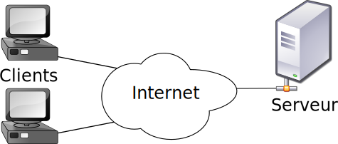

# PHP

Par [Valentin Brosseau](https://github.com/c4software) / [@c4software](http://twitter.com/c4software)

---

## Rendre dynamique votre code static

---

- Largement utilisé
- Gratuit
- Ah oui… Largement utilisé ! (Facebook, Wordpress…)

---

## Création en 1994

_Au début PHP_ => **P**ersonal **H**ome **P**age
_Maintenant PHP_ => **H**ypertext **P**reprocessor

---

## Le PHP est un langage **serveur**

---

<iframe src="https://giphy.com/embed/nuuS1IlKqd2dq" width="480" height="264" frameBorder="0" class="giphy-embed" allowFullScreen/>

---

- Vous écrivez des fichiers `.php`
- Le fichier pourra contenir : du PHP, mais également HTML, CSS, JS.
- Le code est traité sur le serveur : Seule le résultat arrive sur votre navigateur.

---

## Nous avons donc _2 acteurs_

- Un Client (Un navigateur, Un téléphone, …)
- Un Serveur (Linux, Windows, Raspberry Pi…)

---



---

## ✋

Internet ≠ Chrome

---

## Sur Internet deux écoles

- Statique
- Dynamique

---

## L'entre deux existe aussi

Le dynamique statique

=

Le site généré

---

## Bon et le PHP dans tout ça

---

- Génère des pages dynamique. (À trou)
- Collectes des données / saisie utilisateurs (formulaire).
- Lire, écrire, modifier des données « côté serveur ».
- Gestion de session de connexion (SESSION & Cookie).
- Accès à des base de données.

---

## Pourquoi PHP ?

- Gratuit.
- Multiplateforme.
- Très bien documentés ([php.net](https://php.net)).
- Simple à apprendre.
- Largement utilisé.
- Accès au base de données « intégré »
- Installable en dev' simplement

---

## Les outils du developpeur

Wamp, Mamp, Xampp

---

Toujours la même « base »

- Apache
- MySQL (SQL)
- PHP

---

## Les base de PHP

Votre HTML est un texte à trou. Le PHP peut-être mis n'importe où.

- Le script PHP commence par `<?php`
- Et ce termine par `?>`

---

## Exemple

```php
<?php
    // Votre code
?>
```

⚠️ Ne fonctionne que dans les fichier de type `.php` ⚠️

---

```html
<!DOCTYPE html>
<html lang="en">
  <head>
    <title>Exemple PHP</title>
  </head>
  <body>
    <h1>Bonjour vous</h1>
    <p>
      Nous sommes le
      <?php echo date("d/m/Y") ?>
    </p>
  </body>
</html>
```

---

## C'est à vous

Installons ensemble votre environnement de developpement.

---

## C'est à vous

[Votre première page PHP](/tp/php/tp1.html)
