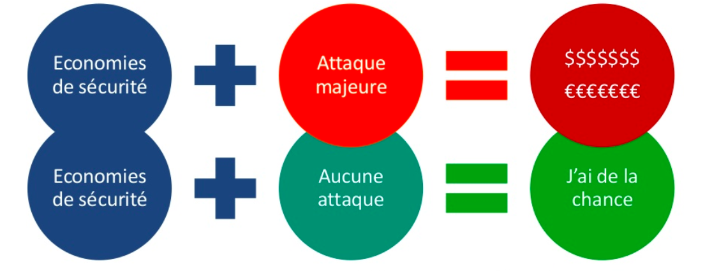

# Sécurité des applications WEB

## Risques et menaces

Par [Valentin Brosseau](https://github.com/c4software) / [@c4software](http://twitter.com/c4software)

---

## Pour vous, la sécurité c’est quoi ?

---

## Des découvertes de failles tous les jours !

---

### Des exemples en tête ?

---


---


---


---


---


---


---


---


---


---

[Top50 du nombre de vulnérabilités par le nombre de produits des marques](https://www.cvedetails.com/top-50-vendors.php)

---

### Comment se tenir à jour ?

#### Prévenir plutôt que guérir…

---

### Des sites à surveiller

- [US CERT (LA SOURCE)](https://www.us-cert.gov/)
- [The Hacker News](http://thehackernews.com/)
- Zataz
- [Undernews](https://www.undernews.fr/)
- [Reddit NetSec](https://www.reddit.com/r/netsec/)
- Next INpact (~Payant)
- Google Actu

Vous en avez d’autres en tête ?

---

#### Vous êtes la première ligne d’informations

Par deux, collecter une actualité récente « sur un problème de sécurités ».


Lien : [https://forms.gle/zXBhF61uKxtHh6Ma7](https://forms.gle/zXBhF61uKxtHh6Ma7)

---

### Le prix de la sécurité

- Impact fonctionnel
- Limitation de l’expérience utilisateur (UX)
- Impact financier

---

### Les facteurs d’expositions


---

#### La sécurité informatique dans une application c’est un « équilibre »

---

### L’insécurité à un coût

À votre avis ?

---

# 2.86 Millions d’euros

Estimation des coûts pour une entreprise à chaque incident de vol de données en France

Source: Cost Of Data Breach \- Symantec

---

### Un exemple… Facebook

---


---


---

### Un impact qui peut-être globalisé

[https://twitter.com/awlnx/status/1445073290708533258?s=09](https://twitter.com/awlnx/status/1445073290708533258?s=09)

---

### Et si je ne fais rien !?

- Volontaire !
- Involontaire ?

---



---

### Une petite histoire d'imprimante…

---

### Intégrer la sécurité à toutes les étapes

La sécurité c’est un état d’esprit à intégrer.

C’est aussi votre métier

- Réseau ?
- Développeur ?
- À votre avis ? Qui doit travailler la sécurité ?

---

### Les deux!

---


---

### Améliorer la sécurité

- Dès la conception
- Comprendre et avoir en tête les règles

---

## Assurer la qualité

s'assurer une qualité continue du code

- 10 règles à connaitre (OWASP).
- Des tests unitaires.
- Une analyse automatique du code (SonarQube).

---

### Open Web Application Security Project (OWASP)

#### Les dix risques par ordre de dangerosité

---

### Le Top10 Web

---

### A1 - Injection

Risque d’injection SQL, Shell...

---

### A2 - Violation de Gestion d’Authentification et de Session

Risque de casser / usurper une authentification ou une session. Comprends notamment le vol de session ou la récupération de mots de passe.

⚠️ Un exemple ?

---

### A3 - Cross-Site Scripting (XSS)

Risque d'injection de contenu dans une page pour but de provoquer des actions non désirées dans celle-ci.

Les failles XSS sont particulièrement répandues.

---

### A4 - Références directes non sécurisées à un objet

Accès à de la donnée en spécifiant un `id` directement par un paramètre non filtré.

---

### A5 - Mauvaise configuration Sécurité

Corresponds aux failles de configuration liées aux serveurs Web, applications, base de données ou frameworks.

---

### A6 - Exposition de données sensibles

Exposition de données sensibles comme les mots de passe, les numéros de carte de paiement ou encore les données personnelles et la nécessité de chiffrer ces données.

---

### A7 - Manque de contrôle d’accès au niveau fonctionnel

Failles liées aux contrôles d'accès de fonctionnalité.

---

### A8 - Falsification de requête intersite (CSRF)

Exécution de requêtes à l’insu de l’utilisateur.

---

### A9 - Utilisation de composants avec des vulnérabilités connues

Utilisation de composants tiers vulnérables.

---

### A10 - Redirections et Renvois Non Validés

Les redirections et les renvois non validés sont une vulnérabilité profitant d’une faiblesse dans le code et dont l’objectif est de rediriger l’utilisateur sur une page malveillante

---


---

#### Avec OWASP on parle de

### Vulnérabilité, et non de risque

---

### Mais, une faille c’est quoi ?


---

### Les types de failles

- L’humain (Social Engineering)
- D'accès (physique)
- Applicatif (Hack)
- L’argent (à quel montant une personne vous donne l’information ?)

---

### Le Social Enineering

Les gens sont souvent trop confiants.

[Exemple SECTF à la DefCon](https://www.youtube.com/watch?v=-FSLaHKoCNE)

[Call Recreation (@5min, @11min30)](https://share.vidyard.com/watch/i46XF6N6rpR9KMaorihFQw)

---

### Les outils autour d’OWASP

- [OWASP Juice Shop (Formation, JavaScript)](https://owasp.org/www-project-juice-shop/)
- WebGoat (Formation, Java + Web)
- WebScarab (Audit)
- OWASP Testing guide (Guide pour voir le niveau de sécu)
- OWASP Code Review guide (Méthode d’audit)

---

Un instant ✋

---

Les mots de passe

🔐

---

Comment les sauvegardez-vous en base de données ?

---

Crypter ≠ Hasher

---

Quelle est la différence ?

---

- Crypter => Réversible (comme Canal+).
- Hasher => Non réversible (comme le steak haché).

---

### On connait les failles

#### Comment on les corrige ?

---

## Étape 1 : Le Code

---

### A1 - Injection

```sql
SELECT * FROM client WHERE id='" . $_GET["id"] . "'
```

```
http://exemple.com/liste?id='or '1'='1
```

---

### A2 - Violation de Gestion d’Authentification et de Session

```
http://exemple.com/?jsessionid=A2938298D293
```

---

### A3 - Cross-Site Scripting (XSS)

Exécution de code JavaScript sans validation

```html
Votre Nom : <input type="text" name="nom" value="" />
```

```js
alert("Bonjour " + $_POST["nom"]);
```

---

### A4 - Références directes non sécurisées à un objet

```
http://exemple.com/liste?mode=client
```

Si je change client par … admin ?

---

```sql
SELECT * FROM client where mode=?
```

```php
$stmt->bindParam(1, $mode);
```

---

### A5 - Mauvaise configuration Sécurité

- Console d’administration disponible sans authentification en ligne
- Listage des répertoires ([Exemple](https://www.google.fr/search?dcr=0&q=intitle%3A%22Index%20of%22))
- Exemples de code non supprimés

---

### A6 - Exposition de données sensibles

- Espace client / admin sans SSL
- Mot de passe en claire (**ou en MD5**) dans la base de données
- Sauvegarde de données inutiles

---

### A7 - Manque de contrôle d’accès au niveau fonctionnel

- Page d’admin accessible avec un compte utilisateur
- Mode non filtré (similaire à l’exemple mode={client,admin})

---

### A8 - Falsification de requête intersite (CSRF)

- Rejeu de requête déjà joué

---

#### Comment le bloquer ?

Ajouter un identifiant/jeton dans la requête, unique et non réutilisable

⚠️ Parlons-en !

---

### A9 - Utilisation de composants avec des vulnérabilités connues

- CMS non à jour
- Apache non patchés
- Librairies XYZ non à jour

---

### A10 - Redirections et Renvois Non Validés

- Utilisation de votre site comme « masque » dans du phishing

```
http://www.shop-vdt.com/login.php?goto=evil.com/login
```

[En vidéo](https://www.youtube.com/watch?v=ibFs8FZxzu4)

---

### OWASP un classement qui évolue


[Source](https://owasp.org/www-project-top-ten/)

---

## Zoom sur les mots de passe

- Un mot de passe ne doit jamais être stocké en claire.
- Un mot de passe doit être haché (non réversible).
- Un mot de passe doit être salé (ajout d’une chaîne aléatoire).

---

## Principes de base


---

## Le sel

- Peut-être différent pour chaque utilisateur.
- Peut-être global pour tous les utilisateurs.

---

## Le bcrypt

- Intègre le sel.
- Intègre un coût (nombre d’itération).
- Intègre un hachage (SHA-256).

---

<fieldset>
  <legend>Les mots de passe</legend>
  <p>
    Un mot de passe ne doit jamais être stocké en claire. Il doit être haché (non réversible) et salé (ajout d’une chaîne aléatoire).
  </p>

  <p>
    Le sel peut-être différent pour chaque utilisateur ou global pour tous les utilisateurs. Celui-ci doit être placé avant ou après le mot de passe, il sera utilisé également pour vérifier le mot de passe.
  </p>

  <p>
    Le bcrypt est un algorithme de hachage qui intègre le sel, le coût et le hachage (SHA-256).
  </p>
</fieldset>

---

## La double authentification

- **Application :** OTP (One Time Password) : SMS, Google Authenticator, Authy, Yubikey.
- **Objet physique :** U2F (Universal 2nd Factor) : Clé USB, Yubikey.
- **Biométrie :** Empreinte digitale, Reconnaissance faciale.

---

- Permets de sécuriser les mots de passe en ajoutant une couche de sécurité supplémentaire.
- Via un secret partagé entre la personne **physique** et le site.

---

## Étape 2 : Le réseau

---


---

### IPS (Intrusion Prevension Systeme)

- Bloque **automatiquement** les attaques
- Non fiable à 100%
- Peu discret

---

### IDS (Intrusion Detection Systeme)

- Analyse
- Repère
- Averti


---

### Comment réduire le risque ?

---

- Sensibilisations / Formations
- Revue de code
- Tests d’intrusions
- Sécurité lors du recrutement
- Sécurité dès la conception du projet
- Suivi des bonnes pratiques (ex. OWASP)

---

### Pourquoi il faut se battre (en interne) ?

- Résistance au changement
- ERP / CMS
- La sécurité est vue comme un frein, pas une fonctionnalité
- Déni de la réalité
- Multitude de librairies
- Développement externe (presta, stagiaires …)

---

### Se former

#### En continu

- [Le Hack](https://lehack.org/fr) / [Hack In Paris](https://hackinparis.com/)
- Internet
- Appliquer les bonnes pratiques tout le temps !

---

### Des questions ?
