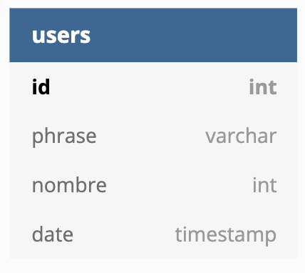

# Introduction aux bases de données avec PHP

Par [Valentin Brosseau](https://github.com/c4software) / [@c4software](http://twitter.com/c4software)

---

La base de données est un vaste sujet. Nous avons ici une introduction à ce qu'il faut connaitre **au minimum** pour avancer dans nos différents projets.

---

Les première base de données (en anglais database) sont apparu en **1960**

---

## Coeur de l'informatique moderne.

---

## On stock de plus en plus d'informations.

Chaque jour, **2,5 quintillions de bytes** de données sont générés.

---

## Attention dangers

Objet de toutes les convoitises

- Hack.
- Faille de sécurité.
- Injectin SQL.

---

## Plusieurs types de base de données

- Relationnelles: SQL (MariaDB, MySQL, Postgresql, Oracle…)
- Non Relationnelles: NoSQL (MongoDB, Firestore, Redis… )

---

## Relationnelles

- SQL
- Intégré à Xampp, Wamp, … (MariaDB)
- Ensemble cohérent de données, avec des relations, contraintes entre les données
- Absence de redondances (découpage, clef, etc)

---

## Non Relationnelles

- NoSQL (Not Only SQL)
- Gère des très gros volumes
- Ensemble de documents sans forcément avoir de structure identique.
- Redondances possible (voir encouragés)

---

## Qu'est-ce qu'une base de données ?

---

- Ensemble de tables
- Qui contiendrons des données structurés :
  - Type de données
  - Organisé en colonnes (nom, prénom, …)
  - Avec des relations entre les tables (contraintes)

---

---

## Dans l'ensemble des cas (SQL _ou_ NoSQL)

### La Modélisation

---

## MCD

### **M**odèle **C**onceptuel de **D**onnées

Le minimum à connaitre, c'est une représentation universelle.

---

Technique pour représenter une base de données.

⚠️ Étape très importante, c'est la base de notre projet. ⚠️

---

- Structure de la base de données:
  - Nom des tables.
  - Nom des colonnes
  - Type de données.
- Contraintes relationnelles :
  - Contraintes entre les tables (nombre).
  - Jointure

---

## Concrêtement un MCD c'est :

- Des rectangles avec des noms
- Des traits entre les rectangles

---

---

---
