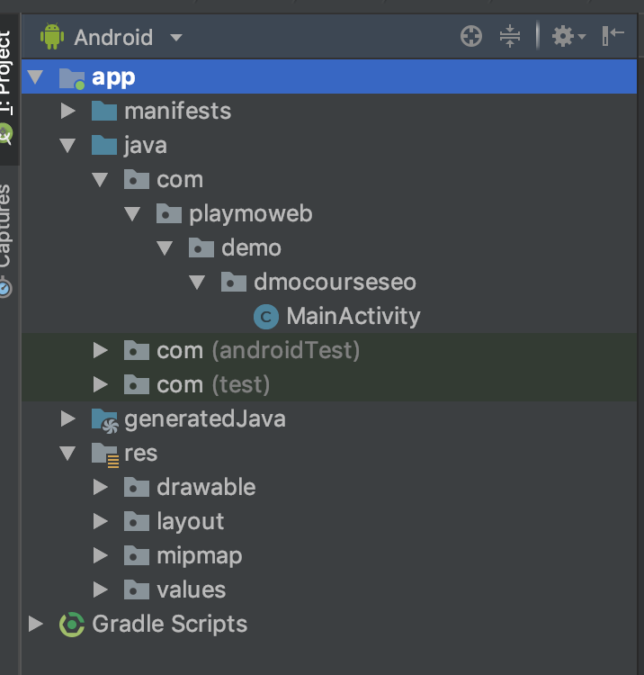
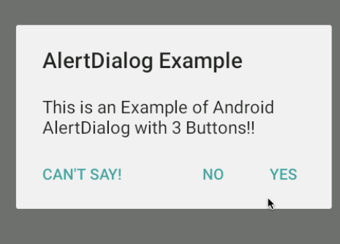

# Android

Par [Valentin Brosseau](https://github.com/c4software) / [Playmoweb](https://www.playmoweb.com)

---

## Introduction à Android

---

- Développé par Google
- Créé en 2008
- Actuellement en version 9.0 (Android Pie)

---

## Pourquoi Android

- Multi marques (Google, Samsung, Xiaomi, HTC, …)
- Part de marché
- Ouvert
- Personnalisable
- Le prix

---

## Les défauts d'Android

- La fragmentation
- Un Android ? Non… des Android!

---

## L'architecture


---


Linux ?

---

## Android is not Linux

Construit autour du noyau Linux mais … C'est tout

- Noyau Linux : Drivers, Batterie, Ram.
- Runtime Android : Fait tourner les applications Android.
- App Framework : Android Framework (Android API).

---

## La sécurité

- Chaque application a son propre utilisateur Linux
- Les applications sont sandboxé
- Chaque application tourne dans sa propre VM.
- Chaque application à son cycle de vie.

---

## Les API

Intégré dans Android.

- SDK Android : Évolue lors des mises à jour de système.
- Play Service : Évolue automatiquement indépendemment de la version de l'OS (presque).

---

## Les langages

### Code

- Java (historique)
- Kotlin (Nouveau)

### Ressources

- xml (drawables)
- png / jpeg / 9.png (images)

---

## Android Studio

- Java
- Version spécial de Intelij

---


---

## Toolbar


---

## Créer un émulateur

- Intégrer dans Android Studio.
- Performance suffisante pour tester.
- BLE / Bluetooth non disponible.

---

# Première application

---

- File > New > New Project
- Configurer le projet
- Lancer l'application sans aucune modification (dans un émulateur)

---

## C'est à vous

---

## Structure du projet

---



---

- **src** : Vos source Java (ou Kotlin).
- **res** : XML, fichiers de configurations, images
  - layout, strings, drawable…
- **R.java.class** :
  - Généré automatiquement.
  - Contient les références de tous les id.
  - Permet l'accès aux ressources depuis votre code :
    - `getString(R.string.title)`
    - `setContentView(R.layout.activity_main)`

---

## Debugger

- Point d'arrêt possible.
- Log.
- Log affiché dans le Logcat.

---

## Logcat


---

## Gradle

- Open-source.
- Script de compilation de votre projet.
- Complètement intégré dans Android Studio (complétion, etc…)

---

## Votre première application

- Activity
- Création d'un Layout associé
- Déclaration dans le Manifest

---

## L'activity

- Représente un seul écran.
- Gère tout ce qu'il y a dans l'écran.
- Gère la logique des intéractions utilisateurs.
- Possède son propre **cycle de vie**.

---


---


---

- L'ensemble de vos activity hérite d'une super **Activity**.
- Override des méthode de base (au début uniquement onCreate)

---

## Un détail qui compte… Les layout

- Constraint Layout
- Linear Layout
- Relative Layout
- Grid Layout

---

## Constraint Layout

- Contraint par rapport au « TOP, BOTTOM, START, END ».
- La nouvelle façon de faire.

---

## Les éléments du Layout

- TextView
- Button
- ListView
- ImageView
- …

---

## C'est à vous

Ajouter un bouton dans l'interface et une ImageView

---

## Le fichier Manifest

- Déclare le nom de l'application.
- Déclare les activités.
- Déclare le thème de l'application.
- L'icône de l'application.
- Configuration de l'application (package…).
- Déclare les permissions.

---

## Permissions ?


---

## Contenu d'un Manifest

```xml
<?xml version="1.0" encoding="utf-8"?>
<manifest xmlns:android="http://schemas.android.com/apk/res/android"
    package="com.playmoweb.demo.dmocourseseo">

    <application
        android:allowBackup="true"
        android:icon="@mipmap/ic_launcher"
        android:label="@string/app_name"
        android:roundIcon="@mipmap/ic_launcher_round"
        android:supportsRtl="true"
        android:theme="@style/AppTheme">

        <activity android:name=".MainActivity">
            <intent-filter>
                <action android:name="android.intent.action.MAIN" />
                <category android:name="android.intent.category.LAUNCHER" />
            </intent-filter>
        </activity>

    </application>

</manifest>
```

---

## Le dossier `res` en détail

- **anim** : Définition des propriétés d'animation (`R.anim.…`)
- **drawable** : Vos images (png, xml, 9.png, …) (`R.drawable.…`)
- **layout** : Vos interface un fichier par vue (`R.layout.…`)
- **menu** : Contenu de vos menus (Options Menu, Sub Menu, …)
- **values** : « Constantes » de votre application (String, Int, Color, etc)
- **mipmap** : Icônes de votre application.

---

## Le dossier `res` en détail 2

### AKA Les ressources alternative

Chaque dossier peut-être redéfini en fonction de la résolution. (`-hdpi`, `-mdpi`, `-xxhdpi`, …)

---


---

## Interagir avec l'utilisateur

---

### Les toasts


---

## C'est à vous

Ajouter un toast dans votre interface

```java
Toast.makeText(this, "Bonjour à tous", Toast.LENGTH_SHORT).show();
```

---

### Les Dialog

Interaction complexe (avec choix)



---

## C'est à vous

Ajouter une Dialog dans votre interface. Nous allons utiliser une library.

[Material Dialog](https://github.com/afollestad/material-dialogs)

---

## Interagir avec l'utilisateur

### 3 étapes

- Le layout
- Le `findViewById` (dans la méthode `onCreate`)
- Le `setOnClickListener(…)`

---

## Le listner

```java
tvHello.setOnClickListener(new View.OnClickListener() {
    @Override
    public void onClick(View v) {
        Toast.makeText(MainActivity.this, "Bonus point", Toast.LENGTH_SHORT).show();
    }
});
```

---

## C'est verbeux …

### mais …


---

## Migrer en Java 1.8

Android supporte Java 1.8 (dont les lambdas)

---

## Les lambda's

```java
tvHello = findViewById(R.id.tvHello);
tvHello.setOnClickListener(l -> {
    Toast.makeText(this, "Bonus Point", Toast.LENGTH_LONG).show();
});
```

---


---

## Les ListView (AdapterView)

---

- **adapter** : Gère les données pour les afficher dans la vue.
- L'adapter est associé à la liste.
- Les données sont ajoutés dans la Datasource.

---


---

[Guide](https://guides.codepath.com/android/Using-an-ArrayAdapter-with-ListView)

---

## C'est complexe… Mais des librairies existe

[FlexibleAdapter](https://github.com/davideas/FlexibleAdapter)

---

## Le futur

- Migration vers AndroidX.
- Passer de Java à Kotlin
