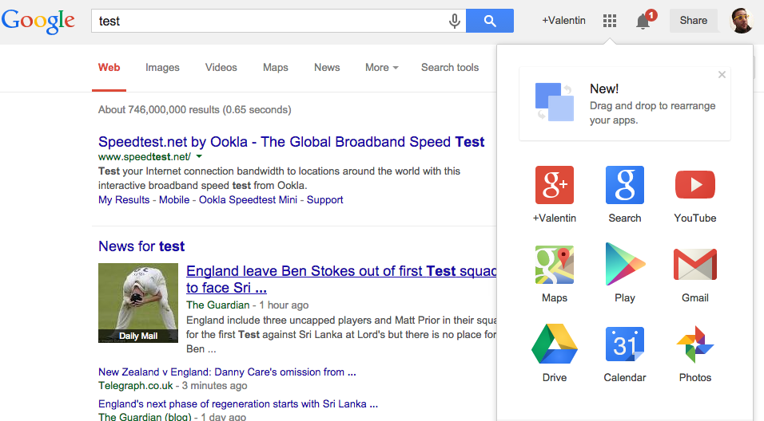
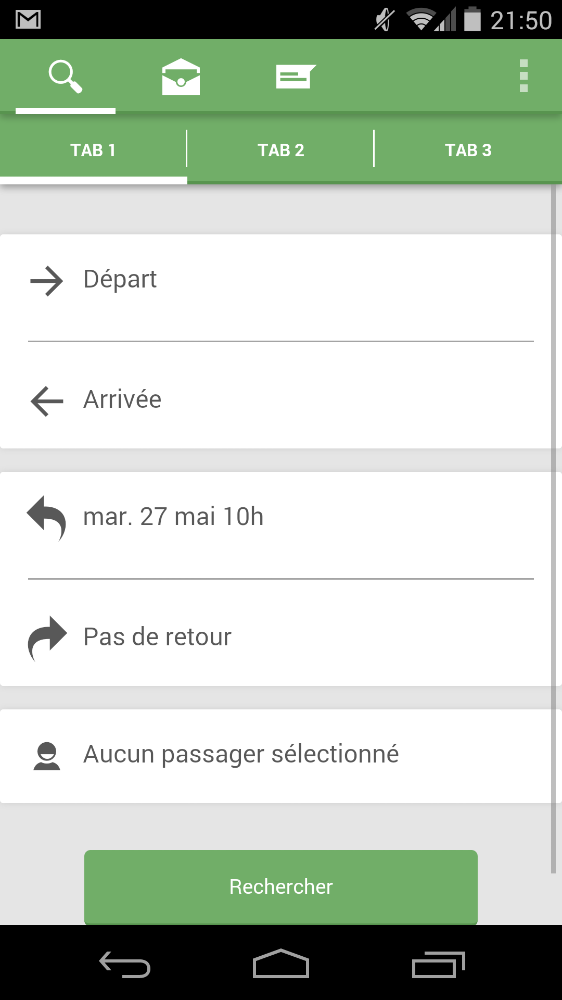
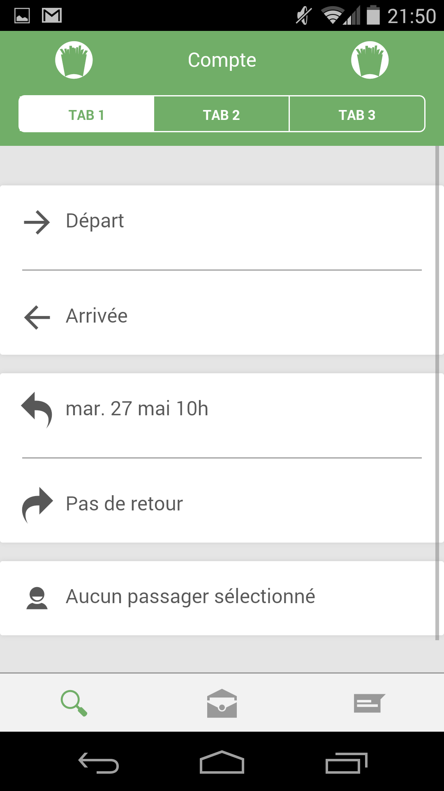

# Cordova

### Réaliser des applications mobile grace au Javascript.

Par [Valentin Brosseau](https://github.com/c4software) / [@c4software](http://twitter.com/c4software)

---

 

---

## Historique

- PhoneGap (2009)
- Cordova (Apache 2011)
- Ionic (Framework, 2013)

---

## Pourquoi Cordova ?

- Simple
- Respect des standards
- Les partenaires
  - Adobe
  - IBM
  - Microsoft
  - RIM
  - Nokia
  - Google
- Et surtout… GRATUIT

---

## La Philosophie − Le multi-plateforme

- iOS
- Android
- BlackBerry
- Windows Phone
- Samsung Bada (TV, Smarthone)
- MacOS
- Windows 10

---

## Fonctionnement

- Webview
- Encapsulation dans une application native
- Code local

---


---

## Javascript

- Normes W3C (HTML5)

---

## La clef : La CSS


---

# Mais rien n’est impossible

---



---



---


---

## Une pincée de natif

- Accès aux périphériques du mobile
  - Caméra
  - Accéléromètre
  - GPS
  - Contact
  - Stockage
  - Réseau
  - NFC
  - …

---

## Les plugins

### http://plugins.cordova.io/

---

- Normalisé
- Officiel
  - Adobe
  - Cordova
- Non-Officiel
  - Communauté

---

## Quelques exemples

- Scan de QRCode
- Prise de photos
- Lecture de tag NFC
- …

---

## Natif ou Web

### Avec cordova le web c'est aussi du natif

---


---

## Pour être honnête…

- L'integration
- Performances 3D
- Les navigateurs (Internet Explorer…)

---

## Cordova

- NodeJS
- La structure des dossiers ([Voir](https://cordova.apache.org/docs/en/latest/reference/cordova-cli/#directory-structure))
- Les plateformes ([Voir](https://cordova.apache.org/docs/en/latest/guide/support/index.html))
- Les évènements ([Voir](http://cordova.apache.org/docs/en/latest/cordova/events/events.html#page-toc-source))

---

## Les plugins

- Différents pour chaque plateforme
- Code Natif + Js
- Aucune limite
- Presque tout est déjà disponible ;)
- [Documentation](http://cordova.apache.org/docs/fr/7.x/guide/hybrid/plugins/index.html)

---

## Installation

---

### Pré-requis

- NodeJS
- npm
- Le SDK de la plateforme voulu (Android, iOs, …)

---

### Installer Cordova

```sh
$ npm install -g cordova
```

---

### Créer un projet

```
$ cordova create exemple com.vbrosseau.demo Exemple
```

---

### Ajouter la plateforme

```
$ cd exemple/
$ cordova platform add android
```

---

### Lancer le projet

```
$ cordova run
```

---

### Ajouter un plugin

```
$ cordova plugin add cordova-plugin-camera
Fetching plugin "cordova-plugin-camera@~2.1.0" via npm
Installing "cordova-plugin-camera" for android
```

---

## Les frameworks JS

- Ionic (Angular)
- ReactJS (+ MaterialUI)
- VueJS (+ Vuetify)

---

## Ionic

- UI multiplateforme (iOs et Android)
- Typescript
- Structure complexe (?)

---

## ReactJS + MaterialUI

- UI uniquement Material Design
- ES2016
- Facebook (pérennité ?)
- Complexe de prise en main

---

## VueJS + Vuetify

- UI uniquement Material Design
- ES2016 (ou Typescript)
- Communauté
- Structure simple, approche simple

---

## Aucun framework

- Possible
- Application rapidement non maintenable

---

## Mon choix

- VueJS + vuetify

---

## VueJS

- Simple
- Minimaliste & Flexible
- Performant (ShadowDOM, seulement 20kb)

---

## Les « .vue »

- Un fichier
- CSS « scoppé »
- Gestion des évènements

---

## Les templates

- Complet
- Boucles
- Conditions
- Étendable (exemple i18n ou filtre)

---

## Les composants

- Réutilisable
- Cycle de vie (componentDidMount, Mounted, …)
- [Suite](https://fr.vuejs.org/v2/guide/instance.html)

---

## Le router

- Simple
- Gestions des paramètres
- [Suite](https://router.vuejs.org/fr/)

---

## Le projet démo

```
$ git clone https://github.com/c4software/vuejs-cordova-sample.git
$ cd vuejs-cordova-sample/
```

---

## Installation des dépendances « VueJS »

```
$ npm install
```

---

## Tester la partie Web

```
$ npm run serve
```

---

## Ajouter la plateforme Android

```
$ cd cordova_app/
$ cordova platform add android
```

---

## « Compiler » la version Web

```
$ npm run build # à la racine de projet
$ cd cordova_app/ && cordova run
```

---

# Des questions ?

### Place au code !
