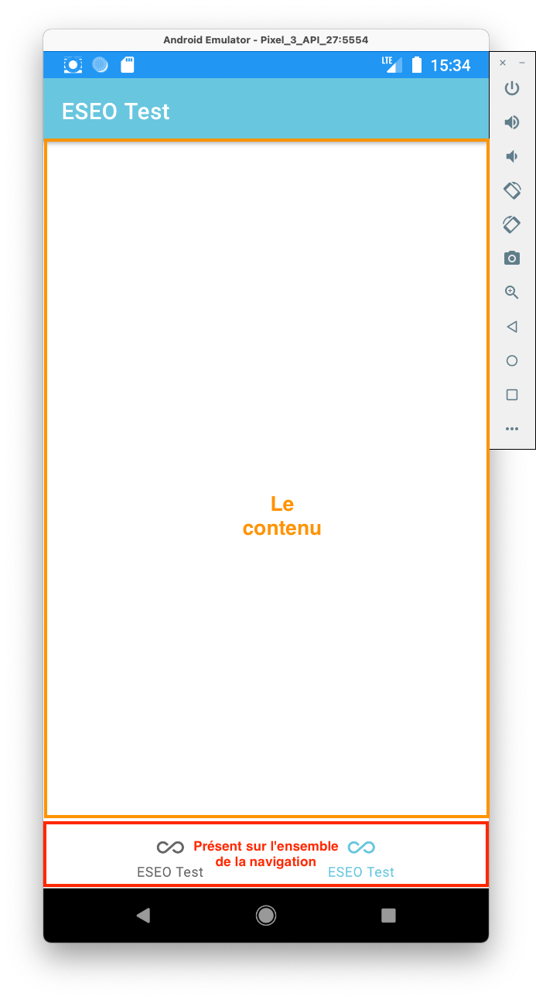
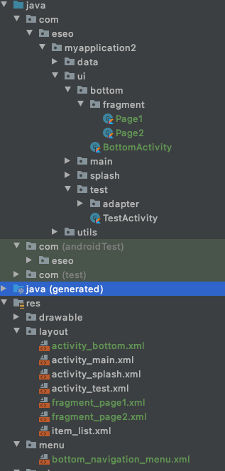
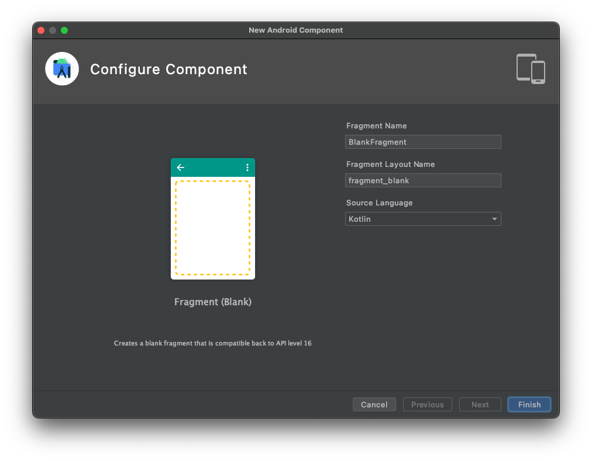
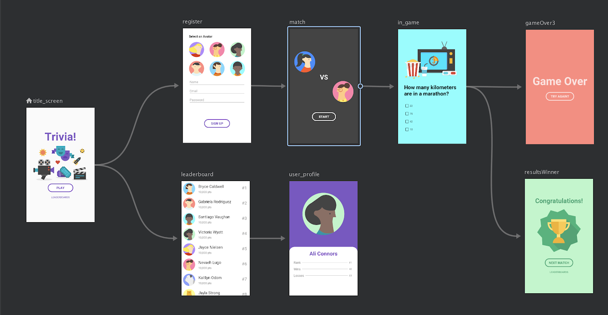
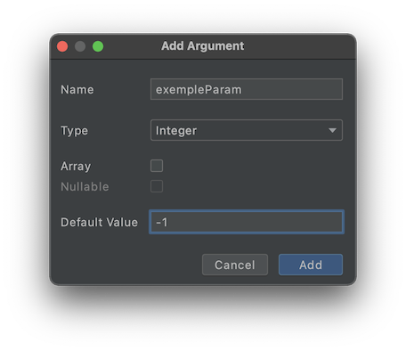
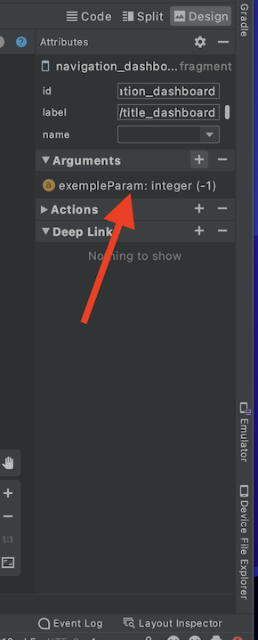

# Suite découverte des bases d'Android

::: details Sommaire
[[toc]]
:::

::: danger XML ou Compose ?

Nous sommes en 2021, le monde d'Android évolue… Pendant des années l'écriture des « layouts » (interface) n'était possible que via du XML. Il est maintenant possible d'écrire les layouts de manières bien plus modernes avec [JetPack Compose](https://developer.android.com/jetpack/compose). Le TP que vous suivez est toujours valide, mais repose sur l'utilisation de XML.

:::

## Les animations

Même si celle-ci n’est pas obligatoire dans une expérience mobile… Celle-ci peut changer radicalement l'expérience de vos utilisateurs. Sur Android (comme souvent) nous avons plusieurs façons de faire nos animations :

- Les animations automatiques `animationLayoutChange`.
- Les Gifs.
- Lottie
- Les « transitions programmées ».
- Les Motion Layout

### Les animations automatiques

Celle-ci est certainement la plus simple à mettre en place. Vous n'aurez aucun contrôle sur celle-ci ; c'est le système Android qui vous animera automatiquement les changements d'état de votre Interface. Pratique pour les cas simples.

Pour mettre en place les animations automatiques il suffit d'ajouter `animationLayoutChange` à la racine du layout à animé layout. Je vous laisse le mettre en place dans votre projet :

- Modifier le layout de votre `splash` pour y ajouter le `animationLayoutChange`.
- Masquer de base le logo de l'ESEO.
- Afficher celui-ci après un délai (comme vu précédemment).
- Le changement sera normalement « animé ».

Je vous laisse tester.

### Les GIF

AKA la technique cheap « et pas ouf ». Je vous l'indique, car c'est marrant ! Et que nous sommes dans un monde où nous utilisons des GIF souvent… Mais en réalité c'est nul comme technique… Lire des GIF ne sont pas supportés nativement par Android, par contre c'est assez simple d'ajouter le support :

- Ajouter la librairie [GifView](https://github.com/Cutta/GifView).
- Remplacer le logo de l'ESEO par un logo animé sur votre Splash.
- Lancer l'`activity` principale à la fin de l'animation.

Je vous laisse tester.

### Lottie

[Lottie](https://airbnb.design/lottie/) est une librairie permettant de faire des animations de qualités, bien au-dessus des GIF ! Lottie est simple à utiliser :

- Installez-la [librairie lottie](https://github.com/airbnb/lottie-android) :

```gradle
dependencies {
  implementation 'com.airbnb.android:lottie:3.6.0'
}
```

- [Chercher une animation sur le site](https://lottiefiles.com/)
- [En suivant la documentation officiel](http://airbnb.io/lottie/#/android?id=from-xml) Placer l'animation à la place de l'image GIF du `SplashScreen`.

C'est à vous, je vous laisse mettre en place l'animation.

### Les transitions programmées

Nous avons vu qu'il était possible d'animer « simplement » une partie de l'écran. Vous avez aussi la possibilité de contrôler les transitions d'un état A -> B et ça de manière assez simple.

```kotlin
    imageView.animate().scaleY(10f).scaleX(10f).setDuration(1000).setStartDelay(500).start()
```

Je vous laisse tester sur votre layout de `Splash` :

<iframe width="560" height="315" src="https://www.youtube.com/embed/eY8tcqyDwYw" frameborder="0" allow="accelerometer; autoplay; clipboard-write; encrypted-media; gyroscope; picture-in-picture" allowfullscreen></iframe>

## Les extensions Kotlin

Kotlin permet d'étendre le langage de manière assez particulière. Vous pouvez ajouter de nouvelles méthodes dans des objets « existant ». Écrit comme ça, ça peut sembler étrange… Mais en réalité ça ouvre des options intéressantes… Ça vous nous permettre de :

- Partage simplement du code. ([Exemple ici](http://kotlinextensions.com/))
- Masquer du code « complexe » que vous pourriez avoir à utiliser à différent endroit.

Créer dans votre projet un fichier nommé `helpers.kt`, dans celui-ci ajouter le code suivant :

```kotlin

/**
 * Extension method to share for Context.
 */
fun Context.share(text: String, subject: String = ""): Boolean {
    val intent = Intent()
    intent.type = "text/plain"
    intent.putExtra(EXTRA_SUBJECT, subject)
    intent.putExtra(EXTRA_TEXT, text)
    return try {
        startActivity(createChooser(intent, null))
        true
    } catch (e: ActivityNotFoundException) {
        false
    }
}
```

Le code en question permet de lancer la fenêtre de partage de votre téléphone. Rien de bien compliqué, cependant si vous avez à le faire à différents endroits c'est rapidement long…

Maintenant pour l'utiliser il suffit d'ajouter par exemple le code suivant :

```kotlin
myButton.setOnClickListener {
    this.share("Ceci est un partage", "Ceci est un partage sub")
}
```

Je vous laisse mettre en place le code sur votre `Home`. Je souhaite avoir :

- Un bouton qui permet de partager « votre application ».
- L'icône doit être « une action de partage ».
- L'icône doit être « En Haut à droite ».

## Les Fragments

Dans le monde d'Android nous n'avons pas que les `Activity` de disponibles, nous avons également les `Fragment` ; les Fragments sont une autre façon d'organiser vos vues. Ils sont utilisés massivement par certains, et pour d'autre pas du tout. Les fragments vont donc permettre de découper la logique de votre vue en différents morceaux. Les différents morceaux ont leurs propres cycles de vies et permettent de faire grossièrement la même chose qu'une activité.

Il y a un endroit ou nous serons « obligé » d'utiliser les fragments c'est dans le cas d'une Bottom Navigation Bar (vous les connaissez très certainement… c'est les bar avec les boutons en bas de l'écran) :



::: danger Un instant
Les Fragments sont un concept pas forcément très compliqué, mais celui-ci demande un peu de concentration pour l'implémenter sans trop de problèmes.
:::

La première étape va être l'ajoute des différentes librairies :

```gradle
    implementation "androidx.fragment:fragment-ktx:1.2.5"
    implementation "androidx.navigation:navigation-fragment-ktx:2.3.2"
    implementation "androidx.navigation:navigation-ui-ktx:2.3.2"
```

### Manuellement

Avant de voir la façon « tout automatique », nous allons implémenter ensemble la version « manuel » des Fragments. La logique des fragments n'est pas vraiment complexe, mais celle-ci demande de la rigueur et de l'organisation. Je vous montre l'objectif à atteindre :

|  |
| :------------------------------------------------: |
|      Les fichiers en vert seront ceux à créer      |

- Étape 1 : Créer une activité racine (vous pouvez utiliser l'outil intégré à Android Studio)

  - Créer la méthode `getStartIntent` comme vu ensemble.

- Étape 2 : Modifier le layout de l'activity principale pour y ajouter :

  ```xml
  <?xml version="1.0" encoding="utf-8"?>
  <androidx.constraintlayout.widget.ConstraintLayout xmlns:android="http://schemas.android.com/apk/res/android"
    xmlns:app="http://schemas.android.com/apk/res-auto"
    xmlns:tools="http://schemas.android.com/tools"
    android:layout_width="match_parent"
    android:layout_height="match_parent"
    tools:context=".ui.bottom.BottomActivity">

    <androidx.fragment.app.FragmentContainerView
        android:id="@+id/frame"
        android:layout_width="0dp"
        android:layout_height="0dp"
        app:layout_constraintBottom_toTopOf="@id/bottom_navigation"
        app:layout_constraintEnd_toEndOf="parent"
        app:layout_constraintStart_toStartOf="parent"
        app:layout_constraintTop_toTopOf="parent" />

    <com.google.android.material.bottomnavigation.BottomNavigationView
        android:id="@+id/bottom_navigation"
        android:layout_width="match_parent"
        android:layout_height="wrap_content"
        app:layout_constraintBottom_toBottomOf="parent"
        app:layout_constraintEnd_toEndOf="parent"
        app:layout_constraintStart_toStartOf="parent"
        app:menu="@menu/bottom_navigation_menu" />

    </androidx.constraintlayout.widget.ConstraintLayout>
  ```

- Étape 3 : Ajouter le menu `bottom_navigation_menu.xml`

  ```xml
  <?xml version="1.0" encoding="utf-8"?>
  <menu xmlns:android="http://schemas.android.com/apk/res/android">
  <item
      android:id="@+id/page_1"
      android:enabled="true"
      android:icon="@drawable/ic_baseline_all_inclusive_24"
      android:title="@string/app_name"/>
  <item
      android:id="@+id/page_2"
      android:enabled="true"
      android:icon="@drawable/ic_baseline_all_inclusive_24"
      android:title="@string/app_name"/>
  </menu>
  ```

  ::: tip À quoi sert le fichier ?
  Le fichier liste l'ensemble des actions possibles dans votre `BottomNavigationView`.
  :::

- Étape 4 : Créer deux fragments (en utilisant l'outil intégré à Android Studio)

  
  

- Étape 5 : Dans le code de votre **Activity** Racine, nous allons ajouter les éléments pour connecter les actions.

  ```kotlin
      private var page1Instance = Page1.newInstance()
      private var page2Instance = Page2.newInstance()

      override fun onCreate(savedInstanceState: Bundle?) {
          super.onCreate(savedInstanceState)
          setContentView(R.layout.activity_bottom)

          showFragment(page1Instance)
          bottom_navigation.setOnNavigationItemSelectedListener { item ->
              when (item.itemId) {
                  R.id.page_1 -> {
                      // Item 1 action
                      showFragment(page1Instance)
                      true
                  }
                  R.id.page_2 -> {
                      // Item 2 action
                      showFragment(page2Instance)
                      true
                  }
                  else -> false
              }
          }

      }

      private fun showFragment(fragment: Fragment) {
          supportFragmentManager.commit {
              setReorderingAllowed(true)
              replace(R.id.frame, fragment)
          }
      }
  ```

::: tip qu'avons-nous ici ?

- Nous avons ajouté dans notre activity 1 méthode, et deux variables qui seront « les fragments » (page1 et page2).
- Nous avons « ensuite connecté » les cliques sur la `BottomNavigationView` aux actions permettant d'afficher le fragment dans le frame.

:::

Implémentons ensemble le code. [Vous avez ici l'ensemble du code](https://gist.github.com/c4software/aebb8f467c229e186d88a04b13a3f406)

### En utilisant le Navigation Graph

Utiliser la Navigation Graph est j'ai envie de dire la bonne façon de faire en 2021. Dans cette solution la théorie des fragments **ne change pas**, vous avez toujours le même découpage et sensiblement la même organisation. Ce qui va changer par contre c'est que nous allons écrire « plus de XML déclaratif » et **beaucoup moins de code Kotlin**.

Avantage du NavGraph :

- Gestion via des XML
- Back stack fonctionnel
- Visuel



Je vous passe la création des activités et des Fragments. Ce que nous allons ajouter/remplacer est :

- Le graph de navigation `res/navigation/mobile_navigation.xml` :

```xml
<?xml version="1.0" encoding="utf-8"?>
<navigation xmlns:android="http://schemas.android.com/apk/res/android"
    xmlns:app="http://schemas.android.com/apk/res-auto" android:id="@+id/mobile_navigation.xml"
    app:startDestination="@id/page_1">

    <fragment
        android:id="@+id/page_1"
        android:name="com.eseo.myapplication2.ui.bottom.fragment.Page1"
        android:label="Page1" />
    <fragment
        android:id="@+id/page_2"
        android:name="com.eseo.myapplication2.ui.bottom.fragment.Page2"
        android:label="Page2" />

</navigation>
```

- Ajuster le layout XML de votre activity pour y ajouter le navGraph :

  ```xml
    <androidx.fragment.app.FragmentContainerView
      android:id="@+id/nav_host_fragment"
      android:name="androidx.navigation.fragment.NavHostFragment"
      android:layout_width="match_parent"
      android:layout_height="match_parent"
      app:defaultNavHost="true"
      app:navGraph="@navigation/mobile_navigation"/>
  ```

- Ajuster le code de votre `Activity` pour y déclarer votre Navigation Graph

  ```kotlin
      override fun onCreate(savedInstanceState: Bundle?) {
          super.onCreate(savedInstanceState)
          setContentView(R.layout.activity_bottom)

          setUpNavigation()
      }

      fun setUpNavigation() {
          val navHostFragment = supportFragmentManager.findFragmentById(R.id.nav_host_fragment) as NavHostFragment?
          NavigationUI.setupWithNavController(bottom_navigation, navHostFragment!!.navController)
      }
  ```

- Et … c'est tout ! Exit la méthode permettant de charger le fragment, Google s'occupe de tout pour nous… Pratique !

Je vous laisse implémenter le code dans votre projet. [Voilà un exemple complet](https://gist.github.com/c4software/6eb4bfca2d82bc04962b0818f676d8df)

::: tip pas de magie ici

De la magie ? Non, Google a tout simplement écrit le code pour vous. Quelques petites remarques pour que ça fonctionne :

- N'oubliez pas : `android:name="androidx.navigation.fragment.NavHostFragment"`.
- Vous devez nommer vos id dans le `mobile_navigation.xml` de la même manière que dans votre `bottom_navigation_menu`.

:::

#### Changer de fragment manuellement

Votre `BottomNavigationView` gère la navigation, c'est pratique, mais nous pouvons aller plus loin. Si vous souhaitez charger un Fragment manuellement il suffit d'écrire :

```kotlin
// Depuis une activité
findViewById<Button>(R.id.test).setOnClickListener {
    findNavController(R.id.nav_host_fragment).navigate(R.id.navigation_dashboard)
}

// Depuis un fragment
root.findViewById<Button>(R.id.test).setOnClickListener {
    findNavController().navigate(R.id.navigation_notifications)
}
```

#### Le passage de paramètre

Pour gérer le passage de paramètre, nous allons devoir ajouter quelques librairies dans notre projet :

Dans votre `build.gradle` (projet) ajouter dans les `dependencies`:

```
classpath "androidx.navigation:navigation-safe-args-gradle-plugin:2.1.0"
```

Dans votre `build.gradle` (app) ajouter :

```
plugins {
    id 'androidx.navigation.safeargs.kotlin'  // <-- Cette ligne
}
```

Nous avons ajouté un plug-in permettant de générer le code « du passage de paramètre ». Il faut donc maintenant configurer « la partie Navigation Graph ». Nous allons procéder en deux étapes :

- Ajouter le paramètre dans le fragment « de destination ».
- Ajouter le lien entre les deux fragments **importants, sans ça rien ne fonctionnera**.

Cette étape n'est pas très complexe, la voilà résumée en vidéo :

<center><iframe width="560" height="315" src="https://www.youtube.com/embed/iUe8KrkacUU" frameborder="0" allow="accelerometer; autoplay; clipboard-write; encrypted-media; gyroscope; picture-in-picture" allowfullscreen></iframe></center>

|                                                |                                                |
| :--------------------------------------------: | :--------------------------------------------: |
|  |                                                |
|  |  |
|  |  |

[Plus d'informations dans la documentation sur l'ensemble du fonctionnement](https://developer.android.com/guide/navigation/navigation-pass-data)

#### Lancer le fragment en passant des paramètres

```kotlin
findNavController().navigate(
    HomeFragmentDirections.goToNotificationWithParam(42)
)
```

#### Récupérer le paramètre

Vous avez de la chance avec Kotlin cette partie est très simple. Si vous souhaitez récupérer le paramètres il suffit d'ajouter une propriété dans la class du fragement de destination, le code à ajouter est le suivant :

```kotlin
val args: VotreClassFragmentArgs by navArgs()
```

::: tip by NavArgs ?
Kotlin vous aide (comme souvent), les développeurs ont codé le fonctionnement qui va injecter ici automatiquement la référence vers « le bundle » contenant la/les donnée(s) passée(s) en paramètre(s)
:::

Et pour utiliser la donnée ? C'est simple, voici un exemple pour « rafraichir les données à chaque affichage du Fragment » :

```kotlin
    override fun onResume() {
        super.onResume()

        // view est la référence à notre Layout.
        // args est le paramètre injecté par Kotlin.
        // args.monElement est mon paramètre.
        view?.findViewById<TextView>(R.id.text_notifications)?.text = args.monElement.toString()
    }
```

### Drawer Layout

En vous servant de l'outil intégré à Android Studio créé une Interface intégrant :

- Un Drawer
- Un BottomNavigationView

Les deux éléments doivent interagir avec le même FragmentContainerView.
