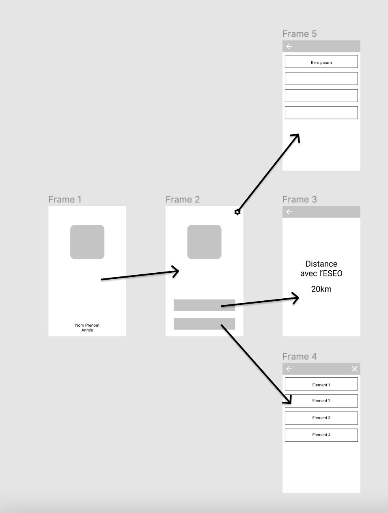

# Projet final

L'objectif de cette application est de valider votre maitrise /connaissances des éléments vus ensemble. Dans « ce cahier des charges » vous avez les éléments **minimums** à fournir, **cependant** je vous invite vivement à vous appropriez le sujet pour proposer une application originale et qui vous ressemble.

Au dela du rendu et de l'aspect fonctionnel de votre application, je vous invite également à soigner :

- La qualité de code (indentation, organisation).
- La mise en place de commentaires (pour faciliter la compréhension).
- L'aspect « propre » des différents écrans de votre application.

## Cahier des charges

L'application à fournir doit contenir **au minimum** les éléments suivants :

- L'icône de l'application doit être personnalisée.
- Les textes doivent être « i18n » (en Français **et** en Anglais)
- La structure de votre application doit être rangée en « package », en suivant l'organisation proposé en cours, ou la vôtre si celle-ci montre une organisation compréhensible.
- Un « splashscreen » qui s'affiche au minimum 2s. Celui-ci doit être constitué d'une image « logo », et d'un texte indiquant votre nom + prénom ainsi que l'année.
- Une activity Home avec :
  - Un logo
  - 3 éléments cliquables :
    - Localisation
    - Historique des localisations précédemment réalisé.
    - Paramétrages
- Une activity Localisation permettant de :
  - Localiser la personne (via le GPS ou le Réseau au choix).
  - Une fois la localisation obtenue, la distance entre l'ESEO et sa position doit être affichée **kilomètre**.
  - À chaque localisation à l'aide des **SharedPreferences** enregistrer la demande pour la lister dans la vue « historique ».
  - Vous devez gérer correctement le flow permission comme vue ensemble.
- Une activity Historique :
  - Utilisation d'un **Recyclerview**.
  - Affiche l'historique des positions enregistrées.
  - _Bonus_ : Action pour vider la liste.
  - _Bonus_ : Si la liste est vide, l'accès à cette activity doit être impossible.
  - _Bonus_ : Ouverture de l'application « de cartographie » du téléphone à la position enregistrée.
  - _Bonus_ : Affichage pour chaque élément du « reverse de la position GPS en texte » (comme vu ensemble).
- Une activity Paramètres :
  - Utilisation d'un **Recyclerview** qui doit contenir :
    - L'accès aux paramètres **de l'application**.
    - L'accès au paramétrage de **localisation du téléphone**.
    - Ouverture de l'application « carte » du téléphone sur la position géo de l'ESEO.
    - Ouverture du site de l'ESEO.
    - Ouverture de l'application « email » pour vous contacter. (lien type mailto)

## Wireframe

::: danger C'est votre application !
Les wireframes ne sont que « la base » / « les fils de fer » de l'application. Je vous laisse être inspiré / imaginatif pour le rendu final.

N'hésitez pas à mettre des icônes, des textes, des images.
:::
