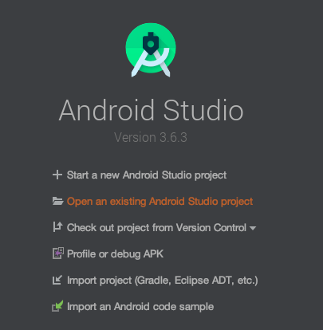
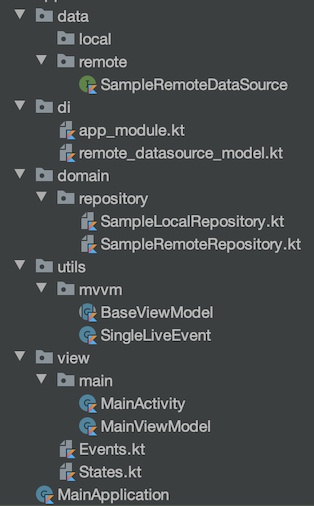

# Explication structure « Android Boilerplate »

Ce document n'est pas un TP, mais une explication de la structure « Android Boilerplate » disponible à l'adresse suivante :

- [Android Boilerplate Koin - Rx - OkHttp](https://github.com/c4software/Android-Boilerplate-Koin-CoRoutines-OkHTTP)

Ce document vous donnera les clés afin de comprendre le fonctionnement et de vous l'approprier.

## But de code

Le but du code fourni sur Github est de simplifier la mise en place d'une base applicative Android « moderne ». Il ne contient aucun code (presque). Il est donc clonnable / téléchargeable et utilisable tel quel, l'idée étant vraiment d'avoir presque un template d'application réutilisable à volonté.

Ceci étant annoncé, passons au détail du fonctionnement.

## Récupérer le code

Pour récupérer le code source vous avez deux possibilités :

- Le fichier zip en provenance de Github : [À télécharger ici](https://github.com/c4software/Android-Boilerplate-Koin-CoRoutines-OkHTTP/archive/master.zip)
- En clonant le repository : `git clone git@github.com:c4software/Android-Boilerplate-Koin-CoRoutines-OkHTTP.git`

⚠️ Attention, si vous avez choisi de cloner le repository. Pensez bien à supprimer le dossier `.git` à la racine des sources afin de ne pas garder l'historique de mon projet. ⚠️

## Lancer le projet une première fois

Avant d'effectuer des modifications dans le projet, nous allons le lancer une première fois. Pour ça, il suffit d'ouvrir le projet avec Android Studio.



Une fois l'indexation terminée, vous devez pouvoir lancer le projet sur un émulateur ou sur votre téléphone. Ce qui devrait donner quelque chose comme :


## La structure des dossiers

Afin de simplifier l'entrée dans le code, j'ai volontairement limité l'organisation des dossiers au strict minimum. Attention, ça ne veut pas dire que vous ne pouvez pas en créer d'autres pour organiser votre code au mieux.



- `data` : Contiens la définition (interface) de vos sources de données (exemple la définition des appels réseau).
- `di` : La définition des éléments qui sont « injectés ».
- `domain` : Votre code métier, celui qui fait le traitement (soit local, ou alors les appels aux APIs HTTP par exemple)
- `utils` : L'ensemble de vos « helpers » / fonctions que vous vous servez à plusieurs endroits dans votre code.
- `view` : Vos « vues », c'est-à-dire vos différents écrans de votre application.

## MVVM ? Kézako !?
L’acronyme MVVM signifie Modèle Vue Vue-Modèle (Model–view–viewmodel). L'architecture MVVM est « plutôt récente » elle date de 2004, elle est inventée à la base par Microsoft afin de simplifier les problématiques de gestion de l'interface (en utilisant des mécaniques d'évènement)

Elle a récemment été popularisée par certains frameworks JavaScript, car elle permet d'implémenter « simplement » des interfaces avec une réactivité importante.


Cette méthode permet, tel le modèle MVC (modèle-vue-contrôleur), de séparer la vue de la logique et de l'accès aux données en accentuant les principes de liaison et d’évènement.

Il faut donc distinguer *3 parties* :

- Le modèle : Les données au sens pures (de la data sous forme d'objet), elles peuvent provenir d'API, de base de données, de sources locales.
- La vue : L'affichage utilisé utilisateur, la gestion des clicks… Et _uniquement_ ça, la logique associée à la donnée est effectuée dans le `Vue-Modèle` (via « le bus des évènements »)
- Le Vue-Modèle : Intéragie avec la couche `modèle` et envoi les nouveaux états résultat à la vue (via le « bus des évènements »).

Nous allons, donc devoir définir « des » bus de communication entre le Vue-Modèle et la Vue afin de permettre l'actualisation des données. Cette organisation vous nous permettre une fois en place de ne manipuler essentiellement plus que de la donnée. La vue sera donc « automatiquement » mise à jour, et ce en fonction de l'état de la donnée (exemple les loaders / les mises à jour de liste, etc.)

📖Pour ceux ayant déjà fait du VueJS (ou autre framework JavaScript récent), le découpage est très proche, vous ne serez pas perdu.

## DI ? Injection de dépendances, Koin quelques explications

En introduction j'ai indiqué que mon « Boilerplate » était le strict minimum viable pour un projet… Et bien je vous ai menti ! Mais garder confiance c'est pour votre bien…

Alors, l'injection des dépendances petite définition Wikipedia :

> Il consiste à créer dynamiquement (injecter) les dépendances entre les différents objets en s'appuyant sur une description (fichier de configuration ou métadonnées) ou de manière programmatique. Ainsi les dépendances entre composants logiciels ne sont plus exprimées dans le code de manière statique, mais déterminées dynamiquement à l'exécution.

Pour faire simple, le but est de ne plus avoir à créer des objets dans votre code. Tout est géré « plus haut » afin de centraliser la configuration, la manière dont l'objet est créé, etc.

Quelques avantages à utiliser de l'injection :

- Réduction du code (les créations d'objets sont effectuées qu'une seule fois et injectées automatiquement grâce au typage).
- Réduction de la mémoire, logique moins d'instance d'objet identique créer à plusieurs endroits dans votre code.
- Isolation entre la logique de l'objet et votre code, vous n'êtes qu'un consommateur de fonctionnalités la logique peut-être carrément écrite par quelqu'un d'autre, voir dans certains cas externalisés dans des librairies externes (Kotlin Native par exemple).
- Etc.

### Koin

Dans notre nous allons utiliser la librairie Koin, elle est complètement écrite en Kotlin, elle a comme avantage d'être simple à utiliser avec très peut de code à écrire (et donc à comprendre).

### Concrètement ça ressemble à quoi

```kotlin
val appModule = module {
    // Inject dependencies for the MainViewModel (the only UI in this boilerplate)
    viewModel { MainViewModel(get(), get()) }

    // Sample Remote Data Repository
    single<SampleRemoteRepository>(createdAtStart = true) { SampleRemoteRemoteRepositoryImpl(get()) }

    // Sample Local Data Repository
    single<SampleLocalRepository>(createdAtStart = true) { SampleLocalRepositoryImpl() }
}

val remoteDataSourceModule = module {
    // provided web components
    single { createOkHttpClient() }

    // Fill property
    single { createWebService<SampleRemoteDataSource>(get(), BuildConfig.REMOTE_URI) }
}

val moduleApp = listOf(appModule, remoteDataSourceModule)
```
L'ensemble est, je pense, relativement parlant, mais regardons en détail le `get()`, comme vous pouvez le voir celui-ci est présent un peu partout dans la déclaration de nos éléments à injecter. Ce mot-clé est _magique_ il permet à [Koin](https://insert-koin.io/) de détecter le type de paramètre attendu et d'injecter automatiquement le bon objet.

Par exemple nous indiquons que `createWebService(client: OkHttpClient, url: String)`, automatiquement Koin va chercher dans les objets qu'il connait ceux correspondant à la signature (dans notre cas `single { createOkHttpClient() }`) et `BuildConfig.REMOTE_URI` étant la String attendu.

Dans le cas d'un objet de notre vue, nous avons dans le même principe : 

`viewModel { MainViewModel(get(), get()) }` qui représente le View-Modele de notre Vue qui attend deux paramètres :

`MainViewModel(sampleRemoteRepository: SampleRemoteRepository, sampleLocalRepository: SampleLocalRepository)`.

Compliqué ? Pas tellement, avec la pratique ça vous semblera automatique. 😊

## Modifier le package « sample »

Comme vous le savez, sur Android les applications doivent être uniques « de manière cryptographique » et via leur package. Nous allons donc faire en sorte de personnaliser le package afin de le rendre unique pour vous et votre téléphone.

<iframe width="560" height="315" src="https://www.youtube.com/embed/3tULbe0wPmU" frameborder="0" allow="accelerometer; autoplay; encrypted-media; gyroscope; picture-in-picture" allowfullscreen></iframe>

## Changer le nom de l'application

Si vous regardez dans votre liste d'application vous allez trouver une application nommée `Boilerplate - Koin - Retrofit`. Pour le changer, c'est simple, il suffit d'éditer le fichier `strings.xml`.

⚠️ En parlant de ce fichier, celui-ci *doit* contenir l'ensemble de vos textes (et évidemment pas uniquement le nom de votre application).

## Changer la configuration de l'API

## LocalRepository ?

## RemoteRepository ?

## Ajouter une nouvelle route d'API distance

### Déclarer l'appel HTTP dans SampleRemoteDataSource

### Déclarer la méthode dans SampleRemoteRepository

### L'appeler depuis le code

## Ajouter une nouvelle méthode « locale »

### Déclarer la méthode dans SampleLocalRepository

## Ajouter une nouvelle Vue

### Layout

### Code

#### getStartIntent ? 