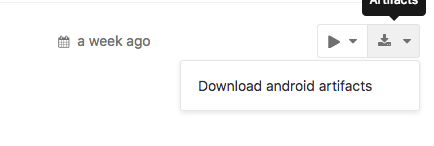

# Compiler une application Hybride avec Gitlab-CI

## Introduction

Dans ce TP vous allez mettre en place l’intégration continue sur votre Projet d’application Hybride. Fini la prise de tête pour la compilation de votre application. Vous allez utiliser « une image Docker » au travers de GitLab-CI l’image docker en question est [https://hub.docker.com/r/c4software/cordova-light/](Cordova-Light).

Pourquoi Light ? Car l’image n’embarque pas Chrome Headless, et donc ne permet pas de faire de test unitaire de votre application.

## Création du projet sur GitLab

Avec votre compte GitLab vous pouvez créer un nombre illimités de projets. La première étape est donc de créer un projet sur votre (https://gitlab.com/projects/new)[compte Gitlab]

⚠️ Je vous conseil de mettre votre projet en mode « Private ».

## Commiter et Pusher vos sources

Si ce n’est pas déjà fait, commiter les sources de votre application Cordova. Attention à bien mettre un ```.gitignore``` pour ignorer le dossier ```nodes_modules/```.

Vous pouvez pusher vos sources.

## Activer GitLab-CI

Maintenant que votre projet est sur GitLab, nous allons activer Gitlab-CI. Pour ça créer un fichier ```.gitlab-ci.yml```, c’est le fichier qui va activer l’intégration continue sur votre projet. Voilà le contenu du fichier :

```yml
image: c4software/cordova-light

stages:
  - deploy

cache:
  untracked: true
  key: "$CI_PROJECT_ID"
  paths:
    - plugins/

android_debug:
  stage: deploy
  when: manual
  script:
    - cordova platform add android
    - cordova build android
  artifacts:
    paths:
      - platforms/android/build/outputs/apk/
```

Et c’est tout, avec se simple fichier votre application est prête et sera compilée en automatique.

Commiter et Pusher la modification.

- Regarder les fichier :
    - À quoi correspond le ```when: manual```?
    - À quoi sert le cache ?
    - À quoi correspond le ```artifacts``` ?

## Lancement d’un « Build »

Pour lancer un build rendez-vous dans la partie « CI/CD » de votre Projet GitLab.


Et lancer le build :


Au bout de quelques minutes votre application est prête :


Bonus !

Grace à l’artifact votre application est même téléchargeable :



## Test et analyse

Désactiver le « cache » dans le fichier Gitlab-ci. Tester de compiler plusieurs fois votre application. À votre avis le cache est-il utile ?

## Signer l’application

Faire du Debug c’est bien ! Mais si on faisait une application prête pour le Store ? C’est possible et tout aussi simplement.

⚠️ Je vous déconseille fortement de le faire sur un runners public de Gitlab-CI. Pourquoi ? Simplement car nous allons mettre une clef de signature sur votre APK, clef qui doit rester PRIVÉE! C’est ce qui garantie la sécurité de votre application, si celle-ci se retrouve en ligne le jeu est fini pour vous n’importe qui peux usurper votre identitée.

Ajouter dans le fichier ```.gitlab-ci.yml```

```yml
android:
  stage: deploy
  when: manual
  script:
    - cordova platform add android
    - cordova build android --release -- --keystore="keystore/keyfile" --keystoreType jks --password="MOT_DE_PASSE" --storePassword="MOT_DE_PASSE" --alias="demo"
  artifacts:
    paths:
      - platforms/android/build/outputs/apk/
```

Comme vous pouvez le constater la partie script fait référence à un nouveau fichier le ```keystore/keyfile```. Pour que la commande fonctionne nous allons donc devoir « le créer ».

### Création du keystore

Le Keystore est une notion d’Android, rien à votre avec Cordova. Il faut donc utiliser Android-Studio (pour les intéréssés il est également possible de le faire avec la ligne de commande) :

Exemple :


Une fois créé :

```sh
git add -A
git commit -am "Ajout signature"
git push
```

### Lancement d’un build

Relancer un build, mais en séléctionnant le stage « android ». Au bout de quelques minutes vous devez obtenir une application signée.