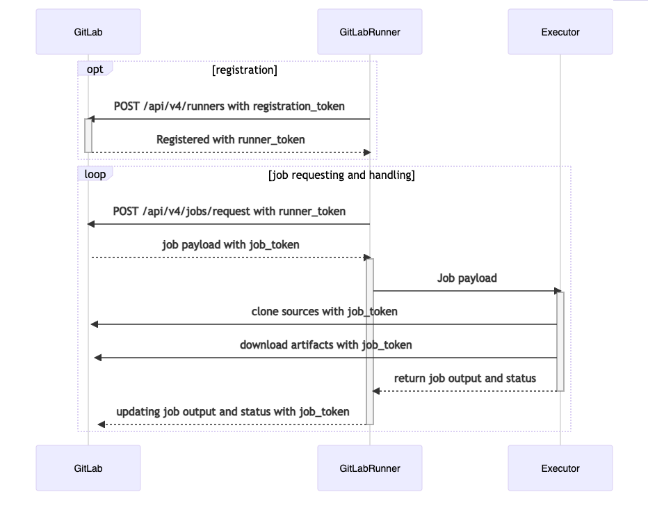
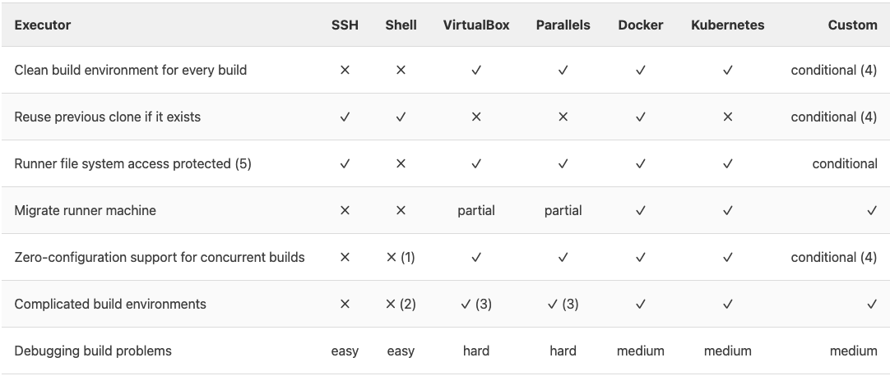
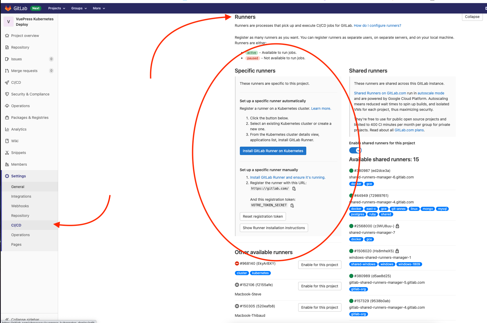
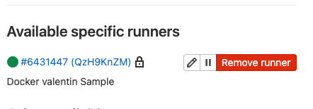
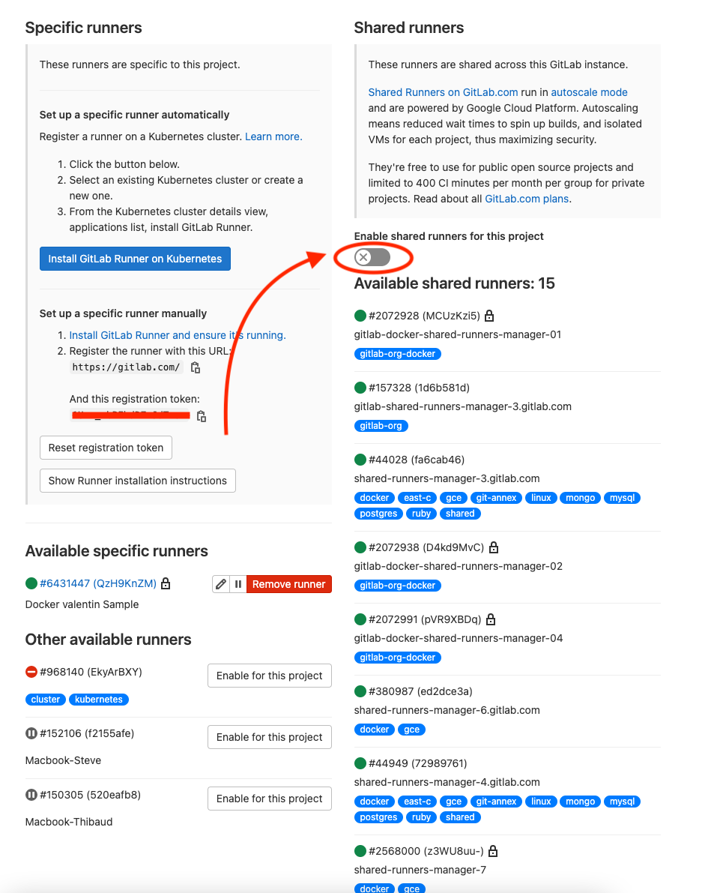

# Installation & Configuration d'un Runner

Dans ce TP nous allons voir comment installer un Runner Gitlab-CI sur votre machine. Posséder un Runner Gitlab aura plusieurs avantages que nous détaillerons au fur et à mesure ensemble.

## Introduction

Nous avons vu que Gitlab-CI « offrait » des runners pour compiler / exécuter vos opérations de CI. C'est runners sont partagé avec l'ensemble des utilisateurs de la plateforme Gitlab. Même s’ils sont globalement très réactifs et très peu souvent en « panne », je vous propose ici d'installer votre (ou vos) propre(s) runner afin de maitriser entièrement votre processus de CI.

- À votre avis, pourquoi est-ce important ? Quels « problèmes » voyez-vous à l'utilisateur des runners partagé ?

Le runner Gitlab-CI est un petit logiciel qui va être connecté aux serveurs de Gitlab et qui va se mettre en écoute de demande de tâche de compilation / test / packaging que **vos projets** ont besoin de réaliser. L'avantage est double :

- Pas de limite en nombre de compilation.
- Accès à vos ressources locales pour le déploiement.



## L'executeur

Un Runner Gitlab-CI est un simple démon qui attend les Jobs comme vus dans le diagramme précédent. Une fois un Job reçu celui-ci va demander à « un exécuteur » de traiter la demande. Les exécuteurs sont des sous-processus qui vont se charger de faire les commandes (`scripts`) que vous avez définies dans votre gitlab-ci. Gitlab-CI est capable de fonctionner de différente manière :

- SSH
- Shell
- Parallels
- VirtualBox
- Docker
- Docker Machine (auto-scaling)
- Kubernetes
- Custom



### Comment choisir ?

#### Shell

C'est le plus simple de tous. Vos scripts seront lancés sur la machine qui possède le Runner.

#### Parallels, VirtualBox

Le Runner va créer (ou utiliser) une machine virtuelle pour exécuter les scripts. Pratique pour avoir un environnement spécifique (exemple macOS)

#### Docker

Utilise Docker pour créer / exécuter vos scripts et traitement (en fonction de la configuration de votre `.gitlab-ci.yml`)

**Solution la plus simple et à privilégié**

#### Docker Machine (auto-scaling)

Identique à docker, mais dans un environnement Docker multimachine avec auto-scaling.

#### Kubernetes

Lance vos builds dans un cluster Kubernetes. Très similaire à Docker-Machine

#### SSH

À ne pas utiliser. Il existe, car il permet à Gitlab-CI de gérer l'ensemble des configurations possibles.

## Installation

L'installation d'un Runner Gitlub-CI est possible quelques soit votre :

- Système d'exploitation.
- Architecture (ARM, X86, …)

Deux installations sont possibles « en mode natif » (binaire) en mode « Docker » (container)

::: tip Une préférence ?
Pas de préférence particulière sur la façon d'installer de Runner Gitlab-CI, dans les deux cas les options sont relativement similaires.
::::

### En mode « natif » (binaire)

L'installation en mode « natif », est une installation similaire à l'installation d'un logiciel classique sur votre ordinateur. Le runner Gitlab-CI va prendre la forme d'un _service_ qui démarrera en même temps que la machine sur lequel vous l'installez. L'installation est différente en fonction de votre environnement. Mais celle-ci se résume toujours à la même suite d'opérations :

- Récupération du Runner.
- Installation
- Configurations / Démarrage

En fonction de votre environnement, l'installation peut-être différente, je vous laisse suivre la documentation officielle (et posez-moi des questions) :

- [GNU/Linux](https://docs.gitlab.com/runner/install/linux-manually.html)
- [macOS](https://docs.gitlab.com/runner/install/osx.html)
- [Windows](https://docs.gitlab.com/runner/install/windows.html)

::: danger Attention danger
Nous avons vu dans les exécuteurs qu'il était possible de choisir **Shell**. Même si dans certains cas c'est utile (exemple compilation d'application iOS), **ce mode de fonctionnement** est très dangereux ! En effet avec ce mode vous lancerez des commandes de manière arbitraire directement sur la machine. Ce qu'il faut comprendre ici c'est que si vous vous trompez et que vous lancez un `rm` hasardeux vous allez casser votre propre machine.

**Donc attention danger**, si vous installez Gitlab Runner sur votre machine en mode binaire, je vous conseille vivement de choisir le mode de fonctionnement `Docker executor` lors de la configuration.
:::

### Dans un Docker

Si vous cherchez une solution simple pour configurer / installer un runner Gitlab, la solution Docker est clairement la plus facile. Elle vous permettra en quelques minutes de monter un Runner. La [documentation officielle](https://docs.gitlab.com/runner/install/docker.html) explique bien comment procéder, mais si on résume la procédure. Celle-ci se déroulera en deux temps :

#### Étape 1 : Enregistrement du Runner avec Gitlab-CI

L'étape d'enregistrement n'est à réaliser qu'une seule fois. Elle a pour but d'autoriser Gitlab à communiquer avec votre runner, elle s'assure aussi que seuls vos jobs vont être lancés sur votre Runner.

```sh
docker run --rm -it -v $(pwd)/config:/etc/gitlab-runner gitlab/gitlab-runner register
```

À cette étape, nous initialisons la configuration de notre runner, vous allez avoir plusieurs questions, l'une d'entre elles sera l'identifiant de votre Runner. Celui-ci est indiqué dans la partie CI/CD de votre projet :



Je vous laisse remplir les différentes questions, si vous avez des questions je suis ici :wave:. Dans mon cas voilà mes choix :


- À quoi correspond les tags ?
- Pourquoi est-je choisi docker comme `executor` ?

::: tip Be curious !
La configuration de votre runner est maintenant générée. Celle-ci est contenue dans le fichier `config`. Je vous laisse la regarder.
:::

#### Étape 2 : Lancer le runner

Notre runner est maintenant connu de Gitlab, il n'est pour l'instant par contre pas encore en fonction.


Pour le lancer on réutilise évidemment Docker, via la commande suivante :

```sh
docker run -d --name gitlab-runner --restart always \
     -v $(pwd)/config:/etc/gitlab-runner \
     -v /var/run/docker.sock:/var/run/docker.sock \
     gitlab/gitlab-runner:latest
```

::: tip Un instant :stop:
Analysons ensemble la commande afin de comprendre chacune des lignes, pour ne pas lancer n'importe quoi sur notre machine.
:::

Cette action lance un Container Docker visible via la commande `docker ps` :


**Félicitation**, votre runner est maintenant actif sur Gitlab-CI :



## Configuration & Test

Votre système est maintenant prêt à recevoir des commandes / des ordres depuis Gitlab-CI. Pour être certains que ça soit bien votre `runner` qui prend les ordres il faut désactiver les runners partagés. Cette opération est au même endroit que la partie Token des Runners :



::: tip À partir de maintenant
À partir de maintenant (sous réserve que votre runner soit actif), vos builds ne seront plus décomptés du quota de 400 minutes mensuel. Vous n'avez plus de limite.
:::

Gitlab offre une option pour lancer un build, pour ça rendez-vous dans la partie `CI/CD > Pipelines` de votre projet :


Puis faites un `Run Pipelines` depuis la branche souhaitée.

::: tip Que va-t-il se passer ?

Votre runner va être sollicité pour compiler. Vous pouvez suivre les opérations directement depuis Gitlab-CI. Mais si vous êtes curieux, vous pouvez également lancer un `docker ps` sur votre machine, vous devriez voir au bout de quelques secondes un container démarré sur votre machine. Dans mon cas :


:::

Quelques questions :

- Comment s'assurer que notre runner s'exécute que dans certains cas ?
- Comment utiliser par exemple les Shared Runner pour la partie « Construction de l'image Docker », mais pas dans les autres cas ?
- Comment utiliser notre runner que pour la partie « livraison continue » par exemple ?
