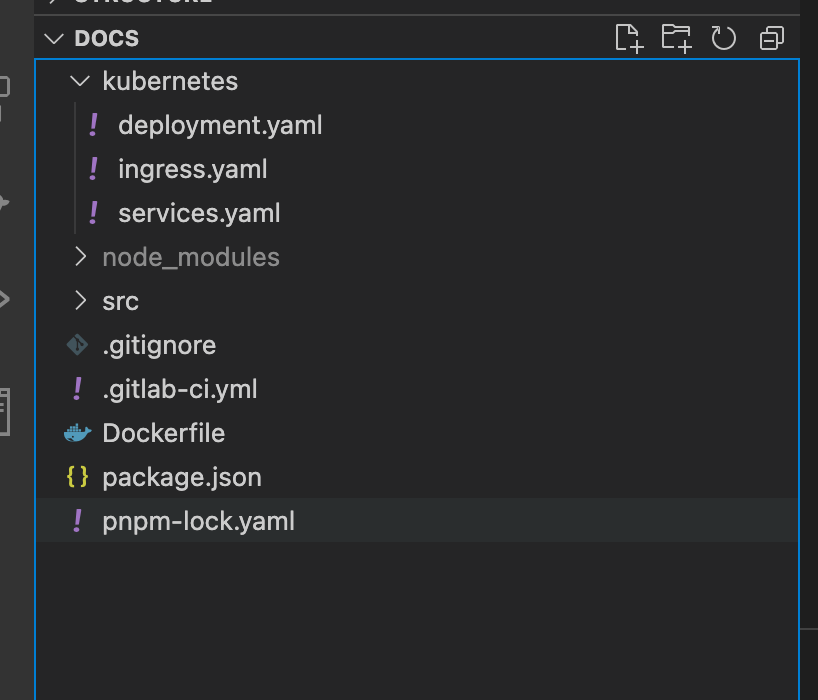

# Déploiement continu et Image Docker dans Kubernetes

[Dans le précédent TP](./deploy-container-in-kubernetes.md) nous avons vu que nous pouvions deployer une image Docker produite par Gitlab-CI « directement » dans un cluster Kubernetes. Dans ce TP nous allons voir comment il est possible d'automatiser ce (re)déploiement.

::: details Sommaire
[[toc]]
:::

## Introduction

Vous avez remarqué dans [le TP d'initiation à Kubernetes](./deploy-container-in-kubernetes.md) qu'après la construction du cluster, les déploiements **étaient très simple** et que finalement il se résume à :

```sh
kubectl apply -f deployment.yaml
```

Nous allons voir que finalement le mettre dans d'un flow de CI/CD ça ne sera finalement pas si compliqué.

::: warning Auto devops ?
Quand on débute, l'option auto devops de Gitlab est tentante. Elle est en effet très intéressante, car elle est plutôt clef en main… **cependant**, je pense que pour un débutant c'est encore plus intéressant de comprendre comment ça fonctionne réellement.

D'autant plus que vous allez le voir, pour un cas simple comme celui que nous avons construit la configuration à mettre est vraiment **très minimaliste**.
:::

## Le retour de la question « On commit la configuration ? »

Gros débat… Dans un projet privé pas de problème, cette configuration peut accompagner le projet… dans le cas d'un projet « public » attention à ne pas commiter un YAML qui ferait référence à des informations privées / non destinée aux publiques (IP, port, …)

Nous sommes dans le cadre d'un projet privé, nous allons commiter la configuration d'autant plus qu'il ne s'agira que des fichiers suivants :

- `deployment.yaml`
- `services.yaml`
- `ingress.yaml`

Un projet nommé `helm` existe également pour automatiser cette partie. Nous pourrions l'utiliser, mais mon objectif est de rester très simple dans l'approche.

::: tip c'est à vous !
Je vous laisse commiter la configuration dans un dossier `kubernetes` (par exemple) **dans le dossier docs**.

Dans mon cas ça donne :


:::

::: danger ATTENTION PAS DE SECRET !
Vous noterez que je ne commit pas la partie contenant les secrets. En effet celle-ci sera présente dans notre projet évidemment ! Mais elle prendra la forme **d'une variable secrète** dans la partie configuration de votre projet gitlab.
:::

## Mise en place du CI

- Mettre les fichiers de configuration Kubernetes dans le projet (et parler de helm)
- Parler que le CI **ne vas pas initialiser la stack**, elle sera fait précédemment une première fois.
  - Reparler du secret gitlab et de la ligne commentée
  - Parler que l'on pourrais gérer l'init

## Authentification (aka comment se connecter à votre serveur depuis la CI)

Création d'une variable type file dans GITLAB (paramètre du projet) avec le contenu du fichier `kubeconfig` obtenu lors de la configuration du projet

-> À faire dans gitlab (mettre image)

## Configuration et variable dans la CI

-> Parler de `sed` pour le remplacement
-> Reparler de `helm`
-> Reparler de l'auth Kubernetes -> Regitry Gitlab

### Commiter la configuration ?

## Configuration du .gitlab-ci

### Ce n'est que de l'automatisation

### 3 étapes

### Un résultat possible

Exemple de configuration Pages + Docker + Kubernetes

```yaml
stages:
  - build
  - deploy
  - publish

build:
  image: node:latest
  stage: build
  script:
    - npm install
    - npm run gitlab
    - mv public public-vue
    - mv dist public
    - find public -type f -regex '.*\.\(htm\|html\|txt\|text\|js\|css\)$' -exec gzip -f -k {} \;
  artifacts:
    paths:
      - public
  only:
    - master

dockerise:
  image: docker:19.03.12
  stage: deploy
  dependencies:
    - build
  services:
    - docker:19.03.12-dind
  variables:
    IMAGE_TAG: $CI_REGISTRY_IMAGE:$CI_COMMIT_SHORT_SHA
  script:
    - docker login -u $CI_REGISTRY_USER -p $CI_REGISTRY_PASSWORD $CI_REGISTRY
    - docker build -t $IMAGE_TAG .
    - docker push $IMAGE_TAG
  only:
    - master

publish_to_prod:
  image:
    name: bitnami/kubectl:latest
    entrypoint: [""]
  stage: publish
  dependencies:
    - dockerise
  script:
    # Décommenter pour autoriser le kubernetes à s'authentifier pour pull l'image docker
    # - kubectl create secret docker-registry gitlab-registry --docker-server="$CI_REGISTRY" --docker-username="$CI_DEPLOY_USER" --docker-password="$CI_DEPLOY_PASSWORD" --docker-email="$GITLAB_USER_EMAIL" -o yaml --dry-run=client | kubectl apply -f -
    - cat ./kubernetes/deployment.yaml | sed "s/{{CI_COMMIT_SHORT_SHA}}/$CI_COMMIT_SHORT_SHA/g" | kubectl apply -f -
    - kubectl apply -f ./kubernetes/services.yaml
    - kubectl apply -f ./kubernetes/ingress.yaml
  only:
    - master
```

### Image multi-architectures ?

Vous souhaitez créer une image qui fonctionnera sur un Raspberry Pi, mais également sur une machine X86? C'est possible, c'est ce que l'on appel le « Multi-architectures. Nous sommes plus dans quelques choses d'aussi simple qu'avec l'exemple précédent, mais vous pouvez le faire sans problème depuis Gitlab-CI ?

```yaml
dockerise:
  image: docker:19.03.12
  stage: deploy
  dependencies:
    - build
  services:
    - name: docker:19.03.12-dind
      command: ["--experimental"]
  variables:
    IMAGE_TAG: $CI_REGISTRY_IMAGE:$CI_COMMIT_SHORT_SHA
    DOCKER_DRIVER: overlay2
    DOCKER_TLS_CERTDIR: ""
    BUILDX_VERSION: v0.4.1
  before_script:
    - apk add curl
    - mkdir -p ~/.docker/cli-plugins
    - curl -sSLo ~/.docker/cli-plugins/docker-buildx https://github.com/docker/buildx/releases/download/$BUILDX_VERSION/buildx-$BUILDX_VERSION.linux-amd64
    - chmod +x ~/.docker/cli-plugins/docker-buildx
    - docker run --rm --privileged multiarch/qemu-user-static --reset -p yes
    - docker info
  script:
    - docker login -u $CI_REGISTRY_USER -p $CI_REGISTRY_PASSWORD $CI_REGISTRY
    - docker buildx create --use
    - docker buildx build --push --platform linux/arm/v8,linux/amd64 -t $IMAGE_TAG .
  only:
    - master
```
