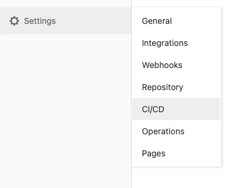
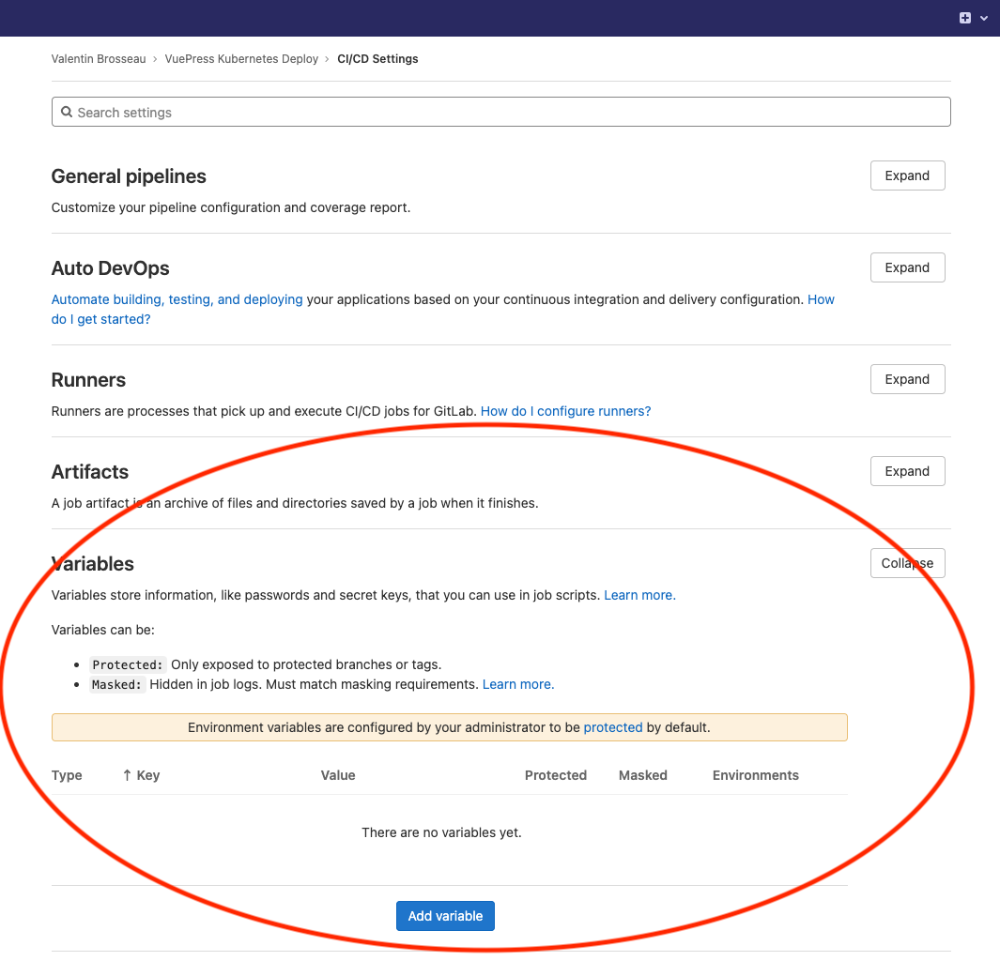
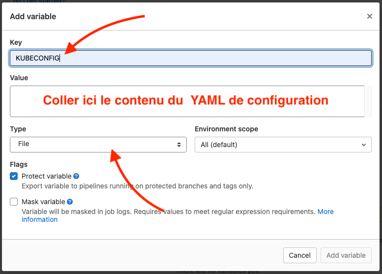
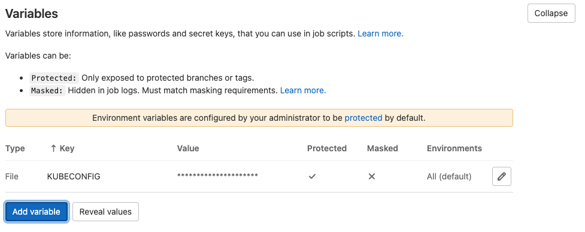

# Déploiement continu, Gitlab-CI + Kubernetes

[Dans le précédent TP](./deploy-container-in-kubernetes.md) nous avons vu que nous pouvions deployer une image Docker produite par Gitlab-CI « directement » dans un cluster Kubernetes. Dans ce TP nous allons voir comment il est possible d'automatiser ce (re)déploiement.

::: details Sommaire
[[toc]]
:::

::: warning
Contenu en cours de rédaction.
:::

## Introduction

Vous avez remarqué dans [le TP d'initiation à Kubernetes](./deploy-container-in-kubernetes.md) qu'après la construction du cluster, les déploiements **étaient très simple** et que finalement il se résume à :

```sh
kubectl apply -f deployment.yaml
```

Nous allons voir que finalement le mettre dans d'un flow de CI/CD ça ne sera finalement pas si compliqué.

::: warning Auto devops ?
Quand on débute, l'option auto devops de Gitlab est tentante. Elle est en effet très intéressante, car elle est plutôt clef en main… **cependant**, je pense que pour un débutant c'est encore plus intéressant de comprendre comment ça fonctionne réellement.

D'autant plus que vous allez le voir, pour un cas simple comme celui que nous avons construit la configuration à mettre est vraiment **très minimaliste**.
:::

## Le retour de la question « On commit la configuration ? »

Gros débat… Dans un projet privé pas de problème, cette configuration peut accompagner le projet… dans le cas d'un projet « public » attention à ne pas commiter un YAML qui ferait référence à des informations privées / non destinée aux publiques (IP, port, …)

Nous sommes dans le cadre d'un projet privé, nous allons commiter la configuration d'autant plus qu'il ne s'agira que des fichiers suivants :

- `deployment.yaml`
- `services.yaml`
- `ingress.yaml`

Un projet nommé `helm` existe également pour automatiser cette partie. Nous pourrions l'utiliser, mais mon objectif est de rester très simple dans l'approche.

::: tip c'est à vous !
Je vous laisse commiter la configuration dans un dossier `kubernetes` (par exemple) **dans le dossier docs**.

Dans mon cas ça donne :


:::

::: danger ATTENTION PAS DE SECRET !
Vous noterez que je ne commit pas la partie contenant les secrets. En effet celle-ci sera présente dans notre projet évidemment ! Mais elle prendra la forme **d'une variable de type file secrète** dans la partie configuration de votre projet gitlab.
:::

## Mise en place du CI/CD

Dans le TP précédent nous avons déjà initialisé dans notre projet la partie CI, en effet l'image du projet est construite automatiquement, cette image est sauvegardée automatiquement dans le Registry Docker interne à Gitlab. Nous allons nous concentrer sur la partie qui nous intéresse à savoir :

- Quel(s) opération(s) nous devons faire lors de la mise à jour de notre Cluster ?
- Quel(s) information(s) nous avons besoin pour échanger avec notre cluster (authentification, secret, registry, …) ?
- Quel(s) commande(s) nous devons utiliser pour déployer notre application ?

::: warning C'est à vous
Cette étape est importante dans le cadre de la mise en place d'un déploiement continue. En effet, le déploiement continu est « juste » une automatisation des actions de livraison. Si vous savez comment livrer, vous saurez comment livrer en continu.

Avant de continuer… Je vous laisse donc réfléchir ! Je vous attends pour échanger sur votre réflexion.
:::

::: danger Une note importante
Dans notre `CI/CD`, et plus particulièrement dans la partie `CD` il s'agit que de la partie déploiement / livraison. **Nous partons du principe** que le cluster est déjà en place et déjà fonctionnel, pour éviter de surcharger notre flow de CD.

Donc normalement :

- Votre cluster existe et est fonctionnel.
- Votre cluster est capable de dialoguer avec votre Registry. (à discuter ensemble)
- Il possède déjà une version de votre application complètement fonctionnelle.

:::

## Authentification (aka comment se connecter à votre serveur depuis la CI)

Nous l'avons vu dens le point précédent, la première étape est d'autoriser le dialogue entre Gitlab et votre Cluster Kubernetes.

Dans le précédent TP nous avons vu que l'authentification était réaliser via un fichier `yaml` obtenu depuis le serveur qui contient le cluster. Nous devrons donc procéder de la même façon depuis GITLAB, le problème est que je vous ai dit que ce fichier **devait rester privé** vous ne devez jamais le commiter dans votre projet.

Les développeurs (Open-Source) de Gitlab ont pensé à tout. Vous avez dans les paramètres de votre projet la possibilité de mettre des variables, ces variables peuvent-être de deux types :

- `string`, pour une variable simple type token, configuration, etc (Ex `$SERVER="https://url-de-staging.devotreprojet.fr"`)
- `file`, représente le contenu de votre fichier, lors de l'étape de CI/CD Gitlab va créer un fichier avec le contenu et déclarera une variable avec comme contenu le chemin vers le fichier en question. (Ex. `$KUBECONFIG="/private/mon_fichie_yaml_RANDOMID.yml"`)

La force des variables c'est qu'en plus d'être souple (de par le type) elles sont également (re)définissables en fonction de l'environnement. Pratique !

Pour configurer une variable, rendez-vous dans "Settings > CICD" puis "Variables".



Puis



### Création de la variable

Nous allons créer une variable de type `file` avec comme nom la variable attendue par `kubectl` à savoir `KUBECONFIG` :



Pour le contenu, je vous laisse prendre le contenu du fichier `YAML` (celui qui contient les secrets) sous **mac** c'est aussi simple que `cat $KUBECONFIG | pbcopy -`.



::: tip Et c'est tout !
Cette étape de création de variables est l'équivalent du `export KUBECONFIG="emplacement/de/votre/vosSecret.yaml"`. Ça veut dire que dans notre flow de CI/CD nous n'aurons rien de spécial à faire. En effet, comme précisé la variable de type `file` expose une variable avec l'emplacement du fichier.
:::

## Configuration et variable dans la CI

Notre authentification est maintenant effective, Gitlab-CI est maintenant capable de dialoguer avec notre Cluster Kubernetes. L'étape suivante est la personalisation du YAML, pourquoi ? En effet, si vous vous souvenez du précédent TP, nous devions undiquer manuellement l'identifiant de l'image à déployer. Exemple :

```yaml
# …
spec:
  containers:
    - name: vuepress-test
      image: registry.gitlab.com/vbrosseau/vuepress-kubernetes-deploy:bb2d2d0b # <- Identifiant du build à déployer
# …
```

Nous devons donc trouver un moyen de le changer **à chaque build** (c'est à dire commit donc). Gitlab-CI intégre un système de variable automatique avec pleins d'informations relative au contexte de votre Build ([Plus d'informations](https://docs.gitlab.com/ee/ci/variables/predefined_variables.html)). Dans cette énorme liste de variable nous avons une variable qui vas nous intéresser plus particulèrement `$CI_COMMIT_SHORT_SHA`. En effet si vous vous souvenez de votre fichier gitlab-ci c'est la variable que nous avons utilisé par tagguer l'image dans le Registry Gitlab.

Mais nous allons avoir un problème… En effet les fichiers `YAML` n'accepte pas les variables comme un simple script shell, nous allons devoir jouer d'une petite astuce pour pouvoir le changer dynamiquement.

::: danger Helm
L'autre solution serait d'utiliser `Helm`, en effet `Helm` permet de gèrer ce genre de chose. **Cependant**, ici nous allons faire simple. Nous allons utiliser `sed`, ça sera suffisant pour faire notre livraison continu minimaliste.
:::

Pardons de l'outil `sed`, TODO

-> Parler de `sed` pour le remplacement
-> Reparler de `helm`
-> Reparler de l'auth Kubernetes -> Regitry Gitlab

::: details En cours de rédaction

### Ce n'est que de l'automatisation

### 3 étapes

### Un résultat possible

Exemple de configuration Pages + Docker + Kubernetes

```yaml
stages:
  - build
  - deploy
  - publish

build:
  image: node:latest
  stage: build
  script:
    - npm install
    - npm run gitlab
    - mv public public-vue
    - mv dist public
    - find public -type f -regex '.*\.\(htm\|html\|txt\|text\|js\|css\)$' -exec gzip -f -k {} \;
  artifacts:
    paths:
      - public
  only:
    - master

dockerise:
  image: docker:19.03.12
  stage: deploy
  dependencies:
    - build
  services:
    - docker:19.03.12-dind
  variables:
    IMAGE_TAG: $CI_REGISTRY_IMAGE:$CI_COMMIT_SHORT_SHA
  script:
    - docker login -u $CI_REGISTRY_USER -p $CI_REGISTRY_PASSWORD $CI_REGISTRY
    - docker build -t $IMAGE_TAG .
    - docker push $IMAGE_TAG
  only:
    - master

publish_to_prod:
  image:
    name: bitnami/kubectl:latest
    entrypoint: [""]
  stage: publish
  dependencies:
    - dockerise
  script:
    # Décommenter pour autoriser le kubernetes à s'authentifier pour pull l'image docker
    # - kubectl create secret docker-registry gitlab-registry --docker-server="$CI_REGISTRY" --docker-username="$CI_DEPLOY_USER" --docker-password="$CI_DEPLOY_PASSWORD" --docker-email="$GITLAB_USER_EMAIL" -o yaml --dry-run=client | kubectl apply -f -
    - cat ./kubernetes/deployment.yaml | sed "s/{{CI_COMMIT_SHORT_SHA}}/$CI_COMMIT_SHORT_SHA/g" | kubectl apply -f -
    - kubectl apply -f ./kubernetes/services.yaml
    - kubectl apply -f ./kubernetes/ingress.yaml
  only:
    - master
```

### Image multi-architectures ?

Vous souhaitez créer une image qui fonctionnera sur un Raspberry Pi, mais également sur une machine X86? C'est possible, c'est ce que l'on appel le « Multi-architectures. Nous sommes plus dans quelques choses d'aussi simple qu'avec l'exemple précédent, mais vous pouvez le faire sans problème depuis Gitlab-CI ?

```yaml
dockerise:
  image: docker:19.03.12
  stage: deploy
  dependencies:
    - build
  services:
    - name: docker:19.03.12-dind
      command: ["--experimental"]
  variables:
    IMAGE_TAG: $CI_REGISTRY_IMAGE:$CI_COMMIT_SHORT_SHA
    DOCKER_DRIVER: overlay2
    DOCKER_TLS_CERTDIR: ""
    BUILDX_VERSION: v0.4.1
  before_script:
    - apk add curl
    - mkdir -p ~/.docker/cli-plugins
    - curl -sSLo ~/.docker/cli-plugins/docker-buildx https://github.com/docker/buildx/releases/download/$BUILDX_VERSION/buildx-$BUILDX_VERSION.linux-amd64
    - chmod +x ~/.docker/cli-plugins/docker-buildx
    - docker run --rm --privileged multiarch/qemu-user-static --reset -p yes
    - docker info
  script:
    - docker login -u $CI_REGISTRY_USER -p $CI_REGISTRY_PASSWORD $CI_REGISTRY
    - docker buildx create --use
    - docker buildx build --push --platform linux/arm/v8,linux/amd64 -t $IMAGE_TAG .
  only:
    - master
```

:::
