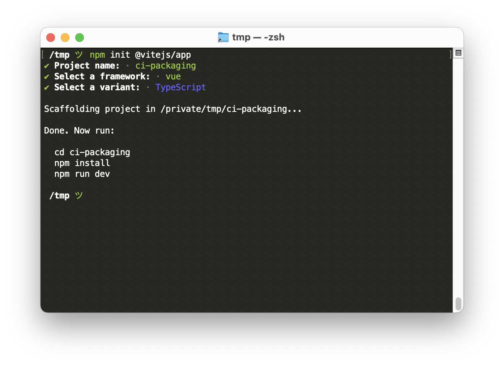
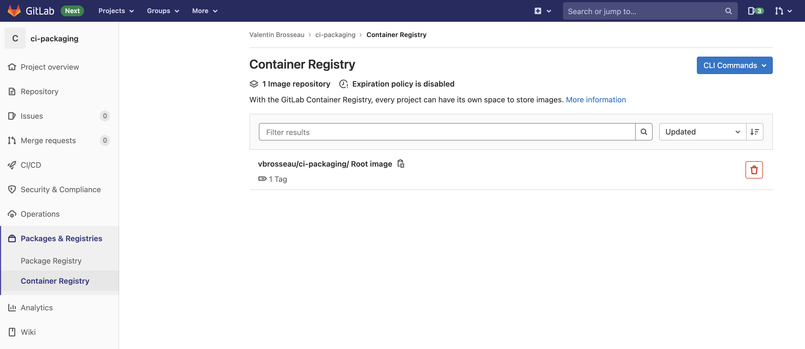

# Packager une application avec Docker

Nous avons vu précédemment qu'il était possible de compiler, déployer, voire de créer un Artifact (livrable) avec l'intégration continue. Cependant nous pouvons aller bien plus loin, nous pouvons carrément créer un conteneur Docker directement depuis le CI.

::: details Sommaire
[[toc]]
:::

## Objectif

L'objectif de faire construire une image Docker directement depuis la CI est d'automatiser à 100% le processus de packaging de votre application. Plus d'humain == plus de risque.

::: tip Plus de risque ?
Façon de parler évidemment… En sécurité l'humain est source de vulnérabilité « volontaire » et « involontaire ». En automatisant au maximum les opérations de packaging, nous pourrons par la même réduire les risques :

- D'erreurs.
- De corruption du livrable.
- de perte de temps.

:::

La finalité est donc de créer directement depuis le CI le livrable **ici l'image Docker de notre application**. Nous utiliserons Gitlab-ci, mais la même opération est possible maintenant avec [Github](https://docs.github.com/en/packages/learn-github-packages/introduction-to-github-packages).

Avec Gitlab ce service s'appelle le [Gitlab Container Registry](https://docs.gitlab.com/ee/user/packages/container_registry/index.html), le service est gratuit et est **intégré** à Gitlab (quelle que soit la version que vous avez). **Bonus** vous avez un registry intégré à chaque projet 👍.

## Créer un projet sur Gitlab

Pour l'instant pas de problème [vous savez faire](https://gitlab.com/projects/new). La première étape est de versionner votre projet sur Gitlab comme habituellement. Je vous laisse créer votre projet, le nom importe peu.


### Ajouter l'application à packager

Je vous propose que l'on package une application Web. Bien que l'on puisse packager ce que l'on souhaite (API, Application, Web), je pense que le web est le plus intéressant, car il possède des étapes « de compilation » en amont ; ces étapes peuvent prendre un peu de temps et sont très facilement automatisables.

Je vous propose de créer un site « fictif » avec ViteJS (VueJS 3), pour ça dans un terminal :

```sh
npm init @vitejs/app
```



Un projet vide vient d'être créé. Je vous laisse le tester dans un premier temps sur votre ordinateur, dans mon cas

```sh
cd ci-packaging
npm install
npm run dev
```

**Je vous laisse vérifier que tout fonctionne comme attendu !**

::: danger npm, yarn, pnpm ?
Personnellement j'utilise `pnpm`, pourquoi ? À cause du dépôt centralisé ; vous souhaitez en savoir plus ? Je suis là 👋  
:::

::: tip Vous souhaitez packager autres choses ?
**Aucun problème** je peux vous aider à packager votre site / api / service.
:::

### Commiter / pusher une première version

Maintenant que tout fonctionne, nous allons créer une première version. Ici bien évidemment on utilise `git` (ça semble évident…).

## Ajouter un gitlab-ci.yml

Pour activer Gitlab-CI, c'est aussi simple que d'ajouter un fichier (`.gitlab-ci.yml`), dans le code source de votre projet. Je vous laisse ajouter la configuration suivante.

```yaml
build:
  image: node:latest
  stage: build
  script:
    - npm install
    - npm run build
  only:
    - master
```

::: tip Comprendre le fonctionnement
Vous voyez ici que finalement l'important c'est de comprendre le fonctionnement pour l'adapteur à notre besoin. Dans le cadre du CI/CD, il faut souvent lire la documentation, adapter, réessayer, etc.

Mais une fois configuré… La vie sera belle et votre travail en grande partie automatisé.
:::

### Tester

Pour l'instant pas de création d'image Docker, nous allons-y aller étape par étape. La première ? Valider que l'installation des dépendances fonctionne sans problème sur Gitlab-CI.

Je vous laisse donc commiter **et pusher** votre code source.

Si tout se passe bien vous devez avoir :


### Dockeriser

La première étape est de `Dockeriser` votre application actuelle. L'idée est donc de créer le fichier Dockerfile nécessaire au bon fonctionnement de votre site web. Je vous laisse réfléchir au besoin, mais pensez qu'ici nous avons un site **static** qui ne possède aucune dépendance ; vous pouvez donc rester très très simple !

[Vous n'avez pas d'inspiration ? Pas de problème, la documentation officielle nous aide](https://vuejs.org/v2/cookbook/dockerize-vuejs-app.html)

::: details Vous avez besoin d'aide ?

```dockerfile
FROM nginx:stable-alpine
COPY dist /usr/share/nginx/html
EXPOSE 80
CMD ["nginx", "-g", "daemon off;"]
```

:::

::: danger STOP !
Avant de pusher votre code, tester sur votre ordinateur le bon fonctionnement !

Dans mon cas :

```sh
docker build -t vue:test .
docker run -it -p 8080:80 --rm --name vuetest vue:test
```

:::

### Packager

Nous avons maintenant tout le nécessaire pour packager notre application directement sur Gitlab-CI et la publier sur le Registry interne à GitLab. Nous allons devoir modifier notre fichier `.gitlab-ci.yml` pour y ajouter une autre step, celle de « release » / « packaging » / « encapsulation ».

La conception de ce gitlab-ci, est un peu plus complexe, je vous propose de vous le donner pour que nous le décortiquer ensemble :

```yaml
stages:
  - build
  - release

build:
  image: node:latest
  stage: build
  script:
    - npm install
    - npm run build
  only:
    - master
  artifacts:
    paths:
      - dist/
    expire_in: 1 hour

release-img:
  image: docker:19.03.12
  stage: release
  dependencies:
    - build
  services:
    - docker:19.03.12-dind
  variables:
    IMAGE_TAG: $CI_REGISTRY_IMAGE:$CI_COMMIT_REF_SLUG
  script:
    - docker login -u $CI_REGISTRY_USER -p $CI_REGISTRY_PASSWORD $CI_REGISTRY
    - docker build -t $IMAGE_TAG .
    - docker push $IMAGE_TAG
  only:
    - master
```

Normalement si tout se passe bien vous devriez avoir …




## Tester depuis votre poste l'image obtenue

### Vous connecter

Votre image est maintenant sauvegardée sur les serveurs de Gitlab, nous pouvons donc maintenant nous en servir sans la builder sur notre poste préalablement. Cependant ce « hub » n'est pas public comme l'officiel, il faudra donc se connecter préalablement / s'authentifier auprès des serveurs de Gitlab.

::: danger STOP
Votre mot de passe ne fonctionnera pas ! Pour des raisons de sécurité vous ne pourrez pas utiliser votre propre mot de passe pour vous authentifiez. [Vous allez devoir générer un Token depuis votre profil](https://gitlab.com/-/profile/personal_access_tokens)


:::

Une fois le token généré il suffit de vous connecter au Registry via la commande :

```sh
docker login registry.gitlab.com
```

### Lancer votre image

Pour lancer votre image, rien de bien complexe ! Il suffit de spécifier le bon projet et le bon tag. Dans mon cas voilà à quoi ça ressemble :

```sh
docker run registry.gitlab.com/vbrosseau/ci-packaging:master
```


## Apporter des modifications

Votre stack est maintenant prête, elle est jouable / rejouable à l'infinie. Je vous laisse apporter des modifications « importante » à votre site Internet pour tester que l'image Docker s'update correctement après vos commits.

## Booster les performances

Votre compilation doit-être actuellement plutôt lente… C'est normal l'installation des dépendances prend un peu de temps. Dans gitlab-ci nous pouvons ajouter du cache, j'ai donné pas mal de pistes pour les autres étapes… Pour celle-ci je vous laisse chercher dans la documentation.

[Gestion du cache](https://docs.gitlab.com/ee/ci/caching/)
