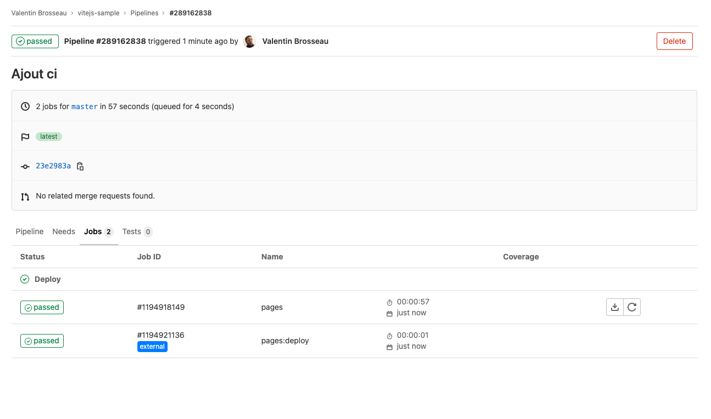

# Utiliser GitLab Pages

## Introduction

Dans ce TP vous allez mettre en place grâce à Gitlab-CI un site web static hébergé par Gitlab Pages. Dans le TP d’introduction au travail collaboratif vous avez travaillé à plusieurs avec une visualisation quasi temps réel des modifications après les commits, c’était réalisé grâce à GitLab-CI et GitLab Pages. Avec un fichier et quelques configurations, vous allez être capable de réaliser la même chose dans vos projets.

## Création d’un nouveau projet sur Gitlab

Pour commencer, créez [un nouveau projet sur votre compte Gitlab](https://gitlab.com/projects/new). Nommer le comme vous voulez, c’est votre projet après tout…

Voilà nous pouvons continuer

## Création d’un site static

Créez rapidement sur votre machine un site static, une simple page web HTML est suffisante (vous pouvez également partir [d’un template disponible ici](https://startbootstrap.com/?showPro=false&showAngular=false)).

Une fois votre page prête, commitez et pushez votre travail sur GitLab (dans le projet que vous avez créé)

Rappel :

```sh
git add -A
git commit -am "Premier Commit"
git push
```

⚠️ Pour pusher votre code il faut avoir ajouté la remote, pour ça vous pouvez suivre les instructions données par GitLab lors de la création du projet.

## Activation de GitLab-CI

Maintenant que votre première version est prête nous allons activer Gitlab-CI pour ça il faut **simplement** créer un fichier intitulé `.gitlab-ci.yml` à la racine de votre projet. Mettez-y le contenu suivant :

```yml
pages:
  stage: deploy
  script:
    - mkdir .public
    - cp -r * .public
    - mv .public public
  artifacts:
    paths:
      - public
  only:
    - master
```

- Regarder le contenu du fichier, étudier les différentes instructions.

## Push de votre code

Pushez votre code sur GitLab, votre projet va maintenant « se compiler » dans la partie CI. Attendez quelques secondes votre site web est maintenant en ligne.

## Allez plus loin

Écrire du code c’est bien, mais le faire en automatique c’est mieux. C’est pour ça que GitLab-CI et GitLab Pages existent, écrire du HTML pour une page c’est possible, mais quand il s’agit d’un site entier, ce n’est pas forcément adapté. C’est pour ça que l’on utilise régulièrement des CMS (écrit en PHP, Python, Ruby, …), mais ce n’est pas la seule façon de faire.

On trouve aussi régulièrement des « générateurs de sites statiques », un générateur c’est un « logiciel » qui va « compiler » votre site pour générer toutes les pages de votre site web (sans avoir à tous les écrire).

Plusieurs avantages :

- Cout d’hébergement réduit (pas de PHP, juste du HTML).
- Sauvegarde simple (c’est juste des fichiers).
- Rapide ! (Oui, pas de PHP).

Inconvénients :

- À votre avis ?

### Déployer un site VueJS

Nous l'avons vu avec Netlify déployer un site VueJS (ViteJS) est très simple. Le faire avec Gitlab-CI et Gitlab Pages est tout aussi simple ! Je vous laisse envoyer votre code source dans un nouveau projet `Gitlab`. Nous allons lui ajouter le fichier `gitlab-ci.yml` suivant :

```yaml
pages:
  image: node:latest
  stage: deploy
  script:
    - npm install
    - npm run gitlab
    - mv public public-vue
    - mv dist public
  artifacts:
    paths:
      - public
  only:
    - master
```

#### npm run gitlab ?

Nous avons ici une petite specificitée, avec Gitlab Pages les fichiers sont distribués dans un sous dossier. Il faut donc indiquer à ViteJS que la base de notre projet ne sera pas à la racine mais dans un sous dossier.

Dans la documentation de ViteJS nous trouvons [donc la réponse ici](https://vitejs.dev/guide/build.html#public-base-path)

Je vous propose donc d'ajouter dans votre fichier `package.json` la configuration suivante dans la partie script :

```json
"gitlab": "vite build --base=./",
```

::: tip Comprendre le fonctionnement
Vous voyez ici que finalement l'important c'est de comprendre le fonctionnement pour l'adapteur à notre besoin. Dans le cadre du CI/CD, il faut souvent lire la documentation, adapter, réésayer, etc.

Mais une fois configuré… La vie sera belle et votre travail en grande partie automatisée.
:::

#### Résultat



Une fois compilé votre site est accessible [pour moi](https://vbrosseau.gitlab.io/vitejs-sample/)

#### Je vous laisse modifier

Je vous laisse modifier votre code source. Vous constaterez que comme Netlify votre site se met à jour automatiquement à chaque push.

### Les moteurs de site static

Comme toujours, il y a plusieurs choix pour faire des sites statiques, voici 3 exemples :

- [Jekyll](https://jekyllrb.com/)
- [Hugo](http://gohugo.io/)
- [Pelican](https://blog.getpelican.com/)

### Exemple avec Hugo

Téléchargez le projet suivant [Exemple de site avec Hugo](https://gitlab.com/pages/hugo), créez un nouveau projet dans votre compte GitLab et envoyez les sources.

- Regarder le contenu du `.gitlab-ci.yml` :

```yml
# All available Hugo versions are listed here: https://gitlab.com/pages/hugo/container_registry
image: registry.gitlab.com/pages/hugo:latest

variables:
  GIT_SUBMODULE_STRATEGY: recursive

test:
  script:
    - hugo
  except:
    - master

pages:
  script:
    - hugo
  artifacts:
    paths:
      - public
  only:
    - master
```

Celui-ci est très proche du nôtre, et c’est normal ! Avec Gitlab-CI c’est toujours très simple à mettre en place.

### Exemple avec Jekyll

C’est à vous… Inspirez-vous [du wiki de Gitlab](https://docs.gitlab.com/ee/user/project/pages/getting_started/pages_from_scratch.html) et [des templates](https://docs.gitlab.com/ee/user/project/pages/getting_started/pages_ci_cd_template.html)
