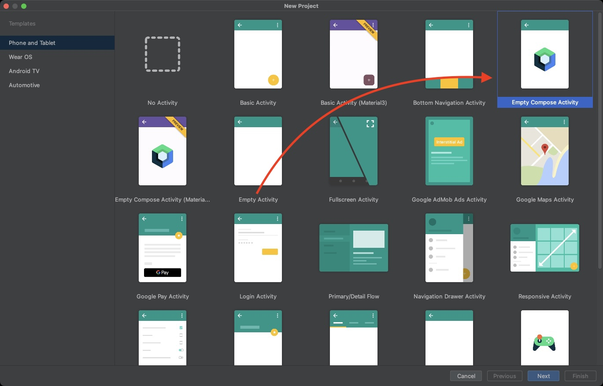
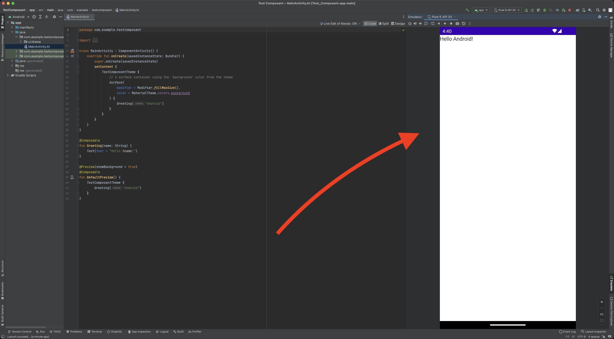
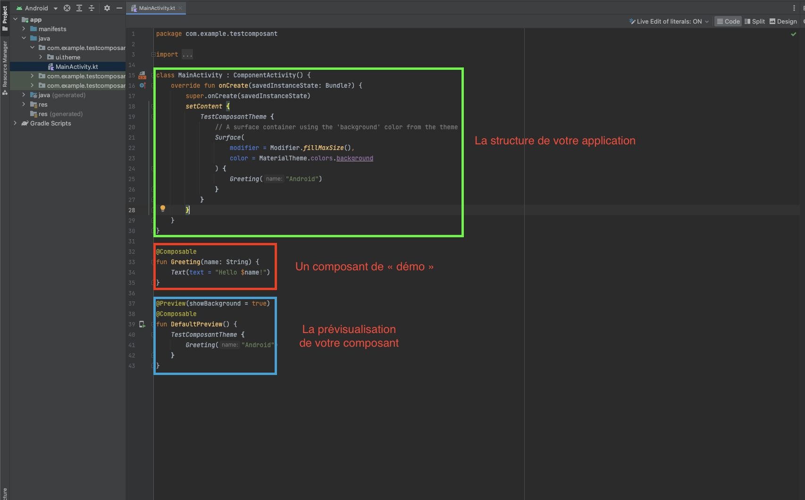
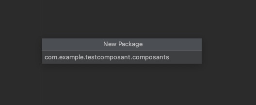
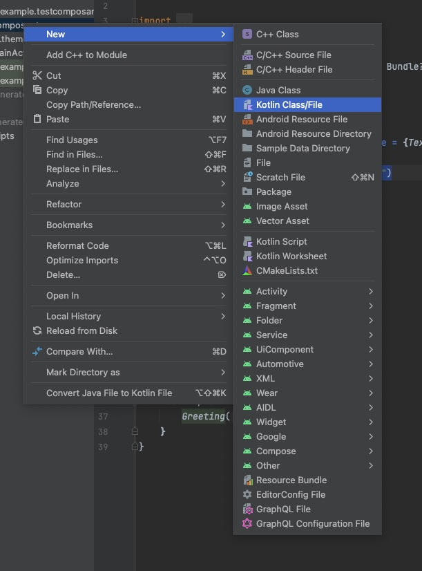
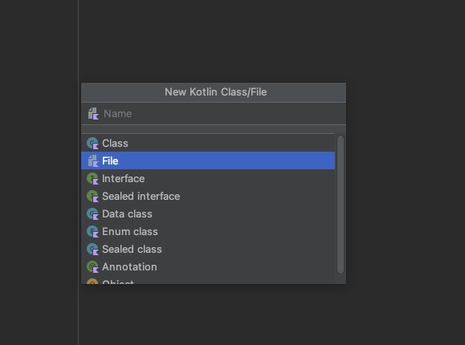
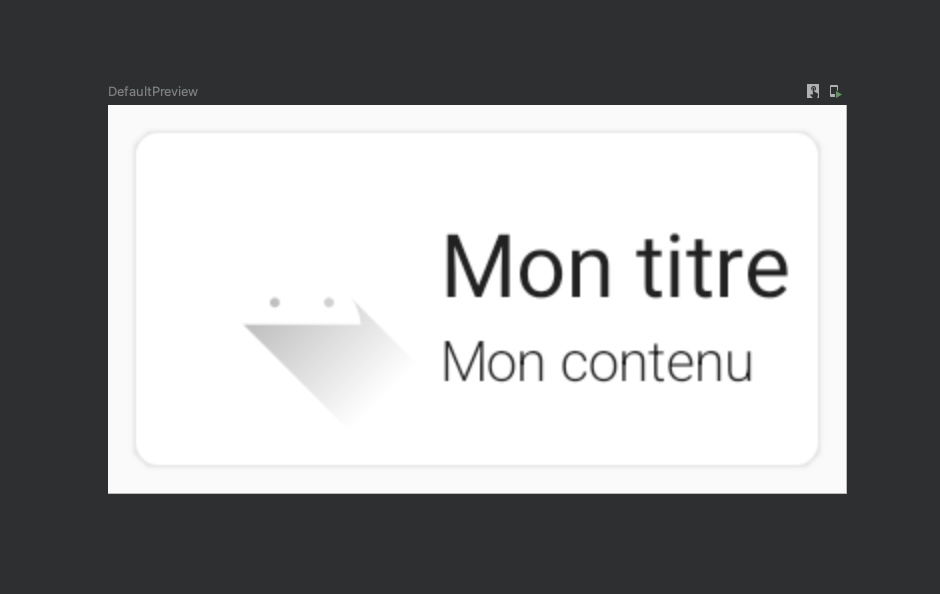
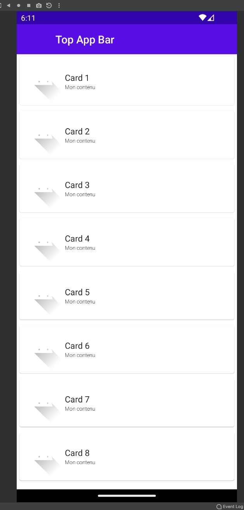

# Les composants avec Android et Jetpack Compose

[[toc]]

## Introduction

Dans ce TP nous allons mettre en pratique l'écriture de composants avec Android Compose. De la logique à la réalisation, nous allons parcourir les bases de la réalisation de composants et de « la réactivité » en lien avec ceux-ci.

## Aperçu du projet

L'application que nous allons réaliser ici est très simple. Il s'agit juste d'une liste et d'une vue de détail. Elle nous servira à comprendre le système de composant.

TODO IMAGE

## Création du projet

Pour la création du projet, rien de spécial à prévoir. Il s'agit ici de suivre le processus de création d'une application comme habituellement. Pour ça nous allons utiliser « Android Studio » qui est l'IDE à utiliser pour créer une application Android.

Lors de la création, Android Studio va nous poser plusieurs questions, nous allons donc choisir :

- Template : Empty Activity
- Language : Kotlin
- SDK Min. : SDK 26. (ou plus)

Je vous laisse suivre les étapes de création d'un nouveau projet.




::: warning, Mais quelques petites remarques :

- Le choix du package est très important. Comme nous avons vu ensemble en cours, le « Package » doit être unique. En effet deux applications ne peuvent pas avoir le même.
- Choisir un min SDK qui correspond aux cibles des mobiles souhaités. (Si vous êtes en France ou dans un autre pays, il conviendra de faire le bon choix).
- Kotlin est maintenant le langage à choisir, Java et Kotlin cohabite sans problème vous n'aurez donc aucun problème de compatibilité.

:::

## Un premier lancement

Pour débuter (et avant de tout casser), je vous laisse compiler et lancer une première fois l'application proposée par Google. Le premier résultat va être incroyable, accrochez-vous…


> Dans mon cas l'application est sur la droite.

::: tip STOP ! Analysons ensemble ce que nous avons obtenu.



Nous allons donc retravailler tout ça pour organiser un minimum notre code source.

:::

## Un peu de structure !

Avant d'aller plus loin, nous allons ajouter un peu de structure dans le microprojet. L'idée étant de faire une application qui ressemble à quelque chose. Nous allons ajouter la structure d'une application basique à savoir une `TopAppBar`.


Je vous laisse modifier le code de la méthode `onCreate`, pour y mettre :

```kotlin
setContent {
    TestComposantTheme {
        Scaffold(
            topBar = { TopAppBar(title = {Text("Top App Bar")},backgroundColor = MaterialTheme.colors.primary)  },
        ) {
            Greeting(name = "Valentin")
        }
    }
}
```

::: tip L'importance de la sémantique

Il est important d'utiliser les bons termes. En développement mobile, nous avons une terminologie qu'il faut respecter. Ici la barre en haut ne se nomme pas « la barre en haut », mais une AppBar.

:::

_À faire :_

Je vous laisse tester votre application à nouveau.

## Votre premier composant

Avant de réaliser le code, nous allons dans un premier temps créer un nouveau package. Il nous servira à stocker nos composants.

Création du package, la procédure est intégrée dans Android Studio :


Nommage du package, dans mon cas « composants » :


Maintenant que votre package est créé, je vous laisse créer le fichier Kotlin qui contiendra votre code :




Pour le nom du fichier, je vous laisse choisir. Moi dans mon cas je vais le nommer « `composant_list_item.kt` ».

::: tip Un instant !

Pas de classe !?

<iframe src="https://giphy.com/embed/l0HlKrB02QY0f1mbm" width="480" height="270" frameBorder="0" class="giphy-embed" allowFullScreen></iframe>

**Et non** avec Compose, les composants ne sont pas des classes. Ce sont des fonctions « Composable » qui seront appelées au bon moment suivant les bonnes conditions dans votre vue.

:::

### Le code de votre composant

L'idée ici est de vous faire constater le bon fonctionnement. Voilà le code de votre premier composant :

```kotlin
import androidx.compose.foundation.Image
import androidx.compose.foundation.layout.Column
import androidx.compose.foundation.layout.Row
import androidx.compose.foundation.layout.height
import androidx.compose.foundation.layout.padding
import androidx.compose.material.Card
import androidx.compose.material.ExperimentalMaterialApi
import androidx.compose.material.Text
import androidx.compose.runtime.Composable
import androidx.compose.ui.Alignment
import androidx.compose.ui.Modifier
import androidx.compose.ui.res.painterResource
import androidx.compose.ui.text.font.FontWeight
import androidx.compose.ui.tooling.preview.Preview
import androidx.compose.ui.unit.dp
import androidx.compose.ui.unit.sp
import com.example.testcomposant.R
import com.example.testcomposant.ui.theme.TestComposantTheme

@OptIn(ExperimentalMaterialApi::class)
@Composable
fun ElementList(
    title: String = "Mon titre",
    content: String = "Mon contenu",
    image: Int? = R.drawable.ic_launcher_foreground,
    onClick: () -> Unit = {}
) {
    Card(modifier = Modifier.padding(5.dp), onClick = onClick) {
        Row(modifier = Modifier.padding(5.dp), verticalAlignment = Alignment.CenterVertically) {
            image?.let {
                Image(modifier = Modifier.height(50.dp), painter = painterResource(id = it), contentDescription = content)
            }

            Column() {
                Text(text = title)
                Text(text = content, fontWeight = FontWeight.Light, fontSize = 10.sp)
            }
        }
    }
}

@Preview(showBackground = true)
@Composable
fun DefaultPreview() {
    TestComposantTheme {
        ElementList()
    }
}
```

Arrêtons-nous un instant, que constatez-vous dans le code que vous avez copié-collé sans trop réfléchir 👀…

- `@Composable` au-dessus de la fonction, indique l'emplacement d'un composant.
- `@Preview(showBackground = true)` permet de réaliser une preview de votre composant sans la lancer sur un téléphone (pratique, testons).
- Les variables (`title`, `content`, `image`, `onClick`) seront le moyen de customiser notre composant.

Je vous laisse mettre en place le code. Et valider que celui-ci s'affiche correctement dans la partie preview.



## Utiliser votre premier composant

Nous avons réalisé notre premier composant, nous allons maintenant utiliser le composant dans notre application.

Pour ça nous allons créer une liste qui contiendra le composant que vous avez créé.

```kotlin
val myData = listOf("Card 1","Card 2","Card 3","Card 4","Card 5","Card 6","Card 7","Card 8","Card 9","Card 10")

LazyColumn {
    items(myData) { item ->
        ElementList(title = item) {
            // Code appelé lors du clique sur un élément de la liste.
        }
    }
}
```

Je vous laisse mettre le code en question **à la place** du `Greeting` dans le composant `Scaffold`.

Vous devez obtenir :



### Rendre votre liste interactive

Maintenant que notre liste s'affiche, nous allons la rendre interactive lors du touch / clique de l'utilisateur sur un élément de la liste. Nous allons avoir besoin de deux choses : 

- Une variable qui permettra de connaitre quel élément à été cliqué.
- Une condition (`if`) pour savoir si nous devons afficher la `LazyColumn` ou seulement un `ElementList`.

Pour la variable, la déclaration de celle-ci est un peu particulière :

```kotlin
var selectedItem by remember { mutableStateOf<String?>(null) }
```

Ajouter cette ligne après votre variable `myData`.

::: tip C'est à vous

Je vous laisse ajouter la condition pour :

- Afficher la `LazyColumn` ou `ElementList` en fonction de `selectedItem != null`.

:::

### Gestion du bouton retour

=> Dans la TopAppBar

## Utiliser tout la puissance des composants

=> Créer une liste d'objet (plutôt que string).

## Découper encore plus

=> Découper et sortir les différentes parties

## Ajouter des animations

```kotlin
AnimatedContent (/* Votre Condition OU votre état */ ) { targetState ->
    when (targetState) {
        true -> { /* Composant affiché quand la condition est vrai */ }
        false -> { /* Composant affiché quand la condition est fausse */ }
    }
}
```