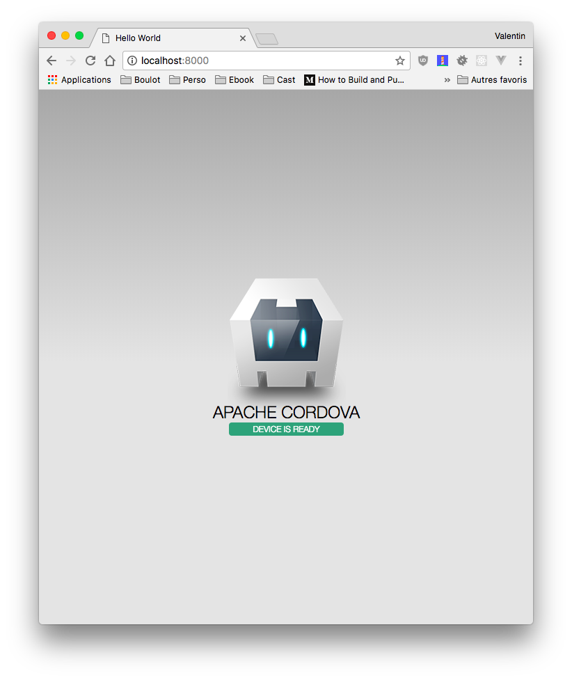

# Découverte de Cordova

Dans ce TP vous aller découvrir la ligne de commande Cordova et créer votre premier TP. Comme les autres TP, utiliser l’aide mémoire Cordova pour trouver les bonnes commandes à chaque étape.

## Ressources

- [Le site Cordova](https://cordova.apache.org)
- [Les plugins Cordova](https://cordova.apache.org/plugins/)
- [Aide mémoire Cordova](https://github.com/c4software/cheatsheet/tree/master/cordova)

## Installation de Cordova

Pour pouvoir utiliser Cordova, vous allez devoir installer le ```cordova-cli```. La ligne de commande Cordova utilise NodeJS pour fonctionner.

(Normalement NodeJS est déjà installé sur votre poste).

```
$ npm install -g cordova
```

L’installation prend quelques minutes, un certains nombre de dépendances NodeJS sont nécessaires au bon fonctionnement.

⚠️ L’installation de Cordova est à effectuer qu’une seul fois sur l’ordinateur.

## Android

Dans le TP, vous allez devoir compiler pour la plateforme Android. Vérifier que celle-ci est bien installer, deux installation sont possibles :

- Android-Studio
- SDK seul

Une fois installé, vérifié que les différents éléments sont bien dans vos variables d’environments :

- Set the JAVA_HOME environment variable to the location of your JDK installation
- Set the ANDROID_HOME environment variable to the location of your Android SDK installation
- Android SDK's ```tools```, ```tools/bin```, and ```platform-tools``` directories to your PATH

Une fois correctement défini le mieux est de redémarrer votre ordinateur pour que l’ensemble des paramètres soit bien pris en compte.

## Création du projet « démo »

La ligne de commande cordova fourni l’ensemble des éléments pour créer un nouveau projet. Le projet que vous allez créer contient une première « page Web » permettant d’avoir un projet Cordova directement fonctionnel.

```
$ cordova create demo com.chevrollier.demo Demo
```

⚠️ Plusieurs paramètres sont nécéssaires à la commande, attention à bien les choisirs des maintenants.

## Ajout d’une plateforme

Votre projet est maintenant prêt vous allez pouvoir ajout une plateforme. Pour rappel Cordova est un framework de développement capable de gérer plusieurs plateforme :

- android
- ios
- browser
- …

Pour commencer nous allons ajouter la plateforme « générique » à savoir browser, celle-ci nous permettra de tester simplement notre configuration.

```shell
$ cordova platform add browser

Using cordova-fetch for cordova-browser@~4.1.0
Adding browser project...
Creating Browser project. Path: platforms/browser
Discovered plugin "cordova-plugin-whitelist" in config.xml. Adding it to the project
Installing "cordova-plugin-whitelist" for browser
Adding cordova-plugin-whitelist to package.json
Saved plugin info for "cordova-plugin-whitelist" to config.xml
--save flag or autosave detected
Saving browser@~4.1.0 into config.xml file ...
```

La plateforme étant maintenant ajouté nous pouvons « démarrer » Cordova en utilisant la commande :

```shell
$ cordova run browser
```



Et voilà, le code de démo tourne dans votre navigateur, génial non ? Bon je vois bien que vous êtes déçu…
 
## Ajouter une seconde plateforme

Bon l’intérêt de Cordova c’est vraiment le mobile, l’utilisation de la plateforme « browser » va nous permettre de valider notre développement sans avoir à brancher son mobile pour valider le fonctionnement.

Pour ajouter la plateforme Android la commande est la suivante :

```shell
$ cordova platform add android 
```

Une fois ajouter nous allons pouvoir « lancer » / « compiler » des applications pour Android.

⚠️ Attention, à cette étape nous avons besoin d’un poste correctement équipé pour compiler de l’Android
