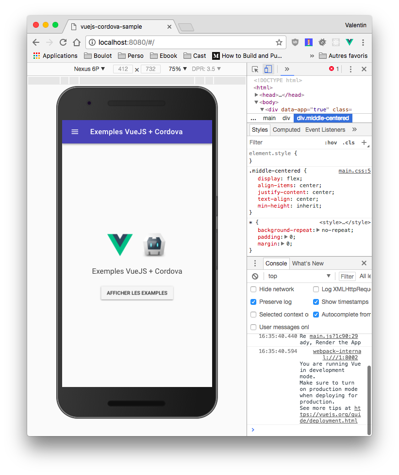
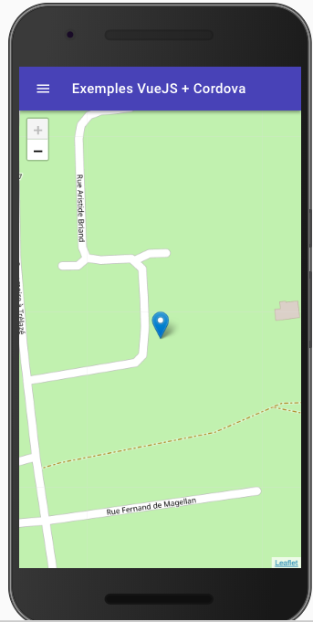

# VueJS et Cordova

Maintenant que nous avons vu les bases de Cordova (Création, Plateforme, plugin). Intéréssons nous à la création d’une vrai application. Dans le monde de cordova il existe plusieurs façon de faire :

- Sans Framework.
- Avec un framework web classique (type VueJS, ReactJS…)
- Avec un framework dédié type ionic
- Avec des solutions comme Phonegap

Pour ce TP nous allons faire une application en utilisant Cordova + VueJS.

<!-- TOC -->

- [VueJS et Cordova](#vuejs-et-cordova)
    - [Le projet](#le-projet)
    - [Le code](#le-code)
    - [Utilser le code fourni](#utilser-le-code-fourni)
        - [1. Compliler une première fois le code](#1-compliler-une-première-fois-le-code)
        - [2. Ajouter la plateforme](#2-ajouter-la-plateforme)
        - [3. Lancer sur votre mobile](#3-lancer-sur-votre-mobile)
    - [Ajouter la vue Localisation](#ajouter-la-vue-localisation)
    - [Ajouter la vue Vibration](#ajouter-la-vue-vibration)
        - [1. Le code](#1-le-code)
        - [2. La route](#2-la-route)
    - [Ajouter la vue Flash](#ajouter-la-vue-flash)
        - [1. Le code](#1-le-code-1)
        - [2. La route](#2-la-route-1)

<!-- /TOC -->

## Le projet

Nous allons réaliser une application qui tests plusieurs plugin Cordova. Cette application utilisera VueJS et VuetifyJS


Cette application sera très simple. Mais va permettre de tester la puissance de Cordova, nous allons utiliser les plugins suivants 

- cordova-plugin-dialogs
- cordova-plugin-vibration
- cordova-plugin-geolocation
- cordova-plugin-flashlight
- cordova-plugin-camera
- phonegap-nfc
- cordova-plugin-statusbar
- cordova-plugin-headercolor

## Le code

Le projet étant assez conséquent je vous propose de partir d’une base déjà faite de l’application. Celle-ci contient :

- L’accueil
- Les scripts pour compiler la partie Cordova
- Les plugins « pré-configurés » / déclaré dans le fichier ```config.xml```.

Le code est [téléchargeable ici](sources/vuejs-cordova-sample.zip)

## Utilser le code fourni

Maintenant que vous avez récupéré le code. Nous allons le rendre fonctionnel pour votre ordinateur.

### 1. Compliler une première fois le code

Le projet étant « non compilé » / « non installé », nous allons devoir dans un premier temps installer les dépendances nécéssaires à notre projet. Pour se faire nous allons utiliser ```npm``` avec la commande ```install```. Dans le dossier du projet :

```shell
npm install .
``` 

Les dépendances « VueJS » s’installe, l’installation peut prendre quelques minutes. Une fois installé tester le fonctionnement avec la commande :

```shell
npm run dev
```

Ouvrez un navigateur et accéder à l’url suivante [http://localhost:8080/](http://localhost:8080/) vous devez voir :



- Passer en mode « simulation de mobile » pour être proche de la compilation final.

### 2. Ajouter la plateforme

Ajouter la plateforme Android au projet :

```shell
cd cordova_app/
cordova platform add android
```

### 3. Lancer sur votre mobile

Maintenant que la plateforme est prête et que notre code est disponible, nous allons compiler l’application pour la lancer sur votre téléphone. La première étape est de « builder » l’application VueJS en version distribuable :

```shell
npm run build
```

✋ La configuration de base d’un projet VueJS créé par VueCLI n’est pas forcément le plus adapté pour Cordova. J’ai donc édité les fichiers :

- ```build/build.js```
- ```config/index.js```

Vous pouvez jeter un coup d’oeil pour voir les différences avec la version normal. Notamment le la partie concernant le file://, cordova utilise l’URI ```file://``` pour servir les ressources dans l’APK, par défaut les développeur de VueCLI on mis des liens avec ```/``` en dur ce qui pose des soucis. J’ai donc remplacé le ```/``` par ```./``` ce qui corrige le soucis. 

Maintenant que le « build » est terminé nous pouvons réaliser le lancement sur le mobile via les commandes suivantes :

```shell
cd cordova_app/
cordova run android
```

✋ Votre mobile doit-être connecté à cet étape, l’application va se lancer directement sur votre mobile. Si ce n’est pas le cas il vous faut un émulateur Android sur votre machine.

## Ajouter la vue Localisation

Pour commencer nous allons ajouter la vue « Localisation ». C’est certainement la plus compliqué de toutes. Par contre c’est celle qui est la plus intéréssante en terme de fonctionnement 



- Créer un fichier ```Localisation.vue``` dans le dossier ```views/```
- Ajouter le contenu suivant :

```js
// Require Cordova Plugin : cordova-plugin-geolocation

<template>
  <div>
    <div id="map"></div>
    <div v-if="isLoading" class="loading elevation-2">
      <div>
        <v-progress-circular indeterminate class="primary--text"></v-progress-circular>
        <br><br>
        <div>{{$t("getPosition")}}</div>
      </div>
    </div>
  </div>
</template>

<script>
  import 'leaflet/dist/leaflet.css';
  import L from 'leaflet';
  import {nativeAlert} from "../libs/";

  // Fix for icon problem with webpack
  // See https://github.com/PaulLeCam/react-leaflet/issues/255#issuecomment-261904061
  delete L.Icon.Default.prototype._getIconUrl;
  L.Icon.Default.mergeOptions({
    iconRetinaUrl: require('leaflet/dist/images/marker-icon-2x.png'),
    iconUrl: require('leaflet/dist/images/marker-icon.png'),
    shadowUrl: require('leaflet/dist/images/marker-shadow.png'),
  });

  export default {
    name: 'localisation',
    data() {
      return {
        isLoading: true
      }
    },
    mounted() {
      // Init the leaflet map
      this.map = L.map('map').setView([47.47121, -0.55198], 5);
      L.tileLayer('https://{s}.tile.openstreetmap.org/{z}/{x}/{y}.png').addTo(this.map);
      this.getUserLocation();
    },
    beforeDestroy(){
      // Destroy the map object on leave
      if(!(this.map === undefined)){
        this.map.remove();
      }
    },
    methods: {
      stopLoading(){
        this.isLoading = false;
      },
      getUserLocation() {
        // Retrieve the current user location
        if (navigator.geolocation) {
          // If the geolocation is available
          navigator.geolocation.getCurrentPosition((position) => {
            // Get the current user position, and create a marker on the map.
            // Pssst, look at the position object there is a lot of more information
            let user_position = [position.coords.latitude, position.coords.longitude];
            L.marker(user_position).addTo(this.map);

            // Set the view on the user position at a correct zoom level
            this.map.setView(user_position, 18);
            this.stopLoading();
          }, () => {
            // If the geolocation plugin not answer or if we reach the timeout
            this.stopLoading();
            nativeAlert(this.$t("positionNotAvailable", this.$t("localisation")));
          });
        }else{
          // If the browser is not compatible
          nativeAlert(this.$t("positionNotAvailable", this.$t("localisation")));
          this.stopLoading();
        }
      }
    }
  }
</script>

<style scoped>
  #map{
    height: calc(100vh - 64px);
    z-index: 1;
  }

  .loading {
    position: absolute;
    width: 150px;
    height: 150px;
    bottom: 50vh;
    top: 50vh;
    z-index: 200;
    margin: auto;
    background-color: white;
    border-radius: 5px;
    left: calc(50% - 50px);
    display: flex;
    justify-content: center;
    align-items: center;
    text-align: center;
    padding: 10px;
  }
</style>
```
- Ajouter l’import dans ```router/index.js``` :

```js
import Localisation from '@/views/Localisation'
```

- Ajouter l’élément ***au bon endroit*** suivant dans ```router/index.js``` :

```js
{
      path: '/localisation',
      name: 'Localisation',
      component: Localisation
}
```

- Lancer le serveur des developpement :

```shell
npm run dev
```

- Tester l’ajout.
- Recompiler l’application et lancer la sur votre téléphone :

```shell
$ npm run build
$ cd cordova_app
$ cordova run android
```

## Ajouter la vue Vibration

Cette vue est très simple, elle a pour but d’utiliser le plugin vibration. Avant de faire le code, je vous propose de regarder la documentation du plugin [cordova-vibrate](https://github.com/apache/cordova-plugin-vibration#vibrate-recommended). Une fois la documentation lu. Passons à l’écriture de la vue.

L’écriture de la fonctionnalitée va se dérouler en 3 étapes :

- Création de ```Vibration.vue``` dans ```views```.
- Écriture de code de la vue.
- Déclaration de la route.

### 1. Le code

### 2. La route


## Ajouter la vue Flash

Une lampe torche c’est fun non ? Et bien nous allons réaliser une nouvelle page qui aura pour simple but d’allumer (ou éteindre) le flash de votre téléphone. Pour ça nous allons utiliser le plugin ```cordova-plugin-flashlight```, avant d’écrire de code nous allons lire la documentation à [l’adresse suivante](https://github.com/EddyVerbruggen/Flashlight-PhoneGap-Plugin). C’est fait ? Bien passons au code.

L’écriture va se dérouler en 3 étapes :

- Création de ```Flash.vue``` dans ```views```.
- Écriture de code de la vue.
- Déclaration de la route.

✋ Petite subtilité! N’oubliez pas VueJS propose une gestion du cycle de vie. Dans cette vue ça vas nous servir. Nous allons utiliser le ```beforeDestroy``` pour éteindre la lampe si celle si est allumée. 

### 1. Le code

### 2. La route