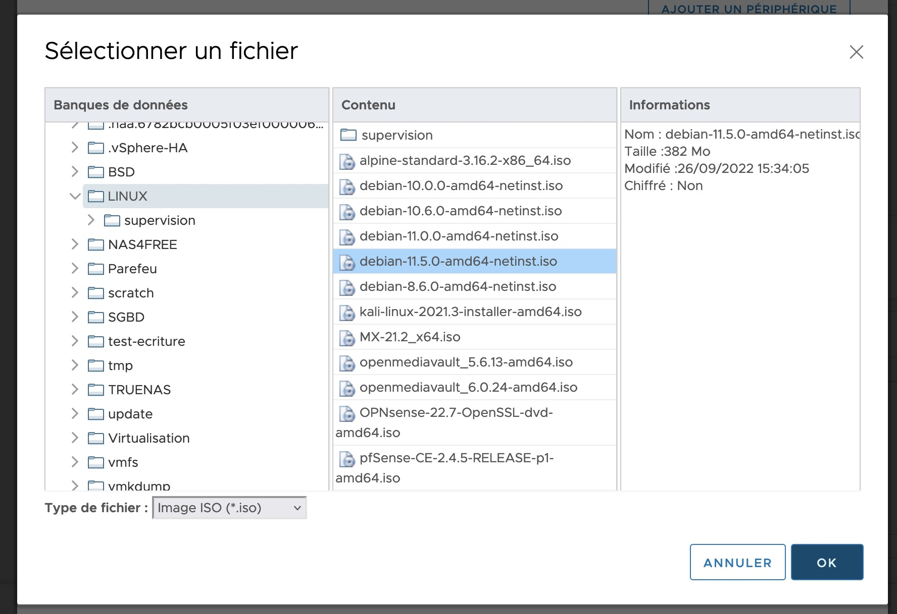

# Installer votre premier serveur

::: details Sommaire
[[toc]]
:::

## Objectifs

Dans ce TP nous allons installer votre premier serveur Debian. L'idée de cette installation est de voir les différentes étapes de l'installation d'un Linux sur la ferme. Nous allons voir :

- Comment installer un système d'exploitation.
- Comment configurer le réseau.
- Comment installer des logiciels.
- Comment accéder à votre serveur depuis votre poste de travail.

## Pré-requis

Pour réaliser ce TP vous devez savoir créer une VM sur la ferme. Si vous ne savez pas comment faire, vous pouvez consulter le TP [créer une VM sur la ferme](./tp1.md).

Vous avez créé votre VM ? Alors c'est parti !

::: tip Installer Debian
Même si au premier abord installer une Debian semble intimidant vous allez voir qu'en réalité c'est plutôt très simple. 

PS: Si vous cherchez plus de défi, vous pouvez installer une [Arch Linux](https://wiki.archlinux.org/index.php/Installation_guide) ou une [Alpine Linux](https://www.alpinelinux.org/). Mais attention, c'est plus compliqué ! **Et surtout non utilisé en entreprise.**

Blague à part 🙃, commençons par installer une Debian, c'est l'une des distributions les plus utilisées en entreprise. Il faut donc maitriser les rudiments de cette distribution.

:::

## Le premier boot

Avant d'aller plus loin, réfléchissons ensemble au premier démarrage de votre machine virtuelle. Vous venez de créer un serveur, celui-ci est normallement équipé : 

- 8Go de disque dur.
- 2Go de RAM.

Cette configuration est suffisante pour installer une Debian.

Votre machine virtuelle va se comporter comme une machine physique. La première étape est donc de vérifier que vous avez bien mis un « disque » dans le lecteur CD / Clef USB pour mettre le système d'exploitation.

## Connecter un ISO pour l'installation

Pour installer votre système d'exploitation, vous allez devoir connecter un ISO à votre VM.

::: tip Un ISO ?

Un ISO est un fichier qui contient une image d'un CD ou d'un DVD. Il est possible de créer un ISO à partir d'un CD ou d'un DVD. Il est également possible de télécharger un ISO sur internet.

Le fichier ISO est une copie parfaite d'un disque physique.

:::

Pour connecter un ISO à votre VM :

- Clique droit sur votre VM et « Modifier les paramètres ».

- choisir l’image iso (liste déroulante) que vous souhaitez : Par exemple `debian-11.5.0-amd64-netinst.iso` qui se trouve dans la banque de données ISO puis répertoire `\LINUX\`.
- N’oubliez pas de cocher la case « Connecter lors de la mise sous tension » sinon votre vm ne bootera pas sur votre iso/cd au démarrage.

::: tip Et voilà !

Vous venez de créer votre première VM. Celle-ci est prête à être démarrée et à être installé (comme un véritable ordinateur).

:::

## L'installation

Vous connaissez déjà l'installation d'un système d'exploitation, c'est la même chose que sur votre ordinateur. Je vous propose cependant que nous suivions ensemble les étapes de l'installation, pour les analyser et les comprendre.

::: warning Un instant

L'avantage d'une VM c'est que nous pouvons, si nous le souhaitons, la supprimer et la recréer. Nous allons donc faire quelques essais pour voir comment installer une Debian.

Dans les prochaines semaines nous installerons plusieurs serveurs, pas de panique si vous ne comprenez pas tout de suite. L'idée est de comprendre les étapes de l'installation et de les reproduire en autonomie (chez vous, dans le cadre d'un projet, d'une AP etc.).

:::

### Le choix de la langue

### Le choix du clavier

### Le choix du fuseau horaire

### Le choix du réseau

### Le choix du mot de passe root

### Le choix du nom de la machine

### Les mots de passe

## Le premier reboot

### Configuration du réseau

### Installation des logiciels

## Accès à votre serveur

### Accès SSH

### L'échange de clés

## Conclusion
