# TP1b. Installer votre premier serveur

::: details Sommaire
[[toc]]
:::

## Objectifs

Dans ce TP nous allons installer votre premier serveur Debian. L'idée de cette installation est de voir les différentes étapes de l'installation d'un Linux sur la ferme. Nous allons voir :

- Comment installer un système d'exploitation.
- Comment configurer le réseau.
- Comment installer des logiciels.
- Comment accéder à votre serveur depuis votre poste de travail.

## Pré-requis

Pour réaliser ce TP vous devez savoir créer une VM sur la ferme. Si vous ne savez pas comment faire, vous pouvez consulter le TP « [créer une VM sur la ferme](./tp1.md) ».

Vous avez créé votre VM ? Alors c'est parti !

::: tip Installer Debian
Même si au premier abord installer une Debian semble intimidant vous allez voir qu'en réalité c'est plutôt très simple. 

PS: Si vous cherchez plus de défi, vous pouvez installer une [Arch Linux](https://wiki.archlinux.org/index.php/Installation_guide) ou une [Alpine Linux](https://www.alpinelinux.org/). Mais attention, c'est plus compliqué ! **Et surtout non utilisé en entreprise.**

Blague à part 🙃, commençons par installer une Debian, c'est l'une des distributions les plus utilisées en entreprise. Il faut donc maîtriser les rudiments de cette distribution.

:::

## Ressources

Pour réaliser ce TP, vous aurez besoin de :

- [Aide mémoire Debian](/cheatsheets/serveur/linux-debian-based.md)
- [Générateur de configuration](/cheatsheets/serveur/debian-reseau.md)
- [Aide mémoire clé SSH](/cheatsheets/ssh-key/)

## Le premier boot

Avant d'aller plus loin, réfléchissons ensemble au premier démarrage de votre machine virtuelle. Vous venez de créer un serveur, celui-ci est normalement équipé :

- 8Go de disque dur.
- 2Go de RAM.

Cette configuration est suffisante pour installer une Debian.

Votre machine virtuelle va se comporter comme une machine physique. La première étape est donc de vérifier que vous avez bien mis un « disque » dans le lecteur CD / Clé USB pour mettre le système d'exploitation.

## Connecter un ISO pour l'installation

Pour installer votre système d'exploitation, vous allez devoir connecter un ISO à votre VM.

::: tip Un ISO ?

Un ISO est un fichier qui contient une image d'un CD ou d'un DVD. Il est possible de créer un ISO à partir d'un CD ou d'un DVD. Il est également possible de télécharger un ISO sur internet.

Le fichier ISO est une copie parfaite d'un disque physique.

:::

Pour connecter un ISO à votre VM :

- Clique droit sur votre VM et « Modifier les paramètres ».


- choisir l’image iso (liste déroulante) que vous souhaitez : Par exemple `debian-11.5.0-amd64-netinst.iso` qui se trouve dans la banque de données ISO puis répertoire `\LINUX\`.
- N’oubliez pas de cocher la case « Connecter lors de la mise sous tension » sinon votre vm ne bootera pas sur votre iso/cd au démarrage.


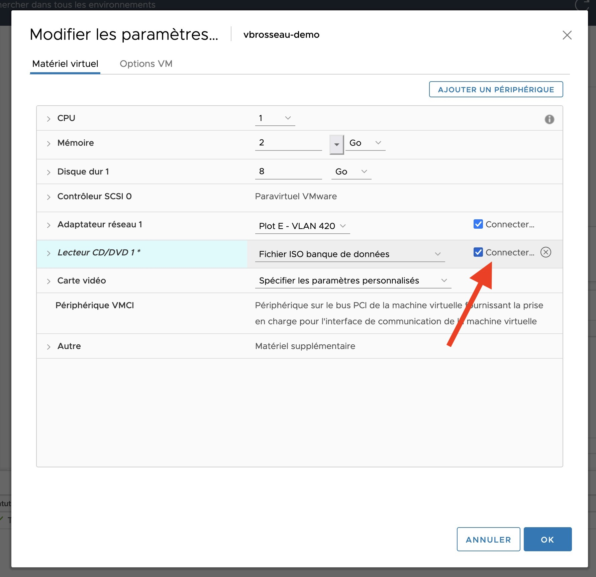

::: tip Et voilà !

Vous venez de créer votre première VM. Celle-ci est prête à être démarrée et à être installé (comme un véritable ordinateur).

:::

## La sécurité

Héberger du contenu nécéssite de réfléchir à la sécurité. En effet, il est important de sécuriser son serveur pour éviter que des personnes malveillantes ne puissent accéder à votre serveur et à vos données.

Différents éléments seront à prendre en compte pour sécuriser votre serveur :

- L'accès aux ports de votre serveur.
- Les services présents sur votre serveur.
- Les utilisateurs présents sur votre serveur.
- Les mots de passe d'accès.

::: danger Développeur != À l'arrache

À première vue, vous vous dites que vous n'avez pas besoin de sécuriser votre serveur, car vous êtes le seul à y avoir accès. Mais ce n'est pas une bonne idée. Vous ne savez pas qui peut avoir accès à votre serveur. Il est possible que quelqu'un d'autre ait accès à votre serveur, et que cette personne soit malveillante. Il est donc important de sécuriser votre serveur.

Vous vous dites également que les serveurs ne sont pas votre histoire. Que c'est l'affaire des personnes dans l'option SISR. Malheureusement pour vous dans la réalité des organisations vous serez amené à gérer des serveurs (au moins de développement).

:::

## L'installation

Vous connaissez déjà l'installation d'un système d'exploitation, c'est la même chose que sur votre ordinateur. Je vous propose cependant que nous suivions ensemble les étapes de l'installation, pour les analyser et les comprendre.

::: warning Un instant

L'avantage d'une VM c'est que nous pouvons, si nous le souhaitons, la supprimer et la recréer. Nous allons donc faire quelques essais pour voir comment installer une Debian.

Dans les prochaines semaines nous installerons plusieurs serveurs, pas de panique si vous ne comprenez pas tout de suite. L'idée est de comprendre les étapes de l'installation et de les reproduire en autonomie (chez vous, dans le cadre d'un projet, d'une AP etc.).

:::

### Choix du type d'installation

Quand Debian Boot, vous avez le choix entre plusieurs types d'installation :

- Graphical install : Installation graphique.
- Install : Installation en mode texte. (C'est celui que nous allons utiliser).


L'installation en mode texte est plus rapide et prendra moins de ressources. De plus, même si le terme « mode texte » peut faire peur, il est très simple d'utilisation.

### Le choix de la langue


### Le choix du clavier


### Le choix de l'emplacement géographique


::: tip Un instant 👋

Pourquoi à votre avis, Debian nous demande de choisir l'emplacement géographique de notre serveur ?

:::

### La configuration du réseau

Comme évoqué en cours, dans le réseau des serveurs, nous ne trouvons pas de DHCP (ou alors très rarement). Nous devons donc configurer manuellement notre serveur.

::: tip DHCP ?

Vous ne vous souvenez plus de ce qu'est le DHCP ? Le DHCP est un service installé sur votre routeur (ou sur un serveur), il permet de configurer automatiquement les machines qui se connectent au réseau. Il permet de configurer l'adresse IP, le masque de sous-réseau, la passerelle par défaut, etc. En quelques mots, comment ça fonctionne ?

- Quand une machine se connecte au réseau, elle envoie une requête au DHCP pour obtenir une configuration réseau.
- Le DHCP lui répond avec une configuration réseau.
- La machine configure automatiquement son adresse IP, son masque de sous-réseau, sa passerelle par défaut, etc.

:::


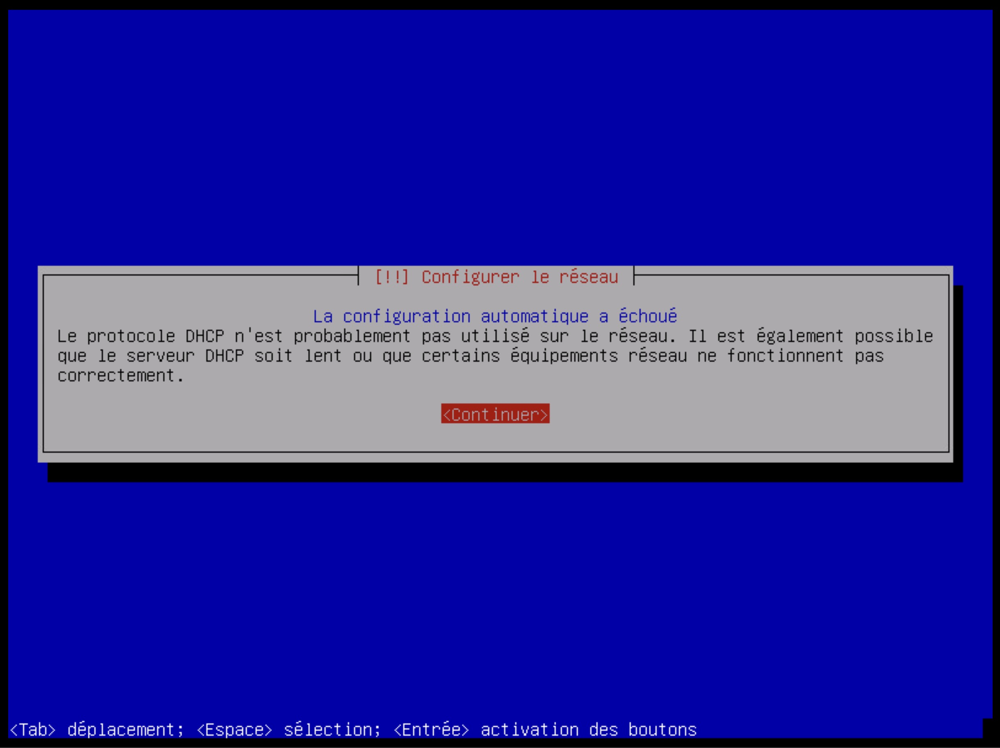

L'installeur va nous demander la configuration réseau de notre serveur. Ici impossible d'inventer, vous devez dans un premier temps vous référer au VLAN qui vous a été attribué par l'équipe pédagogique.

Pour vous aider dans la configuration vous pouvez utiliser l'utilitaire que j'ai développé : [Générateur de configuration](https://cours.brosseau.ovh/cheatsheets/serveur/debian-reseau.html).

Pour simplifier son usage, voilà la version intégré dans ce support :

<DebianConfiguration />

Une fois votre configuration généré par l'outils vous pouvez renseigner les différentes étapes dans votre VM. 

**Dans mon cas**, avec le VLAN 537, j'ai donc :

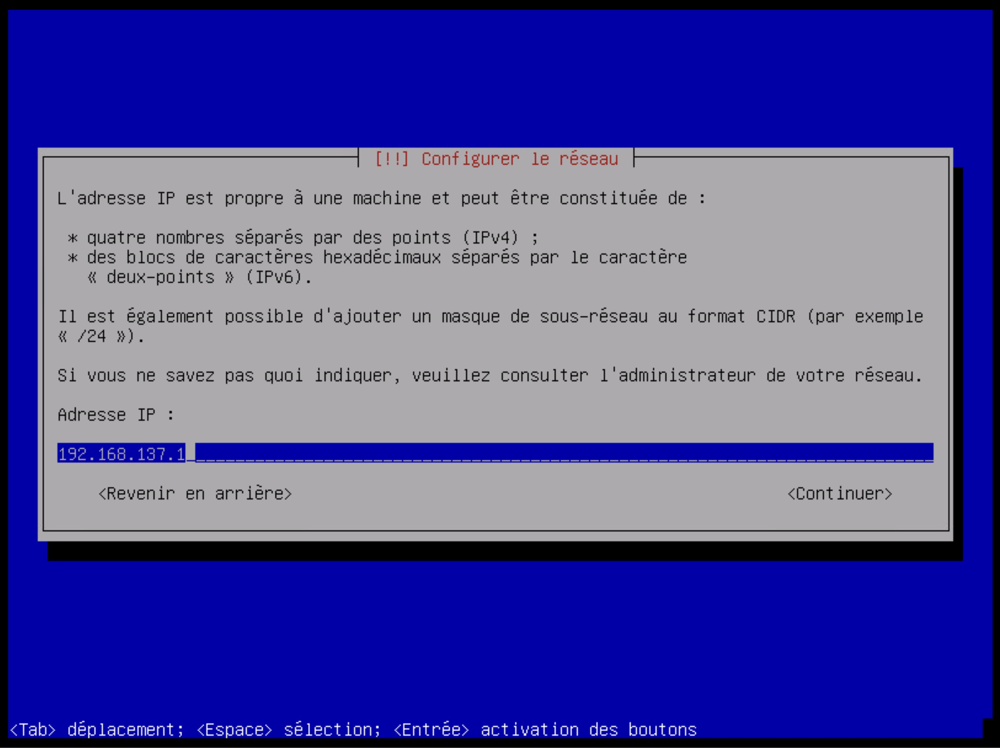
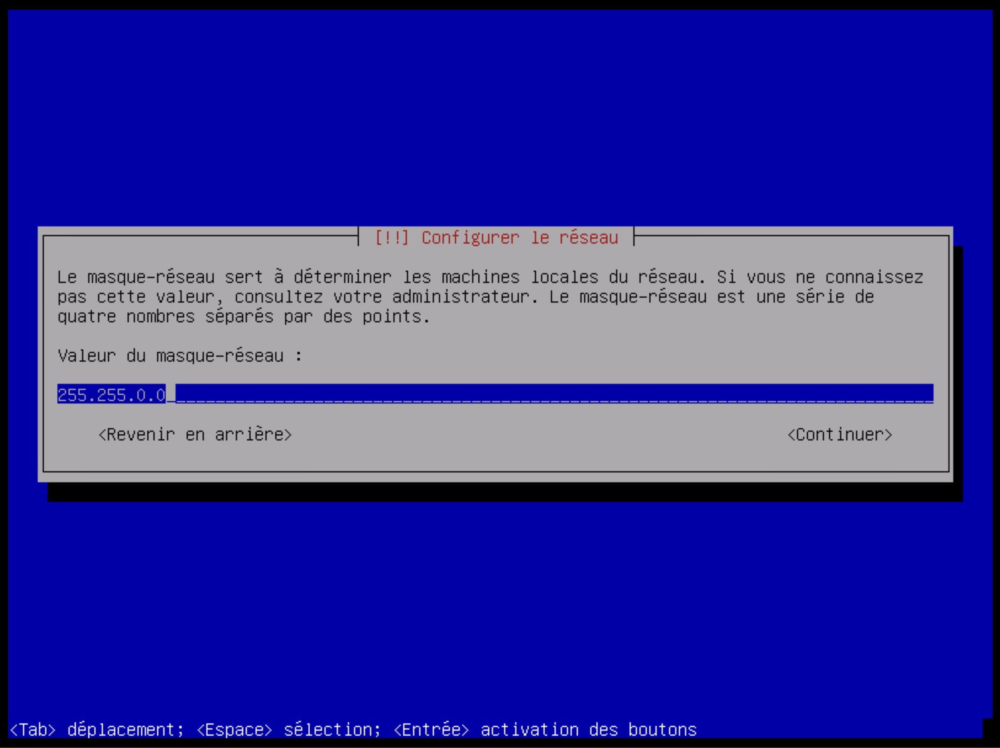
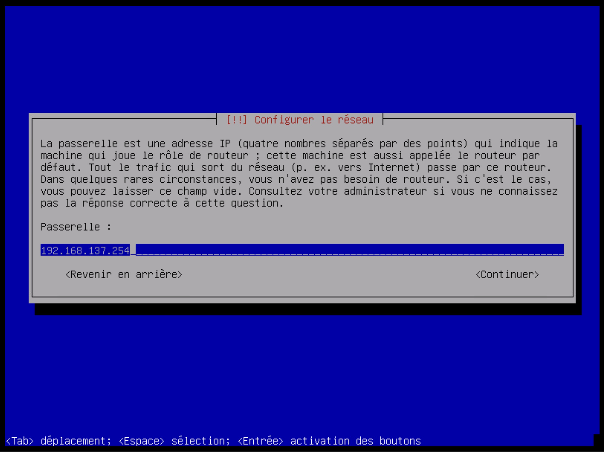
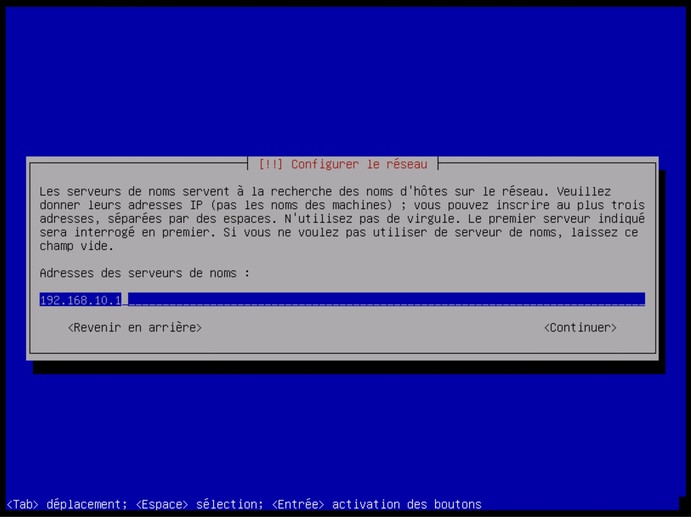

Nous terminons la configuration réseau en renseignant le nom de la machine :

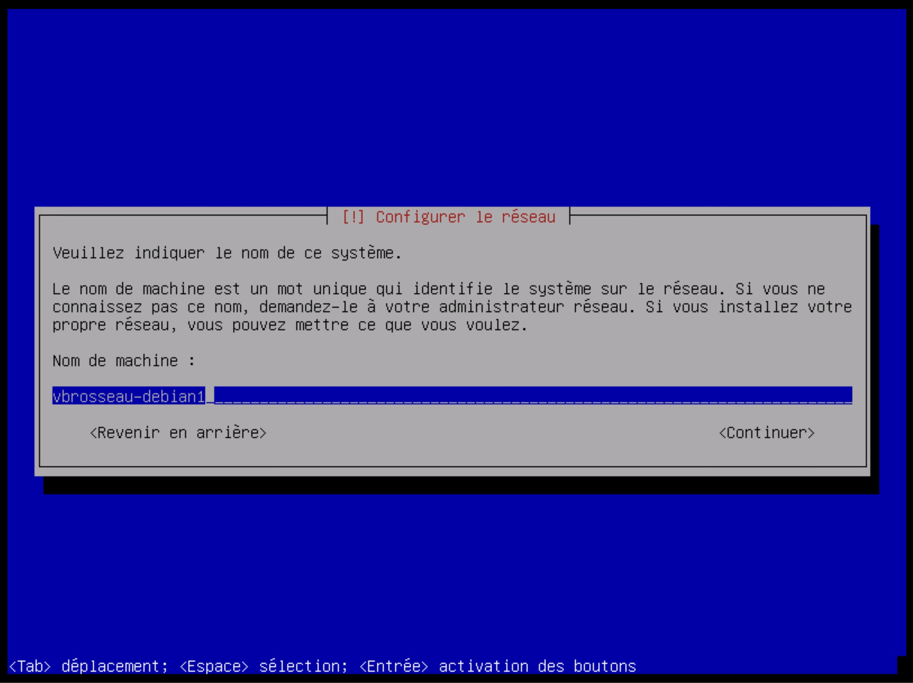

::: danger Attention
Pour assurer la cohérence, le nom de la machine doit être le même que celui que vous avez choisi dans l'interface de vmWare.
:::

### Le choix du mot de passe root

À cet étape, vous devez choisir un mot de passe pour l'utilisateur root. C'est l'utilisateur qui a tous les droits sur le serveur. 

⚠️ Il est donc important de choisir un mot de passe fort.

::: tip Un instant 👋
Même si nous faisons actuellement une machine « de test », je vous invite des à présent à prendre l'habitude de mettre un mot de passe fort.
:::

#### Qu'est-ce qu'un mot de passe fort ?

Un mot de passe fort est un mot de passe qui est difficile à deviner. Vous devez privilégier les mots de passe longs, composés de plusieurs mots, avec des majuscules, des minuscules, des chiffres et des caractères spéciaux.

Par exemple, le mot de passe suivant est très faible :

- `123456`
- `azerty`
- `password`
- `admin`
- …

Pour générer un mot de passe fort vous pouvez utiliser un outil en ligne :

- <https://passwordsgenerator.net/fr/>
- <https://delinea.com/resources/password-generator-it-tool>
- <https://www.grc.com/passwords.htm>

::: warning Quelques conseils

Le mot de passe va être très longs. Vous pouvez des à présent le mettre dans la fiche serveur. Ou voir mieux, dans un gestionnaire de mot de passe comme [KeePass](https://keepass.info/).

:::

### Le compte utilisateur

De manière générale, il est déconseillé d'utiliser le compte root pour se connecter au serveur. Il est préférable d'utiliser un compte utilisateur avec des droits limités.

C'est pour ça que Debian va nous demander de créer un compte utilisateur différent dès l'installation :

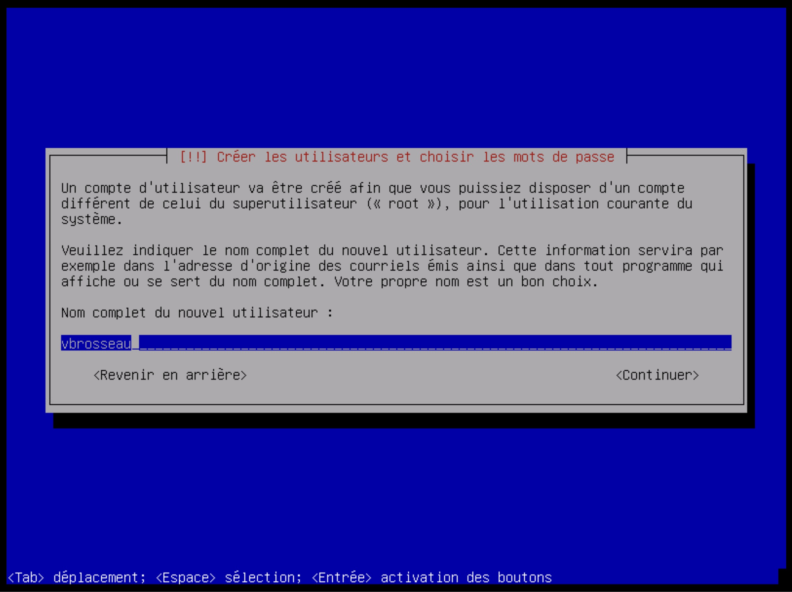

Comme pour le mot de passe root, vous devez choisir un mot de passe fort pour votre compte utilisateur. N'oubliez pas de le noter dans votre fiche serveur.

::: danger Attention
Le mot de passe de votre compte utilisateur doit être différent du mot de passe root.
:::

### Les partitions

L'installeur va maintenant nous demander de créer les partitions de notre serveur. Dans le cadre d'un serveur le choix est simple, nous allons dédié l'intégralité du disque dur à Linux.

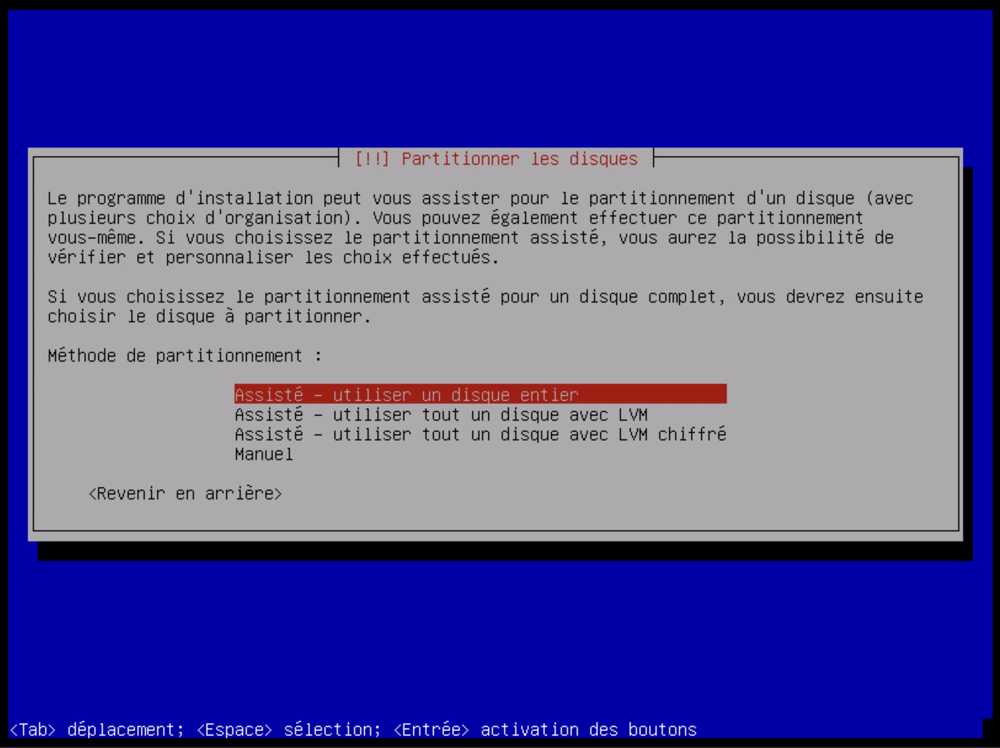
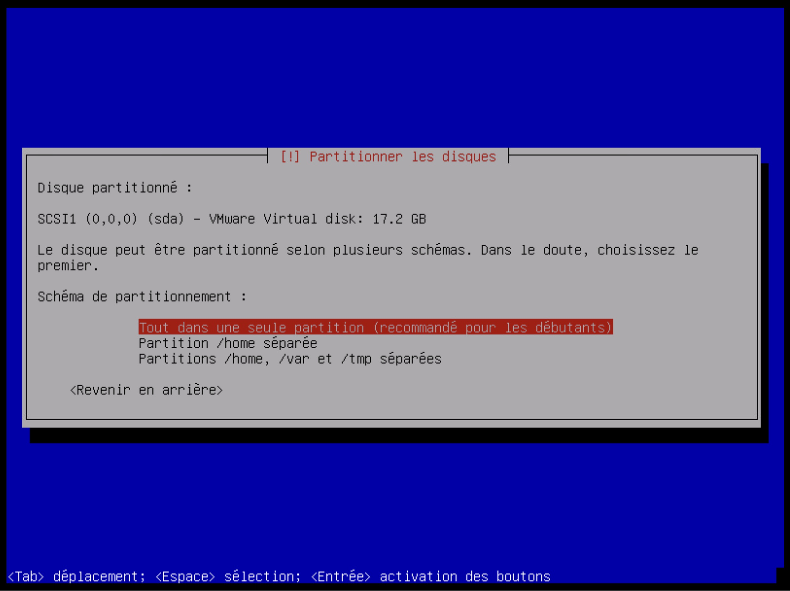

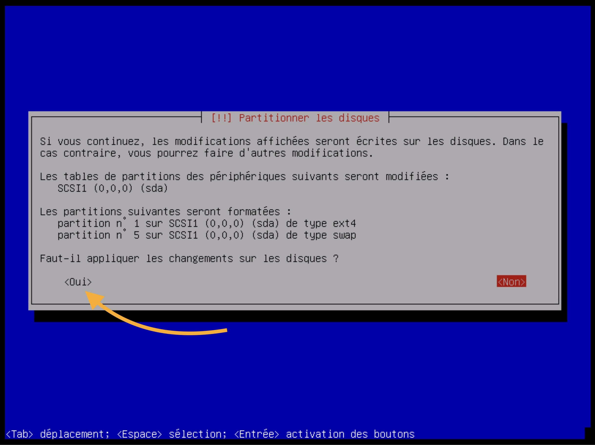

::: tip Vous voulez utiliser Linux sur votre PC ?
Si vous souhaitez utiliser Linux en parallèle de Windows sur votre ordinateur (ce que je vous conseil vivement 👀), l'étape du partitionnement est un peu différente car il ne faut bien entendu pas détruire votre système d'exploitation actuel.
:::

### Installation

L'installation va maintenant commencer. Vous pouvez suivre l'avancement de l'installation en temps réel.

### Le mirroir

L'installeur va vous demander de choisir un mirroir. Un mirroir est un serveur qui contient une copie des paquets Debian. Cela permet de réduire la charge sur les serveurs officiels et de gagner du temps lors de l'installation.

Le mirroir est un serveur Web qui contient une copie des paquets Debian, ils seront utilisé pour finaliser l'installation.

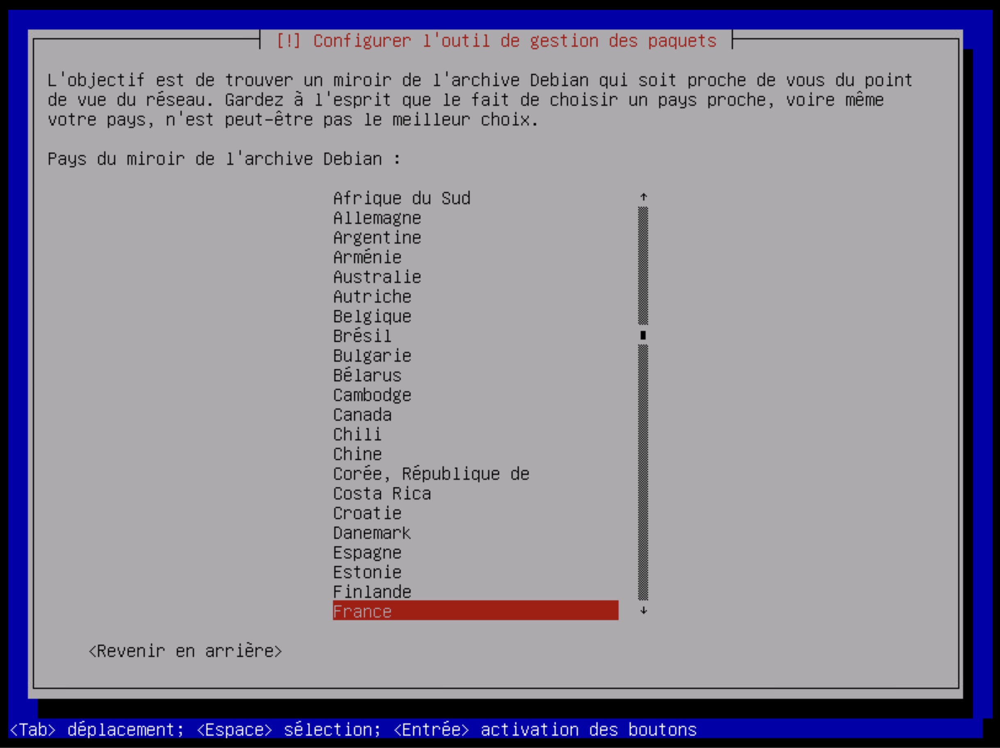

Les mirroirs sont classés par pays. Je vous conseil de choisir un mirroir proche de chez vous, car cela va réduire le temps de téléchargement des paquets. En effet plus le serveur est proche de chez vous, plus la connexion sera rapide.

::: tip Serveur mandataire ?
Un serveur mandataire est un Proxy. Ici au lycée nous n'en avons pas, mais si nous en avions un il pourrait être utilisé pour accélérer le téléchargement des paquets en mettant en cache les paquets déjà téléchargés. C'est une fonctionnalité avancée, vous n'avez pas besoin de vous en préoccuper.
:::

### Logiciels à installer

Nous allons pouvoir pré-configurer les logiciels que nous allons installer sur notre serveur. Nous souhaitons créer un serveur le plus minimaliste possible, nous allons donc ne pas installer de logiciels inutiles.

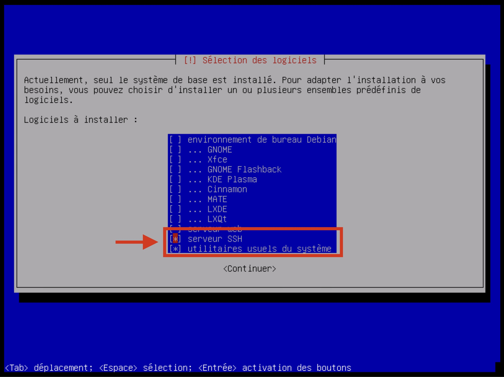

::: danger Attention

Vous pouvez sélectionner les logiciels à installer en utilisant les touches fléchées du clavier. Vous pouvez aussi utiliser la barre d'espace pour sélectionner ou désélectionner un logiciel.

- **Vous devez sélectionner le paquet `Serveur SSH`**. C'est le logiciel qui va nous permettre de nous connecter à notre serveur à distance.
- **Vous devez désélectionner `Environnement de bureau`** et `GNOME`. Il ne nous seront pas utile et il surchargeront inutilement notre serveur.

:::

Votre serveur va maintenant télécharger et installer les logiciels sélectionnés. L'installation va prendre quelques minutes.

### GRUB

GRUB est le gestionnaire de démarrage de Linux. Il gérera le démarrage de votre Linux. L'installeur va nous demander de choisir le disque dur sur lequel installer GRUB.

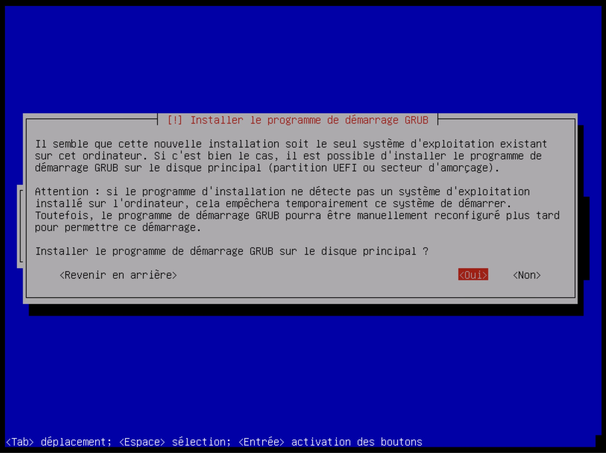

Nous allons l'installer sur le disque dur principal (C'est le disque dur sur lequel nous avons créé les partitions). Le nom du disque principal sous Linux est généralement `/dev/sda`.

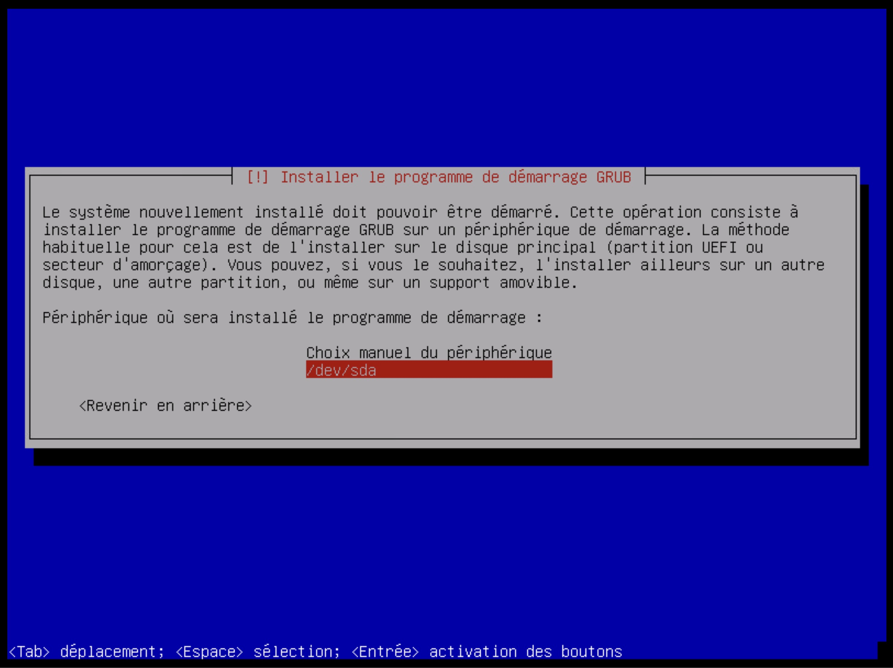

### Installation terminée

L'installation est terminée. Votre serveur va maintenant redémarrer et démarrer sur Linux.

<iframe src="https://giphy.com/embed/S6qkS0ETvel6EZat45" width="480" height="400" frameBorder="0" class="giphy-embed" allowFullScreen></iframe>

### Le premier reboot

Si tout s'est bien passé, vous devriez voir :


## Configuration du réseau

Normalement votre serveur doit avoir l'adresse IP que vous lui avez attribué lors de l'installation. Cette adresse IP est configurée dans le fichier `/etc/network/interfaces`.

### Vérifier l'accès à Internet

Pour vérifier que votre serveur a bien accès à Internet, vous pouvez utiliser la commande `ping` :

```bash
ping www.google.com
```

Vous pouvez également vérifier l'adresse IP de votre serveur avec la commande `ip` :

```bash
ip a
```

## Installer les vmware tools

Les VMware tools sont des outils qui vont permettre à votre machine virtuelle de tirer le maximum de performances de l'environnement.

::: danger Les performances et la virtualisation

Sans les VMware tools semble fonctionner correctement ? Oui… À première vue seulement… En réalité votre machine ne tire pas toutes les performances de l'environnement. Pire, elle peut dégrader les performances de toute la ferme.

Bref, n'oubliez pas d'installer les Tools pour vivre une expérience optimale 👌.

:::

Comment installer les VMware tools ? Et bien avec `apt` évidemment :

```bash
apt update
apt install open-vm-tools
```

::: danger N'oubliez pas

- Vous devez être connecté en tant que `root` pour installer les VMware tools (ou via `su -`).
- Vous devez avoir `update` les dépôts avant d'installer de nouveaux paquets.

:::

### Observer la configuration du serveur

Nous allons maintenant observer la configuration réseau de notre serveur. Pour cela nous allons utiliser la commande `nano` :

```bash
nano /etc/network/interfaces
```

Cette commande va afficher le contenu du fichier `/etc/network/interfaces`. Ce fichier contient la configuration réseau de votre serveur. Si vous souhaitez modifier l'adresse IP de votre serveur vous pouvez modifier ce fichier.

La configuration DNS est également stockée dans le fichier `/etc/resolv.conf`. Pour afficher le contenu de ce fichier nous allons utiliser la commande `nano` :

```bash
nano /etc/resolv.conf
```

### Modifier l'adresse IP de votre serveur

_Étape 1 :_
En utilisant l'aide mémoire [disponible ici](/cheatsheets/serveur/debian-reseau.md), générer une nouvelle adresse IP pour votre serveur.

_Étape 1b :_
Vérifier le nom de votre interface réseau avec la commande `ip link`.

_Étape 2 :_
Nous allons maintenant modifier l'adresse IP de votre serveur. Pour cela nous allons utiliser la commande `nano` :

```bash
nano /etc/network/interfaces
```

Une fois la nouvelle adresse IP rentrée, vous pouvez sauvegarder le fichier en appuyant sur `Ctrl + O` puis en appuyant sur `Entrée`. Vous pouvez quitter le fichier en appuyant sur `Ctrl + X`.

_Étape 3 :_

Nous allons maintenant redémarrer le service réseau de votre serveur. Pour cela nous allons utiliser la commande `systemctl` :

```bash
systemctl restart networking
```

Cette commande va redémarrer le service réseau de votre serveur pour lui faire prendre en compte la nouvelle configuration.

::: tip Pourquoi changer l'adresse IP ?
Ici nous avons installé entièrement l'OS du serveur. L'avantage d'une machine virtuelle c'est qu'il est possible de réaliser une image « réutilisable » pour gagner de précieuses minutes lors de l'installation d'un nouveau serveur. 

Dans ce cas, dès le premier boot, nous irons modifier l'adresse du serveur pour le rendre accessible depuis le réseau.
:::

## Installation des logiciels

Pour installer un logiciel sur un serveur, il faut utiliser la commande `apt` (ou `apt-get`). Cette commande permet d'ajouter des nouveaux programmes sur votre serveur.

Les programmes sont stockés dans des dépots (le mirroir que vous avez choisit lors de l'installation). Pour installer un logiciel il faut d'abord mettre à jour la liste des dépots :

```bash
apt update
```

Une fois la liste des dépots mise à jour, vous pouvez installer un logiciel avec la commande `apt install` :

```bash
apt install <nom_du_logiciel>
```

### Les droits

Vous êtes actuellement connecté à votre serveur en tant que simple utilisateur. Vous n'avez pas les droits pour installer des logiciels. Pour pouvoir installer des logiciels, vous devez utiliser la commande `su` :

```bash
su -
```

Une fois passé `root`, votre terminal devrait ressembler à ça :

```bash
root@serveur:~#
```

::: danger Grand risque !

Travailler en root sur un serveur est un « gros risque », en effet en cas de mauvaise manipulation vous pouvez endommager votre serveur. Il est donc très important de faire très attention lorsque vous êtes en root.

<iframe src="https://giphy.com/embed/10KIsXhwdoerHW" width="480" height="201" frameBorder="0" class="giphy-embed" allowFullScreen></iframe>
:::

### Installation de `vim`

Pour installer `vim` sur votre serveur nous allons utiliser la commande `apt` :

```bash
apt update
apt install vim
```

::: tip Pourquoi `vim` ?
`vim` est un éditeur de texte. Il est très utilisé sur les serveurs car il est très rapide et très léger. Il est également très simple à utiliser. Vous pouvez bien évidemment utiliser un autre éditeur de texte tel que `nano`. Mais personnellement je trouve `vim` très pratiques.
:::

### Installation de SSH

Dans quelques instant nous allons voir comment accèder à votre serveur. Pour ça nous utiliserons SSH. SSH est un protocole de communication sécurisé. 

Pour installer SSH sur votre serveur nous allons utiliser la commande `apt` :

```bash
apt install openssh-server
```

Démarrer le service SSH à chaque démarrage de votre serveur :

```bash
systemctl enable ssh
```

```bash
systemctl start ssh
```

::: tip Votre serveur est maintenant accessible !
Fini la fenêtre web très peu pratique pour accéder à votre serveur. Vous pouvez maintenant accéder à votre serveur en utilisant SSH. Nous allons voir comment faire ça dans la prochaine partie.
:::

## Accès à votre serveur

Pour accéder à votre serveur, nous allons utiliser un client SSH. Un client SSH est un programme que vous pouvez installer sur votre ordinateur. Il permet de se connecter à un serveur en utilisant le protocole SSH. Il existe plusieurs clients SSH (exemple `Putty` pour Windows), mais depuis quelques mois nous avons de base un client SSH (sous Windows, sous Linux et sous Mac).

Pour utiliser le client SSH intégré à votre ordinateur, il faut ouvrir un terminal. Sous Windows, il faut ouvrir le terminal `cmd` (sous Windows je vous conseil `git-bash` qui est très proche d'un terminal Linux). Sous Linux et sous Mac, il faut ouvrir le terminal.

### Accès SSH

Pour se connecter à votre serveur en utilisant SSH, il faut utiliser la commande `ssh` :

```bash
ssh <nom_du_compte>@<adresse_ip_du_serveur>
```

Dans mon cas :

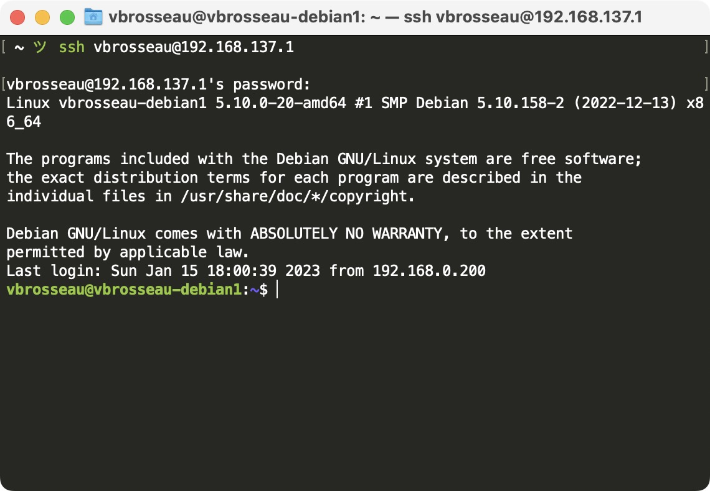

::: tip Pourquoi privilégier SSH ?

Vous pourriez être tenté d'utiliser directement l'interface de VMWare pour accéder à votre serveur. Mais il y a plusieurs problèmes avec cette méthode :

- En entreprise vous n'y aurez pas accès.
- Elle ne permet pas le copier-coller (et je sais que vous adorez ça).
- Elle est globalement très lente.

:::

### Sécuriser votre serveur

Avec la configuration de base, votre serveur est accessible depuis l'utilisateur `root`. C'est une **très** **très** mauvaise chose. En effet, si quelqu'un trouve le mot de passe de votre serveur, il pourra faire ce qu'il veut sur votre serveur.

Nous allons donc dans un premier temps désactiver l'accès SSH pour l'utilisateur `root`. Pour ça nous allons modifier le fichier de configuration de SSH :

```bash
vim /etc/ssh/sshd_config
```

Dans le fichier de configuration, nous allons modifier la ligne `PermitRootLogin` :

```bash
PermitRootLogin no
```

::: tip Si la ligne est en commentaire
Si la ligne `PermitRootLogin` est en commentaire, il faut la décommenter (enlever le `#` au début de la ligne).
:::

Ensuite nous allons redémarrer le service SSH :

```bash
systemctl restart ssh
```

- C'est à vous ! Je vous laisse vérifier que l'accès SSH pour l'utilisateur `root` est désactivé

::: danger Pourquoi est-ce très important ?
Avant de continuer, je vous propose que l'on discute un peu de la sécurité.
:::

## L'échange de clés

Les mots de passe… Vous en avez plein, vous les perdez souvent ! Et si je vous disais qu'il existe une autre méthode pour se connecter à un serveur ? Une méthode qui ne nécessite pas de mot de passe ? Et bien c'est possible ! Il suffit d'utiliser l'échange de clés.

L'échange de clé repose sur le principe suivant : Vous avez une clé privée et une clé publique. Vous donnez votre clé publique à votre serveur. Vous donnez votre clé privée à votre client. Quand vous voulez vous connecter à votre serveur, vous utilisez votre clé privée pour vous connecter. Votre serveur utilise votre clé publique pour vérifier que vous êtes bien le propriétaire de la clé privée.

**Avant d'aller plus loin, nous allons générer une clé SSH, elle vous servira de clé pour vous connecter à votre serveur. Mais également aux prochains serveurs que vous allez installer.**

Avoir une clé SSH est intéressant, car une clé SSH est plus sécurisée qu'un mot de passe. De plus une clé SSH est un standard, donc vous pouvez l'utiliser pour vous connecter à n'importe quel type de serveur (Linux, mais également GIT, etc.).

::: tip C'est une clé ultra privée
La clé SSH est une clé privée, donc ne la partagez pas avec n'importe qui. Elle vous permet de vous connecter à votre serveur, mais également à d'autres serveurs. Si vous la partagez avec n'importe qui, vous risquez de vous faire pirater votre serveur.

**Avoir la clé == Pouvoir se connecter à votre serveur.**
:::

### Générer une clé SSH

::: danger À ne faire qu'une seule fois !
Vous ne devez générer une clé SSH qu'une seule fois. Si vous en générer une nouvelle, vous ne pourrez plus vous connecter à votre serveur.
:::

#### Générer une clef privée/public

Cette opération n'est à réaliser qu'une seule fois (sur chaque machine/session). Au lycée, la clef va s'enregistrer dans votre dossier utilisateur, elle sera donc synchronisée automatiquement avec l'ensemble des ordinateurs sur lesquels vous allez pouvoir vous connecter.

La commande pour générer une clef est la suivante.

::: tip Windows, Linux, macOS ?

La commande sera la même, quel que soit votre système d'exploitation. Cependant, le terminal lui sera différent :

- Windows : `Git Bash` (ou `Git cmd`). ([nécessite Git](https://git-scm.com/downloads))
- macOS : `terminal`.
- Linux : `console`.

:::

```bash
ssh-keygen
```

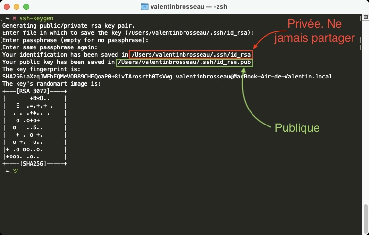

La commande va générer **deux fichiers** :

- **id_rsa**, est privé. **Vous ne devez jamais le partager**.
- **id_rsa.pub**, est publique, vous pouvez le partager autant que vous voulez ce fichier permettra de vous reconnaître au moment de la connexion.

::: danger Plus de sécurité

Vous pouvez faire « entrée (3×) » pour générer une clé sans mot de passe. Vous pouvez également faire le choix de mettre un mot de passe sur votre clé pour plus de sécurité en cas de perte de celle-ci.

:::

Je vous conseille vivement de sauvegarder votre clé privée dans un endroit sûr. Vous pouvez la sauvegarder sur votre clé USB, sur un disque dur externe, sur un NAS, etc. Ainsi si vous perdez votre clé privée, vous pourrez la récupérer en cas de besoin (changement de machine, etc.).

### Ajouter votre clé publique sur votre serveur

Maintenant que nous avons notre clé privée, nous allons ajouter notre clé publique sur notre serveur. Pour ça nous allons utiliser la commande `ssh-copy-id` :

```bash
ssh-copy-id <nom_du_compte>@<adresse_ip_du_serveur>
```

::: tip Attention

Cette commande doit être exécutée sur votre machine locale. 

Elle va copier votre clé publique (local à votre machine) sur votre serveur (VM).

:::

Dans mon cas :

```bash
ssh-copy-id vbrosseau@192.168.137.1
```

Cette commande va prendre votre clé publique et l'ajouter dans le fichier `authorized_keys` de votre compte sur le serveur. Vous pouvez vérifier que votre clé publique est bien présente dans ce fichier :

```bash
cat ~/.ssh/authorized_keys
```

Vous devriez y voir normalement votre clé publique.

### Se connecter à votre serveur

À présent, vous pouvez vous connecter à votre serveur sans mot de passe :

```bash
ssh <nom_du_compte>@<adresse_ip_du_serveur>
```

::: tip Pourquoi utiliser un échange de clés ?

Cette étape supplémentaire lors de la configuration d'un serveur est à mon avis **un passage obligé**. Elle va permettre :

- De sécuriser votre serveur.
- De ne plus avoir à taper votre mot de passe à chaque connexion.
- D'autoriser l'accès à votre serveur à plusieurs personnes (exemple membre d'un projet) sans avoir à leur donner votre mot de passe.

:::

### Désactiver l'accès SSH pour l'utilisateur root

Par défaut, l'accès SSH pour l'utilisateur root est activé. C'est une mauvaise pratique de laisser l'accès SSH pour l'utilisateur root. Nous allons donc désactiver l'accès SSH pour l'utilisateur root.

Pour ça nous allons modifier le fichier de configuration de SSH :

```bash
vim /etc/ssh/sshd_config
```

Pour désactiver l'accès SSH pour l'utilisateur root, nous allons modifier la ligne `PermitRootLogin` :

```bash
PermitRootLogin no
```

Ensuite nous allons redémarrer le service SSH :

```bash
systemctl restart ssh
```

À présent, vous ne pourrez plus vous connecter en tant qu'utilisateur root via SSH. Vous devez vous connecter avec un autre utilisateur (celui que vous avez créé lors de l'installation de votre serveur). Cette étape est vraiment importante, car elle va vous permettre de sécuriser votre serveur.

### Bonus : Ne plus autoriser l'accès SSH avec un mot de passe

Nous pouvons aller encore plus loin dans la sécurisation de notre serveur. Maintenant que nous avons un échange de clés, nous pouvons complètement désactiver l'accès SSH avec un mot de passe. Pour ça nous allons modifier le fichier de configuration de SSH :

```bash
nano /etc/ssh/sshd_config
```

Dans le fichier de configuration, nous allons modifier la ligne `PasswordAuthentication` :

```bash
PasswordAuthentication no
```

Ensuite nous allons redémarrer le service SSH :

```bash
systemctl restart ssh
```

Cette étape est vraiment intéressante, car elle nous assure que notre serveur ne sera pas accessible via une attaque de type "force brute". Si vous décidez de réaliser cette étape, **je vous conseille de le mettre en avant lors d'un oral (car ça montre que vous avez compris l'importance de la sécurité).**

## Installer des paquets

Pour installer des paquets sur votre serveur, vous allez utiliser la commande `apt` :

```bash
apt update
apt install <nom_du_paquet>
```

Cette commande va modifier votre OS et installer le paquet demandé. Par exemple, pour installer `apache2` :

```bash
apt update
apt install cmatrix

cmatrix
```

L'installation de paquets n'est possible que si votre utilisateur a accès à l'ensemble du système, c'est pour ça que nous avons à notre disposition l'utilisateur `root`. Pour passer en mode `root` nous allons utiliser la commande `su` :

```bash
su -
```

::: tip `su -` ?

La commande `su` permet de passer en mode `root`. La commande `su -` permet de passer en mode `root` et de charger les variables d'environnement de l'utilisateur `root`. C'est pour ça que nous utilisons `su -` et non `su`. Si vous ne chargez pas les variables d'environnement de l'utilisateur `root`, vous ne pourrez pas utiliser `apt` par exemple.

:::

## Installer Apache

Pour valider notre installation. Nous allons installer un serveur Web. Pour ça nous allons installer Apache.

Pour rappel, Apache est un serveur Web. Il permet de mettre en ligne des sites Internet. C'est un service qui va tourner en permanence sur votre serveur.

### Installation

Pour installer Apache, nous allons utiliser la commande `apt` :

```bash
apt update
apt install apache2
```

### Vérification

Pour vérifier que Apache est bien installé, nous allons utiliser la commande `systemctl` :

```bash
systemctl status apache2
```

::: tip Comment vérifier que le service est bien lancé ?
Si le service est bien lancé, vous devriez voir la ligne suivante :

```bash
Active: active (running) 
```

:::

### Accéder à votre site

Pour accéder à votre site, vous devez utiliser l'adresse IP de votre serveur. Par exemple :

```bash
http://192.168.1.1
```

::: tip Comment trouver l'adresse IP de votre serveur ?

Pour obtenir l'adresse IP de votre serveur, vous pouvez utiliser la commande `IP.` :

```bash
ip a
```

Vous pouvez également regarder votre fiche serveur ;).

:::

### Créer une page web

Pour finaliser ce premier TP, nous allons créer une page web. Pour ça nous allons utiliser l'éditeur de texte `vim.` :

```bash
vim /var/www/html/index.html
```

Dans le fichier, nous allons y mettre le code suivant :

```html
<html>
    <head>
        <title>Bienvenue sur le serveur de VOTRE NOM</title>
    </head>
    <body>
        <h1>Bravo ! Votre site fonctionne</h1>
    </body>
</html>
```

Cette dernière étape permet de valider que votre serveur fonctionne comme prévu.

::: tip Pratique ?
Nous venons de créer rapidement un serveur web. Dans le prochain TP, nous allons voir comment être efficace avec la ligne de commande. Cette compétence sera très utile pour la suite de votre formation.

Nous verrons ensuite comment mettre en place un serveur web dans son intégralité. _Car oui, ça sera un peu plus compliqué que ce que nous venons de faire._ (Mais pas trop quand même 😉)
:::

_À votre avis :_

- Pouvons-nous faire du PHP sur notre serveur ?
- Comment pouvons nous envoyer des fichiers sur notre serveur ?

## Conclusion

Dans ce TP nous avons vu comment installer un serveur Debian 11. Nous avons également vu comment configurer le réseau de notre machine virtuelle, comment installer les VMware tools et comment configurer l'accès SSH à notre serveur.

Cette machine nous servira de base pour les prochains TP de [prise en main de la ligne de commande](./tp1c.md)