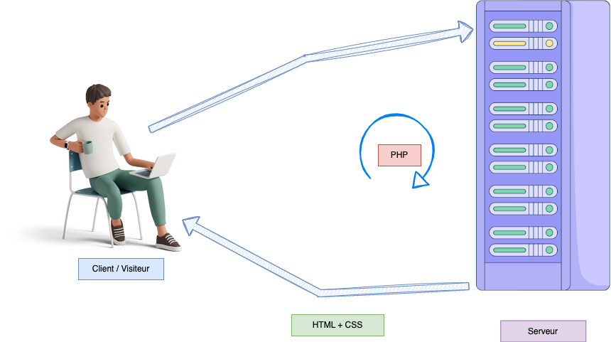

# TP2. Configurer un serveur Web

::: details Sommaire
[[toc]]
:::

## Pré-requis

Avant de commencer ce TP, vous devez savoir comment installer un serveur Debian. Si ce n'est pas le cas, vous pouvez suivre le [TP1](./tp1b.md). Je part du principe que vous maitriser également les commandes de base de Linux (voir [cheatsheet](/cheatsheets/serveur/linux-debian-based.md)).

## Objectifs

Dans ce TP nous allons voir comment créer un serveur Web (Apache + PHP) et comment le configurer. Ce type de serveur est très utilisé pour héberger des sites Web dynamiques. Lors de vos deux années de BTS ont vous demandera de créer ce genre de serveur, pour mettre à disposition vos réalisations (En AP, mais également lors des projets de fin d'année).

Maitriser la création de serveur, est un point important. En effet, derrière chaque site Web, il y a un serveur qui tourne. Il est donc important de savoir comment le configurer, et comment le sécuriser. Même si il est possible d'héberger son site Web sur des plateformes ou la notion de serveur n'est pas présente, il est important de savoir comment cela fonctionne afin de pouvoir dépanner un site web en cas de problème (gestion des droits, des logs, etc.).

