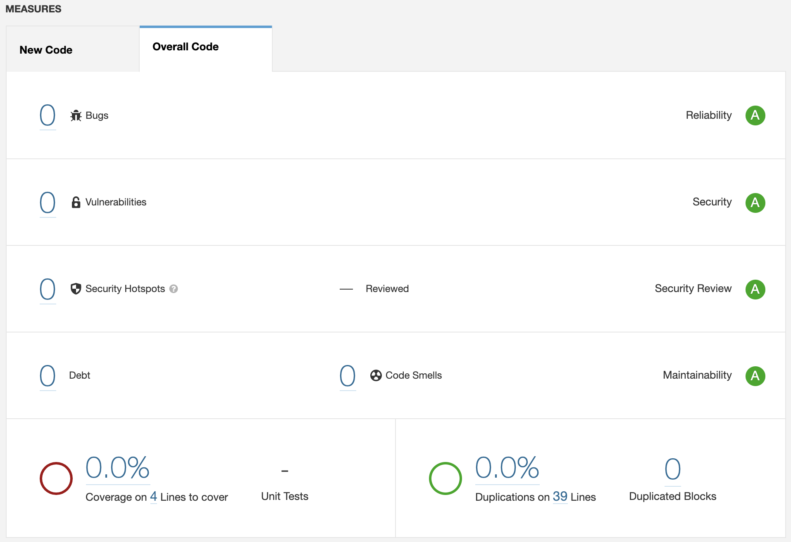

# SonarQube

Dans ce TP nous allons voir comment utiliser SonarQube avec Gitlab-CI.

::: details Sommaire
[[toc]]
:::

## Introduction

Nous l'avons vu en cours, SonarQube est un outil très puissant il va vous permettre d'analyser votre code de manière statique. C'est-à-dire via une analyse à base d'expression régulière.

L'objectif de Sonar est de vous donner des indicateurs « simplifié » pour comprendre comment « va votre projet » / afin d'en mesurer ça santé. Cette santé est exprimée sous la forme de 4 grandes notes :

- Le nombre de « bugs ».
- Le nombre de vulnérabilités.
- Le nombre de points chauds / sensibles à vérifier.
- La dette technique



Nous analyserons ensemble les indicateurs. Cette note ne doit pas être prise comme une finalité **c'est très important**, elle doit être prise comme un indicateur permettant de vous améliorer au fur et à mesure (à chaque évolution idéalement).

**L'objectif étant de ne pas faire baisser la note.**

## Installation

En fonction du langage SonarQube peut-être gourmand (très gourmand même). Pour tester, je vous propose de monter un SonarQube dans un cluster Kubernetes (car pourquoi pas ?).

[Vous pouvez suivre l'installation ici](https://github.com/c4software/kubernetes-sonarqube)

### Installation via Docker

Vous pouvez également lancer simplement SonarQube avec Docker :

```sh
docker run -d --name sonarqube -e SONAR_ES_BOOTSTRAP_CHECKS_DISABLE=true -p 9000:9000 sonarqube:latest
```

::: danger Quelques soit la solution
Nous parlons ici de **tester** sonarqube, il est évident que si nous devions l'installer « en prod » / « pour de vrai » il faudrait :

- Dédier un serveur.
- Configurer une base de données externe autre que `H2`.

:::

### Premier lancement

**Attention**, le premier lancement de SonarQube est relativement long.

## Utilisation

L'utilisation du SonarQube est relativement simple, elle se découpe en deux étapes :

- Création d'un token pour autoriser l'échange entre votre Gitlab et votre SonarQube.
- Ajouter la configuration dans votre CI pour permettre l'envoi des informations.

### Création du Token

Le token est une sorte « d'alias » permettant d'autoriser l'accès à votre compte sans fournir le login et le mot de passe. Vous pouvez le créer dans votre compte utilisateur :


::: danger C'est secret !
Votre token est personnel, vous devez le garder **secret** sous peine d'introduire une faille de sécuritée.
:::

### Gitlab-CI

Cette partie est issue de la documentation de SonarQube, je vous laisse le mettre dans votre projet. Ici pas d'aide vous l'avez déjà fait plusieurs fois.

N'oubliez pas de :

- Changer la projectKey par une valeur pour vous.
- `http(s)://ip.ou.domaine.vers.votre.sonar` par le lien vers votre SonarQube.
- `VOTRE-TOKEN` par le token obtenu à l'étape précédente

```sh
sonarqube-check:
  stage: test
  image:
    name: sonarsource/sonar-scanner-cli:latest
    entrypoint: [""]
  variables:
    SONAR_USER_HOME: "${CI_PROJECT_DIR}/.sonar"  # Defines the location of the analysis task cache
    GIT_DEPTH: "0"  # Tells git to fetch all the branches of the project, required by the analysis task
  cache:
    key: "${CI_JOB_NAME}"
    paths:
      - .sonar/cache
  script:
    - sonar-scanner -Dsonar.qualitygate.wait=true -Dsonar.projectKey=vitejs-sample -Dsonar.sources=. -Dsonar.host.url=http(s)://ip.ou.domaine.vers.votre.sonar -Dsonar.login=VOTRE-TOKEN
  allow_failure: true
  only:
    - master
```

Je pense que l'on devrait en parler non ? Pendant que ça analyse, prenons quelques minutes pour comprendre les spécificités de cette configuration.

## Analyse des résultats

Le plus important dans l'utilisation de SonarQube ce n'est pas les indicateurs en eux-mêmes (quoique) mais plutôt la tendance de votre projet. En effet l'idée derrière des outils tels que SonarQube c'est d'analyser de manière continue afin d'améliorer de manière continue votre application.


Je vous laisse analyser un projet « plus conséquent » afin que nous puissions discuter d'un code avec de vrais problèmes 😉.
