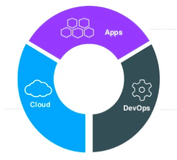
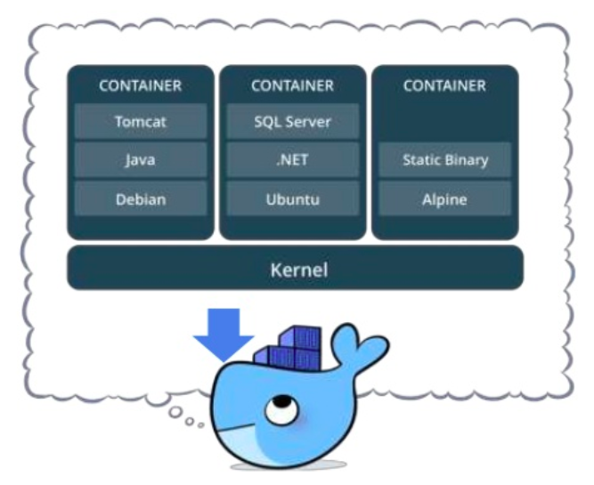
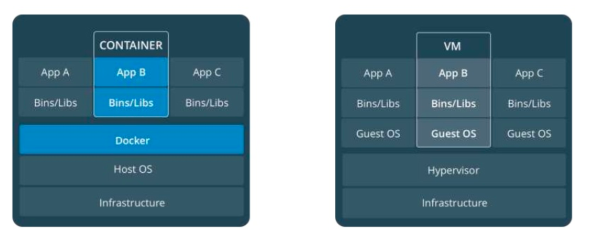
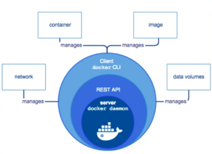

# Complément du cours Dev Ops

Ce document est un complément du cours. Il vous permettra de revenir sur les différentes notions avec différents exemples.

::: details Table des matières
[[toc]]
:::

## Introduction

Le terme « Full Stack » est un gros mot, il se cache derrière plein de définitions différentes. Nous allons voir un aspect de celui-ci dans ce document et dans nos échanges.

Nous allons découvrir comment vous allez pouvoir « Développer, Tester, Déployer » sans vous prendre la tête avec différentes technologies qui sont maintenant la base de tout bon développeur (Docker, l'intégration Continue, la JamaStack, les Function As A Service − FaaS −). L'idée étant qu'à la fin de ce document vous soyez capable de construire, maintenir, mais également comprendre la révolution « Cloud » autour du métier du développeur.

Nous allons donc voir comment le développeur seul sera capable de mettre en place une infrastructure d'exécution de son application ; cette infrastructure sera complètement automatisée pour « se recréer » / « se mettre à jour » en fonction des actions (commit) que vous ferez dans votre code source. J'ai utilisé le terme « commit », car oui, cette automatisation est possible en grande partie grâce à notre système de version de sources (par exemple, GIT).

Je vous propose de commencer notre pèlerinage par la découverte de Docker.

## Docker

### Introduction

Docker c'est « une petite révolution » ! Docker est une plateforme datant de 2013 permettant aux développeurs de déployer, mais également d'exécuter des applications avec **des conteneurs**. Docker permet de packager une application (ainsi que ses dépendances) dans un process isolé nommé conteneur. Ce conteneur peut ensuite être exécuté sur n'importe quelle machine (ARM, X86…), mais également sur n'importe quel système d'exploitation (Linux, Windows, macOS).

Docker est une technologie française, mais celle-ci est utilisée mondialement ; elle est devenue un standard en très peu de temps ce qui en fait un incontournable à connaitre pour vous développeur. Et vous allez le voir, celle-ci va vous faire gagner un temps fou !

::: tip Quelques chiffres autour de Docker

- 14 millions de « machines »
- 900 000 images Docker
- 12 milliard d’images téléchargées
- 3300 contributeurs au projet
  :::

Comme je disais cette technologie est au coeur de l'évolution du paysage informatique (IT)

Cette révolution consiste globalement à migrer les infrastructures locales (serveurs) vers « Le cloud » et ce pour plusieurs raisons :

- Migrer la puissance dans le Cloud
- Changement d’environnement/plateforme simplifié
- Pas de « Bloquage / Fermeture » d’un constructeur

::: tip Un instant !
Mais avant de continuer pour vous le cloud, c'est quoi ?
:::

Nous allons donc changer de paradigme, avant nous avions :

- Monolitique
- Mise à jour lente
- Gros serveurs

Et maintenant :

- Plein de petits services assemblés (externes et indépendants les uns des autres)
- Mise à jour rapide
- Petites machines, multitude de serveurs, etc.

**À votre avis** pourquoi nous migrons vers ce genre d'architecture ? Connaissez-vous le nom de ce genre d'organisation ?

### Les microservices

Et oui ! Le découpage actuelle / « la mode du moment », c'est de découper en microservices. C'est-à-dire de passer de :

Cette simplification est là pour répondre à plusieurs problématiques :

- Réduire la taille des applications (et donc leur temps de compilation, exemple Linux ~2h, Firefox 40min)
- L’application est centrale au fonctionnement.
- Adaptation au changement difficile.

Le découpage en microservices va donc nous permettre de répondre à l'ensemble des problématiques :

- Découper l’application en fonctionnalités indépendantes
- Rends l’application indépendante des autres
- Capable de « multiplier » l’application sur plein de serveurs pour absorber une hausse de la demande.
- Une conception qui rend l’application hautement disponible

::: tip CI / CD
Ce découpage permet également de rentrer dans un autre mouvement celui de la **livraison en continu** / **déploiement en continu**. Nous reviendrons plus en détail sur ce point ultérieurement dans le cours.
:::

### Containers ou Machines virtuelles ?

Alors là vous allez me dire, non, mais je connais ce que tu nous racontes là !? Embarquer une application dans un truc transportable quelques soit la machine je connais déjà ! C'est une machine virtuelle…

Alors oui vous avez raison… Il y a quelques années nous avions **une application un serveur**, puis nous avons eu **un serveur => Un hyperviseur => Des machines**, mais nous allons voir qu'avec Docker plus d'hyperviseur nous avons « que notre applicatif dans un conteneur ».

Un serveur :

Un hyperviseur :

Les machines virtuelles vous connaissez déjà, et vous savez que le but c'est de mutualiser la puissance du serveur pour y mettre **plusieurs machines** / **systèmes d'exploitation entiers**. Mais cette organisation à des limites :

- Des ressources allouées pour chaque machine (CPU, Disque, Ram)
- Un OS complet sur chaque machine (virtuelle)
- Plus il y a de machines plus il faut de puissance (ressources perdues)
- Ressources perdues par… des parties de l’OS virtualisées pour rien (les crons, mais également les I/O).

Le conteneur va donc répondre à une problématique, éviter la multiplication des petites ressources perdue, le conteneur c'est donc :

- Un moyen standardiser de packager l’application
- Un moyen d’isoler les applications entres elles
- Un partage du noyau avec la machine physique

**Les conteneurs**

**VM vs Conteneur :**

::: tip, Mais est-ce la fin des VM ?
Bien évidement non, les VM sont là pour rester elles sont une vraie réponse sur la mutualisation des machines ; mais également une vraie sécurité entre les machines. En effet l'hyperviseur est là pour nous garantir au maximum la séparation des processus entre « **Les VM** » et la machine physique.

D'ailleurs il est complètement possible de faire :

:::

### Pour résumer Docker c’est :

- Un projet open source, qui a pour but d’automatiser le déploiement d’applications dans un « container »
- Le container une sorte « d’archive » qui contient tout ce qu’il faut pour faire fonctionner un logiciel : Code, Librairies pour l’exécution, outils système, et librairies système. (autonome)
- Ça garantit que le code fonctionnera toujours de la même façon, quel que soit l’environnement.

Avec docker pas « d'hyperviseur », nous avons un morceau aux milieux qui s'appelle le « Docker Engine », il repose sur les technologies du noyau Linux, il est donc plus lège qu'un Hyperviseur entier (comme VMWare ou Dropbox) il aura en charge la gestion de :

- La sécurité
- Le réseau
- Les volumes
- L’orchestration

Comme j'indiquai en introduction, l'angine de Docker est multiplateforme il fonctionne donc sans problème sur :

- Linux
- Windows
- macOS

Mais également quelques soit l'architecture de l'ordinateur :

- Un raspberry Pi
- Un processeur Intel
- Un processeur AMD
- Un M1 de Apple

Docker **vous assure** que votre application tournera de la même façon quelques soit là ou vous souhaiter la faire fonctionner.

### Créer des machines simplement

### La ligne de commande

Docker c'est principalement une « interface » avec laquelle nous devons communiquer en ligne de commande. Il n'y a pas beaucoup de commandes à retenir et celle-ci est logique. Quoi qu’il en soit je vous ai résumé l'ensemble dans [le document ici](/cheatsheets/docker/).

### Le DockerFile

### Le Docker Compose

### Les alternatives

### Une stack complète sur un Raspberry Pi

Nous l'avons vu dans les différents exemples précédents, Docker est un vrai petit bijou pour la conception du « stack » applicative. C'est en partant de cette constatation que j'ai décidé de créer moi-même une « Stack » permettant de créer un serveur d'évaluation / de développement personnel basé sur du matériel « pas cher » à savoir un Raspberry Pi.

Une solution qui dans mon cas ressemble à :

|  |  |
| ------------------------------------- | ------------------------------------- |

[Lire la suite](../rpi/web-stack.md)

## CI / CD

### Introduction

### CI (Intégration Continue)

### CD (Déploiement Continu / Livraison Continue)

#### Les tests

#### Les artifacts

## Gitlab CI

### Introduction

### Gitlab Pages

### Tester en continu

### Compilation d'application

## Netlify

### La JamStack ?

La jamstack c'est une nouvelle façon de voir la conception de site Internet, cette nouvelle façon de faire va nous permettre de réduire les couts d'hébergements / et bénéficier de l'avantage du Cloud (CI/CD, compression des assets, FAAS…)

Plein de mots qui font peur, mais ne vous inquiétez pas… C'est beaucoup plus simple qu'il n'y parait. Ici pas de PHP pour générer vos pages nous allons tout concevoir en HTML / JavaScript (VanillaJS, React, Vue, …) / CSS

### Déployer un site automatiquement

Ici pas de blabla, Netlify est une solution pensée pour être simple ; je vous propose donc de directement mettre en application via [le TP suivant](../ci/jamstack/netlify.md)

## OpenFaas

### Introduction

### Déployer sur OpenFaas
