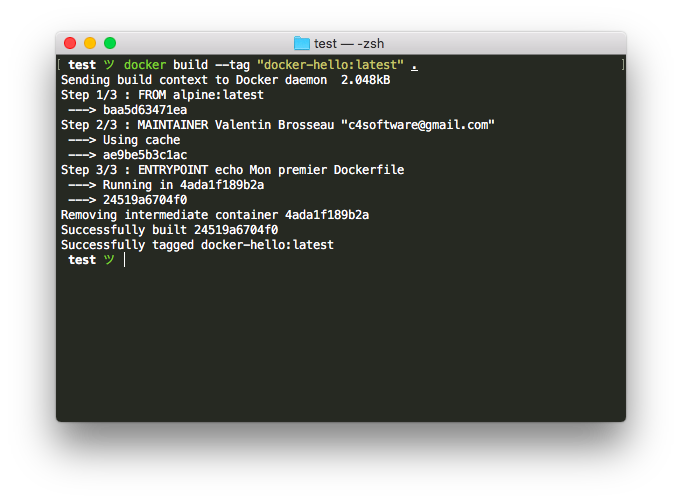

# Les Dockerfile’s

<!-- TOC -->

- [Les Dockerfile’s](#les-dockerfiles)
    - [Introduction](#introduction)
    - [Pourquoi faire des Dockerfile](#pourquoi-faire-des-dockerfile)
    - [Créer un Dockerfile](#créer-un-dockerfile)
    - [Builder votre image](#builder-votre-image)
    - [Image Docker pour l’application "TODO"](#image-docker-pour-lapplication-todo)
        - [1. Écriture du Dockerfile](#1-écriture-du-dockerfile)

<!-- /TOC -->

## Introduction

Comme nous l’avons vu dans le premier TP chaque image Docker repose sur un fichier Docerfile. Pour l’instant nous n’avons pas écrit le notre, nous avons juste utilisé ceux fourni sur le DockerHub. Dans ce TP nous allons voir la structure d’un fichier Dockerfile et vous allez écrire votre premier Dockerfile il aurra pour but de définir l’ensemble de la « stack applicative » nécéssaire au bon fonctionnement de l’application TODO.

## Pourquoi faire des Dockerfile

Comme vous avez pu le voir sur le DockerHub il existe énormément d’image déjà prête, elles nous seront bien évidement utiles dans nos images Docker, mais tels qu’elles elle n’ont que « peu d’intérêts ». Nous allons donc écrire un fichier Dockefile qui va permettre de créer toutes la définition pour le bon fonctionnement de l’application Todo que vous avez écrit dans un autre TP.

Une fois le fichier Dockerfile écrit votre applications sera fonctionnelle sur toutes les plateforme supportées par Docker (Windows, Linux, OSX, Raspberry Pi…), fonctionelle oui, mais surtout fonctionnelle en quelques secondes !

## Créer un Dockerfile

Les « Dockerfile » sont des simple fichier texte mais avec un formalisme précis. Par exemple :

```conf
FROM alpine:latest
MAINTAINER Valentin Brosseau "c4software@gmail.com"
ENTRYPOINT ["echo", "Mon premier Dockerfile"]
```

Avant de « builder » cette première image, arretons nous sur les différentes lignes :

- « FROM alpine:latest », c’est l’image de référence, dans le cas présent une image très légère (un linux avec très peu de dépendance).
- « MAINTAINER Valentin Brosseau "c4software@gmail.com" », Le mainteneur de l’image (purement indicatif).
- « ENTRYPOINT ["echo", "Mon premier Dockerfile"] », La commande qui sera lancé au **démarrage** de votre image.

Pour finir enregistrer la définition précédente dans un fichier nommé « Dockerfile ».

## Builder votre image

Pour builder votre image il suffit de lancer la commande suivante :

```
docker build --tag "docker-hello:latest" .
```

Avant de lancer cette commande, regardons les différents éléments :

- « --tag "docker-hello" », c’est le nom de votre image.
- « …:latest », c’est en quelques sorte la version de votre image. Latest indique la version la plus récente.
- « . » indique à Docker que le fichier Dockerfile est dans le dossier courant.

Lancer la précédente commande dans le dossier ou vous avez créé le fichier Dockerfile.



## Image Docker pour l’application "TODO"

Faire un test c’est bien! Mais maintenant que l’on connais les bases d’une image Docker, nous allons créer une image Docker qui va nous permettre de lancer rapidement (et très simplement) l’application sans avoir à ce soucier de l’environnement sur lequel vous allez lancer « votre applications / site web »

### 1. Écriture du Dockerfile

Pour écrire notre Dockerfile nous allons avoir besoin de connaitre les technologies nécéssaire au bon fonctionnement de notre application. Dans notre cas, il faut le langue de programmation de la partie serveur :

- […] (À vous de trouver…)

Une fois que ça est fait il faut trouver une image de base qui nous servira de référence. Dans notre cas … PHP. Une image officiel existe : [Docker Hub PHP](https://hub.docker.com/_/php/)

- Qu’elle version choisisez-vous ?
- Pourquoi ?

