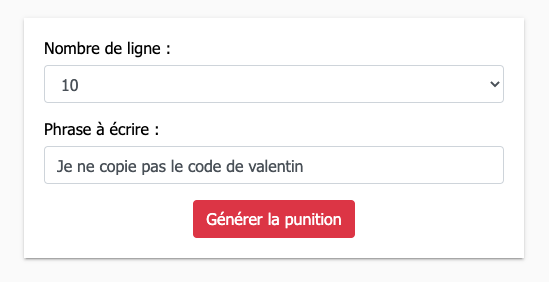

# Contrôle de saisie & intéractivité

Le JavaScript, comme je l'indiquai en introduction, est partout. Pour l'instant, nous allons le limiter principalement aux interactions utilisateurs (contrôle de saisie, validation de formulaire, interactivité).

Nous allons pratiquer les évènements JavaScript en ajoutant à notre TP Bart ([Version JavaScript](/tp/php/tp2.md)) un simple formulaire puis des contrôles de saisie.

L'objectif étant donc d'ajouter des contrôles de saisie sur votre page formulaire.

Deux solutions sont possibles coder nous même, ou faire confiance à une librairie « provenant d'Internet ».

## Ajouter le formulaire sur votre page

La première étape vas être d'ajouter dans la page un formulaire HTML doit ressembler à :



Je vais laisse écrire le code _et le style_ du formulaire en question. Quelques règles :

- Vous pouvez ajouter bootstrap si vous souhaitez.
- Vous devez utiliser un « form »
- Vous devez externaliser la CSS.
- Votre formulaire doit être avant le tableau.

## La validation sans Librairie

Ajouter des contrôles, finalement c'est simple. Il « faut juste » :

- Ajouter un évènement « onSubmit ».
- Vérifier que les champs `input` ne sont pas vide (ou du moins, possède les valeurs attendues).

En pratique ça va donner :

```javascript
function validateForm(evt) {
  const name = document.getElementById("name").value;
  const password = document.getElementById("password").value;

  if (name == null || name == "") {
    alert("Name can't be blank");
    evt.preventDefault();
  } else if (password.length < 6) {
    alert("Password must be at least 6 characters long.");
    evt.preventDefault();
  }

  // Cas de réussite

  // Empêche le submit du formulaire
  evt.preventDefault();
}

// Attacher l'évènement en JS
document
  .getElementById("monForm")
  .addEventListener("submit", validateForm, true);

// Vous pouvez également attacher l'événement directement dans le HTML avec
// <form onsubmit="validateForm()">
// …
```

::: tip Un Instant !
`return false` ? Et oui, c'est aussi simple que ça ! En JS si vous souhaitez stopper la soumissions d'un formulaire il suffit que votre fonction de validation retourne `false`. Votre navigateur sera automatiquement qu'il doit arrêter imédiatement la soumission du formulaire. Votre _serveur ne recevra donc **pas**_ les données.
:::

### À faire

- Je vous laisse le mettre en place dans votre code.
- Rendre la page interactive avec les données saisies (via un `onsubmit` en HTML ou, `submit` via les events)
- Je vous laisse écrire la même chose avec jQuery.

## Faire l'action souhaitée

Maintenant que nos informations sont validées, il faut les utiliser dans la page. En reprenant [le code du TP précédent](./tp2.md), je vous laisse intégrer la logique suivante :

- Le tableau ne doit pas être visible au chargement de la page.
- Une fois, la validation du formulaire effective (saisie correcte), le tableau doit s'afficher avec dedans la phrase choisie par l'utilisateur (ainsi que le nombre).
- Le formulaire ne doit plus être visible (ainsi que la `card` dans lequel celui-ci est).
- « Une action » recommencer la saisie doit permettre de :
  - Masquer le tableau
  - Afficher le formulaire à nouveau

::: tip Rappels

Je vous rappels que vous avez [l'aide mémoire](/cheatsheets/javascript/) ainsi que le [support du cours](/tp/javascript/support.md) pour vous aider. Mais l'ensemble va reposer sur :

- Des sélecteurs, exemple `document.getElementById('tableau')`.
- L'obtention de valeur, exemple `document.getElementById('monInputText').value`.
- Masquer / afficher des éléments, exemple `document.getElementById('monInputText').className='hidden'`.

:::

## Avec une Librairie

Nous avons vu la façon manuelle de valider les formulaires. Je pense que sans vous faire un dessin… vous vous rendez compte que si nous avons 200 champs; ça va être plus compliqué ! D'autant plus que plus notre formulaire sera complexe plus celui-ci aura des règles complexes.

Heureusement des gens ont déjà pensé à ce genre de problématique pour vous… Je vous propose d'utiliser :

- [jQuery Validation](https://github.com/jquery-validation/jquery-validation)

::: warning C'est un plug-in parmi tant d'autres
Ce plug-in est juste « un parmi tant d'autre », comme toujours utilisez celui le plus adapté à votre problématique.

Par exemple quand nous ferons du VueJS, **il ne faudra plus utiliser jQuery** !
:::

### À faire

Réécrire votre code précédent pour implémenter une validation via jQuery Validation.
