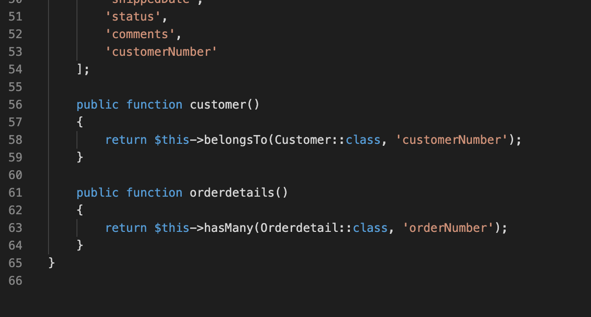
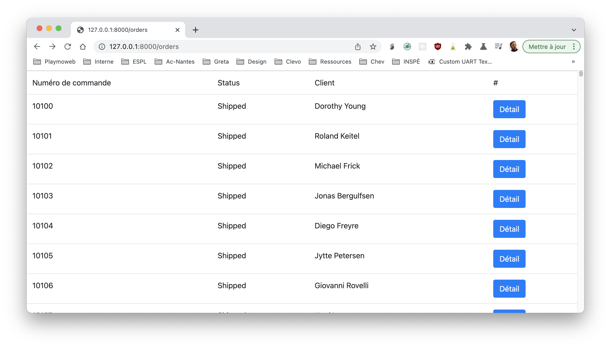

# Eloquent les modèles simplement

::: details Sommaires
[[toc]]
:::

Dans ce TP nous allons voir comment générer le modèle Laravel à partir d'une base de données existante.

## Introduction

Pour pouvoir utiliser Laravel, nous allons avoir besoin de différents outils :

- PHP 8 (ou 7)
- Composer

Il y a bien plus de dépendances, mais celles-ci seront récupérées automatiquement par `Composer`

## Créer le premier Projet

Votre poste est maintenant configuré pour Laravel, vous pouvez donc créer un nouveau projet grâce à la commande :

✋ Attention, le projet sera créé dans le dossier courant.

```bash
laravel new mon-premier-projet

# Ou

composer create-project --prefer-dist laravel/laravel mon-premier-projet
```

La commande va télécharger l'ensemble des dépendances nécessaire et va créer un dossier `mon-premier-projet` avec les sources.

::: tip Vous avez récupéré le projet via GIT ?

Si vous avez récupéré le projet depuis GIT vous n'allez bien évidemment pas utiliser la commande `create-project`… Par contre vous allez devoir réinstaller les dépendances (`vendor`) de votre projet. C'est très simple :

Dans le dossier de votre projet, lancer la commande :

```sh
composer install
```

:::

## Initialisation

Votre nouveau projet contient un fichier `.env` ouvrez-le, et éditez par exemple le nom du projet.

Questions :

- Le fichier est plutôt complet, à quoi servent les différents paramètres ?
- Dans les cours, je vous ai parlé de la APP_KEY, celle-ci est déjà remplie, à votre avis pourquoi ?

## Lancer le projet d’exemple

Laravel intègre un serveur de test permettant de valider son développement avec rien d’autre que PHP sur sa machine. Pour ça, dans le dossier du projet (`cd mon-premier-projet`) vous pouvez faire la commande suivante :

```bash
php artisan serve
```

Rendez-vous maintenant dans [votre navigateur](http://localhost:8000) pour voir le site de démonstration fourni par Laravel.


## La base de données

L'idée de ce TP est de générer automatiquement les modèles à partir de la structure de votre base de données.

Pourquoi générer nos modèles ? L'avantage de générer nos modèles c'est qu'ils vont vraiment être complets.

Ils contiendront évidemment les, `$fillable` mais également les jointures entre les tables !

### Importer la BDD

Dans un premier temps, je vous laisse restaurer la base suivante :

[Télécharger la base de données](./ressources/mysqlsampledatabase.sql)


- Je vous laisse importer la base de données dans MySQL.

### Installer le générateur de modèle

Pour générer les modèles, nous allons utiliser un plugin que nous allons ajouter avec Composer.

Le plugin en question [Reliese Laravel Model Generator](https://github.com/reliese/laravel)

Pour l'installer, la procédure est simple :

```sh
composer require reliese/laravel --dev
php artisan vendor:publish --tag=reliese-models
php artisan config:clear
```

::: tip Un instant !

Qu'avez-vous installé ? Quels fichiers ont été modifiés ? Je vous laisse regarder, nous allons en parler !

:::

### Générer les modèles

::: danger Attention

Avant de générer les modèles, je vous laisse vérifier la configuration de votre `.env` notamment au niveau de la base de données.

:::

Maintenant que votre base de données est configurée et prête à être utilisée depuis Laravel, nous allons pouvoir générer l'ensemble des modèles de notre application.

Pour générer **l'ensemble des modèles,** nous allons saisir une nouvelle commande (celle-ci a été ajoutée par le plugin que vous venez d'ajouter) :

```sh
php artisan code:models
```

::: tip C'est rapide et ça fonctionne !
En quelques secondes le plugin a créé l'ensemble des modèles de votre projet. Je vous laisser regarder les modifications dans votre projet, et surtout le dossier `models`
:::

### Les modèles générés

Avant d'aller plus loin, regardons ensemble un peu les modèles :


Vous vous souvenez des jointures ? Je vous avais expliqué qu'il était possible de les définir dans Laravel pour requêter simplement votre base de données. Dans le code généré par le plugins, nous avons évidemment celle-ci, voilà un exemple :



::: danger STOP

Ici, pas de magie ! Le plugin ne fait qu'écrire du code à votre place. Le code vous ne pouvez **évidemment pas l'inventer,** il est dans la documentation officielle de Laravel.

Vous l'avez oublié ? Pas de problème : 

[La documentation de base](https://laravel.com/docs/8.x/eloquent)
[Les jointures et Eloquent](https://laravel.com/docs/8.x/eloquent-relationships)

:::

## Testons avec la liste des commandes

Pour voir l'intérêt de tout ceci, nous allons réaliser quelques requêtes !

Pour ça nous allons ajouter quelques éléments dans votre projet… En premier lieu, un contrôleur qui permettra de réaliser les requêtes.

Pour tester, nous allons réaliser des requêtes dans la table `orders`.

Pour cette première fois, nous allons le faire ensemble.

### 1. Ajouter un contrôleur

La première étape, c'est la création du contrôleur : 

```sh
php artisan make:controller OrdersControler
```

### 2. Déclarer la route

```php
Route::get('/orders', [OrdersController::class, 'list']);
```

::: danger Un instant ✋

En PHP objet il y a la notion de namespace, Laravel utilise de base les namespace, ça veut dire que nous allons avoir à utiliser le mot clé `use` pour importer (include). Quand vous voulez utiliser une classe qui n'est pas dans le même fichier, il faudra déclarer l'emplacement via un `use`. Exemple, pour que `Demo` soit accessible depuis le contrôleur, il faudra :

```php
use App\Models\Demo;
```

- ⚠️ Si vous utilisez **PHPStorm,** cet import sera automatique.
- ⚠️ Si vous utilisez **VSCode,** il faudra passer par une extension [Disponible ici](https://marketplace.visualstudio.com/items?itemName=MehediDracula.php-namespace-resolver)

Pour **PHPStorm**, alt+entrée permettra de déclencher l'ajout dû use.

Pour **VSCode** je vous laisse regarder l'usage de l'extension :


:::

### 3. Déclarer la méthode

Si vous avez bien suivi, vous avez compris que nous allons devoir ajouter dans notre `OrdersController` une méthode `list`.

Dans votre contrôleur, ajouter le code suivant :

```php
    function list(){
        return view("orders-list", ["orders" => Order::all()]);
    }
```

::: tip Un instant !

Qu'avez-vous copié / coller ?

- `Order::all()` ? À quoi correspond cette ligne ?
- `orders-list` ? Avez-vous créé ce fichier ?

:::

### 4. Créer la vue

Vous l'avez vu, nous avons besoin d'un template pour que la page s'affiche. Créer un fichier nommé `orders-list.blade.php` dans le dossier. `resources/view`

```html
<!DOCTYPE html>
<html lang="fr">
    <head>
        <meta charset="UTF-8">
        <meta http-equiv="X-UA-Compatible" content="IE=edge">
        <meta name="viewport" content="width=device-width, initial-scale=1.0">
        <link rel="stylesheet" href="https://maxcdn.bootstrapcdn.com/bootstrap/4.0.0/css/bootstrap.min.css" integrity="sha384-Gn5384xqQ1aoWXA+058RXPxPg6fy4IWvTNh0E263XmFcJlSAwiGgFAW/dAiS6JXm" crossorigin="anonymous">
    </head>
    <body>
        <div>
            <div>
                <table class="table">
                    <thead>
                        <tr>
                            <td>Numéro de commande</td>
                            <td>Status</td>
                            <td>Client</td>
                            <td>#</td>
                        </tr>
                    </thead>
                    <tbody class="bg-white dark:bg-slate-800">
                    @foreach($orders as $order)
                        <tr>
                            <td>{{$order->orderNumber}}</td>
                            <td>{{$order->status}}</td>
                            <td>{{$order->customer->contactFirstName}} {{$order->customer->contactLastName}}</td>
                            <td>
                                <a class="btn btn-primary" href="/orders/{{$order->orderNumber}}">Voir la page de détail</a>
                            </td>
                        </tr>    
                    @endforeach
                    </tbody>
                </table>
            </div>
        </div>
    </body>
</html>
```

Je vous laisse tester dans votre navigateur, si tout fonctionne correctement vous devriez avoir :




::: tip Un instant !

- Vous avez remarqué ? Non ? Vraiment ?
- Vous avez des données de commande, mais vous avez également des données `client` (`customer`) ! Comment est-ce possible ? Vous n'avez pas écrit de requête pourtant ?
- `$order->customer` est en fait un raccourci qui va faire la requête pour vous !
  - Attention… pas de magie… Le code est écrit dans la méthode `customer()` du modèle `Order`.
  - Avant d'aller plus loin, allez regarder le code du modèle.

:::

### 5. Ajouter une autre donnée

Vu que vous avez regardé le modèle `Order`, vous avez remarqué la méthode `orderdetails`. Je vous laisse :

- Ajouter dans le données une nouvelle colonne.
- Celle-ci doit contenir le nombre de produits commandés

Un indice

```html
({{sizeof($order->orderdetails)}})
```

C'est à vous !

## Ajouter la vue de détail

Nous allons maintenant faire la page de détail en prenant le même principe.

### 1. La méthode  

Pour vous aider, voilà le code. **Attention** avant de copier / coller trop rapidement, regardez bien…

```php
function detail($id){
    return view("orders-detail", ["order" => Order::find($id)]);
}
```

::: tip Un instant !

- D'où ça provient `$id` ?
- `::find($id)` ? À quoi sert cette méthode ?

:::

### 2. La route

Et pour assembler le tout… La route !

```php
Route::get('/orders/{id}', [OrdersController::class, 'detail']);
```

`{id}` ? Correspond à une route dynamique, grâce à cette notation, votre variable `$id` de votre contrôleur sera automatiquement remplie avec la valeur en provenance du lien.

### 3. Le template

Je vous laisse l'écrire, celui-ci va afficher (de manière sympa, dans une Card) :

- La commande
- Le client
- Le détail de la commande (liste des produit)

::: details Vous pouvez débuter avec…

```html
<h2>Commande</h2>
{{ $order }}

<h2>Client</h2>
{{ $order->customer }}

<h2>Détail</h2>
{{ $order->orderdetails }}
```

Ce n’est pas beau, mais ça fonctionne :


:::

## Et si nous allions plus loin!

Notre base de données est assez volumineuse et permet de faire bien plus ! Je vous laisse créer les routes et la vue permettant de constulter un `Customer` :

- Liste des `Customer`.
- Vue de détail d'un `Customer`.
  - Le détail dû `Customer`.
  - Dans la vue de détail, je veux voir la liste des commandes du `Customer`.


Pour ça vous allez devoir :

- Créer un nouveau contrôleur.
- Les routes

::: tip Un Instant !

Pour réaliser les deux pages, vous n'avez besoin que d'un seul modèle (`Customer`). Via les jointures l'ensemble des autres requêtes sera automatique !

:::

C'est à vous !