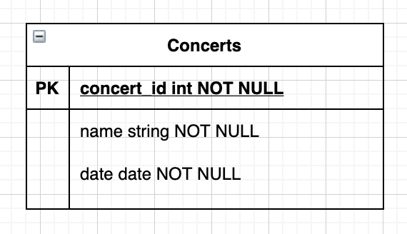

# Créer des API avec Laravel

Nous avons vu précédemment qu'il était simple de créer des site Web avec Laravel. Dans le monde du developpement, il est très courant de ne pas échanger entre le client et le serveur directement en HTML mais directement en JSON.

Nous appelons cette façon des API (dans notre cas des API REST), c'est le fondement même de beaucoup de site Internet que vous utilisez tous les jours (Gmail, Facebook, …).

Laravel étant un framework « à tout faire » celui-ci nous permet bien évidemment de créer également des API. C'est ce que nous allons faire dans ce TP.

::: details Sommaire
[[toc]]
:::

## Créer votre projet

Pour cette étape, je vous laisse suivre le début du [précédent TP](./introduction.md).

**Attention** a bien installer au moins la version >8 de Laravel.

## Création de la base de données

La première étape comme toujours est d'ajouter dans votre projet « une nouvelle migration » afin de créer la base de données relative à notre problématique.

Dans notre cas, voilà la table que nous souhaitons créer :

Je vous laisse créer :

- La migration et le modèle `php artisan make:model Concert --migration`
- Définir les champs dans la migration mais également dans le `$fillable`.
- Lancer la migration `php artisan migrate`
