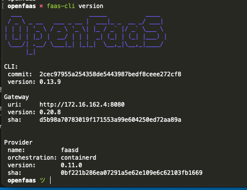

# Création stack openfaas (via Multipass)

Ce document s'intéresse uniquement à la partie création création de la stack inital openfaas dans Multipass

## Installer Multipass

« Ubuntu VMs on demand for any workstation »

Installer [multipass](https://multipass.run/)

## Installer faas-cli

### Linux et Mac

Sans être root :

```sh
curl -sSL https://cli.openfaas.com | sh
```

Via brew (Mac OS) :

```sh
brew install faas-cli
```

### Windows Powershell

```sh
$version = (Invoke-WebRequest "https://api.github.com/repos/openfaas/faas-cli/releases/latest" | ConvertFrom-Json)[0].tag_name
(New-Object System.Net.WebClient).DownloadFile("https://github.com/openfaas/faas-cli/releases/download/$version/faas-cli.exe", "faas-cli.exe")
```

## Configuration Cloud-config

Pour créer la machine nous allons utiliser `Cloud-config` ce fichier de configuration va initialiser la VM avec l'ensembles des dépendances nécéessaires au bon fonctionnement.

```sh
curl -sSLO https://raw.githubusercontent.com/openfaas/faasd/master/cloud-config.txt
```

## SSH Key

Afin de pouvoir vous connecter à la machine il faut modifier le fichier `cloud-config.txt` pour y ajouter votre clé SSH

```sh
ssh-add -L
```

Éditer dans le fichier `cloud-config.txt` la ligne `ssh-rsa` pour mettre votre clé.

## Créé et démarrer la VM

```sh
multipass launch --cloud-init cloud-config.txt  --name faasd
```

::: tip Opération longue
Cette opération va prendre quelques minutes en fonction de votre machine. Votre ordinateur (via cloud-init) est entrain de créer une machine disposant de `open-faas` mais également de l'ensemble des dépendances nécessaire au bon fonctionnement.
:::

## Récupération de l'authentification

Votre machine est maintenant créé. Pour pouvoir se connecter à Open-faas vous devez récupérer le fichier `basic-auth-password` pour ça nous allons :

- Avoir besoin de l'IP de votre VM
- Récupéré via SSH le fichier d'auth

```sh
multipass ls
```


Dans mon cas l'IP est dans `172.16.162.4`, via la commande :

```sh
ssh ubuntu@172.16.162.4 "sudo cat /var/lib/faasd/secrets/basic-auth-password" > basic-auth-password
```

## Connexion à l'instance

```sh
export OPENFAAS_URL=http://172.16.162.4:8080 && cat basic-auth-password | faas-cli login -s
```

## Valider le fonctionnement

```sh
faas-cli version
```



Vous pouvez également accéder à l'interface d'admin WEB via :

[172.16.162.4:8080](172.16.162.4:8080)

Votre ordinateur est maintenant prêt, nous avons donc créé :

- Une VM contenant open-faas (votre serveur).
- Le CLI pour contrôler `open-faas`.
- Connecter votre ordinateur à votre serveur.
