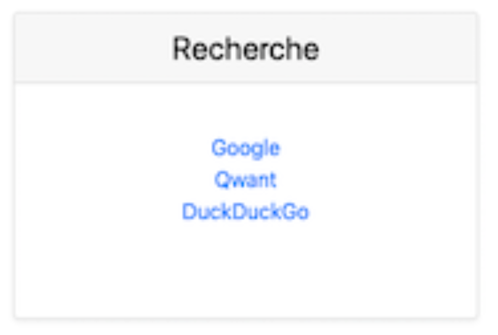

# (Ré)organiser mon code

## Introduction

Dans ce TP nous allons voir comment « ré-organiser » du code pour le rendre plus facilement maintenable.

⚠️ Le code fourni est clairement de mauvaise qualitée. Il ne dois pas être pris comme référence. ⚠️

## Code

Le code est [disponible ici](./shitty-app.zip). Les premières étapes sont :

- Installer Wamp (si pas déjà fait).
- Télécharger et « installer » le sources dans votre WAMP.
- Prendre en main l'application (naviguer dans les écrans).
- Regarder le code source.

L'application dois ressembler à :


## Première analyse du code

Maintenant que vous avez pris en main le code source, quels sont les remarques sur le code pouvez-vous émettre :

```text
Vos remarques


```

PS: Cette première analyse est importante !



```text
- Non utilisation de template.
- Le code des liste est répeté (sans utilisation de fonction).
- Le Header et le Footer HTML est dupliqué entre les deux pages.
- Le « Widget » HTML des liste est répété 3x
- L'accès à la données n'est pas centralisé (les fichiers JSON sont ouvert directement depuis la page).
- Il n'y a pas de DAO.
- Il n'y a aucun modèle de données.
- Pas de configuration centralisée.
```



## Détail des fonctionnalités

Avant de commencer à modifier le code il faut « lister » / « détailler » les différentes fonctionnalité de l'application. Pour moi voilà les points clefs

- Deux pages (une complète, l'autre de détail).
- Utilisation de bootstrap.
- Les données sont stockés dans des fichiers JSON.
- L'interface est responsive.
- Il est possible d'ajouter des éléments via l'interface web.

## Début des modifications

Comme vous l'avez constaté l'application comporte de nombreux défaut (plus ou moins important). Nous allons les prendres dans l'ordre :

- Le découpage (pour éviter la duplication du code HTML).
- Réécrire la page d'accueil pour ne plus avoir 3x le même code à la suite.
- Créer un modèle qui représente un « lien ».
- Créer un DAO pour l'accès à la données (Lecture, Ajout).
- Créer un fichier PHP « avec les paramètres / constantes » de l'application.

## Le découpage du code HTML

### Header & Footer

La première étape est de découper le HTML pour éviter la duplication de code HTML.

- Sortir le Header dans une fonction avec paramètre pour le titre.
- Sortir le Footer dans une fonction.

Pour l'organisation je vous propose d'écrire un fichier PHP `index.php`. Bien évidement, nous n'allons pas le mettre à la racine. Mais dans un dossier nommée (par exemple) `fonctions`.

C'est à vous :

- Créer le dossier.
- Créer un fichier `index.php` à l'interieur de celui-ci.

La structure de vos sources dois ressembler à quelques chose comme :

```shell
├── data
│   ├── reddit.json
│   ├── search.json
│   └── twitter.json
├── detail.php
├── fonctions
│   └── index.php
├── index.php
└── public
    └── main.css
```

Pour vous aidez dans votre missions voilà la structure du fichier :

```php
<?php

function header($titre) {
    echo "…";
}

function footer($titre) {
    echo "…";
}
```

C'est à vous, dans la page `index.php` actuelle isoler le code relatif au `header` et au `footer` et mettez le dans les bonnes fonctions.

Utilisez maintenant les fonctions dans votre code.

> Rappel: En PHP vous devez `include` les fichiers pour rendre le code accessible dans la page. Exemple :

```php
<?php 
    include("fonctions/index.php);

    header();
```

### Testez

Valider le bon fonctionnement de votre modification avant d'allez plus loin.

### Reflechissons ensemble

C'est bien, mais ! Est-il possible de faire autrement ? Pouvons nous utilisez un objet plutôt que deux fonctions ?

- Est-ce intéressant ?
- Quel est l'avantage ?

### Réécriture des listes de lien

Comme vous l'avez constaté, les liste de lien (ainsi que le code PHP) est répété 3x. Procéder ainsi est à la fois inéficace et inutile. Prendre du temps pour éviter ce genre de choses est primordiale et vous évitera bien des tracas en cas de mise à jour de votre code (ou de celui d'un collègue).

Pour rappel les listes de liens ressemble à :



Regardons ensemble le code source de cet élément :

```html
<div class="card mb-4 shadow-sm">
    <div class="card-header">
    <a class="nolink" href="detail.php?c=search"><h4 class="my-0 font-weight-normal">Recherche <i class="material-icons">edit</i></h4></a>
    </div>
    <div class="card-body">
    <ul class="list-unstyled mt-3 mb-4">
        <?php
        $data = json_decode(file_get_contents("./data/search.json"));
        foreach($data as $d){
            echo "<li><a rel='nofollow' target='_blank' href='" . $d->lien . "'>" . $d->name . "</a></li>";
        }
        ?>
    </ul>
    </div>
</div>
```

- Quels éléments sont variables ?
- Comment reformater le code pour le transformer en fonction ?

### Place au code

Je suis sympa je vous aide, dans `fonctions/index.php` ajouter une fonction nommée `genereListe`.

```php
function genereListe($title, $file){
    // Votre code ici.
}
```

Remplacer le code dupliqué, par l'appel à votre fonction.
### Testez

Valider le bon fonctionnement de votre modification avant d'allez plus loin.

### Allez plus loin

Comme vous devez le constater, nous n'avons pas retirer le code dupliqué… nous l'avons simplifié, mais pas supprimé.

À votre avis comment procéder ?


```php
$elements = [
    ["file" => "search", "title" => "Rechercher"],
    ["file" => "reddit", "title" => "Reddit"],
    ["file" => "twitter", "title" => "Twitter"],
];

foreach($elements as $el){
    genereListe($el['title'], $el['file']);
}
```

- Quel est l'avantage de ma solution ?
- Est-ce meilleur que la votre ?



### Page detail.php

Utilisez vos nouvelles fonctions dans la page `detail.php`. Cette fois-ci pas d'aide.

## L'organisation du code PHP

## Le modèle de la données

## Le DAO

## Les paramètres

## En plus : Migration vers MySQL

## En plus : Autorisation d'accès

## En plus : Ne pas autoriser plusieurs lien identique

