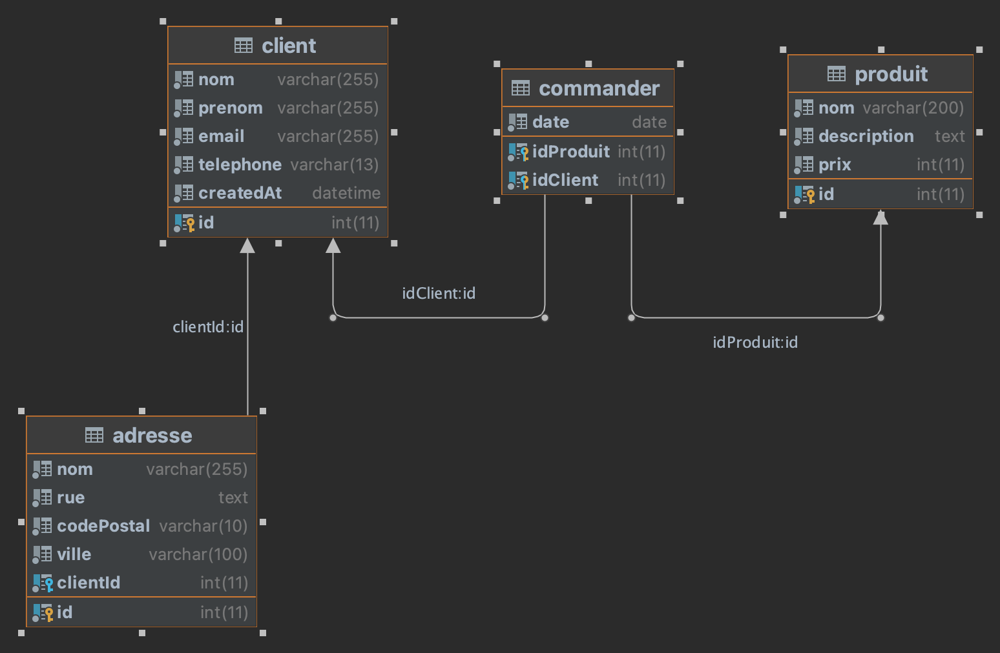
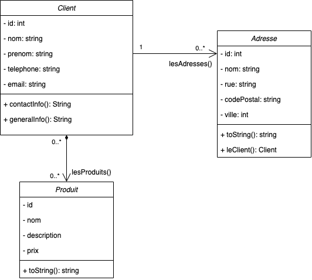
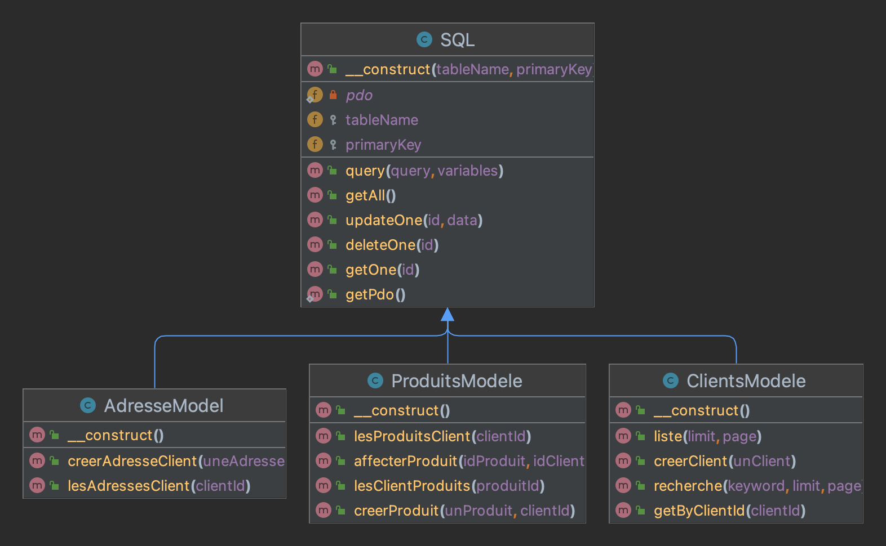
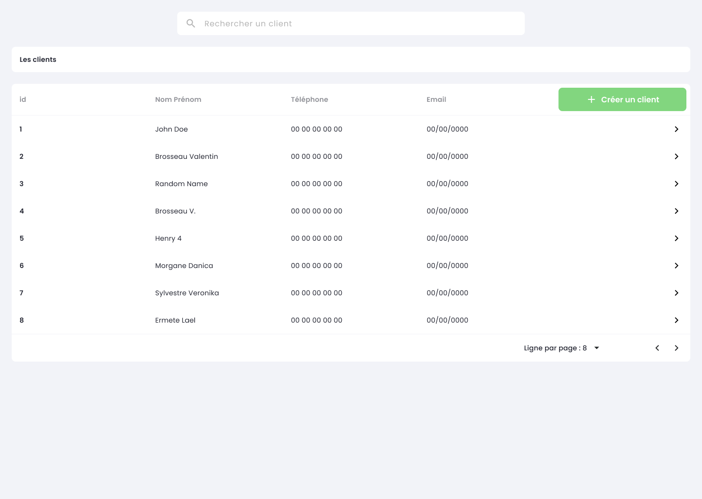
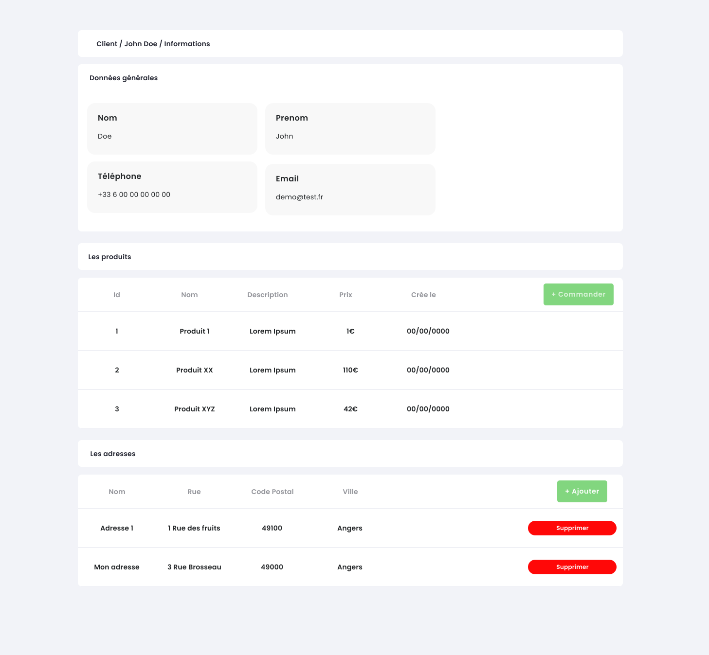
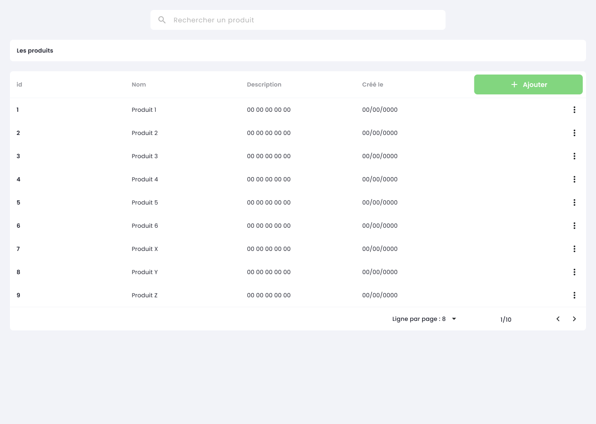

# Pratiquer la POO et le MVC

Dans ce TP, nous allons continuer notre découverte de la POO au travers du MVC.

::: details Sommaire
[[toc]]
:::

## Le projet

Dans le TP todo liste nous avons vu la mise en place du design pattern MVC. Le découpage en 3 classes est le minimum, nous allons voir ici qu'il est possible d'exploiter la puissance de la programmation orientée objet (POO) pour organiser son code autour de classes qui auront un sens dans le cadre de votre projet.

Le projet que vous allez réaliser est ce que l'on appelle une CRM (Customer Relationship Management), c'est une site (outil) qui va permettre d'afficher des informations clients sous le format d'une `Fiche Client`. Vous allez donc de voir créer quelques éléments de cette application à savoir :

- Lister les clients.
- Rechercher les clients.
- Voir la fiche d'un client (et afficher ces informations).
- Voir la liste des produits commandée par le client consulté.
- _Bonus_ : Afficher la liste des contacts d'un client.

::: danger Un instant

Nous allons nous placer ici dans un contexte type entreprise ou vous aurez à votre disposition un code existant. Pas d'inquiétude, le code de base est relativement petit, cependant il intègre des fonctionnements nouveaux. Donc, comme d'habitude je vous demande d'être curieux et de fouiner dans le code avant d'attaquer votre travail.

:::

## Récupérer le projet de base

Le projet de base est disponible [à l'adresse suivante en cliquant ici](https://github.com/c4software/mini-mvc-sample/archive/refs/tags/2.2.zip)

::: tip C'est un projet vide
Même si celui-ci contient à première vue « beaucoup de fichiers », le projet que vous avez téléchargé est bien un projet vide.
:::

## Pdo vous connaissez ?

Évidemment [PDO](https://www.php.net/manual/en/book.pdo.php) vous connaissez… Mais connaissez-vous `FETCH_CLASS` ? Vous ne l'avez peut-être pas remarqué, mais la structure MVC n'utilise pas l'habituel`FETCH_ASSOC` , mais `FETCH_CLASS`. Ça veut dire qu'à partir de maintenant nous utiliser une syntaxe objet plutôt que des tableaux lors de la récupération de données en base !


Rassurez-vous, la lecture et l'écriture du code en seront grandement simplifiées ! Voilà quelques exemples :

```php
<?php
/** @var Client[] $clients */
foreach ($clients as $c) { ?>

    <div class="card m-3 p-3">
        <h3><?= $c->generalInfo() ?></h3>
        <p class="small"><?= $c->contactInfo() ?></p>

        <?php
        // Liste des produits
        $produits = $c->lesProduits();
        if (sizeof($produits) > 0) {
            ?>
            <h4>Les produits</h4>
            <ul>
                <?php foreach ($produits as $p) { ?>
                    <li><?= $p->toString() ?></li>
                <?php } ?>
            </ul>
        <?php } ?>


        <?php
        // Liste des adresses
        $adresses = $c->lesAdresses();
        if (sizeof($adresses) > 0) {
            ?>
            <h4>Les adresse</h4>
            <ul>
                <?php foreach ($adresses as $a) { ?>
                    <li><?= $a->toString() ?></li>
                <?php } ?>
            </ul>
        <?php } ?>
    </div>
<?php } ?>

```

Plus simple, non ? Ça va être surtout beaucoup plus puissant ! Nous allons être capables d'encapsuler la logique dans des objets que nous manipulerons directement dans notre vue.


## Avant d'aller plus loin… un usage avancé du routeur

La structure MVC que vous avez à votre disposition incorpore également la possibilité d'avoir des routes « dynamiques », exemple :

- `/sample/utilisateur/42`
- `/sample/utilisateur/420`

ou encore :

- `/sample/fiche/1`
- `/sample/fiche/123`

=> Que constatez-vous ?

::: details Élément de réponse

Nous avons effectivement une partie « variable » dans notre route, dans le cas des exemples :

- `/sample/utilisateur/42` => Consulter l'utilisateur avec comme identifiant **42**.
- `/sample/utilisateur/420` => Consulter l'utilisateur avec comme identifiant **420**.

ou encore :

- `/sample/fiche/1` => Consulter la fiche avec comme identifiant **1**.
- `/sample/fiche/123` => Consulter la fiche avec comme identifiant **123**.

C'est routes sont des équivalents à :

- `/sample/utilisateur?id=42` => Consulter l'utilisateur avec comme identifiant **42**.
- `/sample/utilisateur?id=420` => Consulter l'utilisateur avec comme identifiant **420**.
- `/sample/fiche?id=1` => Consulter la fiche avec comme identifiant **1**.
- `/sample/fiche?id=123` => Consulter la fiche avec comme identifiant **123**.

**Mais en beaucoup plus lisible !**

:::

Ce type de lien est très présent sur Internet, la structure MVC permet évidemment la création de ceux-ci.

Testons ça dans votre routeur :

```php
Route::Add('/client/{id}', [$main, 'client']);
```

Et dans votre Contrôleur :

```php
function client($id)
{
    echo "Voici le client avec l'identifiant $id";
}
```

Je vous laisse tester.

::: tip Valider le bon fonctionnement

- Tester le code proposé.
- Écrire une vue plutôt qu'un simple `echo`.
- À votre avis à quoi cela sert-il ?

:::

## Le code de base


### Les modèles

Dans ce TP vous allez travailler essentiellement la manipulation d'objet. Pour attaquer directement ce qui nous intéresse, voilà quelques modèles à télécharger et à déposer dans le dossier `models` de votre projet.

=> TODO LIEN VERS LES MODELS & Classes <=

### La base de données

Pour faire fonctionner les modèles, vous devez évidemment avoir la base de données compatible. La voilà :

=> TODO METTRE LIEN SUR LA BASE DE DONNÉES <=

Afin de vous permettre de la comprendre, voilà le diagramme de celle-ci.



Je vous laisse importer la base de données sur votre ordinateur.

::: tip Import ?

Pour important la base de données n'oublier pas le dossier migration. En déposant le script dans le dossier `migration` de votre projet. Vous pourrez initialiser la base de données avec la commande suivante :

```sh
php mvc db:migrate
```

:::

### Diagramme de classe / UML relative aux modèles

Pour bien comprendre les classes que je vous fournis, voilà le diagramme de classe qui permet de les comprendre.

#### Diagramme des classes



#### Diagramme des modèles



::: warning STOP
Arrêtons-nous un instant pour analyser les diagrammes.

<iframe src="https://giphy.com/embed/xCwYFe19SldXLrJlwm" width="480" height="480" frameBorder="0" class="giphy-embed" allowFullScreen></iframe>

:::

## La page de liste / recherche

Maintenant que vous avez vu l'ensemble des méthodes à votre disposition pour accéder aux données présentes en base. Je vous propose de travailler sur la liste des clients présent en base de données.

Cette fonctionnalité est appelé la page de « Liste et de Recherche ». Elle va lister l'ensemble des clients présent en base et permettra l'accès à la fiche client.

Pour vous aider dans votre conception l'entreprise vous fourni le « mockup » d'interface suivant :



::: tip Quelques éléments pour vous aider.

Les zones « blanches » en design sont appelé des Cards. Ils sont fourni de base dans Bootstrap ou Tailwind. N'hésitez pas à les utiliser.

Les résultats (liste des clients) sont une données tabulés, plutôt que de réinventer ce genre de choses avec des `div` n'hésitez pas à utiliser l'élément HTML prévu à cette effet à savoir une `table`.

:::

Maintenant que vous avez les bases en tête nous allons pouvoir attaquer la conception de cette première page.

### Créer le contrôleur

### Créer la vue

### Créer la route /

### Afficher la liste des clients

### Ajouter la fonctionnalité de recherche

Vous avez à votre disposition dans le bon modèle `XXXX` une méthode permettant d'effectuer une recherche. Après l'avoir trouvé, je vous laisse écrire le code dans votre contrôleur pour effectuer une recherche dans la base de données des clients.

## La fiche client



### Créer le contrôleur

### Créer la route /client/{id}

### Créer la fiche client

### Afficher la liste des produits d'un client

### Ajouter un produit au client

## Les adresses clients

En reprenant le principe de la liste des produits dans la fiche client, écrire le code qui permet : 

- D'afficher la liste des adresses d'un client.
- Créer et ajouter une adresse à un client.

::: warning Vous manquer d'inspiration ?

Pour traiter la demande d'affichage des adresses d'un utilisateur, vous devez regarder l'UML et plus précisément les méthodes accessibles dans l'objet `Client`. En regardant attentivement, vous devriez trouver une méthode nommée `lesAdresses()`. Cette méthode retourne un tableau des adresses utilisateur.

Pour l'ajout, vous allez devoir utiliser le modèle `AdresseModele` et plus particulièrement la méthode `creerAdresseClient` qui vous permettra d'ajouter une adresse.

:::

## La liste des contacts

En reprenant le principe de la partie « Produit » ou « Adresse ». Le développeur de la société vous demande d'ajouter le code nécessaire pour que :

- Votre client possède plusieurs données de contact `(Nom du contact, Numéro, Email)`.

Il vous demande de modifier l'objet `Client` pour ajouter un nouveau `getters` permettant d'obtenir l'ensemble des contacts d'un client.

::: tip À faire

Pour traiter ce problème, vous devez découper votre travail en différentes étapes :

- Créer un nouveau modèle `php mvc model:create ContactModele`
- Ajouter en base les deux tables.
- Écrire les requêtes dans votre modèle.
- Créer un objet `Contact` (prendre exemple sur ceux déjà présents dans le code, dans le dossier `classes`).
- Afficher les contacts du client dans la partie Fiche Client.

:::

## Les bonus

Un bon TP se termine toujours pas de bon bonus. Les bonus vont vous permettre de voir si vous avez compris les manipulations précédemment réalisées.

### Bonus : Ajouter une pagination dans la vue liste / recherche.

Modifier votre code pour ajouter un système de pagination (10 clients par 10 clients) dans votre liste. Les méthodes que vous avez utilisées comportent différents paramètres permettant de réaliser des listes paginées. Après l'avoir trouvé, je vous laisse donc :

- Modifier l'interface afin de permettre la pagination.
- Modifier vos appels aux modèles pour réaliser des listes paginées.

### Bonus : Les produits

Vous avez précédemment codé la partie Fiche client. Le développeur de l'entreprise vous demande maintenant d'ajouter les différents écrans pour afficher les produits. La première étape va donc être la création d'un contrôleur.

#### Lister les produits en base

- Créer la vue permettant de liste les produits présente en base.
- Créer la route permettant d'afficher votre vue.
- À l'aide du bon modèle affiché la liste de l'ensemble des produits.

Voilà à quoi pourrait ressembler l'écran :



#### Ajouter un produit en base

- Créer la vue permettant d'ajouter un nouveau produit en base.
- Créer la route permettant d'afficher cette nouvelle vue.
- Écrire la logique dans votre nouveau contrôleur pour ajouter un produit en base à l'aide des modèles déjà présents.