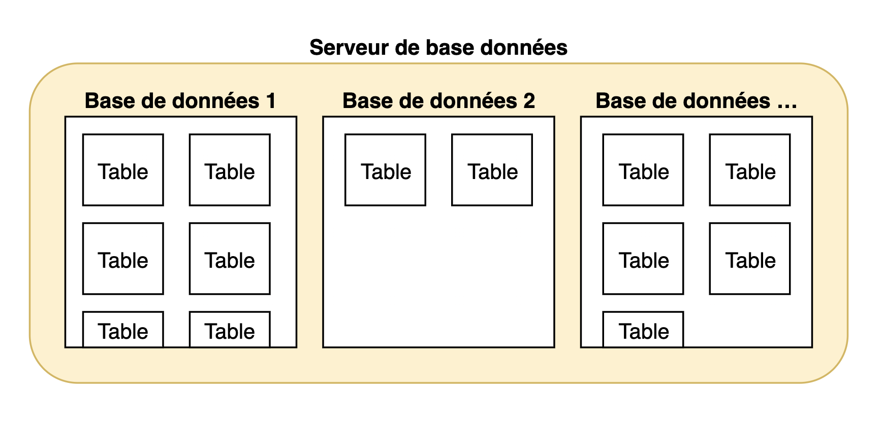
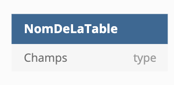
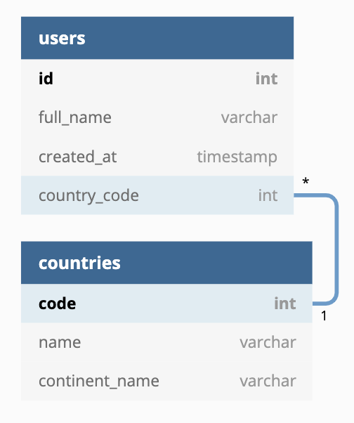
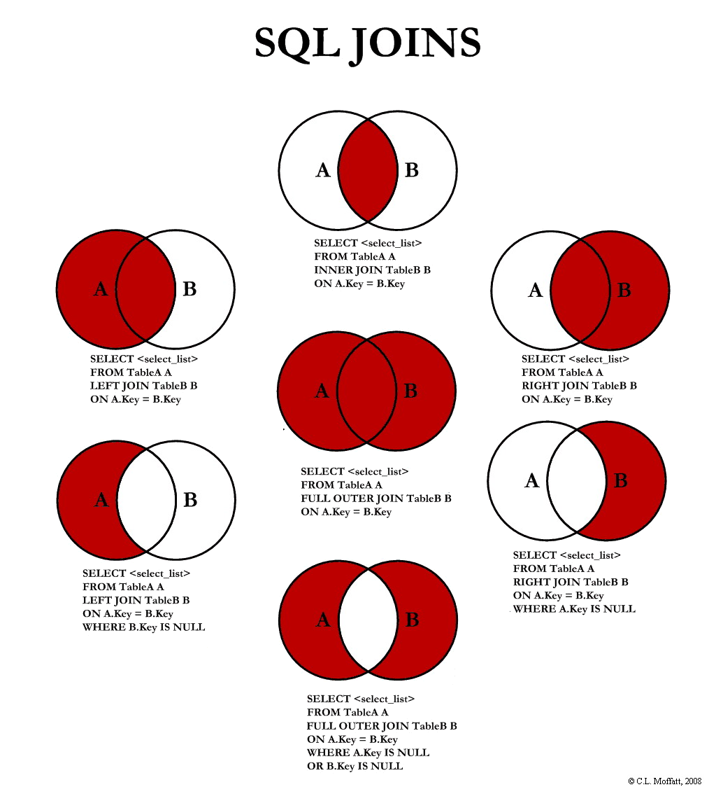

# Complément Cours Base de données

Nous allons maintenant voir la base de données via le PHP. La base de données est un élément important des systèmes d'information moderne.

::: details Table des matières
[[toc]]
:::

::: warning Un instant
La base de données est un vaste sujet. Nous avons ici une introduction à ce qu'il faut connaitre au minimum pour avancer dans nos différents projets.
:::

## Introduction

Une base de données va être en charge de sauvegarder et d'organiser les données pour qu'il soit utilisable. Nous avons actuellement deux types de bases de données :

- Relationnelle
- Non Relationnelle

Les bases de données relationnelles, est celle que l'on rencontre pour l'instant le plus, mais ça change petit à petit et vous rencontrerez très certainement (et très rapidement des BDD non relationnelles).

Pour faire simple, une base de données « Relationnelle », indique que la structure et les règles de validations de vos données seront portées par votre **moteur de base de données**.

Une base de données relationnelle sera plus ouverte. Elle stocke de l'information sans forcément avoir de structure forte. Votre logique de données et la validation des éléments en base seront traitées par **votre code**.



## PHP et les base de données

Dans le cours PHP, nous utiliserons des bases de données relationnelles, plus tard avec le JavaScript nous utiliserons des bases de données non relationnelles.

Il existe plusieurs systèmes de base de données (MySQL, Oracle, MariaDB, Postgresql, …). PHP est compatible avec presque tous les systèmes de base de données « connu » et ça par défaut ! Il intègre une API qui s'appelle [PDO](https://www.php.net/manual/fr/book.pdo.php), cette API est de base avec PHP, il suffit juste de l'utiliser.

::: tip Petite note
PHP est un langage vivant précédemment les accès aux BDD était effectué par d'autres API. Celle-ci est pour la plupart « obsolète ». Je vous conseille vivement de regarder la documentation officielle au maximum plutôt qu'une recherche Google.
:::


MySQL étant intégré à XAMPP / WAMP je vais l'utiliser dans la suite de mon cours. Mais rien ne vous empêche d'utiliser d'autre système tel que PostgreSQL.

## Le langage SQL

Nous allons maintenant voir un gros sujet. Nous avons vu qu'il était possible de stocker des données dans des bases de données. Ces entrepôts de données sont le coeur de nos programmes modernes, tous les programmes que vous allez réaliser existent toujours pour afficher, traiter, emmagasiner de l'information ; cette donnée est le coeur de votre métier encore plus sur Internet.

Nous allons donc prendre un peu de temps, pour voir comment :

- Modéliser.
- Sauvegarder.
- Requêter.

Nous allons donc modéliser les bases de données grâce à des MCD et nous récupèrerons / modifierons les données avec le langage SQL (le mot langage est important).

## Modéliser la base de données

Modéliser une base de données est une étape très importante, elle fait partie intégrante de la phase de conception et **elle ne doit surtout pas être négligée**.

Cette étape de modélisation doit être faite avant chaque création d'une base de données, mais également lors de la modification de celle-ci, je pense qu'il est intéressant de faire ça en dehors d'un ordinateur avec une simple feuille de papier; vous pouvez bien évidemment utiliser un outil en ligne pour créer votre modélisation.

Cette modélisation s'appelle un **MCD** (Modèle Conceptuel de Données), ce MCD va regrouper l'ensemble de la structure de notre base de données (nom des tables, nom des colonnes, types de données), mais également les contraintes **relationnelles**, c'est-à-dire les contraintes entre les tables (nombre maximum, jointures, etc.)

Pour réaliser le MCD nous avons plusieurs solutions :

- Avec un papier et un crayon.
- [DBDiagram](https://dbdiagram.io/home)
- [draw.io](http://draw.io/)

Avant d'aller plus loin, nous allons modéliser ensemble une première base de données très simple. Cette base de données sera la suivante :

- Des Utilisateurs (Identifiant, Nom, Prénom, Date de naissance, Sexe, Code Pays).
- Des pays (Code Pays, Nom)

Un MCD repose toujours sur le même principe, c'est un ensemble de « rectangle » relié ensemble par des traits.



_Nous avons donc :_

- Un rectangle.
- En titre le nom de la table.
- En dessous la liste des champs avec le type de la donnée.

Maintenant que nous avons posé la base, réfléchissons à notre problématique « Utilisateurs et Pays ».

::: details Voilà à quoi ça peut ressembler

:::

::: tip
Ne vous inquiétez pas, nous allons nous entrainer de multiple fois.
:::

## PHPMyAdmin

PHPMyAdmin est un outil qui va nous permettre d'administrer notre serveur de base de données. Celui-ci est intégré à votre serveur XAMPP, vu que c'est un site Internet il sera directement accessible par votre navigateur :

[Accéder à PHPMyAdmin](http://localhost/phpmyadmin/)


L'interface de PHPMyAdmin est découpée en 3 morceaux :

_La liste des bases de données_:


_Les actions possibles_:


_La partie centrale sera différente en fonction de la page / actions (contenu, création, etc)_:


::: tip Un instant
Avant d'aller plus loin, nous allons faire le tour ensemble de l'interface de phpMyAdmin. Pour découvrir quelques fonctionnalités.

👋 phpMyAdmin est très complet et permet de tout faire. **Mais** ce n'est pas le seul outil qui permet d'administrer une base de données, nous avons également :

- [MySQLWorkbench (gratuit)](https://www.mysql.com/fr/products/workbench/)
- [DataGrip (payant)](https://www.jetbrains.com/datagrip/features/)
- [DBeaver (gratuit)](https://dbeaver.io/)

D'ailleurs, je vous propose de tester DBeaver si ça vous dit.
:::

## Le langage de requêtage

Nous avons un langage « universel » pour accéder / manipuler une base de données. Ce langage est découpé en 4 grandes catégories.

| Catégorie                | Mot-clé                               | Usage                                      |
| ------------------------ | ------------------------------------- | ------------------------------------------ |
| Définition d'une base    | create, alter, truncate, drop, rename | Structure de la base                       |
| Manipulation des données | insert, update, delete, merge         | Gestion des données en base                |
| Transaction              | commit, rollback                      | Groupement d'opérations                    |
| Contrôle d'accès         | grant, revoke                         | Droit d'accès aux données                  |
| Accès aux données        | select                                | Récupération d'enregistrements de table(s) |

## Obtenir des données

Comme vu précédemment le SQL va nous permettre différentes opérations autour des tables de notre base données. Celle que nous allons nous servir le plus est « l'obtention de données ». L'obtention de données se réalise avec la commande.

```sql
SELECT
```

La commande `SELECT` permet d'obtenir des données. Cette requête est très simple elle est **toujours** formée de la même manière à savoir :

```sql
SELECT quoi FROM votreTable WHERE condition(s);
```

- `quoi` : Ce que vous souhaitez obtenir, `*` pour l'ensemble, sinon `le_nom_de_votre_colonne` séparé par des virgules.
- `table` : La table que vous souhaitez requêter.
- `condition(s)` : La ou les condition(s) que vous souhaitez appliquer à votre récupération de données.

_Quelques exemples :_

Avec une table telle que

| #id | nom      | prenom   | age | pays |
| --- | -------- | -------- | --- | ---- |
| 1   | Brosseau | Valentin | 33  | FR   |
| 2   | Doe      | John     | 14  | US   |
| 3   | Bernard  | Michel   | 56  | FR   |

```sql
-- Récupère l'ensemble des utilisateurs
SELECT * FROM utilisateurs;

-- Utilisateur de plus de 18ans
SELECT * FROM utilisateurs WHERE age > 18;

-- Utilisateurs de plus de 18ans et de France
SELECT * FROM utilisateurs WHERE age > 18 AND pays = "FR";

-- Nom et Prénom des Utilisateurs
SELECT nom, prenom FROM utilisateurs;
```

| Liste des opérateurs de conditions |
| ---------------------------------- | ------------------------------------------------- |
| =                                  | Égal à                                            |
| >                                  | Supérieur à                                       |
| <                                  | Inférieur à                                       |
| =>                                 | Strictement supérieur                             |
| >=                                 | Strictement inférieur                             |
| !=                                 | Différent de                                      |
| BETWEEN                            | Entre deux valeurs `WHERE age BETWEEN 30 AND 50;` |
| LIKE                               | Recherche `WHERE nom LIKE 'val%';`                |
| IN                                 | Plusieurs valeurs `WHERE IN pays ('FRA','USA');`  |

::: tip C'est à vous

- Nous allons maintenant créer notre première `base de données` et notre première `table` grâce à PHPMyAdmin.
- Insérer un jeu de données fictif.
- Réaliser des requêtes pour s'entrainer.

:::

### Gérer de la pagination

Rapidement vous allez devoir faire des requêtes avec de la pagination, c'est-à-dire avec un nombre restreint de résultats pour gérer des choses que vous avez certainement déjà vu :


```sql
-- Première page (0 à 10)
SELECT * FROM utilisateurs LIMIT 10 OFFSET 0;

-- Seconde page (10 à 20)
SELECT * FROM utilisateurs LIMIT 10 OFFSET 10;

--- …
```

### Ordre de récupération

Trier les résultats est aussi également utile.

```sql
-- Trier page age croissante
SELECT * FROM utilisateurs ORDER BY age ASC;

-- Trier page age décroissante
SELECT * FROM utilisateurs ORDER BY age DESC;
```

### Obtenir de données de plusieurs tables

Votre données peut-être « découpée » dans plusieurs table afin d'éviter les doublons. Cette opération est **très courante** en SQL, en effet il est important de découper la données dans plusieurs tables pour éviter la redondances d'informations (comme vu ensemble précédemment).

Cette opération en SQL est appelé une `jointure`. Nous avons plusieurs façon de joindre les données



::: danger Trop de choix ?
Le choix dépend des données et des opérations que vous souhaitez faire. Mais sachez que dans 90% du temps ce que vous souhaiter faire c'est un **LEFT JOIN**.
:::

::: tip C'est à vous
Nous allons à nouveau mettre en pratique. Nous allons créer une seconde table. Nous allons créer une table de `pays` elle contiendra la liste des pays en lien avec la table `utilisateurs` créé précédemment.

| #code | nom       | iso_code |
| ----- | --------- | -------- |
| FR    | France    | FRA      |
| DE    | Allemagne | DEU      |
| IT    | Italie    | ITA      |

- Insérer une liste de pays suffisamment importante
- Créer la requête qui permet d'afficher les informations du pays en plus de l'utilisateur

:::

## Ajouter des données

Nous avons vu qu'il était possible d'ajouter des données via une interface graphique (PHPMyAdmin), mais bien évidemment notre code va également devoir ajouter des données. Les requêtes d'ajout de données s'appellent un `INSERT`, cette requête prend la forme suivante :

_Ajout de certains champs_:

```sql
insert into utilisateurs (nom, prenom, age) values (1, 'Test'), (2, 'Insert'), (3, 22);
```

_Tout les champs_:

```sql
INSERT INTO utilisateurs VALUES (99,'Test','Insert',12, 'IT');
```

## Modifier des données

Ce type de requête s'appelle un `UPDATE`, c'est également disponible directement dans PHPMyAdmin mais comme l'`INSERT` nous serons amené à le faire directement dans le code.

```sql
update utilisateurs set name = 'valentin' where name = 'Valentin-Update';
update utilisateurs set name = 'Valentine' where id = 1;
```

## Supprimer une donnée

Pour supprimer une donnée il suffit de

```sql
delete from utilisateurs WHERE id = 1;
```

::: danger ATTENTION
Attention !!! Si vous oubliez le **WHERE** vous allez vider l'ensemble de la table. (Et aucun retour en arrière possible)
:::

## SQL et PHP

Nous allons maintenant écrire le code qui va nous permettre d'accéder à la base de données. En PHP, nous avons à notre disposition plusieurs connecteurs SQL (API).

- mysql\_\* (déprécié, n'existe plus, mais vous trouverez encore peut-être des exemples en ligne **à éviter**)
- MySQLi (le remplacement de mysql\_\*)
- PDO (PDO_MySQL)

Nous avons donc deux possibilités, la différence entre les deux ? Il y en a plusieurs, mais PDO à un grand avantage c'est qu'il permet de changer simplement de base de données (via des connecteurs pour MariaDB, Oracle, …). À mon avis **PDO** est doit-être votre choix par défaut dans le cas d'un nouveau projet.


Nous allons travailler intelligemment, nous allons utiliser les includes et les variables pour éviter de mettre le code de la connexion à la base de données dans chaque page de notre site.

Nous allons également « sortir » / « mettre » en variables les informations de connexion à notre base de données à savoir :

- l'IP du serveur de base de données.
- Le login.
- Le mot de passe.
- Le nom de la base de données

:fire: L'organisation est très importante ! Cette étape de « découpage » peut paraitre superflue, mais c'est là où se jouera votre réussite.

### utils/db.php

Nous allons écrire dans ce fichier le code nous permettant de nous connecter à la base de données. Cette partie du code est fournie directement dans la documentation PHP… Comme je suis sympa, je vous fournis directement le code :

```php
// Cette partie est à customiser
$server = "localhost";
$db = "bart";
$user = "root";
$passwd = "";
// Fin de la partie customisable

// Cette partie est générique à l'ensemble de vos projets utilisant une base de données.
$dsn = "mysql:host=$server;dbname=$db";
$pdo = new PDO($dsn, $user, $passwd);
```

:fire: Et c'est tout ! Voilà, si vous utilisez un `include` du fichier `utils/db.php` votre code sera connecté à la base de données et vous pourrez réaliser des requêtes SQL.

::: tip Nous venons d'écrire une `librairie`
Ce que vous venez d'écrire est une « librairie », vous allez pouvoir réutiliser ce code autant de fois que vous le souhaitez. Il est générique, vous n'avez plus qu'à le « copier / coller » dans vos différents projets nécessitant une base de données.
:::
