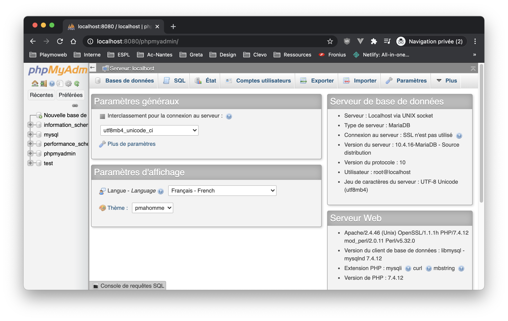

# Bart PHP et MySQL

Vous aviez une session… Et bien maintenant, nous allons mettre en place une base de données ! Celle-ci nous permettra de sauvegarder **de manière** persistante les données de vos utilisateurs.

## Première étape définir le besoin

Dans notre application nous souhaitons **enregistrer** les phrases saisies par les utilisateurs. Nous devons donc déterminer :

- Ce que nous allons sauvegarder (table)
- Les données que nous allons enregistrer (colonnes)
- Sous quel format (type de données)
- Les informations rattachées à « la phrase enregistré ». (relation)

::: tip C'est un métier la base de données
Concevoir une base de données est une chose qui peut-être complexe en fonction du projet. Il faut donc y passer du temps idéalement hors du code, voir même sur une feuille pour avoir les idées bien claires.
:::

## Concevoir le MCD

La première étape d'un développement avec une base de données est la conception d'un MCD. Le MCD va nous permettre de nous représenter visuellement l'ensemble des données ainsi que les relations entre les différentes tables.

Pour réaliser le MCD nous avons plusieurs solutions :

- Avec un papier et un crayon.
- [En ligne](https://dbdiagram.io/home)

Pour moi, dans notre cas nous allons avoir :

- Une table : **phrases**.
- 4 colonnes : **id**, **phrase**, **nombre**, **date**, **ip**.

Je vous laisse concevoir le MCD et déterminer le format des données.

::: details Voilà le résultat dans mon cas

:::

## Transformer le MCD en Base de données

En fonction de votre choix, nous avons deux solutions :

- Si vous avez choisi d'utiliser [dbdiagram.io](https://dbdiagram.io/home) celui-ci, intègre « le script SQL » permettant de générer la base de données (via _Export_).
- Si vous n'avez pas utilisé dbdiagram, nous allons utiliser l'interface de PhpMyAdmin pour créer notre base de données.

L'autre solution, c'est d'écrire à la main le script SQL permettant de créer la base de données. C'est complètement possible, et avec l'habitude c'est également très rapide !

### PhpMyAdmin

PhpMyAdmin est un outil qui va nous permettre d'administrer notre serveur de base de données. Celui-ci est intégré à votre serveur XAMPP, vu que c'est un site Internet il sera directement accessible par votre navigateur :

[Accéder à PHPMyAdmin](http://localhost/phpmyadmin/)

L'interface de PHPMyAdmin est découpée en 3 morceaux :

_La liste des bases de données_:

_Les actions possibles_:

_La partie centrale sera différente en fonction de la page / actions (contenu, création, etc)_:

::: tip Un instant
Avant d'aller plus loin, nous allons faire le tour ensemble de l'interface de phpMyAdmin. Pour découvrir quelques fonctionnalités.

👋 phpMyAdmin est très complet et permet de tout faire. **Mais** ce n'est pas le seul outil qui permet d'administrer une base de données, nous avons également :

- [MySQLWorkbench (gratuit)](https://www.mysql.com/fr/products/workbench/)
- [DataGrip (payant)](https://www.jetbrains.com/datagrip/features/)
- [DBeaver (gratuit)](https://dbeaver.io/)

D'ailleurs, je vous propose de tester DBeaver si ça vous dit.
:::

### Créer votre base de données & Table

Maintenant que vous avez fait le tour des fonctionnalités de PHPMyAdmin nous allons créer notre **première base de données** :tada:. Comme je l'expliquais pendant le cours, notre serveur contient des Bases de données qui peuvent contenir de une à plusieurs centaines de tables.

Nous allons donc devoir dans un premier temps **créer une base de données** (bart) puis **créer une table** (phrases).

Nous allons le faire ensemble pour la première fois, mais voilà en vidéo comment vous devez procéder :

<iframe width="560" height="315" src="https://www.youtube-nocookie.com/embed/i3A6yZQLTYQ" frameborder="0" allow="accelerometer; autoplay; clipboard-write; encrypted-media; gyroscope; picture-in-picture" allowfullscreen></iframe>

::: tip rappels

- Votre base de données doit se nommer : `bart`.
- Votre table doit se nommer : `phrases`.

:::

::: danger ATTENTION
Un projet === une base de données ! C'est comme les dossiers, ne mélanger pas tout. Et SURTOUT pas les données de différents sites.
:::

:hand: Au passage, regarder également avec DBeaver votre nouvelle base de données.

Attaquons maintenant la partie création de la table en elle-même. Vous allez voir c'est **très très simple**. Il suffit de saisir le nom de votre table dans le formulaire (je vous rappelle le nom de la table `phrases`).

Une fois validé, celui-ci va vous demander de saisir les différentes colonnes de la table comme définie dans votre MCD (d'où l'importance de bien le créer au début).

<iframe width="560" height="315" src="https://www.youtube-nocookie.com/embed/SIEdalKnjV0" frameborder="0" allow="accelerometer; autoplay; clipboard-write; encrypted-media; gyroscope; picture-in-picture" allowfullscreen></iframe>

Et voilà, votre table est maintenant créée nous allons pouvoir ajouter des données.

### Ajouter des données de tests

Nous allons faire les premières insertions de données via PhpMyAdmin, comme je le disais en introduction l'ensemble des actions possibles sont regroupées dans le menu en haut :

Je vous laisse créer vous les premières données (menu « Insérer »). Une fois créée celle-ci seront disponible dans le menu « Parcourir ».

**C'est à vous** !

### Écrire les requêtes

Avant d'attaquer la partie « PHP », je vous propose d'écrire dans un premier temps les différentes requêtes…

- Le SELECT (obtenir l'ensemble de données).
- l'INSERT (ajouter des données)

## Accéder à la BDD depuis le PHP

C'est la partie qui nous intéresse…

### db.php

Se connecter à la base de données.

### index.php

Récupérer les données

### bart.php

Ajouter les données
