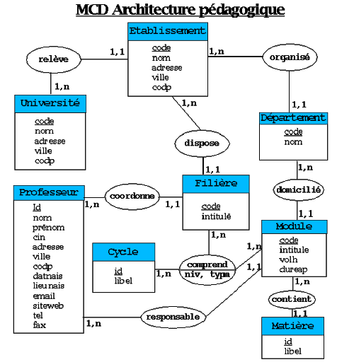
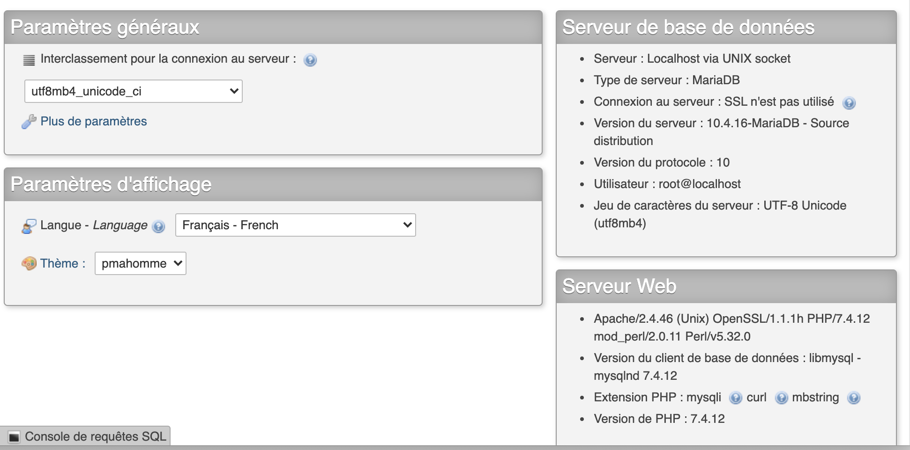
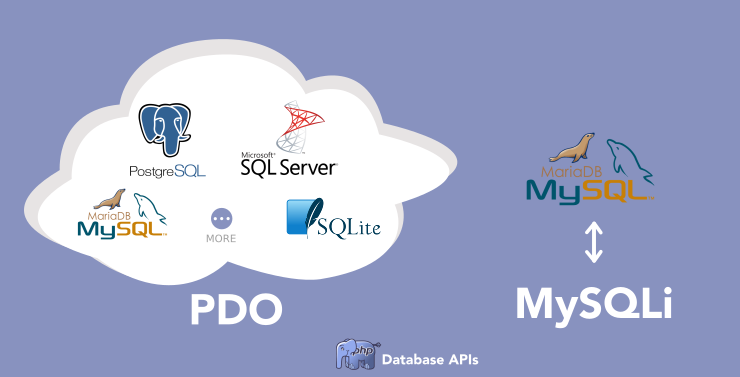

# Bart PHP et MySQL

Vous aviez une session… Et bien maintenant, nous allons mettre en place une base de données ! Celle-ci nous permettra de sauvegarder **de manière** persistante les données de vos utilisateurs.

## Première étape définir le besoin

Dans notre application nous souhaitons **enregistrer** les phrases saisies par les utilisateurs. Nous devons donc déterminer :

- Ce que nous allons sauvegarder (table)
- Les données que nous allons enregistrer (colonnes)
- Sous quel format (type de données)
- Les informations rattachées à « la phrase enregistré ». (relation)

::: tip C'est un métier la base de données
Concevoir une base de données est une chose qui peut-être complexe en fonction du projet. Il faut donc y passer du temps idéalement hors du code, voir même sur une feuille pour avoir les idées bien claires.
:::

## Concevoir le MCD

La première étape d'un développement avec une base de données est la conception d'un MCD. Le MCD va nous permettre de nous représenter visuellement l'ensemble des données ainsi que les relations entre les différentes tables.

Pour réaliser le MCD nous avons plusieurs solutions :

- Avec un papier et un crayon.
- [DBDiagram](https://dbdiagram.io/home)
- [draw.io](http://draw.io/)

Pour moi, dans notre cas nous allons avoir :

- Une table : **phrases**.
- 4 colonnes : **id**, **phrase**, **nombre**, **date**, **ip**.

Je vous laisse concevoir le MCD et déterminer le format des données.

::: details Voilà le résultat dans mon cas

:::

## Transformer le MCD en Base de données

En fonction de votre choix, nous avons deux solutions :

- Si vous avez choisi d'utiliser [dbdiagram.io](https://dbdiagram.io/home) celui-ci, intègre « le script SQL » permettant de générer la base de données (via _Export_).
- Si vous n'avez pas utilisé dbdiagram, nous allons utiliser l'interface de PhpMyAdmin pour créer notre base de données.

L'autre solution, c'est d'écrire à la main le script SQL permettant de créer la base de données. C'est complètement possible, et avec l'habitude c'est également très rapide !

### PhpMyAdmin

PhpMyAdmin est un outil qui va nous permettre d'administrer notre serveur de base de données. Celui-ci est intégré à votre serveur XAMPP, vu que c'est un site Internet il sera directement accessible par votre navigateur :

[Accéder à PHPMyAdmin](http://localhost/phpmyadmin/)


L'interface de PHPMyAdmin est découpée en 3 morceaux :

_La liste des bases de données_:


_Les actions possibles_:


_La partie centrale sera différente en fonction de la page / actions (contenu, création, etc)_:



::: tip Un instant
Avant d'aller plus loin, nous allons faire le tour ensemble de l'interface de phpMyAdmin. Pour découvrir quelques fonctionnalités.

👋 phpMyAdmin est très complet et permet de tout faire. **Mais** ce n'est pas le seul outil qui permet d'administrer une base de données, nous avons également :

- [MySQLWorkbench (gratuit)](https://www.mysql.com/fr/products/workbench/)
- [DataGrip (payant)](https://www.jetbrains.com/datagrip/features/)
- [DBeaver (gratuit)](https://dbeaver.io/)

D'ailleurs, je vous propose de tester DBeaver si ça vous dit.
:::

### Créer votre base de données & Table

Maintenant que vous avez fait le tour des fonctionnalités de PHPMyAdmin nous allons créer notre **première base de données** :tada:. Comme je l'expliquais pendant le cours, notre serveur contient des Bases de données qui peuvent contenir de une à plusieurs centaines de tables.

Nous allons donc devoir dans un premier temps **créer une base de données** (bart) puis **créer une table** (phrases).

Nous allons le faire ensemble pour la première fois, mais voilà en vidéo comment vous devez procéder :

<iframe width="560" height="315" src="https://www.youtube-nocookie.com/embed/i3A6yZQLTYQ" frameborder="0" allow="accelerometer; autoplay; clipboard-write; encrypted-media; gyroscope; picture-in-picture" allowfullscreen></iframe>

::: tip rappels

- Votre base de données doit se nommer : `bart`.
- Votre table doit se nommer : `phrases`.

:::

::: danger ATTENTION
Un projet === une base de données ! C'est comme les dossiers, ne mélanger pas tout. Et SURTOUT pas les données de différents sites.
:::

:hand: Au passage, regarder également avec DBeaver votre nouvelle base de données.

Attaquons maintenant la partie création de la table en elle-même. Vous allez voir c'est **très très simple**. Il suffit de saisir le nom de votre table dans le formulaire (je vous rappelle le nom de la table `phrases`).


Une fois validé, celui-ci va vous demander de saisir les différentes colonnes de la table comme définie dans votre MCD (d'où l'importance de bien le créer au début).

<iframe width="560" height="315" src="https://www.youtube-nocookie.com/embed/SIEdalKnjV0" frameborder="0" allow="accelerometer; autoplay; clipboard-write; encrypted-media; gyroscope; picture-in-picture" allowfullscreen></iframe>

Et voilà, votre table est maintenant créée nous allons pouvoir ajouter des données.


::: danger Je vous invite…
Je vous invite à chaque fois à regarder les requêtes générées par phpMyAdmin se sont les mêmes que vous pouvez écrire vous-même.
:::

### Ajouter des données de tests

Nous allons faire les premières insertions de données via PhpMyAdmin, comme je le disais en introduction l'ensemble des actions possibles sont regroupées dans le menu en haut :


Je vous laisse créer vous les premières données (menu « Insérer »). Une fois créée celle-ci seront disponible dans le menu « Parcourir ».

::: danger Je vous invite…
Je vous invite à chaque fois à regarder les requêtes générées par phpMyAdmin se sont les mêmes que vous pouvez écrire vous-même, et que nous devrons écrire dans notre code PHP.
:::

**C'est à vous** !

### Écrire les requêtes

Avant d'attaquer la partie « PHP », je vous propose d'écrire dans un premier temps les différentes requêtes…

- Le SELECT (obtenir l'ensemble de données).
- l'INSERT (ajouter des données)

::: tip Rappels
Le SQL est un langage très puissant, il permet de faire énormément de choses. Nous sommes ici dans une introduction nous allons donc faire quelques requêtes simples seulement. L'idée étant « juste » de mettre en pratique.
:::

::: details En manque d'idée ?

### Le SELECT

```sql
SELECT * FROM phrases;
```

### L'INSERT

```sql
INSERT INTO phrases (phrase, nombre, date, ip) values('Ceci est ma phrase', 1000, 1609533688, '217.23.34.49');
```

:::

## Accéder à la BDD depuis le PHP

C'est la partie qui nous intéresse… Nous allons maintenant écrire le code qui va nous permettre d'accéder à la base de données. En PHP, nous avons à notre disposition plusieurs connecteurs SQL (API).

- mysql\_\* (déprécié, n'existe plus, mais vous trouverez encore peut-être des exemples en ligne **à éviter**)
- MySQLi (le remplacement de mysql\_\*)
- PDO (PDO_MySQL)

Nous avons donc deux possibilités, la différence entre les deux ? Il y en a plusieurs, mais PDO à un grand avantage c'est qu'il permet de changer simplement de base de données (via des connecteurs pour MariaDB, Oracle, …). À mon avis **PDO** est doit-être votre choix par défaut dans le cas d'un nouveau projet.



Nous allons travailler intelligemment, nous allons utiliser les includes et les variables pour éviter de mettre le code de la connexion à la base de données dans chaque page de notre site.

Nous allons également « sortir » / « mettre » en variables les informations de connexion à notre base de données à savoir :

- l'IP du serveur de base de données.
- Le login.
- Le mot de passe.
- Le nom de la base de données

:fire: L'organisation est très importante ! Cette étape de « découpage » peut paraitre superflue, mais c'est là où se jouera votre réussite.

### utils/db.php

Nous allons écrire dans ce fichier le code nous permettant de nous connecter à la base de données. Cette partie du code est fournie directement dans la documentation PHP… Comme je suis sympa, je vous fournis directement le code :

```php
// Cette partie est à customiser
$server = "localhost";
$db = "bart";
$user = "root";
$passwd = "";
// Fin de la partie customisable

// Cette partie est générique à l'ensemble de vos projets utilisant une base de données.
$dsn = "mysql:host=$server;dbname=$db";
$pdo = new PDO($dsn, $user, $passwd);
```

:fire: Et c'est tout ! Voilà, si vous utilisez un `include` du fichier `utils/db.php` votre code sera connecté à la base de données et vous pourrez réaliser des requêtes SQL.

::: tip Nous avons écrit une `lib`
Ce que vous venez d'écrire est une « librairie », vous allez pouvoir réutiliser ce code autant de fois que vous le souhaitez. Il est générique, vous n'avez plus qu'à le « copier / coller » dans vos différents projets nécessitant une base de données.
:::

C'est à vous, je vous laisse écrire le code dans votre projet.

### home.php

Dans votre page d'accueil, vous avez actuellement un formulaire, nous allons ajouter « en plus », une liste des phrases précédemment écrite par les utilisateurs. Nous allons donc utiliser la requête de type `SELECT` qui nous retourne l'ensemble des informations présentes dans la base de données.

Avec PDO, faire ce genre d'opération va se résumer à 3 lignes de code :

```php
// DANS l'index.php
// ATTENTION ATTENTION : Cette ligne ne doit être mise qu'une seule fois.
include('./utils/db.php');

// Dans home.php
// Requêtes SQL que nous souhaitons jouer.
$results = $pdo->query("SELECT * FROM phrases")->fetchAll(\PDO::FETCH_ASSOC);
```

::: tip `$results`
La variable `$results` va contenir une structure semblable à :

```text
Array
(
    [0] => Array
        (
            [phrase] => "Ceci est ma phrase"
            [nombre] => 1000
            [date] => 1609536464
            [ip] => "127.0.0.1"
        )
)
```

:::

Je vous laisse mettre en place le code dans votre projet plus précisément dans le fichier `index.php`. Nous allons procéder avec logique :

- Mettre le code tel quel dans la page.
- Afficher le contenu de la variable `$results` avec un `print_r($results);` (**POUR TESTER SEULEMENT**).
- Parcourir les résultats et les afficher dans un `<select></select>` dans la page en utilisant une boucle de type `foreach`.

C'est à vous.

### bart.php

Dans la page `bart.php` celle qui affiche le tableau, nous allons mettre en place le code nous permettant d'ajouter des données dans la base de données. Je vous donne le code vous permettant d'ajouter une entrée en base de données.

::: tip
Nous allons utiliser une requête de type « préparé ». Cette requête est particulier, elle est « sécurisée », c'est-à-dire que normalement il n'est pas possible de « forcer » l'ordinateur à exécuter autre chose que ce que vous aviez prévu.
:::

Attention, je ne vous donne que ça. Je vous laisse écrire le code au bon endroit :

```php

// ATTENTION ATTENTION : Cette ligne ne doit être mise qu'une seule fois.
include('./utils/db.php');

$sql = "INSERT INTO phrases (phrase, nombre, date, ip) values(?, ?, ?, ?);";
$stmt= $pdo->prepare($sql);
$stmt->execute([$phrase, $nombre, time(), $_SERVER['REMOTE_ADDR']]);
```

:fire: Je vous laisse écrire le code au bon endroit. C'est à vous.

## Évolution

Ajouter une nouvelle page dans votre site. Celle-ci doit :

- Respecter le design actuel.
- Afficher les valeurs actuellement en base à l'aide d'un tableau.
- Votre tableau doit être paginé (LIMIT, OFFSET) via la requête SQL.

C'est à vous.
