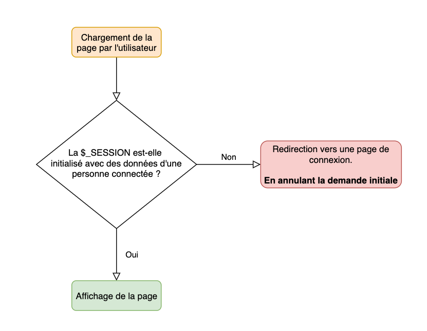
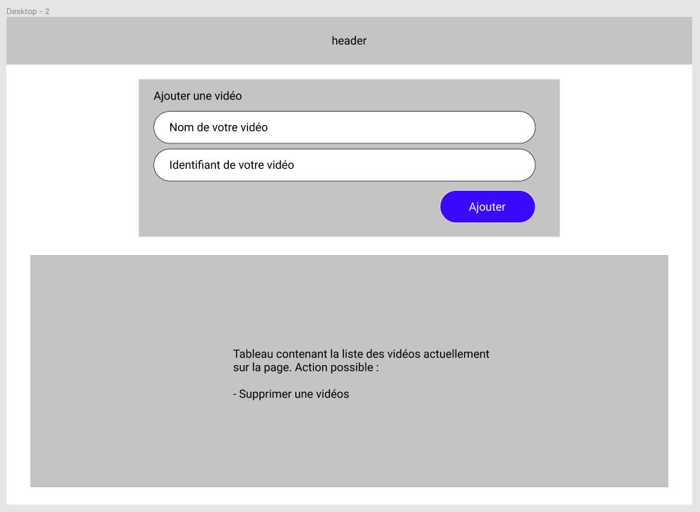

# Greta TV - Administrable

Dans ce TP nous allons mettre en pratique nos connaissances autour de la base de données. Nous allons mettre en place une base de données nous permettant de rendre administrable :

- La liste des vidéos.
- Le thème en fonction de la vidéo.

## Première étape définir le besoin

La première étape dans tous les projets est la définition du besoin. Vous devez avec la personne qui vous demande une mission comprendre ce qu'il attend (moi en l'occurence dans ce projet). Je souhaite donc rendre administrable l'application Greta TV.

En effet, la première version de l'application est statique, nous avons utilisé le PHP pour intégrer des vidéos dans une page nommée `tv.php`. Cette page prend en paramètre un identifiant de vidéo, et potentiellement un thème si vous aviez intégré cette fonctionnalité.

Je souhaite que nous allions plus loin ! Notre application doit maintenant être administrable afin de rendre la liste des vidéos sur la page `index.php` dynamique en fonction **de données présentes en base de données**. En plus de cette interface dynamique, je souhaite que vous ajoutiez une page d'administration permettant l'ajout de lien dans la base de données.

Je résume voilà le besoin à intégrer :

- Création d'une base de données avec la liste des liens à afficher.
- Utilisation de la base de données sur la page d'accueil.
- Utilisation de la base de données sur la page `tv.php` pour ne plus utiliser l'ID Google, mais l'identifiant interne de la vidéo à voir.
- Création d'une page « d'admin » permettant l'ajout de vidéo. (Cette page ne sera pas accessible à tous)

## Créer le MCD

La première étape avant de commencer la création de la base de données est la réalisation du MCD. Je vous laisse travailler sur le sujet. Pour ma part j'ai défini **deux tables**.

::: tip N'oubliez pas
N'oubliez pas les clés ! Un enregistrement de base de données **doit posséder une clé unique** (idéalement autogénéré comme vu ensemble).
:::

C'est à vous ! Je vous laisse travailler le sujet.

## Créer la base de données

Maintenant que votre modèle de base de données est réalisé, nous allons passer à la création de la base de données à partir du MCD. Pour cette étape vous avez deux possibilités :

- Via phpMyAdmin
- Via dbeaver

Je vous laisse travailler. Je vous rappelle que **vous devez mettre des clés** pour vos enregistrements comme définis dans votre MCD.

::: tip
Pour valider votre base de données, je vous laisse créer des données fictives. Réaliser cette opération directement via phpMyAdmin (ou dbeaver).
:::

## Insérer un jeu de test

Pour commencer nous allons insérer des données.

::: danger LES MOT NE DOIVENT PAS ÊTRE EN CLAIR
Vous ne devez **JAMAIS** avoir un mot de passe en clair en base de données.

Vous pouvez par exemple utiliser la fonction SQL `SHA2("VotreMotDePasse-SALT-SECRET", 512)`. Cela génèrera un mot de passe « hasher » équivalent au mot de passe.

Exemple d'insertion :

```sql
INSERT INTO table ('user', 'password') VALUES ("valentin", SHA2("VotreMotDePasse-SALT-SECRET", 512));
```

Exemple de vérification si l'utilisateur existe :

```sql
SELECT * FROM table WHERE user = "valentin" AND password = SHA2("VotreMotDePasse-SALT-SECRET", 512);
```

S’il y a un résultat, c'est que votre utilisateur existe et a fourni le bon mot de passe.

:::

## Créer la page « d'administration ».

Afin de créer cette page d'administration, nous allons avoir besoin d'une page de connexion. En effet l'administration du site ne doit pas être ouverte à tous, seuls les gens possédant un compte peuvent administrer la liste des vidéos.

La page devant être protégée, vous devez mettre en place une mécanique comme :



### Étape 1 : Création de la page de connexion

En vous inspirant de [l'aide mémoire PHP](/cheatsheets/php/#gestion-basique-d-une-authentification-«-simple-»), je vous laisse écrire le code permettant :

- D'afficher le formulaire de saisie des informations.
- Vérifier que les édentant saisie sont correctes.
- Redirigé vers la page de gestion de vidéos (`header('location: …');`)

👹 N'oubliez pas l'organisation 👹 (nous allons ici créer que la `page` faisant le traitement).

::: details Vous séchez pour la partie requête SQL ?

Pour valider l'authentification, vous devez écrire quelque chose comme :

```php
<?php
    // Vérification si l'utilisateur existe
    $stmt= $pdo->prepare("SELECT * FROM users WHERE login=? AND password=SHA2(?, 512)");
    $res = $stmt->execute([$_POST['login'], $_POST['password']]);
    $users = $res->fetchAll(\PDO::FETCH_ASSOC);

    // La personne existe en base de données (nous allons donc la connecter)
    if(count($users) == 1){
        // Réussite de la connexion, on sauvegarde dans la SESSION les informations.
        $_SESSION['user'] = $users[0]; // Sauvegarde le premier utilisateur
        header("location: / ");
        die();
    } else {
        // Action en cas d'echec de connexion
    }
?>
```

:::

### Étape 2 : Crééer la page de gestion des vidéos

Pour la page de gestion des vidéos, je vous propose de réaliser une page ressemblant à ceci :



Commencer par la réalisation de la page en HTML. Nous ajouterons par la suite les requêtes SQL.

## Modifier la page d'accueil pour utiliser la base de données

Modifier la page d'accueil de votre site afin de réaliser la requête SQL permettant de récupérer l'ensemble des vidéos présentes en base de données. Utiliser le résultat afin d'afficher les vidéos.

::: details Vous séchez ?

```php
<?php
    include('./utils/db.php');
    $results = $pdo->query("SELECT * FROM videos")->fetchAll(\PDO::FETCH_ASSOC);

    // $results contient maintenant l'ensemble de vos vidéos présent en base de données. Pour l'afficher, il vous suffit de faire une boucle.
?>
```

:::

## Modifier la page `tv.php` pour utiliser la base de données

Pour cette étape vous avez deux solutions :

- Ne rien modifier, et continuer à utiliser l'ID de YouTube comme identifiant (**ATTENTION**, votre code est donc vulnérable à l'injection de paramètres !!).
- Modifier, pour passer l'identifiant **interne** de la vidéo que vous souhaitez afficher. Cet identifiant vous permettra de faire une requête du type :

```php
<?php
    $stmt= $pdo->prepare("SELECT * FROM videos WHERE id = ?");
    $res = $stmt->execute([$_GET['id']]);
    $videos = $res->fetchAll(\PDO::FETCH_ASSOC);

    // La vidéo demandé n'existe pas.
    if(!$videos){
        // On redirige l'utilisateur vers la home
        header('location: ./');
        die();
    }

    // VOTRE CODE d'AFFICHAGE DE LA VIDÉO

    // $current contient les informations de la vidéo à afficher
    $current = $video[0];
?>
```

C'est à vous !
