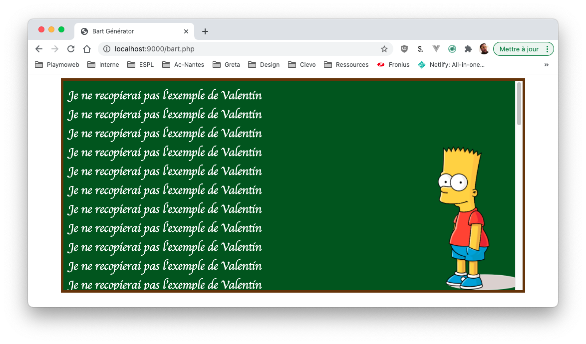

# Le générateur de Bart

Le meilleur moyen de comprendre les boucles. C'est d'en écrire par soi-même. Je vous propose de créer votre propre générateur de Bart.

## Introduction

Nous allons mettre en application les boucles en PHP. Bon je ne vais pas vous demander de recopier 100× une phrase au tableau… Mais je vais demander à votre ordinateur de le faire avec une boucle `while` ou `for`.

Dans ce TP nous allons utiliser les boucles, mais surtout nous allons regarder comment le faire « pas trop salement »

## La structure

Avant d'attaquer le code, regardons un peu ce que je vous demande. Je vous propose de reproduire le résultat suivant :



### Définir les éléments nécessaires

Malheureusement vous n'avez pas au code. Mais seulement à une maquette du rendu final. Il faut donc interpréter, regarder, obtenir les éléments nécessaires à la réalisation de la page. Si on regarde il y a :

- Une image de Bart sur fond transparent (à chercher sur Internet)
- Un fond vert avec une bordure de quelques pixels marron.
- L'image de bart semble être un `background-image` placé en CSS.
- Le texte est assez gros avec une police personnalisée.
- Le tableau semble être d'une largeur fixe centré dans la page (`margin: auto`).

### Définir la structure HTML et CSS

Maintenant que nous avons défini les éléments nécessaires il faut déterminer la structure de la partie HTML + CSS, à première vue je dirais :

- Une page HTML non-responsive.
- Une feuille de style.
- Le « tableau de bart » sera très certainement une `<div>` avec dedans une boucle `while` ou `for` écrite en PHP.

### Définir les éléments du code PHP

Notre code PHP sera certainement très simple. Je vois à première vue :

- Une variable `$nb_ligne` qui sera le nombre total de lignes à afficher.
- Une variable `$phrase` qui est la phrase à afficher dans le « tableau ».
- Une boucle `while` ou `for`.

## Réalisation

Voilà… Nous avons vu les éléments nécessaires… C'est à vous. Je vous laisse réaliser la page en question

::: tip N'oubliez pas
Votre IDE vous aide. N'oubliez pas de le configurer pour automatiser certaines de vos actions.
:::

## Évolution

Passer en paramètre `GET` le nombre de ligne à écrire dans la page :

_Exemple :_

Pour la page avec un lien comme : `http://localhost/bart/index.php?nb=1000`

```php
$nombre = $_GET['nb'];
```

::: danger Attention
Ne pas oublier de gérer le cas si pas de paramètre (avec un IF).

```php
$nombre = 100;
if(isset($_GET['nb'])){
    $nombre = $_GET['nb'];
}
```

:::

## La suite

Nous reviendrons sur cette base de TP plus tard pour y ajouter :

- Une fonction.
- Des includes.
