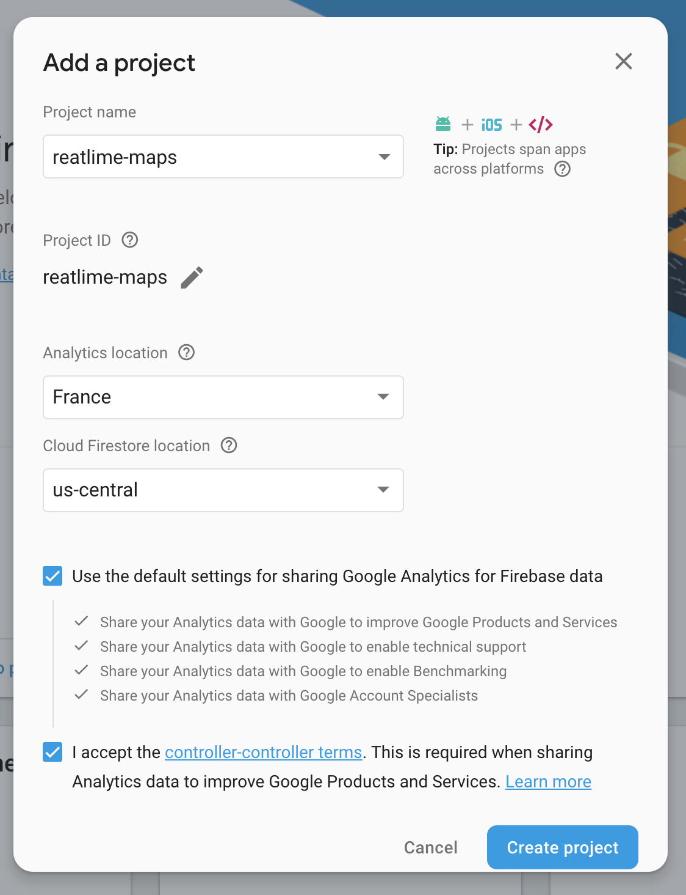
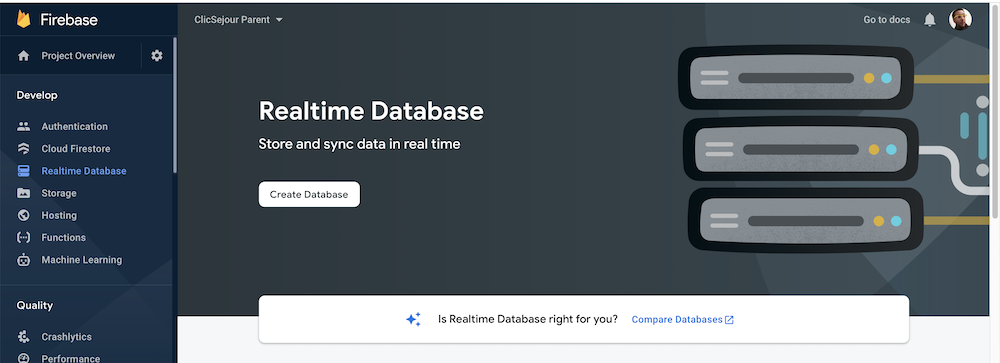
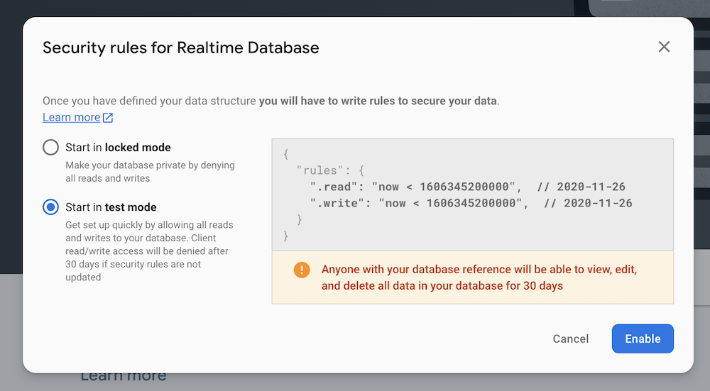
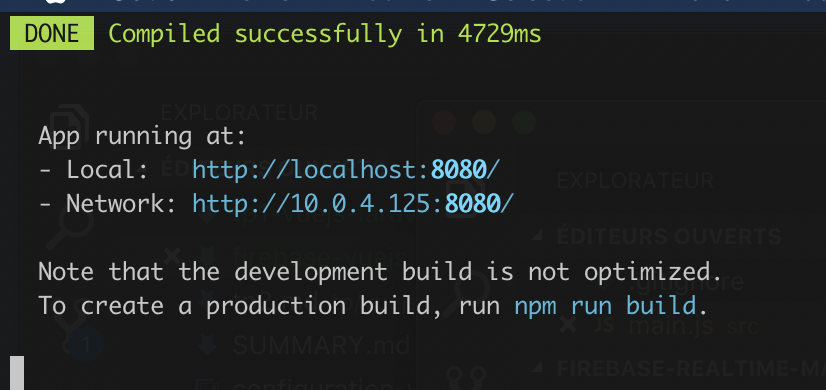

# Firebase + Vuejs

Dans ce TP nous allons découvrir Firebase RealtimeDB (base de données temps réel). Nous allons coupler cette base de données temps réel à la puissance de VueJS pour obtenir en un rien de temps une application web surpuissante.

## Introduction

Nous allons mettre en place une carte du monde qui affiche en temps réel l'emplacement des utilisateurs qui interagissent avec la carte. Mais nous pourrions également afficher les personnes présentes sur votre site.


## La mise en place

Nous allons utiliser VueCLI pour initialiser le projet, première étape l'installation.

## Installer NodeJS + VueCLI

Avant de commencer, nous allons avoir besoin de plusieurs outils :

- NodeJS
- VueCli

## NodeJS

La première étape va être l’installation de NodeJS, la démarche est différente en fonction de votre environnement, mais pour résumer [sous Windows c’est ici](https://nodejs.org/en/download/) prendre la version CURRENT, sous OSX le plus simple c’est via Brew `brew install nodejs`, et sous Linux c’est via le gestionnaire de paquet `apt install nodejs`

Une fois installé, vous êtes prêt, votre PC est prêt à accueillir l’outil Vue-Cli.

## Vue-Cli

Vue-Cli est un outil qui simplifie la création d’un nouveau projet Vue-JS à partir de template fourni par la communauté.

Dans un terminal lancer la commande suivante dans le `Node.js Command Prompt` :

```bash
npm install -g @vue/cli
```

Maintenant que vue-cli est installé, vous avez à votre disposition sur votre ordinateur une nouvelle commande, la commande `vue`.

Pour créer un nouveau projet, c’est simple il suffit de lancer la commande suivante dans le `Node.js Command Prompt`.

## Initialiser le projet

La création d'un nouveau projet est très simple. Il suffit de rentrer la commande suivante :

```js
vue create firebase-vuejs
```

Choisir l'option « Default ».

🤓 git est déjà initialisé, vous pouvez en profiter pour pusher votre code sur Github / Gitlab.

### Questions

- Pourquoi git est déjà initialisé ?
- Allez jeter un coup d'œil au fichier `.gitignore`

## Tester

Le projet initialisé par `Vue-Cli` est immédiatement fonctionnel. Testez-le en saisissant :

```js
npm run serve
```


## Les dépendances

Maintenant que notre projet est « initialisé », nous allons avoir besoin de quelques dépendances NPM pour faire fonctionner notre projet. Notre projet va utiliser les technologies suivantes :

- firebase
- leaflet

Firebase comme vous le savez va nous servir de système de base de données. [Leaflet](http://leafletjs.com/) quant à lui est une librairie qui va nous permettre d'afficher très rapidement une carte sur notre site internet.

### Ajouter les dépendances

Les deux outils / librairies que nous allons utiliser sont disponibles via NPM, nous allons donc les installer / ajouter au projet via les commandes suivantes :

```bash
npm install firebase leaflet vue2-leaflet --save
```

### Configuration de la dépendance carte

Certains plugins nécessitent de la configuration supplémentaire, ça sera le cas pour Vue2-Leaflet (et Firebase). Comme vous, je ne connais pas la configuration de l'ensemble des dépendances existantes. Première étape :

- [Lire la documentation sur le site de Vue2-Leaflet](https://vue2-leaflet.netlify.app/quickstart/)

Maintenant que nous avons vu comment s'intègre le Leaflet, réfléchissons comment intégrer ça dans notre projet :

- À l'arrache dans le fichier `main.js` ? ✋ => NON
- Dans un dossier `plugins` => 👍 Oui

À votre avis pourquoi ?

### Création de la partie plugin

Créer le fichier `src/plugins/vue2-leaflet.js` y mettre dedans :

```js
import { Icon } from "leaflet";
import "leaflet/dist/leaflet.css";

// this part resolve an issue where the markers would not appear
delete Icon.Default.prototype._getIconUrl;

Icon.Default.mergeOptions({
  iconRetinaUrl: require("leaflet/dist/images/marker-icon-2x.png"),
  iconUrl: require("leaflet/dist/images/marker-icon.png"),
  shadowUrl: require("leaflet/dist/images/marker-shadow.png"),
});
```

- D'où vient le code ?

### Déclarer le plugin

Maintenant que la configuration du « plugin » est effective nous devons le déclarer dans notre fichier `main.js` pour ça rien de compliquer.

Ajouter l'import :

```js
import "./plugins/vue2-leaflet";
```

🤓 Avec les autres imports déjà existants.

### Questions

- Pourquoi l'import est-il nécessaire ?
- Pourquoi vue2-leaflet et pas juste leaflet ?

### Dépendance supplémentaire

Le gros avantage de NPM (et de NodeJS) c'est la quantité de librairies disponibles pour répondre à un besoin, nous allons donc en profiter pour gagner du temps dans notre réalisation.

Firebase est plutôt simple à utiliser, mais nativement celle-ci ne s'intègre pas directement avec le « state » d'un composant VueJS! Mais grâce à d'excellents développeurs c'est maintenant possible et très simplement. Pour ça nous allons utiliser :

- [Vuefire](https://vuefire.vuejs.org/)

```bash
npm install vuefire --save
```

⚠️ Dans une prochaine étape, nous allons configurer Vuefire. Pour l'instant le package est disponible, mais non actif.

🤓 Je vous invite quand même à aller voir [la documentation](https://github.com/vuejs/vuefire/tree/v1) de VueFire pour voir de quoi il en retourne !

## Création du projet sur Firebase

Maintenant que nos dépendances sont installées et que notre projet est initialisé, nous allons configurer le projet sur Firebase :

Première étape [créer le projet sur le site de Firebase](https://console.firebase.google.com/u/0/)



Maintenant que le projet est créé, nous allons récupérer la configuration :


Nous allons récupérer une partie du code fourni… Nous allons prendre la configuration (dans mon cas) :

```js
// Initialize Firebase
var config = {
  apiKey: "✋-CHANGE-CHANGE-CHANGE-CHANGE-✋",
  authDomain: "reatlime-maps.firebaseapp.com",
  databaseURL: "https://reatlime-maps.firebaseio.com",
  projectId: "reatlime-maps",
  storageBucket: "reatlime-maps.appspot.com",
  messagingSenderId: "✋✋✋✋✋✋✋✋",
};

export default config;
```

Nous allons mettre le code dans le fichier `src/config/firebase.js` ⬅️

⚠️ ✋ Attention à bien changer la valeur de `apiKey` et `messagingSenderId`. ✋ ⚠️

BRAVO ! Votre projet est maintenant capable de « se connecter » avec Firebase !

### Questions

- Et la sécurité ? À votre avis comment ça fonctionne ?
- Est-il possible de faire autrement ?

## Activer la Realtime DB

Dans l'interface de Firebase activez la Realtime DB.





## Modification du code pour inclure la configuration Firebase

Maintenant que nous avons ajouté la configuration, nous devons la déclarer dans notre code. Comme pour Vue2-Leaflet nous allons ajouter un fichier de « configuration du plugin » dans le dossier `src/plugins/` ajouter un fichier nommé `firebase.js` avec le contenu suivant :

```js
import firebaseConfig from "../config/firebase";
import firebase from "firebase/app";
import "firebase/database";
import Vue from "vue";

const firebaseApp = firebase.initializeApp(firebaseConfig);
const db = firebaseApp.database();

Vue.prototype.$db = db;
```

Comme pour leaflet, ajouter un import dans le fichier `main.js` pour référencer notre « configuration de plugin » :

```js
import "./plugins/firebase";
```

### Questions

- Que fait le code ?
- Comment connaitre les autres options ?
- Vue.prototype ? Kézako ? On en parle !

## Testons

Bien maintenant, que nous avons mis en place les bases de notre projet, testons si celui-ci fonctionne correctement. Pour ça (dans un terminal) :

```bash
npm run serve
```

Après quelques secondes de compilation (pré-processing) vous devriez avoir sur votre écran :



Et dans votre navigateur toujours la même chose à savoir :


## Création de notre première vue / composant.

Notre projet est maintenant prêt à recevoir son premier `.vue` bien à vous. Toujours dans le but d'organiser son travail nous allons commencer par créer un dossier :

- `src/views/`

Ce dossier nous servira à ranger l'ensemble de nos vues, pour l'instant nous allons créer une vue nommée `map.vue` ce fichier contiendra le code source de notre carte.

Créer le fichier `src/views/map.vue` avec le contenu suivant :

```vue
<template>
  <l-map id="map" :zoom="zoom" :center="center">
    <l-tile-layer :url="url"></l-tile-layer>
  </l-map>
</template>

<script>
import { LMap, LTileLayer, LMarker, LControl } from "vue2-leaflet";

export default {
  name: "myMap",
  data() {
    return {
      url: "http://{s}.tile.osm.org/{z}/{x}/{y}.png",
      zoom: 13,
      center: [47.472092, -0.550589],
    };
  },
  components: {
    LMap,
    LTileLayer,
    LMarker,
    LControl,
  },
  methods: {},
};
</script>

<style scoped>
#map {
  height: 100%;
  width: 100%;
}
</style>
```

✋ D'où vient le code ? Tout simplement une adaptation du [code de démonstration fourni par Vue2-Leaflet](https://vue2-leaflet.netlify.app/components/LMap.html)

## Utiliser notre première vue

Créer la vue ne déclenche rien, il faut maintenant l'importer. Comme vu en cours, la « base » de notre application est répartie entre deux fichiers :

- le main.js : qui contient les imports de base et la déclaration de notre objet `.vue`.
- l'App.vue : qui contient la « racine » de notre HTML (c'est dans celui-ci que nous allons référencer notre nouvelle vue / composant).

Modifier le `App.vue` par :

```vue
<template>
  <div class="container">
    <myMap />
  </div>
</template>

<script>
import myMap from "./view/map.vue";

export default {
  name: "app",
  components: {
    myMap,
  },
};
</script>

<style>
html,
body,
#container {
  margin: 0;
  padding: 0;
  height: 100%;
  width: 100%;
}
</style>
```

### Questions

- Quelles sont les différences ?
- Pourquoi le CSS n'est pas `scoped` ?
- À quoi correspond `components` ?

## Tester

Votre projet doit maintenant afficher une carte, tester rapidement via la commande :

```bash
npm run serve
```


## Configurer VueFire

Comme pour Vue2-Leaflet et firebase, VueFire nécéssite une déclaration pour être utilisé dans le projet.

- [Lire la documentation](https://vuefire.vuejs.org/).
- Créer le fichier dans le dossier `plugins`.
- Réaliser l'import dans le fichier `main.js`.

<Reveal text="Voir la solution">

`src/plugins/vuefire.js`

```js
import Vue from "vue";
import { rtdbPlugin } from "vuefire";

Vue.use(rtdbPlugin);
```

`main.js`

```js
// […]
import "./plugins/vuefire";

// […]
```

::: tip
Et voilà ! Votre base RealtimeDB est accessible !
:::

</Reveal>

## Connecter Firebase à notre vue

Grâce au plugin l'intégration de Firebase va être très simplifiée. Déjà vous avez mis en place Firebase et injecter le connecteur de base de données grâce au « plugin » et « Vue.prototype », nous allons devoir l'utiliser. Pour ça, modifiez le fichier `maps.vue` pour ajouter (après name) :

```js
firebase() {
  return {
    markerList: this.$db.ref("/markerList/")
  };
}
```

Ajouter également dans les `data` de votre composant une variable nommée `markerList` avec comme valeurs `[]`.

```js
markerList: [];
```

### Questions :

- D'où vient `this.$db` ?
- À quoi correspond le `/markerList/` ?

Et c'est tout ! Vous avez maintenant dans votre objet vue une nouvelle variable de disponible `markerList` celle-ci est synchronisée avec votre base de données temps réel (Firebase RealtimeDB).

## Manipuler la base RealtimeDB

La manipulation de la base RealtimeDB va se faire via l'objet `this.$firebaseRefs`. Voilà l'ensemble des actions possibles :

### Ajouter une nouvelle entrée :

```js
this.$firebaseRefs.markerList.push(/*…*/);
```

### Modifier une entrée :

```js
this.$firebaseRefs.markerList[0].update(/*...*/).then(() => {
  console.log("Marker updated!");
});
```

::: tip

- `0` étant l'index de l'élément à modifier.
- `/* ... */` étant le nouveau contenu, par exemple `[0, 0]`

:::

### Supprimer un élément :

```js
this.$firebaseRefs.markerList.child(identifiant).remove();
```

::: tip
`identifiant` étant la clé unique représentant votre élément en base.
:::

[Plus de détail ici sur la documentation](https://vuefire.vuejs.org/vuefire/writing-data.html#updates-to-collection-and-documents)

## Ajouter un marker

Pour ajouter un marker sur la carte nous allons utiliser la directive `@stop` sur l'objet `l-map` :

- Ajouter sur l'objet `<l-map>` la directive suivante `@click="addMarker"`.
- Ajouter la méthode `addMarker` dans les méthodes de votre objet VueJS `addMarker(position){…}` .
- À votre avis à quoi doit ressembler le code ?
- Ajouter un `console.log(marker)` avez-vous une propriété `latlng` ?

<Reveal text="Voir la solution">

```js
addMarker(position) {
  this.$firebaseRefs.markerList.push([
    position.latlng.lat,
    position.latlng.lng
  ]);
},
```

</Reveal>

## Tester

- Ouvrer la [console de Firebase](https://console.firebase.google.com/) rendez-vous dans la partie `Database`.
- Lancer votre projet local `npm run serve`.
- Cliquer sur la carte.
- Que constatez-vous ?

## Afficher les markers

Les markers ne s'affichent pas ? C'est normal! Pour l'instant nous n'avons pas mis le code permettant de les afficher. C'est l'étape à laquelle nous sommes.

La logique va être simpliste, nous devons afficher TOUS les éléments contenus dans la variable `markerList` déclarée précédemment.

Les étapes :

- Utilisation de [l-marker](https://korigan.github.io/Vue2Leaflet/#/components/l-marker/)
- Le mettre en place dans le `l-map` en suivant la documentation.
- Mise en place d'une boucle v-for.
- et… c'est tout
- Essayer sans regarder la solution.

<Reveal text="Voir la solution">

Le marker est à mettre dans le `l-map`.

```html
<l-marker
  v-for="(marker,i) in markerList"
  :key="i"
  :lat-lng="marker"
></l-marker>
```

</Reveal>

## Tester

Toujours avec `npm run serve`, normalement des markers doivent s'afficher. Tenter d'en ajouter d'autres.

## Suppression d'un marker

Bon maintenant qu'il y a plein de marker partout nous allons mettre en place le code pour les supprimer ! Voilà la procédure à suivre :

- Ajout d'une méthode `removeMarker`

```js
removeMarker(markerKey) {
  this.$firebaseRefs.markerList.child(markerKey).remove();
},
```

- Ajouter la directive sur `l-marker` :

<Reveal text="Voir la solution">

```html
@click="() => removeMarker(marker['.key'])"
```

</Reveal>

## Tester

Tenter de supprimer un marker en cliquant dessus.

## Tester à plusieurs

Accéder à plusieurs au même projet (via votre IP) pour tester la synchronisation.

## Centrer la carte sur votre position

Profitons des nouvelles fonctionnalités de nos navigateurs pour améliorer notre carte. Actuellement la carte est centrée sur Angers… C'est pratique… Si on se trouve à Angers… dans tous les autres cas, ce n’est pas forcément adapté. Nous allons donc utiliser l'API `geolocation` de notre navigateur.

Celle-ci permet de localiser une personne en fonction de sa connexion internet (ou GPS / Réseau téléphonique si disponible)

- [Documentation de l'API geolocation](https://developer.mozilla.org/en-US/docs/Web/API/Geolocation_API).
- Ajouter une méthode dans le code dans le composant `map.vue`.
- La méthode doit mettre à jour la Data `this.center = [lat, lng]`.
- La méthode doit être appelée via un clique utilisateur [Documentation de LControl](https://korigan.github.io/Vue2Leaflet/#/components/l-control/)

<Reveal text="Voir la solution">

template :
Dans le `l-map`

```html
<l-control> <button @click="getUserLocation">Localisez-moi</button> </l-control>
```

methods :

```js
getUserLocation() {
  if ("geolocation" in navigator) {
    navigator.geolocation.getCurrentPosition(
      position => {
        this.center = [position.coords.latitude, position.coords.longitude];
      },
      error => {
        console.error(error);
      }
    );
  }
}
```

</Reveal>

### Intégrer Bootsrap

En utilisant la documentation fournie sur le site de [Vue-Bootsrap](https://bootstrap-vue.org/docs)

Modifier l'affichage du `button` précédemment ajouté pour lui donner un style plus propre.

### Ajouter une confirmation

Actuellement la suppression d'un Marker est faite sans confirmation. En utilisant le composant [Dialog de VueBootsrap](https://bootstrap-vue.org/docs/components/modal#confirm-message-box) ajoutez une confirmation de suppression.

```js
this.$bvModal.msgBoxConfirm("Are you sure?").then((confirmation) => {
  // Confirmation peut-être true ou false en fonction du choix de l'utilisateur.
});
```

### Personalisation du Marker

La carte est basique… beaucoup trop ! Et si nous placions des markers différents en fonction du navigateur de l'utilisateur. Je vous laisse réfléchir à comment nous pouvons faire ça :

- À la fois dans le code.
- À la fois dans la base de données.

### Modification du Marker

En utilisant « Une Dialog » de Bootstrap ajouter le code nécéssaire à la modification du Marker :

- Un click sur un Marker permet de choisis une nouvelle icône.
- Un bouton « valider » enregistre la modification.
