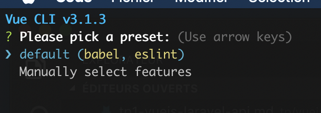

# Réaliser une application avec VueJS

Dans ce TP nous allons utiliser une autre façon d’utiliser VueJS, une façon plus moderne, celle qui utilise à 100% le modèle MVVM (Modèle Vue, Vue-Modèle) ainsi que la puissance de VueJS (```.vue```, VueCli, ES5)


## MVVM en quelques mots

Non mais moi je connais que MVC, C’est quoi MVVM ?

MVVM est un design pattern, souvent utilisé par les bibliothèques Javascript moderne (Ionic, VueJS, ReactJS). A l’origine, MVVM à été introduit par Microsoft.

Ce pattern a spécialement été conçu pour améliorer la séparation entre les données et la vue qui les affichent. Le lien entre la vue et le modèle de données est fait par des mécanismes de binding. Le binding est un mécanisme qui permet de faire des liaisons entre des données de manière dynamiques. Ce qui veut dire que si A et B sont lié, le fait de modifier A va être répercuté sur B et inversement.

- Model : le modèle contient les données.
- View : la vue correspond à ce qui est affiché. C’est notre site Web
- ViewModel : ce composant fait le lien entre le modèle et la vue. Il s’occupe de gérer les liaisons de données et les éventuelles conversions. C’est ici qu’intervient le binding.

L’important avec MVVM c’est que ***la vue ne doit jamais traiter de données***. Elle s’occupe uniquement de les afficher. Le View-Model aura en charge les conversions et les accès au modèle de données.


## Introduction

Maintenant que vous savez ce que c’est le MVVM, nous allons attaquer le TP pour de vrai. Nous allons réaliser « une application » à l’aide de VueJS. Cette application est purement pour la démonstration, Cette application calculera la hauteur d’une falaise (ou de n’importe que de suffisamment haut) en fonction du temps chute d’un objet jeter du haut de celle-ci.


## Initialisation du projet

Avant de commencer nous allons avoir besoin de plusieurs outils :

- NodeJS
- Vue-cli

### NodeJS

La première étape, vas être l’installation de NodeJS, la démarche est différente en fonction de votre environnement, mais pour résumer [sous Windows c’est ici](https://nodejs.org/en/download/), sous OSX le plus simple c’est via Brew ```brew install nodejs```, et sous Linux c’est via le gestionnaire de paquet ```apt install nodejs```

Une fois installé, vous êtes prêt, votre PC est prêt à accueillir l’outil VueCLI

### Vue-cli

Vue-cli est un outil qui simplifie la création d’un nouveau projet Vue-JS à partir de template fourni par la communauté.

Dans un terminal lancer la commande suivante :

```
npm install -g vue-cli
```

Maintenant que vue-cli est installé, vous avez à votre disposition sur votre ordinateur une nouvelle commande, la commande ```vue```

Vue-Cli intègre plusieurs template :

- webpack : A full-featured Webpack + vue-loader setup with hot reload, linting, testing & css extraction.
- webpack-simple : A simple Webpack + vue-loader setup for quick prototyping.
- browserify : A full-featured Browserify + vueify setup with hot-reload, linting & unit testing.
- browserify-simple : A simple Browserify + vueify setup for quick prototyping.
- pwa : PWA template for vue-cli based on the webpack template
- simple : The simplest possible Vue setup in a single HTML file

Pour notre exemple nous allons prendre le Webpack, il contient tous les éléments qui seront intéressant pour réaliser notre application.

Pour créer un nouveau projet, c’est simple il suffit de lancer la commande suivante :

```
vue init webpack cliff-height-timer
```

⚠️ Attention, la commande créer le projet dans le dossier courant ! ⚠️

Le Vue-Cli est interactif il va vous posez des question permettant de configurer votre projet :



Voilà notre projet est maintenant prêt. Place à la suite.

## Installation des librairies (du projet)

Le projet que vous avez initialisé est « vide », c’est-à-dire que dans l’état il n’est pas fonctionnel. Avant de pouvoir l’afficher vous allez devoir installer les librairies (VueJS, WebPack, …). Cette étape n’est à faire qu’une seul fois sur votre poste, en effet en général on ne commit pas les fichier « librairies » qui sont présent dans le future dossier ```node_module``` pour la simple et bonne raison que celui-ci est gros et rempli de pleins de petits fichiers (et qu’en plus ça se re-télécharge facilement depuis Internet).

Pour l’installation la procédure est la suivante :

```
cd cliff-height-timer/
npm install
```

⚠️ L’installation risque de prendre plusieurs secondes (enfin 1 ou 2 minutes).

Dans mon cas :

```
added 1070 packages in 49.404s
```

Une fois terminé votre projet est prêt à être lancé.

## Premier lancement (l’exemple)

Les librairies étant maintenant disponible, nous allons pouvoir lancer l’exemple fourni par Vue-Cli, pour ça rien de plus simple

```
npm run dev
```

une fois cette commande lancée, votre navigateur va s’ouvrir sur un nouvel onglet contenant « l’application » de démonstration fournie par le template


## Le serveur de développement

Comme vous avez pu le constater dans votre invite de commande (terminal), vous avez un serveur qui tourne. Ce serveur est un peut particulier, il n’est utilisé que dans la phase de développement il incorpore plusieurs outils permettant de simplifier la création d’application Javascript :

- Redémarrage à chaud, comprendre ici, qu’il va « patcher » votre code pour intégrer vos dernières modifications sans que vous n’ayez rien à faire (GÉNIAL !)
- Lint, analyse du code pour vous remontez les erreurs avant l’execution.
- Gestion des .vue (avec vue-loader)

Et si vous avez les outils sur votre machine il peu également :

- Créer la CSS à partir du SCSS présent dans le .vue
- Et plein d’autres usage car Webpack c’est un outil qui permet l’assemblage de différent outils
