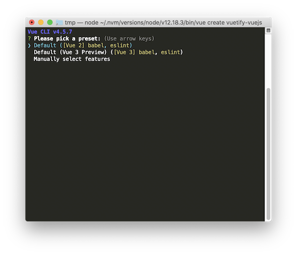

# Vuetify + VueJS

Dans ce TP nous allons voir dans un premier temps comment créer une application VueJS avec VueCLI. Puis à partir de ce projet, nous allons y ajouter la librairie Vuetify afin de manipuler des composants fournis par un développeur tiers.

## Installer VueCLI

⚠️ Si vous ne l'avez pas déjà sur votre ordinateur ⚠️

Nous allons avoir besoin de plusieurs outils :

- NodeJS
- Vue-cli

### NodeJS

La première étape va être l’installation de NodeJS, la démarche est différente en fonction de votre environnement, mais pour résumer :

- [sous Windows c’est ici](https://nodejs.org/en/download/) prendre la version CURRENT.
- Sous OSX le plus simple c’est via [Brew](https://brew.sh) `brew install nodejs`.
- Sous Linux c’est via le gestionnaire de paquet `apt install nodejs`.

Une fois installé, vous êtes prêt, vous allez pouvoir installer l’outil VueCLI.

### Vue-cli

Vue-cli est un outil qui simplifie la création d’un nouveau projet Vue-JS à partir de template fourni par la communauté.

Pour ceux sous Windows lancer `Node.js Command Prompt` :

```sh
npm install -g @vue/cli
```

Pour ceux sous Linux / OSX lancer dans un terminal :

```sh
npm install -g @vue/cli
```

Vous venez d'installer vue-cli. Vous avez maintenant à votre disposition sur votre ordinateur une nouvelle commande, la commande `vue`.

## Création du projet

Créer un nouveau projet est très simple il suffit de saisir la commande suivante :

```sh
vue create le-nom-du-projet
```

ou dans notre cas :

```sh
vue create vuetify-vuejs
```

Votre ordinateur va vous poser quelques questions :



Pour l'instant, nous allons rester sur VueJS 2.0 comme évoqué en cours. Valider votre choix avec la trouche entrée.

Vue-CLI est entrain d'installer l'ensemble des dépendances nécessaire au bon fonctionnement de votre application. Cette étape va prendre quelques secondes / minutes.

## Tester

Pour lancer votre projet, il suffit de suivre les commandes proposées par votre console à savoir :

```sh
🎉  Successfully created project vuetify-vuejs.
👉  Get started with the following commands:

 $ cd vuetify-vuejs // <-- Étape 1
 $ npm run serve  // <--  Étape 2
```

Toujours dans votre terminal :

```sh
cd vuetify-vuejs
npm run serve
```

::: tip
Rappel, la commande `cd` permet de vous déplacer dans le dossier `vuetify-vuejs`.
La commande `npm run serve` est une commande interne à votre projet, elle va lancer un « serveur » qui vous permettra de tester votre code pendant la phase de développement.
:::

Votre code [est disponible ici](https://localhost:8080)

Vous devez voir quelque chose qui ressemble à


## Ajouter Vuetify

Maintenant que votre code fonctionne, nous allons le faire évoluer pour ajouter Vuetify. Avec Vue-Cli c'est très simple. Il suffit de saisir une commande.

::: danger ATTENTION
la commande va modifier en profondeur votre projet. Il ne faut pas la faire à n'importe quel moment. Il est préférable de faire celle-ci _au début de la création de votre projet_.
:::

Dans le dossier de votre projet :

```sh
vue add vuetify
```

ET C'EST TOUT !

Votre projet va être modifié, afin d'inclure vuetify.

## Tester à nouveau

Pour tester, il suffit de saisir à nouveau la commande `npm run serve`.

Votre projet est maintenant différent, il doit ressembler à


🤔 Sacrée différence n'est-ce pas ?

## Simplifier le code fourni

Le but de ce TP est de découvrir le fonctionnement de VueJS et de Vuetify, nous allons simplifier le code dès à présent pour n'en garder que l'essentiel.

## Modifier le App.vue

_Remplacer_ le contenu du fichier `App.vue` par le code code suivante :

```html
<template>
  <v-app>
    <v-app-bar app color="primary" dark>
      <v-toolbar-title>{{ school }}</v-toolbar-title>
    </v-app-bar>

    <v-main>
      <div class="text-center pa-10">👋 Bonjour 👋</div>
      <!-- Votre Code ICI -->
    </v-main>
  </v-app>
</template>

<script>
  export default {
    name: "App",
    data() {
      return { school: "MyDigitalSchool" };
    },
  };
</script>
```

Tester à nouveau votre application.

## Test & Évolutions

Afin de tester les possibilités de Vuetify, nous allons ajouter des éléments dans l'interface. _En vous servant de la documentation_.

Dans la balise `v-main` nous allons ajouter :

- Un bouton
- Une card
- Une liste

### Le bouton

[En suivant la documentation](https://vuetifyjs.com/en/components/buttons/) ajouter le code _à la place du commentaire « votre code ici »_ inséré :

```html
<v-btn>Clique ici</v-btn>
```

🤓 Vérifier que celui-ci s'affiche comme attendu.

À faire :

- Ajouter un `@click` qui affiche une alerte quand vous cliquez sur votre bouton.
- Modifier le comportement pour que votre bouton soit un `block` (100% de la largeur).

### Ajouter une card

Le composant Card est un conteneur, il va nous permettre d'ajouter d'autres éléments dedans. Il est utile pour symboliser à votre utilisateur les éléments importants.

[Toujours en utilisant la documentation](https://vuetifyjs.com/en/components/cards/#misc) ajouter le code suivant :

```html
<v-card>
  <v-card-text>
    <!-- Votre contenu ici -->
  </v-card-text>
</v-card>
```

Vérifier que votre `card` s'affiche correctement.

À faire :

- Modifier la couleur de la card avec les attributs suivants `color="#385F73" dark`.

### Ajouter une liste

Le composant « Liste » va nous permettre d'afficher du contenu « sous forme de liste »… Incroyable non ?

Comme dans les précédents exemples pour réaliser le code _vous devez_ [utiliser la documentation](https://vuetifyjs.com/en/components/lists/#usage).

Ajouter _dans_ la balise `v-card-text` le code suivant :

```html
<v-list-item>
  <v-list-item-content>
    <v-list-item-title>Votre texte</v-list-item-title>
  </v-list-item-content>
</v-list-item>
```

À faire :

- Déclarer une liste dans les `data` de votre objet. _Exemple :_ `list: ["A", "B", "C"]`.
- Répéter la balise `v-list-item-content` autant de fois qu'il y a d'éléments dans la liste (_en utilisant un `v-for`_)

## Créer un composant

Le principe même de VueJS c'est la création de composants. Pour l'instant nous avons tout mis dans « le App.vue », ça fonctionne… mais clairement pas idéale.

Nous allons donc remédier à ça en créant votre premier composant.

### Création du composant

Première étape créer le fichier `.vue` de _votre_ composant.

- Créer un nouveau fichier nommé `Home.vue` dans le dossier `components`.

La structure de fichier est la suivante :

```html
<template>
  <!-- Votre Code ICI -->
</template>

<script>
  export default {
    name: "Home",
  };
</script>
```

### Déplacer le code de votre composant

Maintenant que votre composant est prêt. Déplacer le contenu du _v-main_ dans le template de votre nouveau composant.

::: tip
N'oubliez pas de prendre également les `data` associées à votre vue.
:::

### Utiliser votre composant

Pour utiliser un composant vous devez réaliser trois opérations :

- Le déclarer dans les imports.
- Le déclarer dans la page où vous souhaitez l'utiliser.
- L'utiliser dans votre template.

Voilà un exemple :

```html
<template>
  <Home />
</template>

<script>
  import Home from "./components/Home.vue";

  export default {
    name: "App",
    components: {
      Home,
    },
  };
</script>
```

À faire:

- Adapter le code fourni pour l'utiliser dans votre projet.
