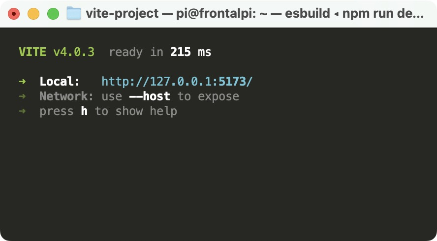

# ViteJS + Vue3

[[toc]]

## Introduction

ViteJS est une des nouvelles façons de créer un projet « moderne » avec VueJS (mais pas que). L'objectif est la création de projets « rapide » permettant au développeur de créer des projets avec une structure simple et moderne. Cette organisation repose sur quatre éléments :

- Un serveur web de développement qui utilise les modules EcmaScript intégrant un Hot Reload très rapide des ressources modifiées.
- Une commande de compilation, préconfigurée pour optimiser les ressources pour la production en utilisant [Rollup](https://rollupjs.org/) et non pas WebPack
- Un système reposant sur des plug-ins permettant des projets personnalisés si besoin.
- Intègre nativement le support du [TypeScript](https://www.typescriptlang.org/)

L'ensemble du fonctionnement est détaillé sur [la documentation officielle](https://vitejs.dev/)

## Installation / Création du projet

Contrairement aux anciens outils fonctionnement avec VueJS, ViteJS ne nécessite rien d'autre que d'avoir sur votre ordinateur `NodeJS` (minimum 12) et `NPM`. Si c'est le cas pour vous, il vous suffit de saisir dans votre terminal :

```sh
npm init @vitejs/app
```

::: tip C'est interactif !
L'ensemble du processus est interactif ; il vous suffit donc de suivre les étapes pour créer un projet.

**Attention quand même**, le projet que vous allez créer sera situé dans le dossier courant.
:::


::: warning plusieurs choix !
Vous avez le choix du type de projet ; nous allons choisir **vue-ts**. Cette sélection du type de projet est la vraie force de ViteJS, grâce à son système de plug-in ViteJS est complètement agnostique il est donc complètement possible de faire autre chose que du VueJS (et ça, c'est cool).
:::

## Lancer le projet

Votre projet est maintenant « configuré » / « initialisé ». Pour la suite des opérations, il suffit de suivre ce qu'a indiqué votre ligne de commande à savoir :

```sh
cd test-projet-vite
npm install
npm run dev
```

🚀 Et ça va vite ! Très vite. Attention les yeux 🚀



Vous pouvez tester la page dans [votre navigateur](http://localhost:3000).

## C'est du TypeScript

Contrairement à ce que nous avons vu précédemment la structure n'est pas en JavaScript. Celle-ci est en Typescript fondamentalement ça ne change pas grand-chose… La seule différence pour l'instant (pour ce qui nous intéresse) dans le fond, c'est qu'il est possible d'ajouter des types sur les données.

::: warning Des différences oui
Nous allons voir des différences oui… mais elles seront principalement dues au fait que nous migrons de VueJS 2.0 à VueJS 3.0. Nous verrons plus tard `defineComponents` qui est une spécificité de VueJS + `TypeScript` mais rien d'incroyable ne vous inquiétez pas.
:::

## Regardons la structure

TODO regarder les dossiers

## VueJS 2.0 -> VueJS 3.0

TODO Voir les différences.

- Expliquer `defineComponents`
- Expliquer `setup()`
- Expliquer la nouvelle façon d'observer les données
- Expliquer qu'il est encore possible de faire comme avant.

## Testons une modification

## Créer un composant « 2.0 » dans une structure « 3.0 »

## Ajouter Vue-Bootstrap
